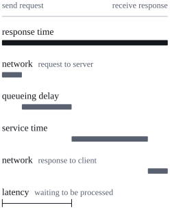
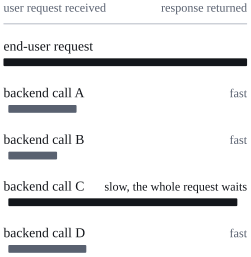

*Designing Data-Intensive Applications* (DDIA) is a book by Martin Kleppmann about the principles of data systems. This series is my notes as I read the book chapter by chapter, based on the first edition from 2017[^edition].

Chapter 1 does not discuss specific databases or frameworks. Instead, it first defines three words that recur throughout the book: **reliability**, **scalability**, and **maintainability**. The English quotations in the text are from the original book; the rest is my own retelling and organization.

## Data systems: more than just "using a database"

Many applications today are **data-intensive** rather than compute-intensive: CPU power is rarely the bottleneck. The real challenges are the amount of data, the complexity of data, and the speed at which data changes.

These applications are usually assembled from several standard building blocks:

| Component | Role |
| --- | --- |
| Database | Stores data so that this application or others can find it again later |
| Cache | Remembers the result of an expensive operation to speed up reads |
| Search index | Searches by keyword or filters data by various criteria |
| Stream processing | Sends messages to another process for asynchronous handling |
| Batch processing | Periodically processes a large amount of accumulated data |

But the boundaries between these categories are blurring: Redis is a data store, yet it is often used as a message queue; Kafka is a message queue, yet it offers database-like durability guarantees. More commonly, no single tool can meet all of an application's requirements anymore, so several tools have to be combined, glued together with application code, and exposed to the outside as a single API.

At that point, the person writing this glue code is already designing a new data system:

> You are now not only an application developer, but also a data system designer.

## Reliability

The rough definition of reliability is just one sentence:

> Continuing to work correctly, even when things go wrong.

Spelled out, users typically expect:

1. The application performs the function the user expects;
2. It can tolerate users making mistakes or using it in unexpected ways;
3. Its performance is good enough under the expected load and data volume;
4. It prevents unauthorized access and abuse.

### Faults and failures

The most important distinction in this chapter:

| Term | Meaning |
| --- | --- |
| Fault | **One component** of the system deviates from its spec |
| Failure | **The system as a whole** stops providing the required service to users |

The probability of faults can never be reduced to zero, so the goal is not to eliminate faults but to be **fault-tolerant** (also called resilient): prevent faults from escalating into failures.

A counterintuitive corollary is that sometimes we should **deliberately trigger faults**. Many serious bugs live in error-handling code, which is rarely executed in normal operation. Netflix's Chaos Monkey randomly kills processes in production, keeping the fault-tolerance mechanisms constantly exercised, so that there is more confidence when a real fault occurs.

### Hardware faults

The mean time to failure (MTTF) of a hard disk is roughly 10 to 50 years. That sounds long, but in a storage cluster with 10,000 disks, on average one disk fails every day.

The traditional response is to add redundancy to individual machines: RAID for disk groups, dual power supplies and hot-swappable CPUs for servers, batteries and diesel generators for data centers.

The current trend is to use **software fault tolerance** in addition to (or instead of) hardware redundancy, to tolerate the loss of an entire machine. There are two reasons:

- As data volumes grow, applications need more machines, and the rate of hardware faults rises proportionally;
- Cloud platforms like AWS prioritize flexibility and elasticity over single-machine reliability, and a virtual machine can become unavailable without any warning.

Tolerating the loss of an entire machine has a side benefit: it enables **rolling upgrades**, patching and rebooting one node at a time without taking the whole system down.

### Software errors

Hardware faults are largely random and independent of each other: one disk failing does not mean another will too. Software errors, by contrast, are **systematic** and **correlated** across nodes, so they often cause more failures than hardware faults. The book gives several categories of examples:

- A particular input crashes all instances at once. For example, the leap second on June 30, 2012, which, because of a bug in the Linux kernel, caused a large number of applications to hang simultaneously;
- A runaway process exhausts shared resources such as CPU, memory, disk, or network bandwidth;
- A service the system depends on becomes slow, unresponsive, or starts returning incorrect results;
- Cascading failures: a small fault in one component triggers a fault in another component, which triggers more faults.

These bugs often lurk for a long time until some unusual circumstance triggers them. The root cause is usually that the software makes an assumption about its environment, an assumption that holds all the time—until one day it suddenly does not.

There is no single solution to software errors, only a series of small measures: think carefully about the assumptions and interactions in the system, test thoroughly, isolate processes, allow processes to crash and restart, and measure, monitor, and analyze system behavior in production. If the system can provide some guarantee about itself, it can also continuously **self-check**: for example, a message queue constantly verifies that the number of incoming messages equals the number of outgoing messages, and raises an alarm if they differ.

### Human errors

A study of large internet services found that **configuration errors by operators** were the leading cause of outages, while hardware faults played a role in only 10% to 25% of outages.

Humans are unreliable, and a good system combines several approaches:

1. **Reduce opportunities for error**: well-designed abstractions, APIs, and admin interfaces make it easy to do the right thing and hard to do the wrong thing. But don't restrict things too much, or people will find ways to work around them.
2. **Decouple the places where people make mistakes from the places where failures happen**: provide fully featured non-production sandbox environments where people can experiment safely with real data.
3. **Test thoroughly**: from unit tests to whole-system integration tests to manual testing. Automated tests are especially good at covering edge cases that rarely occur in normal operation.
4. **Allow quick recovery**: configuration changes can be rolled back quickly, new code is rolled out gradually (so a bug affects only a small fraction of users), and tools are provided for recomputing data.
5. **Detailed and clear monitoring**: performance metrics and error rates, i.e., telemetry. It can give early warning signals and is indispensable when diagnosing problems.
6. **Good management practices and training**: important, but beyond the scope of this book.

### How important is reliability?

Reliability is not something only nuclear power plants or air traffic control systems need to care about. Bugs in business systems cause lost productivity (and incorrect numbers may even carry legal risks), and an e-commerce site going down directly loses revenue and reputation. The book also gives a more everyday example: a parent stores all their children's photos and videos in your photo album app. If the database suddenly gets corrupted, how would they feel? Do they know how to restore from a backup?

Of course, there are times when it makes sense to sacrifice some reliability to reduce development or operational costs—for example, when building a prototype for an unproven market, or when the service itself has extremely thin margins. But be clear about what you are doing:

> But we should be very conscious of when we are cutting corners.

## Scalability

Scalability describes a system's ability to **cope with increased load**. It is not a label you can stick on a system—saying "X is scalable" or "Y doesn't scale" is meaningless. The real question is: if the system grows in a particular way, what options do we have for coping? How do we add computing resources to handle the additional load?

### Describing load: load parameters

Before discussing growth, we need to be able to describe the current load. The numbers that describe load are called **load parameters**, and which ones to choose depends on the system's architecture. For example:

- Requests per second to a web server;
- The ratio of reads to writes in a database;
- The number of simultaneously active users in a chat room;
- The hit rate of a cache.

Sometimes the average case is what matters, but sometimes the bottleneck is determined by a few extreme cases.

### Case study: Twitter's home timeline

The book uses data Twitter published in November 2012 as an example. Its two main operations:

| Operation | Request rate |
| --- | --- |
| Post tweet | 4.6k requests/sec on average, over 12k requests/sec at peak |
| Read home timeline | 300k requests/sec |

Handling 12k writes per second is not difficult in itself. The challenge lies in **fan-out**: each user follows many people and is followed by many people. The term fan-out is borrowed from electronic engineering; in transaction processing systems, it refers to how many requests to other services are needed to serve one incoming request.

There are two ways to implement the home timeline.

**Approach 1: merge at read time.** Posting a tweet just inserts it into a global table of tweets; when a user reads their home timeline, look up all the people this user follows, fetch their tweets, and merge them by time. In SQL it looks like this:

```sql
SELECT tweets.*, users.* FROM tweets
  JOIN users   ON tweets.sender_id    = users.id
  JOIN follows ON follows.followee_id = users.id
  WHERE follows.follower_id = current_user
```

**Approach 2: fan out at write time.** Maintain a home timeline cache for each user, like an inbox for each person. When a user posts a tweet, look up all the people who follow this user, and insert the new tweet into each follower's timeline cache. Reading the timeline is then just reading a ready-made cache.

| Approach | When posting | When reading the timeline |
| --- | --- | --- |
| Approach 1: merge at read time | Insert one record, cheap | Query and merge tweets from everyone followed, expensive |
| Approach 2: fan out at write time | Write to every follower's cache, expensive | Read the cache directly, cheap |

Twitter initially used approach 1, but the read-time queries could not keep up with the load, so they switched to approach 2. This trade-off made sense because the rate of timeline reads was nearly two orders of magnitude higher than the rate of tweets, so it was better to do more work at write time and less at read time.

The cost of approach 2 also lies in fan-out. On average, each tweet is delivered to about 75 followers, so 4.6k tweets per second become 345k timeline cache writes per second. But the average hides something: the distribution of follower counts is extremely uneven. Some users have over 30 million followers, and a single tweet from them would require 30 million writes, while Twitter's goal is to deliver tweets to followers' timelines within 5 seconds. So for Twitter, **the distribution of followers per user** is the key load parameter when discussing scalability.

Twitter ended up with a hybrid approach: tweets from most users are still fanned out at post time; a small number of users with extremely many followers (celebrities) are not fanned out. Their tweets are fetched separately at read time and merged with the reader's timeline cache—in effect, falling back to approach 1 for celebrities. This example will be discussed again in Chapter 12.

### Describing performance

Once the load is described, we can study what happens when the load increases. There are two ways to ask the question:

1. When a load parameter increases and system resources stay unchanged, how is performance affected?
2. When a load parameter increases, how much do resources need to increase to keep performance unchanged?

Both questions require numbers to measure performance. Batch processing systems (such as Hadoop) usually care about **throughput**: how many records can be processed per second, or how long a job takes to run over a dataset of a certain size[^skew]. Online systems care more about **response time**: the time between a client sending a request and receiving a response.

**Response time and latency are often used interchangeably, but they are not the same thing.** Response time is the entire time the client sees: in addition to the actual service time spent processing the request, it includes network delays and queueing delays. Latency is the time a request spends waiting to be handled, during which the request is "latent."



Even the same request sent repeatedly will have a different response time each time. Context switches to background processes, network packet loss and TCP retransmissions, garbage collection pauses, page faults reading from disk, and even mechanical vibration of a server rack all add random additional delays. So response time should not be treated as a single number, but as a **distribution**.

### Percentiles

It is common to report the average response time, but the average does not tell you how many users actually experienced that latency, so **percentiles** are usually better. Sort the response times over a period from fastest to slowest:

- The **median** (p50) is the value in the middle. A median of 200 ms means half of all requests returned within 200 ms, and the other half were slower;
- **p95, p99, p999** are the 95th, 99th, and 99.9th percentiles. A p95 of 1.5 seconds means that out of 100 requests, 95 were faster than 1.5 seconds and 5 took 1.5 seconds or longer.

The median describes a single request. A user typically makes multiple requests in one session, and a page loads multiple resources, so the probability that at least one of them is slower than the median is far greater than 50%.

#### Tail latency

Response times at high percentiles are called **tail latency**, and they directly affect user experience. The book gives Amazon as an example:

- Amazon's internal services define response time requirements in terms of p999, even though it only affects one request in a thousand;
- This is because the slowest requests tend to come from the customers with the most data in their accounts—that is, the customers who buy the most and are the most valuable;
- Amazon observed that every 100 ms increase in response time reduced sales by 1%; another report said that being 1 second slower reduced a customer satisfaction metric by 16%;
- But Amazon considered optimizing the 99.99th percentile (the slowest one in ten thousand) too expensive for too little benefit. The higher the percentile, the more it is affected by random events beyond your control, and the smaller the returns from optimization.

#### Queueing and head-of-line blocking

Queueing delay often accounts for a large part of response times at high percentiles. A server can only process a limited number of requests in parallel (limited by the number of CPU cores, for example). As long as there are a few slow requests, they can block all the requests behind them. This is called **head-of-line blocking**. Even if the requests behind are themselves fast to process, the response time the client sees is lengthened by the queueing.

Two practical conclusions follow:

1. **Response time should be measured on the client side.** Measuring on the server side tends to miss the time spent queueing.
2. **When load testing, the client should send requests continuously at its own pace, without waiting for the previous response to return.** If each request waits for the previous one to return before sending the next, the queues in the test will be shorter than in reality, and the numbers will be optimistic.

#### Tail latency amplification

A backend service often gets called multiple times to serve a single end-user request. Even if these calls are made in parallel, the user request has to wait for the slowest call to return:



> It takes just one slow call to make the entire end-user request slow.

The more calls there are, the higher the probability of hitting a slow call. Suppose each backend call has a 1% chance of being slower than its p99, and the calls are independent of each other. Then a user request requiring N calls has a probability of at least one slow call of 1 − 0.99<sup>N</sup>:

| Number of backend calls per user request, N | Probability of at least one slow call |
| ---: | ---: |
| 1 | 1% |
| 10 | about 9.6% |
| 100 | about 63% |

This table is my own calculation based on the independence assumption; the original book only gives a qualitative conclusion. At N = 100, more than half of all user requests will hit at least one backend p99 slow call.

#### Calculating percentiles in monitoring

To put percentiles on a monitoring dashboard, you need to compute them continuously and efficiently—for example, maintaining a rolling window of response times over the last 10 minutes. The most direct approach is to keep all the response times of requests in the window and sort them periodically; if that is too slow, approximate algorithms such as forward decay, t-digest, and HdrHistogram can be used.

There is a common mistake to avoid: averaging the percentiles of several machines, or averaging percentiles over several time periods to reduce time resolution, is mathematically meaningless.

> The right way of aggregating response time data is to add the histograms.

### Coping with load

#### Scaling up and scaling out

| Approach | What it does | Advantages | Disadvantages |
| --- | --- | --- | --- |
| Scaling up | Move to a more powerful machine | Simpler system | High-end machines are very expensive |
| Scaling out | Distribute the load across multiple smaller machines, also called a shared-nothing architecture | Cheaper at large scale, can tolerate faults | More complex system |

In reality, a good architecture is usually a pragmatic combination of the two: a few fairly powerful machines may be simpler and cheaper than a large number of small virtual machines.

#### Elastic scaling and manual scaling

An **elastic** system automatically adds computing resources when it detects increased load, while a **manually scaled** system has humans analyze capacity and decide to add machines. Elastic systems are useful when load is highly unpredictable, but manually scaled systems are simpler and have fewer operational surprises.

#### Stateful data systems are harder to scale

Distributing stateless services across multiple machines is relatively straightforward, but turning a stateful data system from a single node into a distributed one brings a great deal of additional complexity. So until recently, the common practice was to keep the database on a single node (scaling up) until the cost of scaling or the need for high availability forced you to make it distributed.

The book predicts that as the tools and abstractions for distributed systems get better, this practice may change: even when the data volume and traffic are not large, distributed data systems may become the default choice in the future.

#### There is no universal scalable architecture

The architecture of a large-scale system is usually **highly specific to the application**. There is no one-size-fits-all scalable architecture—the book jokingly calls it "magic scaling sauce." The bottleneck might be the volume of reads, the volume of writes, the amount of data to store, the complexity of the data, the response time requirements, the access patterns, or (usually) a mixture of these.

The book gives a very intuitive comparison: a system handling 100,000 requests per second, each 1 kB, and a system handling 3 requests per minute, each 2 GB, have the same data throughput but completely different architectures.

A scalable architecture is built around assumptions about which operations are common and which are rare—that is, around the load parameters. If the assumptions are wrong, the engineering effort spent on scaling is at best wasted and at worst counterproductive. So for an early-stage startup or an unproven product, the ability to iterate on features quickly is usually more important than scaling for some hypothetical future load.

## Maintainability

Most of the cost of software is not in the initial development but in ongoing maintenance: fixing bugs, keeping the system running, investigating failures, adapting to new platforms, making changes for new use cases, repaying technical debt, and adding new features. To make maintenance less painful, the book proposes three design principles:

| Principle | Goal |
| --- | --- |
| Operability | Make it easy for operations teams to keep the system running smoothly |
| Simplicity | Eliminate as much complexity as possible, making the system easy for new engineers to understand |
| Evolvability | Make it easy for engineers to modify the system in the future; also called extensibility, modifiability, or plasticity |

### Operability

> Good operations can often work around the limitations of bad (or incomplete) software, but good software cannot run reliably with bad operations.

A good operations team is typically responsible for:

- Monitoring the health of the system and restoring service quickly when something goes wrong;
- Tracking down the causes of problems such as system failures or degraded performance;
- Keeping software and platforms up to date, including security patches;
- Understanding how different systems affect each other, and avoiding problematic changes before they cause damage;
- Anticipating future problems and solving them in advance, such as capacity planning;
- Establishing good practices and tools for deployment, configuration management, and so on;
- Performing complex maintenance tasks, such as moving an application from one platform to another;
- Maintaining the security of the system as configuration changes are made;
- Defining processes that make operations predictable and help keep the production environment stable;
- Preserving the organization's knowledge about the system as people come and go.

Data systems themselves can also make operations easier:

- Providing good monitoring, so people can see the runtime behavior and internal state of the system;
- Supporting automation and integrating with standard tools;
- Not depending on a single machine, so the system keeps running while a machine is taken down for maintenance;
- Having good documentation and an easy-to-understand operational model ("if I do X, Y will happen");
- Having sensible default behavior, but allowing administrators to override the defaults when needed;
- Being able to self-heal when appropriate, but also letting administrators manually control the system state when necessary;
- Behaving predictably, with as few surprises as possible.

### Simplicity

The code of a small project can be simple and expressive, but as a project grows it often becomes complex and hard to understand, slowing down everyone who works on it and driving up maintenance costs. A project mired in complexity is sometimes called a **big ball of mud**. Symptoms of complexity include:

- Explosion of the state space;
- Tight coupling between modules;
- Tangled dependencies;
- Inconsistent naming and terminology;
- Patches added to solve performance problems;
- Special-case handling written to work around problems elsewhere.

Complexity makes maintenance harder, causing budgets and schedules to be overrun; changes are also more likely to introduce bugs, because the harder a system is to understand, the easier it is to overlook hidden assumptions, unintended consequences, and interactions.

Making a system simpler does not necessarily mean cutting features; it can also mean eliminating **accidental complexity**. According to the definition by Moseley and Marks[^tarpit], complexity is accidental if it is not inherent in the problem the software solves (from the user's point of view) but arises only from the implementation; the complexity inherent in the problem itself is called **essential complexity**.

One of the best tools for eliminating accidental complexity is **abstraction**: hiding a large amount of implementation detail behind a clean, easy-to-understand facade, where the same abstraction can be reused by many different applications. High-level programming languages hide machine code, CPU registers, and system calls; SQL hides complex data structures on disk and in memory, concurrent requests from other clients, and inconsistent states after crashes. Reuse is not only more efficient than reimplementing; improvements in the quality of an abstract component benefit all the applications that use it.

The hard part is finding good abstractions. The field of distributed systems has many good algorithms, but how to package them into abstractions that can control system complexity is far from settled.

### Evolvability

The requirements of a system are almost never static: you learn new facts, use cases you never thought of appear, business priorities change, users demand new features, new platforms replace old ones, legal or regulatory requirements change, and the growth of the system forces architectural changes.

Agile development provides a framework for adapting to change, with technical tools such as test-driven development (TDD) and refactoring. But most of these discussions stay at a very small, local scale—a few source files within a single application. What this book seeks are ways to improve agility at the level of the **entire data system**, which may consist of several different applications or services. For example: how would you "refactor" Twitter's architecture for assembling the home timeline from approach 1 to approach 2?

How easy it is to modify a data system to adapt to changing requirements is closely related to its simplicity and its abstractions: a simple, easy-to-understand system is usually easier to modify. Because this concept is so important, the book gives agility at the data system level its own name: evolvability.

## Summary

| Concern | In one sentence | Key points of this chapter |
| --- | --- | --- |
| Reliability | Keep working correctly even when things go wrong | The difference between faults and failures; hardware faults are random and independent, software errors are systematic and correlated, human errors are inevitable; fault-tolerance techniques can hide some faults from users |
| Scalability | Still have ways to maintain good performance as load grows | Describe load with load parameters (Twitter's fan-out); describe performance with response time percentiles; scaling up and scaling out |
| Maintainability | Make life easier for engineering and operations teams | Operability: see the system's state clearly and keep it under control; simplicity: reduce complexity with good abstractions; evolvability: make the system easy to modify |

> There is unfortunately no easy fix for making applications reliable, scalable, or maintainable.

But there are patterns and techniques that recur across different kinds of applications, and the following chapters will unfold them one by one.

## Glossary

| English | Chinese | Meaning |
| --- | --- | --- |
| data-intensive | 数据密集型 | The main challenges are the volume, complexity, and rate of change of data |
| compute-intensive | 计算密集型 | Bottlenecked on CPU |
| fault | 故障 | One component deviates from its spec |
| failure | 失效 | The system as a whole stops providing the required service |
| fault-tolerant / resilient | 容错 | Anticipates faults and copes with them, preventing faults from becoming failures |
| MTTF | 平均无故障时间 | mean time to failure |
| redundancy | 冗余 | Providing backups for components, so another takes over when one fails |
| rolling upgrade | 滚动升级 | Upgrading one node at a time, without taking the whole system down |
| cascading failure | 级联失效 | One fault triggers faults in other components |
| telemetry | 遥测 | Detailed monitoring data such as performance metrics and error rates |
| load parameters | 负载参数 | The numbers that describe the current load |
| fan-out | 扇出 | The number of requests to other services needed to serve one incoming request |
| throughput | 吞吐量 | The number of records processed per unit of time (batch processing) |
| response time | 响应时间 | The entire time the client sees: network, queueing, and service time |
| latency | 延迟 | The time a request spends waiting to be processed |
| percentile | 百分位数 | The Nth percentile: N% of requests are faster than it |
| tail latency | 尾部延迟 | Response times at high percentiles (p99, p999) |
| head-of-line blocking | 队头阻塞 | A few slow requests block the requests behind them |
| tail latency amplification | 尾部延迟放大 | The more backend calls a request depends on, the more likely it is to be slow |
| scaling up | 垂直扩展 | Moving to a more powerful machine |
| scaling out | 水平扩展 | Distributing the load across multiple machines |
| shared-nothing | 无共享架构 | Nodes are independent and communicate only over the ordinary network |
| elastic | 弹性 | Automatically adds resources when increased load is detected |
| magic scaling sauce | 魔法扩展酱 | A universal scalable architecture that does not exist (said in jest) |
| operability | 可操作性 | The system is easy to keep running |
| simplicity | 简单性 | The system is easy to understand |
| evolvability | 可演化性 | The system is easy to modify |
| big ball of mud | 大泥球 | A software project mired in complexity |
| accidental complexity | 附随复杂性 | Complexity that arises from the implementation rather than from the problem itself |
| abstraction | 抽象 | Hiding implementation details behind a simple facade |

[^edition]: A second edition came out in 2026, co-authored by Martin Kleppmann and Chris Riccomini, with the chapters reorganized: the reliability, scalability, and maintainability discussed in this chapter are spread across the first two chapters of the second edition.

[^skew]: Ideally, the running time of a batch job equals the dataset size divided by the throughput. In practice, the running time is often longer because of data skew (data not evenly distributed across worker processes) and because you have to wait for the slowest task to finish.

[^tarpit]: From the 2006 paper *Out of the Tar Pit* by Ben Moseley and Peter Marks.
