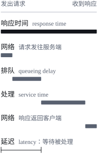
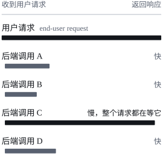

*Designing Data-Intensive Applications*（中译本《数据密集型应用系统设计》，下文简称 DDIA）是 Martin Kleppmann 写的一本讲数据系统原理的书。这个系列是我逐章读这本书时做的笔记，依据的是 2017 年的第一版[^edition]。

第一章不讲具体的数据库或框架，而是先把全书反复用到的三个词定义清楚：**可靠性**、**可扩展性**和**可维护性**。文中的英文引文出自原书，其余是我自己的复述和整理。

## 数据系统：不只是“用一个数据库”

现在很多应用是**数据密集型**的，而不是计算密集型的：CPU 算力很少成为瓶颈，真正的难题是数据的量、数据的复杂程度，以及数据变化的速度。

这类应用通常由几种标准构件拼起来：

| 构件 | 作用 |
| --- | --- |
| 数据库（database） | 存储数据，之后本应用或其他应用还能再找到它 |
| 缓存（cache） | 记住一次昂贵操作的结果，加快读取 |
| 搜索索引（search index） | 按关键词搜索，或按各种条件过滤数据 |
| 流处理（stream processing） | 把消息发给另一个进程，异步处理 |
| 批处理（batch processing） | 定期处理大量累积下来的数据 |

但这些类别的边界正在变模糊：Redis 是数据存储，却常被当作消息队列；Kafka 是消息队列，却提供类似数据库的持久性保证。更常见的情况是，一个应用的需求已经没有哪个单一工具能全部满足，只能把几个工具组合起来，用应用代码把它们粘在一起，对外只暴露一个 API。

这时，写这段粘合代码的人其实已经在设计一个新的数据系统了：

> You are now not only an application developer, but also a data system designer.

## 可靠性（Reliability）

可靠性的粗略定义只有一句：

> Continuing to work correctly, even when things go wrong.

展开来说，用户通常期望：

1. 应用完成用户期望的功能；
2. 能容忍用户犯错，或以意料之外的方式使用它；
3. 在预期的负载和数据量下，性能足够好；
4. 能阻止未经授权的访问和滥用。

### 故障与失效

这一章最重要的一组区分：

| 术语 | 含义 |
| --- | --- |
| 故障（fault） | 系统的**某个组件**偏离了它的规格 |
| 失效（failure） | **整个系统**不再向用户提供所需的服务 |

故障的概率不可能降到零，所以目标不是消灭故障，而是**容错**（fault-tolerant，也叫 resilient）：不让故障演变成失效。

一个反直觉的推论是，有时应该**主动制造故障**。很多严重的 bug 出在错误处理代码上，而这类代码平时很少被执行到。Netflix 的 Chaos Monkey 会随机杀掉生产环境里的进程，让容错机制一直处在被演练的状态，真正出故障时才更有把握。

### 硬件故障

硬盘的平均无故障时间（MTTF）大约是 10 到 50 年。听起来很长，但在一个有 1 万块硬盘的存储集群里，平均每天就要坏一块。

传统的应对是给单台机器加冗余：磁盘组 RAID，服务器配双电源和可热插拔的 CPU，数据中心配电池和柴油发电机。

现在的趋势是在硬件冗余之外（或代替它），用**软件容错**来承受整台机器的丢失，原因有两个：

- 数据量变大以后，应用要用的机器更多，硬件故障的发生率也随之成比例上升；
- AWS 这类云平台优先考虑灵活和弹性，而不是单机可靠，虚拟机可能毫无预警地变得不可用。

能容忍整台机器丢失还有一个附带的好处：可以**滚动升级**，一次给一个节点打补丁、重启，整个系统不必停机。

### 软件错误

硬件故障大体上是随机、相互独立的：一块盘坏了，不代表另一块也会坏。软件错误则是**系统性**的，而且在节点之间**相互关联**，所以往往比硬件故障造成更多的失效。书里举了几类例子：

- 某个特定输入让所有实例同时崩溃。例如 2012 年 6 月 30 日的闰秒，因为 Linux 内核里的一个 bug，让大量应用同时挂起；
- 失控的进程耗尽 CPU、内存、磁盘或网络带宽等共享资源；
- 系统依赖的某个服务变慢、无响应，或者开始返回错误的结果；
- 级联失效：一个组件的小故障引发另一个组件的故障，继而引发更多故障。

这类 bug 往往潜伏很久，直到某个不寻常的情况把它触发出来。根源通常是软件对环境做了某个假设，这个假设平时一直成立，直到某天突然不成立了。

软件错误没有一招解决的办法，只能靠一系列小手段：仔细想清楚系统里的假设和交互，充分测试，进程隔离，允许进程崩溃后重启，在生产环境中测量、监控和分析系统行为。如果系统能对自己提供某种保证，还可以让它持续**自检**：例如消息队列不断核对进入的消息数和发出的消息数是否相等，不相等就告警。

### 人为错误

一项针对大型互联网服务的研究发现，**运维人员的配置错误**是服务中断的首要原因，而硬件故障只在 10% 到 25% 的中断里起了作用。

人不可靠，好的系统会组合多种手段：

1. **减少犯错的机会**：设计良好的抽象、API 和管理界面，让做对的事容易、做错的事难。但也不能限制得太死，否则人们会想办法绕过去。
2. **把容易犯错的地方和会造成失效的地方解耦**：提供功能完整的非生产沙箱环境，让人能用真实数据放心地试验。
3. **充分测试**：从单元测试到全系统集成测试，再到手工测试。自动化测试特别适合覆盖平时很少出现的边角情况。
4. **能快速恢复**：配置改动能迅速回滚，新代码逐步放量（出了 bug 只影响一小部分用户），并提供重新计算数据的工具。
5. **详细清晰的监控**：性能指标和错误率，也就是遥测（telemetry）。它能提前发出预警，排查问题时也离不开它。
6. **良好的管理实践和培训**：重要，但超出了这本书的范围。

### 可靠性有多重要

可靠性不只是核电站、空管系统才需要关心的事。业务系统的 bug 会造成生产力损失（报错数字还可能带来法律风险），电商网站宕机会直接损失收入和声誉。书里还举了一个更日常的例子：一位家长把孩子所有的照片和视频都存在你的相册应用里，如果数据库突然损坏，他们会有什么感受？他们知道怎么从备份里恢复吗？

当然，有时确实可以为了降低开发或运维成本而牺牲一些可靠性，比如给一个还没被验证的市场做原型，或者服务本身的利润率极低。但要清楚自己在做什么：

> But we should be very conscious of when we are cutting corners.

## 可扩展性（Scalability）

可扩展性描述的是系统**应对负载增长**的能力。它不是一个可以贴在系统上的标签，说“X 可扩展”或“Y 扩展不了”都没有意义。真正该问的是：如果系统按某种方式增长，我们有哪些应对办法？怎样增加计算资源来承接额外的负载？

### 描述负载：负载参数

讨论增长之前，先要能描述当前的负载。描述负载的几个数字叫**负载参数**（load parameters），选哪些取决于系统的架构，比如：

- Web 服务器每秒的请求数；
- 数据库的读写比例；
- 聊天室里同时在线的用户数；
- 缓存的命中率。

有时关心的是平均情况，有时瓶颈却由少数极端情况决定。

### 案例：Twitter 的主页时间线

书里用 Twitter 在 2012 年 11 月公开的数据举例。它的两个主要操作：

| 操作 | 请求速率 |
| --- | --- |
| 发推（post tweet） | 平均 4.6k 次/秒，峰值超过 12k 次/秒 |
| 读主页时间线（home timeline） | 300k 次/秒 |

每秒 12k 次写入本身并不难处理。难点在**扇出**（fan-out）：每个用户关注很多人，也被很多人关注。扇出这个词借自电子工程，在事务处理系统里指为了处理一个请求，需要向其他服务发出多少个请求。

主页时间线有两种实现方式。

**方案一：读时合并。** 发推只是把推文插入一张全局的推文表；用户读主页时间线时，查出这个用户关注的所有人，取出这些人的推文，按时间合并。用 SQL 写出来是这样：

```sql
SELECT tweets.*, users.* FROM tweets
  JOIN users   ON tweets.sender_id    = users.id
  JOIN follows ON follows.followee_id = users.id
  WHERE follows.follower_id = current_user
```

**方案二：写时扇出。** 给每个用户维护一份主页时间线缓存，就像每个人一个收件箱。用户发推时，查出关注这个用户的所有人，把新推文插进每个人的时间线缓存。读时间线就只是读一份现成的缓存。

| 方案 | 发推时 | 读时间线时 |
| --- | --- | --- |
| 方案一：读时合并 | 插入一条记录，很便宜 | 查询并合并所有关注对象的推文，很贵 |
| 方案二：写时扇出 | 写入每个粉丝的缓存，很贵 | 直接读缓存，很便宜 |

Twitter 最初用的是方案一，后来读时间线的查询扛不住负载，改成了方案二。这样做划算，是因为读时间线的速率比发推高了将近两个数量级，所以宁可在写入时多做事，读取时少做事。

方案二的代价也在扇出上。平均每条推文要送达约 75 个粉丝，所以每秒 4.6k 条推文会变成每秒 345k 次时间线缓存写入。但平均值掩盖了一点：粉丝数的分布极不均匀，有些用户的粉丝超过 3000 万，他们发一条推文就要写 3000 万次，而 Twitter 的目标是在 5 秒内把推文送到粉丝的时间线上。所以对 Twitter 来说，**每个用户的粉丝数分布**才是讨论可扩展性时的关键负载参数。

Twitter 最终用了混合方案：大多数用户的推文仍在发布时扇出；少数粉丝极多的用户（名人）不做扇出，他们的推文在读取时单独查出来，再和读者的时间线缓存合并，相当于对名人退回方案一。这个例子在第 12 章还会再讨论。

### 描述性能

描述完负载，就可以研究负载增加时会发生什么。有两种问法：

1. 负载参数增加、系统资源不变，性能会受到什么影响？
2. 负载参数增加，要让性能保持不变，资源需要增加多少？

两个问题都需要先有衡量性能的数字。批处理系统（比如 Hadoop）通常关心**吞吐量**：每秒能处理多少条记录，或者在一定规模的数据集上跑完一个作业要多久[^skew]。在线系统更关心**响应时间**：从客户端发出请求到收到响应之间的时间。

**响应时间和延迟（latency）常被混用，但不是一回事。** 响应时间是客户端看到的全部时间：除了真正处理请求的服务时间，还包括网络延迟和排队延迟。延迟则是请求等待被处理的那段时间，这段时间里请求处于“潜伏”（latent）状态。



同一个请求反复发送，每次的响应时间也不一样。上下文切换到后台进程、网络丢包和 TCP 重传、垃圾回收暂停、缺页时从磁盘读取，甚至服务器机架的机械振动，都会带来随机的额外延迟。所以响应时间不该看成一个数字，而应该看成一个**分布**。

### 百分位数

常见的做法是报告平均响应时间，但平均值不能告诉你有多少用户真的经历了这个延迟，所以通常用**百分位数**更好。把一段时间内的响应时间从快到慢排序：

- **中位数**（p50）是排在正中间的那个值。中位数是 200 ms，意味着一半请求在 200 ms 内返回，另一半更慢；
- **p95、p99、p999** 分别是第 95、99、99.9 百分位。p95 是 1.5 秒，意味着 100 个请求里有 95 个快于 1.5 秒，5 个达到或超过 1.5 秒。

中位数说的是单个请求。一个用户在一次会话里通常会发出多个请求，一个页面也要加载多个资源，其中至少有一个慢于中位数的概率远大于 50%。

#### 尾部延迟

高百分位的响应时间叫**尾部延迟**（tail latency），它直接影响用户的体验。书里举了 Amazon 的例子：

- Amazon 内部服务的响应时间要求以 p999 来定义，虽然它只影响千分之一的请求；
- 这是因为最慢的请求往往来自账户里数据最多的客户，也就是买得最多、最有价值的客户；
- Amazon 观察到，响应时间每增加 100 ms，销售额下降 1%；另有报告称，慢 1 秒会让一项客户满意度指标下降 16%；
- 但 Amazon 认为优化 99.99 百分位（最慢的万分之一）成本太高、收益不够。百分位越高，越容易受到无法控制的随机事件影响，优化的回报也越来越小。

#### 排队与队头阻塞

高百分位的响应时间里，排队延迟往往占了很大一部分。一台服务器能并行处理的请求数有限（比如受 CPU 核数限制），只要有少数几个慢请求，就能把后面的请求都堵住，这叫**队头阻塞**（head-of-line blocking）。即使后面的请求本身处理得很快，客户端看到的响应时间也会因为排队而变长。

由此有两个实际结论：

1. **响应时间要在客户端测量**，在服务端测量容易漏掉排队的时间。
2. **做压测时，客户端要按自己的节奏持续发请求，不等上一个响应返回。** 如果每次等上一个请求返回才发下一个，测试里的队列会比真实情况短，测出来的数字就偏乐观。

#### 尾部延迟放大

后端服务常常要为一个终端用户请求被调用多次。即使这些调用是并行发出的，用户请求也要等最慢的那个调用返回：



> It takes just one slow call to make the entire end-user request slow.

调用越多，碰上慢调用的概率就越大。假设每个后端调用有 1% 的概率慢于它的 p99，而且各次调用相互独立，那么一个需要 N 次调用的用户请求，至少碰上一次慢调用的概率是 1 − 0.99<sup>N</sup>：

| 每个用户请求的后端调用数 N | 至少一次慢调用的概率 |
| ---: | ---: |
| 1 | 1% |
| 10 | 约 9.6% |
| 100 | 约 63% |

这张表是我按独立假设自己算的，原书只给出了定性的结论。N = 100 时，超过一半的用户请求都会碰上至少一次后端的 p99 慢调用。

#### 在监控中计算百分位数

要把百分位数放到监控面板上，就得持续、高效地计算它，比如维护最近 10 分钟响应时间的滚动窗口。最直接的做法是保存窗口内所有请求的响应时间、定期排序；嫌这样太慢，可以用近似算法，比如 forward decay、t-digest 和 HdrHistogram。

有一个常见的错误要避免：把几台机器的百分位数求平均，或者为了降低时间精度把几个时间段的百分位数求平均，在数学上都没有意义。

> The right way of aggregating response time data is to add the histograms.

### 应对负载

#### 垂直扩展与水平扩展

| 方式 | 做法 | 优点 | 缺点 |
| --- | --- | --- | --- |
| 垂直扩展（scaling up） | 换一台更强的机器 | 系统简单 | 高端机器非常贵 |
| 水平扩展（scaling out） | 把负载分摊到多台较小的机器上，也叫无共享架构（shared-nothing） | 规模大时更便宜，能容错 | 系统更复杂 |

现实中好的架构通常是两者的务实组合：几台相当强的机器，可能比一大堆小虚拟机更简单、也更便宜。

#### 弹性扩展与手动扩展

**弹性**系统在检测到负载增加时自动添加计算资源，**手动扩展**的系统则由人分析容量、决定加机器。负载难以预测时弹性系统很有用，但手动扩展的系统更简单，运维上的意外也更少。

#### 有状态的数据系统更难扩展

把无状态服务分布到多台机器上相对直接，把有状态的数据系统从单节点改成分布式，却会带来大量额外的复杂性。所以直到不久前，通行的做法都是让数据库留在单节点上（垂直扩展），直到扩展成本或高可用的要求逼着你把它做成分布式的。

书里预测，随着分布式系统的工具和抽象越来越好，这个做法可能会改变：即使数据量和流量都不大，分布式数据系统将来也可能成为默认选择。

#### 没有通用的可扩展架构

大规模系统的架构通常**高度针对具体应用**，不存在一种万能的可扩展架构，书里戏称为“魔法扩展酱”（magic scaling sauce）。瓶颈可能是读的量、写的量、要存的数据量、数据的复杂度、响应时间的要求、访问模式，或者（通常是）这些问题的混合。

书里有个很直观的对比：一个每秒处理 10 万个请求、每个 1 kB 的系统，和一个每分钟处理 3 个请求、每个 2 GB 的系统，数据吞吐量相同，架构却完全不同。

一个扩展性好的架构，是围绕“哪些操作常见、哪些少见”的假设，也就是负载参数来构建的。假设错了，为扩展付出的工程努力往好了说是白费，往坏了说是帮倒忙。所以对早期创业公司或还没被验证的产品来说，能快速迭代功能，通常比为某个假想的未来负载做扩展更重要。

## 可维护性（Maintainability）

软件的大部分成本不在最初的开发，而在持续的维护：修 bug、保持系统运行、排查故障、适配新平台、为新用例做修改、偿还技术债、添加新功能。为了让维护少一点痛苦，书里提出了三条设计原则：

| 原则 | 目标 |
| --- | --- |
| 可操作性（operability） | 让运维团队容易保持系统平稳运行 |
| 简单性（simplicity） | 尽量消除复杂性，让新工程师容易理解系统 |
| 可演化性（evolvability） | 让工程师将来容易修改系统，也叫 extensibility、modifiability 或 plasticity |

### 可操作性（Operability）

> Good operations can often work around the limitations of bad (or incomplete) software, but good software cannot run reliably with bad operations.

一个好的运维团队通常要负责：

- 监控系统健康，出问题时迅速恢复服务；
- 追查系统失效、性能下降等问题的原因；
- 保持软件和平台更新，包括安全补丁；
- 掌握不同系统之间如何相互影响，在有问题的变更造成损害之前避开它；
- 预见未来的问题并提前解决，比如容量规划；
- 为部署、配置管理等建立好的实践和工具；
- 执行复杂的维护任务，比如把应用从一个平台迁到另一个平台；
- 在配置变更时维护系统的安全；
- 定义让运维可预测的流程，保持生产环境稳定；
- 在人员来来去去时，保留组织对系统的知识。

数据系统本身也能让运维更轻松：

- 提供良好的监控，让人能看到系统运行时的行为和内部状态；
- 支持自动化，能和标准工具集成；
- 不依赖单台机器，某台机器下线维护时系统照常运行；
- 有好的文档和容易理解的运维模型（“如果我做 X，就会发生 Y”）；
- 默认行为合理，但允许管理员在需要时覆盖默认值；
- 适当时能自愈，但需要时也让管理员手动控制系统状态；
- 行为可预测，尽量少出意外。

### 简单性（Simplicity）

小项目的代码可以简单而富有表现力，项目一大就往往变得复杂难懂，拖慢所有在上面工作的人，维护成本也随之上升。深陷复杂性的项目有时被称为**大泥球**（big ball of mud）。复杂性的症状有：

- 状态空间爆炸；
- 模块之间紧耦合；
- 依赖关系纠缠不清；
- 命名和术语不一致；
- 为解决性能问题打的补丁；
- 为绕过别处问题而写的特殊情况处理。

复杂性让维护变难，预算和工期因此超支；改动时也更容易引入 bug，因为系统越难理解，隐藏的假设、意料之外的后果和交互就越容易被忽略。

让系统变简单，不一定意味着砍功能，也可以是消除**附随复杂性**（accidental complexity）。按 Moseley 和 Marks 的定义[^tarpit]，如果一种复杂性不是软件要解决的问题（从用户的角度看）本身固有的，而只是因为实现方式才产生的，它就是附随的；问题本身固有的复杂性则叫**本质复杂性**。

消除附随复杂性最好的工具之一是**抽象**：把大量实现细节藏在一个干净、易懂的外观后面，同一个抽象还能被很多不同的应用复用。高级编程语言隐藏了机器码、CPU 寄存器和系统调用；SQL 隐藏了磁盘和内存里复杂的数据结构、来自其他客户端的并发请求，以及崩溃之后的不一致状态。复用不仅比重复实现更高效，抽象组件的质量改进还会让所有使用它的应用受益。

难的是找到好的抽象。分布式系统领域有很多好的算法，但该怎样把它们封装成能控制系统复杂性的抽象，还远没有定论。

### 可演化性（Evolvability）

系统的需求几乎不可能一成不变：你会了解到新的事实，出现以前没想到的用例，业务优先级变化，用户要新功能，新平台取代旧平台，法律或监管要求变化，系统的增长迫使架构调整。

敏捷开发提供了适应变化的框架，技术上有测试驱动开发（TDD）和重构等工具。但这些讨论大多停留在很小的局部范围，比如同一个应用里的几个源文件。这本书要找的是在**整个数据系统**层面提高敏捷性的办法，这样的系统可能由多个不同的应用或服务组成。比如：怎样把 Twitter 组装主页时间线的架构，从方案一“重构”成方案二？

修改数据系统、让它适应需求变化的难易程度，和它的简单性、抽象密切相关：简单易懂的系统通常更容易修改。因为这个概念很重要，书里给数据系统层面的敏捷性单独起了一个名字：可演化性。

## 小结

| 关注点 | 一句话 | 本章的要点 |
| --- | --- | --- |
| 可靠性 | 出了故障也能正确工作 | 故障与失效的区别；硬件故障随机且相互独立，软件错误系统性且相互关联，人为错误不可避免；容错技术能对用户隐藏一部分故障 |
| 可扩展性 | 负载增长时仍有办法保持好的性能 | 用负载参数描述负载（Twitter 的扇出）；用响应时间的百分位数描述性能；垂直扩展与水平扩展 |
| 可维护性 | 让工程和运维团队的日子好过 | 可操作性：看得清系统状态，管得住系统；简单性：用好的抽象降低复杂性；可演化性：让系统容易修改 |

> There is unfortunately no easy fix for making applications reliable, scalable, or maintainable.

但有一些模式和技术会在不同类型的应用中反复出现，后面的章节会逐个展开。

## 术语表

| 英文 | 中文 | 含义 |
| --- | --- | --- |
| data-intensive | 数据密集型 | 主要挑战在数据的量、复杂度和变化速度 |
| compute-intensive | 计算密集型 | 瓶颈在 CPU |
| fault | 故障 | 某个组件偏离了它的规格 |
| failure | 失效 | 整个系统不再提供所需的服务 |
| fault-tolerant / resilient | 容错 | 能预料故障并应对，不让故障变成失效 |
| MTTF | 平均无故障时间 | mean time to failure |
| redundancy | 冗余 | 给组件准备备份，一个坏了另一个顶上 |
| rolling upgrade | 滚动升级 | 一次升级一个节点，整个系统不停机 |
| cascading failure | 级联失效 | 一个故障引发其他组件的故障 |
| telemetry | 遥测 | 性能指标、错误率等详细的监控数据 |
| load parameters | 负载参数 | 描述当前负载的几个数字 |
| fan-out | 扇出 | 处理一个请求需要向其他服务发出的请求数 |
| throughput | 吞吐量 | 单位时间处理的记录数（批处理） |
| response time | 响应时间 | 客户端看到的全部时间：网络、排队和服务时间 |
| latency | 延迟 | 请求等待被处理的时间 |
| percentile | 百分位数 | 第 N 百分位：N% 的请求比它快 |
| tail latency | 尾部延迟 | 高百分位（p99、p999）的响应时间 |
| head-of-line blocking | 队头阻塞 | 少数慢请求堵住后面的请求 |
| tail latency amplification | 尾部延迟放大 | 一个请求依赖的后端调用越多，越容易变慢 |
| scaling up | 垂直扩展 | 换一台更强的机器 |
| scaling out | 水平扩展 | 把负载分摊到多台机器上 |
| shared-nothing | 无共享架构 | 各节点独立，只通过普通网络通信 |
| elastic | 弹性 | 检测到负载增加时自动添加资源 |
| magic scaling sauce | 魔法扩展酱 | 并不存在的通用可扩展架构（戏称） |
| operability | 可操作性 | 系统容易保持运行 |
| simplicity | 简单性 | 系统容易理解 |
| evolvability | 可演化性 | 系统容易修改 |
| big ball of mud | 大泥球 | 深陷复杂性的软件项目 |
| accidental complexity | 附随复杂性 | 由实现方式而不是问题本身带来的复杂性 |
| abstraction | 抽象 | 把实现细节藏在简单的外观后面 |

[^edition]: 2026 年出了第二版，由 Martin Kleppmann 和 Chris Riccomini 合著，章节做了重新编排：本章讨论的可靠性、可扩展性和可维护性，在第二版里分布在前两章。

[^skew]: 理想情况下，批处理作业的运行时间等于数据集大小除以吞吐量。实际运行时间往往更长，因为有数据倾斜（skew，数据没有均匀地分配到各个 worker 进程上），而且要等最慢的那个任务完成。

[^tarpit]: 出自 Ben Moseley 和 Peter Marks 2006 年的论文 *Out of the Tar Pit*。
