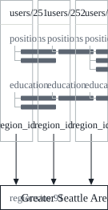

This is the second post in my DDIA reading notes. [The first one](/en/posts/ddia-01/) covered reliability, scalability, and maintainability. Chapter 2 shifts perspective: the same data can be expressed through different **data models**—relational, document, graph, and so on—and each model has its own query language. The English quotations in the text are from the book; everything else is my own retelling and organization.

The chapter opens with a line from Wittgenstein's *Tractatus Logico-Philosophicus*:

> The limits of my language mean the limits of my world.

A data model is the language we use to describe the problem at hand. The book says that data models are perhaps the most important part of developing software, because their influence runs deep: they affect not only how the software is written, but also how we think about the problem we are solving.

## Data models are layered on top of each other

Most applications are built by layering one data model on top of another. For each layer, the key question is: **how does it represent the layer below?**

| Layer | Considered by | Representation |
| --- | --- | --- |
| Application | Application developers | Models the real world as objects or data structures, plus APIs to manipulate them, usually specific to the application |
| General-purpose data model | Application developers | When storing those data structures, expresses them through general-purpose models such as JSON or XML documents, tables in a relational database, or graphs |
| Bytes | Database engineers | Decides how JSON, XML, relational, or graph data is represented in bytes in memory, on disk, and on the network; this representation determines how the data can be queried, searched, modified, and processed |
| Physical signals | Hardware engineers | Represents bytes as electrical currents, pulses of light, magnetic fields, and so on |

Each layer hides the complexity of the layers below it behind a clean data model. These abstractions allow different groups of people—for example, the engineers at a database vendor and the application developers using that database—to work together effectively.

Every data model embodies assumptions about how it is going to be used: some usages are convenient, others are not supported at all; some operations are fast, others perform badly; some data transformations feel natural, others are awkward. Mastering even one data model takes a lot of effort (think of how many books there are on relational data modeling), but the data model has such a profound effect on what the software above it can and cannot do that it is worth choosing one that is appropriate for the application.

This chapter compares the second layer, the general-purpose data models: the relational model, the document model, and several graph models, along with the languages for querying data in them. How these models are implemented at the next layer down is the subject of Chapter 3, on storage engines.

## The relational model and the document model

### The origins of the relational model

The best-known data model today is probably SQL, which is based on the **relational model** proposed by Edgar Codd in 1970: data is organized into **relations** (called tables in SQL), where each relation is an unordered collection of **tuples** (called rows in SQL).

The relational model was initially just a theoretical proposal, and many people doubted whether it could be implemented efficiently. But by the mid-1980s, relational database management systems (RDBMSes) and SQL had become the tools of choice for most people who needed to store and query structured data. This dominance lasted for roughly 25 to 30 years—an eternity in computing history.

Relational databases trace their roots to **business data processing**, with typical use cases in transaction processing (entering sales or banking transactions, airline reservations) and batch processing (customer invoicing, payroll, reporting). Other databases of the time required application developers to think carefully about how data was represented inside the database, whereas the goal of the relational model was to hide those implementation details behind a cleaner interface.

### The emergence of NoSQL

By the 2010s, **NoSQL** had become the latest attempt to overthrow the relational model's dominance. The name is actually unfortunate: it doesn't refer to any particular technology. It was originally just a Twitter hashtag for a 2009 meetup about open source, distributed, nonrelational databases, and only later was retroactively reinterpreted as Not Only SQL.

Four main forces drove people to adopt NoSQL:

1. A need for **scalability** that relational databases struggle to achieve easily, such as very large datasets or extremely high write throughput;
2. A preference for **free and open source software** over commercial database products;
3. Some **specialized query operations** that the relational model does not support well;
4. Frustration with the restrictiveness of relational **schemas**, and a desire for a more dynamic and expressive data model.

Different applications have different requirements, and the best technical choice for one use case may not be right for another. So for the foreseeable future, relational databases are likely to be used alongside a broad variety of nonrelational datastores—an approach sometimes called **polyglot persistence**.

### The impedance mismatch between objects and tables

Most applications today are developed in object-oriented languages. If the data is stored in relational tables, an awkward translation layer is required between the objects in the application code and the tables, rows, and columns in the database. This disconnect between the models is called an **impedance mismatch**[^impedance]. Object-relational mapping (ORM) frameworks like ActiveRecord and Hibernate reduce the amount of boilerplate code required for this translation layer, but they can't completely hide the differences between the two models.

The book uses a résumé (a LinkedIn profile) as an example. Fields like `first_name` and `last_name` appear exactly once per user, but most people have held more than one job, attended several schools, and may have several kinds of contact information—all **one-to-many** relationships from the user to the entries. There are three ways to represent one-to-many relationships in SQL:

| Approach | Description |
| --- | --- |
| Split into multiple tables with foreign keys | The most common normalized representation before SQL:1999: positions, education, and contact information each go in their own table, with a foreign key reference back to the users table |
| Structured types, XML, or JSON columns | Later SQL standards support storing multi-valued data in a single row, with the ability to query and index inside it; support varies across Oracle, IBM DB2, SQL Server, and PostgreSQL, and DB2, MySQL, and PostgreSQL also support a JSON type |
| Store JSON or XML encoded in a text column | The application parses its structure; the database cannot query the values inside |

For a document like a résumé, which is largely a self-contained unit, a JSON representation is quite appropriate. Document-oriented databases such as MongoDB, RethinkDB, CouchDB, and Espresso support this model. Here is an abridged version of the book's example:

```json
{
  "user_id": 251,
  "first_name": "Bill",
  "last_name": "Gates",
  "region_id": "us:91",
  "industry_id": 131,
  "positions": [
    { "job_title": "Co-chair", "organization": "Bill & Melinda Gates Foundation" },
    { "job_title": "Co-founder, Chairman", "organization": "Microsoft" }
  ],
  "education": [
    { "school_name": "Harvard University", "start": 1973, "end": 1975 },
    { "school_name": "Lakeside School, Seattle", "start": null, "end": null }
  ]
}
```

Compared with the multi-table approach, JSON has two advantages:

- **Better locality**: in the relational schema, fetching a complete profile requires either querying each table separately by `user_id` or performing an awkward multi-way join; a JSON document keeps all the relevant information in one place, so one query suffices;
- **The tree structure is explicit**: the one-to-many relationships from the user to positions and education are inherently a tree, and JSON writes that tree out directly.

Some developers feel that the JSON model reduces the impedance mismatch between the application code and the storage layer.

### Many-to-one and many-to-many

In the JSON above, `region_id` and `industry_id` store IDs rather than text like "Greater Seattle Area" or "Philanthropy". Using an ID to refer to a standardized list (typically a drop-down list or autocompleter in the UI) has these advantages:

- Consistent style and spelling across all profiles;
- Avoiding ambiguity, such as when several cities have the same name;
- The name is stored in only one place, so if it ever needs to change (say, a city is renamed for political reasons), one update suffices;
- The list can be localized, displayed in the viewer's language;
- Better search: to find philanthropists in Washington state, the list of regions can encode the fact that Seattle is in Washington, which is not apparent from the string alone.

Whether to store an ID or text is fundamentally a question of **duplication**. With an ID, the information that is meaningful to humans is stored in only one place, and everything else refers to it by ID; storing the text directly duplicates that information in every record that uses it. An ID has no meaning to humans, so it **never needs to change**; anything that is meaningful to humans may need to change in the future, and if it is duplicated in many places, every copy has to be updated—with write overhead and the risk of inconsistency. Removing such duplication is the key idea behind **normalization** in databases[^normal].

The problem is that normalization requires **many-to-one** relationships (many people live in the same region, many people work in the same industry), and many-to-one relationships don't fit naturally into the document model:



In a relational database, referring to rows in other tables by ID is routine, because joins are easy; document databases typically don't need joins for one-to-many trees, and their support for joins is often weak. If the database itself doesn't support joins, you have to emulate them in application code: query the database several times and assemble the results yourself. The lists of regions and industries are small and change rarely, so the application can simply keep them in memory—but either way, the work of joining has moved from the database into the application code.

More troublesome is that even if the first version of an application fits the join-free document model well, **as features are added, data tends to become more interconnected**. The book gives two extensions:

- **Organizations and schools as entities**. Currently `organization` and `school_name` are just strings. If each organization and each school has its own page (logo, news feed), the résumé should reference those entities rather than storing just a name;
- **Recommendations**. One user can write a recommendation for another user, and the recommendation appears on the recommended person's résumé together with the recommender's name and photo. If the recommender changes their photo, all recommendations should show the new photo, so the recommendation should reference the recommender's profile.

Both extensions introduce **many-to-many** relationships.

### Are document databases repeating history?

Relational databases handle many-to-one and many-to-many relationships with joins, while document databases and NoSQL have reopened the debate over how such relationships should be represented. This debate is actually much older than NoSQL—it goes all the way back to the earliest computerized database systems.

#### The hierarchical model

The most popular database for business data processing in the 1970s was IBM's IMS (Information Management System). It was originally developed for inventory management for the Apollo space program and was first released commercially in 1968.

IMS used the **hierarchical model**, representing all data as a tree of records nested within records, much like JSON. It excelled at one-to-many relationships but struggled with many-to-many, and it did not support joins. Developers had to choose between duplicating data (denormalization) and manually resolving references. These problems from the 1960s and 70s are remarkably similar to the problems developers face with document databases today.

Several solutions were proposed to address the limitations of the hierarchical model. The two most prominent were the **relational model** (which became SQL and took over the world) and the **network model** (which was popular for a while but eventually faded into obscurity).

#### The network model

The network model was standardized by a committee called CODASYL (Conference on Data Systems Languages), so it is also known as the CODASYL model. It is a generalization of the hierarchical model: in a tree, every record has exactly one parent, whereas in the network model, a record can have multiple parents. For example, there is one record for "Greater Seattle Area", and every user who lives there can link to it, representing many-to-one and many-to-many relationships this way.

But these links are not foreign keys; they are more like pointers in a programming language (except stored on disk). The only way to access a record is to start from some root record and follow a chain of links, a path called an **access path**.

In a many-to-many world, there may be several paths to the same record, and programmers had to keep all of them in their heads. A query was performed by moving a cursor through the database, iterating over lists of records and following access paths. Even members of the CODASYL committee admitted that it was like navigating around an n-dimensional data space. When you didn't have a path to the data you wanted, things got awkward: you could change the access path, but then you had to go through a large body of hand-written database query code and rewrite it, making changes to the application's data model difficult.

#### The relational model's answer

The relational model's approach is to lay all the data out in the open: a relation (table) is simply a collection of tuples (rows), and that's it. There are no labyrinthine nested structures, and no complicated access paths to follow when looking at the data. You can read any or all rows of a table, matching arbitrary conditions; you can designate certain columns as keys and read particular rows by their keys; and you can insert a new row into any table without worrying about foreign key relationships to other tables[^fk].

In a relational database, the **query optimizer** automatically decides which parts of the query to execute in which order, and which indexes to use. Those choices are effectively the access path—but the difference is that they are made automatically by the optimizer, not by the application developer, so we rarely need to think about them. To query the data in a new way, you just declare a new index, and queries will automatically use whichever index is most appropriate, without requiring changes to the queries themselves.

The query optimizer is a complicated thing, and it has consumed many years of research and development. But a key insight of the relational model is:

> you only need to build a query optimizer once, and then all applications that use the database can benefit from it.

Without a query optimizer, hand-coding the access path for a particular query is easier than writing a general-purpose optimizer, but the general-purpose solution wins in the long run.

#### Where document databases stand

In one respect, document databases revert to the hierarchical model: nested records (one-to-many relationships) are stored within their parent record rather than in a separate table.

But when it comes to many-to-one and many-to-many relationships, they are not fundamentally different from relational databases: the referenced item is identified by a unique identifier—called a foreign key in the relational model and a document reference in the document model—which is resolved at read time by a join or follow-up queries. So far, document databases have not gone down the CODASYL path.

### How to choose today

The main arguments for each model:

| Model | Arguments in its favor |
| --- | --- |
| Document model | Schema flexibility; better performance due to locality; for some applications, closer to the data structures used in the application |
| Relational model | Better support for joins; better handling of many-to-one and many-to-many relationships |

#### Which model leads to simpler application code

If the data in your application is document-like (a tree of one-to-many relationships, typically loaded in its entirety at once), the document model may be a good fit. The relational technique of splitting a document-like structure into multiple tables is called **shredding**, and it leads to cumbersome schemas and unnecessarily complicated application code.

The document model has limitations too. It cannot directly refer to a nested item within a document; you can only say something like "the second item in the list of positions for user 251", much like an access path in the hierarchical model. However, as long as documents are not too deeply nested, this is usually not a problem. Whether weak join support is a problem depends on the application: an analytics application that uses a document database to record "what event happened when" may never need many-to-many relationships.

But if the application does use many-to-many relationships, the document model becomes less appealing. Denormalization can reduce the need for joins, but the application has to do extra work to keep the denormalized data consistent; emulating joins in application code also moves complexity into the application, and is usually slower than specialized join code inside the database. In general, which model leads to simpler code depends on the kinds of relationships between data items:

> For highly interconnected data, the document model is awkward, the relational model is acceptable, and graph models are the most natural.

#### Schema flexibility

Document databases are sometimes called **schemaless**, but that's misleading: the code that reads the data usually assumes some kind of structure, meaning there is a schema—it is just **implicit**, and the database does not enforce it. A more accurate way to put it:

| Term | Meaning | Analogy |
| --- | --- | --- |
| Schema-on-read | The structure of the data is implicit, and only interpreted when the data is read | Dynamic (runtime) type checking |
| Schema-on-write | The schema is explicit, and the database ensures all written data conforms to it; this is the traditional approach of relational databases | Static (compile-time) type checking |

Just as the advocates of static and dynamic typing debate their relative merits, whether a database should enforce a schema is a contentious topic, and there is generally no right or wrong answer.

The difference between the two approaches is most visible when an application needs to change its data format. For example, suppose you currently store each user's full name in one field, and now you want to store the first name and last name separately. With a document database, you just start writing new documents with the new fields, and handle the case of reading old documents in the application:

```javascript
if (user && user.name && !user.first_name) {
  // Documents written before Dec 8, 2013 don't have first_name
  user.first_name = user.name.split(" ")[0];
}
```

With a schema-on-write database, you would typically perform a migration:

```sql
ALTER TABLE users ADD COLUMN first_name text;
UPDATE users SET first_name = split_part(name, ' ', 1);      -- PostgreSQL
UPDATE users SET first_name = substring_index(name, ' ', 1); -- MySQL
```

Schema changes have a bad reputation of being slow and requiring downtime. The book says this reputation is not entirely deserved: most relational databases execute `ALTER TABLE` in a few milliseconds. MySQL is a notable exception—it copies the entire table, which can mean minutes or even hours of downtime on a large table, though various tools exist to work around this limitation[^mysql]. Running `UPDATE` on a large table is likely to be slow on any database, since every row needs to be rewritten; if that's not acceptable, you can leave `first_name` as its default of NULL and fill it in at read time, like the document database would.

Schema-on-read is advantageous in two situations:

- There are many different types of objects, and it is not practical to put each type in its own table;
- The structure of the data is determined by external systems over which you have no control and which may change at any time.

Conversely, if all records are expected to have the same structure, a schema is a useful mechanism for documenting and enforcing that structure.

#### Data locality for queries

A document is usually stored as a single continuous string, encoded as JSON, XML, or a binary variant thereof (such as MongoDB's BSON). If your application often needs to access the entire document (for example, to render it on a web page), this storage locality has a performance advantage. If the data is split across multiple tables, multiple index lookups are required to retrieve it all, which may require more disk seeks and take more time.

But locality only helps if you need **large parts of the document at the same time**. Even if you access only a small portion, the database typically has to load the entire document, which can be wasteful for large documents. On updates, the entire document usually has to be rewritten—only modifications that don't change the encoded size can be performed in place. For these reasons, it is generally recommended that documents be kept fairly small, and that writes that increase the size of a document be avoided. These performance limitations significantly reduce the set of situations in which document databases are useful.

Grouping related data together for locality is not unique to the document model either: Google's Spanner allows you to declare in the schema that a table's rows should be interleaved (nested) within a parent table; Oracle has multi-table index cluster tables; the column family concept in the Bigtable data model (used by Cassandra and HBase) is also about managing locality. Chapter 3 will cover more of this.

#### The two models are converging

Most relational databases (other than MySQL) have supported XML since the mid-2000s, allowing local modifications to XML documents, as well as indexing and querying inside them; since PostgreSQL 9.3, MySQL 5.7, and IBM DB2 10.5, similar support has been available for JSON documents.

On the document database side, RethinkDB's query language supports relational-like joins, and some MongoDB drivers automatically resolve document references. The latter is effectively a client-side join, which is usually slower than a join performed inside the database because it requires extra network round-trips and less optimization.

Relational and document databases are becoming more similar over time, and that is a good thing: the two data models can complement each other. If a database can handle document-like data and also perform relational queries on it, applications can use the combination that best fits their needs. The book argues that a hybrid of the relational and document models is a good path forward for databases[^codd].

## Query languages for data

### Declarative vs. imperative

The relational model introduced a new way of querying data: SQL is a **declarative** query language, whereas IMS and CODASYL queried the database using **imperative** code.

For example, find all the sharks in a list of animals. The imperative approach tells the computer to perform certain operations in a certain order; you can imagine stepping through the code line by line, evaluating conditions, updating variables, and deciding whether to loop around again:

```javascript
function getSharks() {
  var sharks = [];
  for (var i = 0; i < animals.length; i++) {
    if (animals[i].family === "Sharks") {
      sharks.push(animals[i]);
    }
  }
  return sharks;
}
```

In relational algebra it is a single line: sharks = σ<sub>family = "Sharks"</sub>(animals), where σ is the selection operator. SQL is almost a direct translation:

```sql
SELECT * FROM animals WHERE family = 'Sharks';
```

A declarative language describes only what pattern the desired data should satisfy: what conditions the results must meet, and how the data should be transformed (sorted, grouped, aggregated)—**but not how to achieve that goal**. Which indexes to use, which join methods, and in what order to execute the various parts of the query are all decided by the database's query optimizer.

Declarative languages have three advantages:

1. **They are more concise and easier to work with.**
2. **They hide implementation details of the database engine**, allowing the database to improve performance without requiring any changes to queries. For example, the database may move records around to reclaim disk space, changing their order. SQL makes no guarantee about the order of results, so it doesn't care about order changes; if the query were imperative code, the database could never be sure whether the code depended on that order. SQL's limited functionality actually gives the database much more room to optimize automatically.
3. **They lend themselves to parallel execution.** Today, CPUs get faster by adding more cores, not by running at much higher clock speeds. Imperative code specifies that instructions must be executed in a particular order, making it hard to spread across multiple cores and multiple machines; declarative languages describe only the pattern of the results, not the algorithm, so they have more opportunity to speed up through parallel execution.

### An example on the web: CSS vs. JavaScript

The benefits of declarative languages are not limited to databases. Imagine a website about marine animals, where the currently selected page "Sharks" in the navigation bar has the `selected` class, and we want the title of the selected page to have a blue background. In CSS, a single rule suffices:

```css
li.selected > p {
  background-color: blue;
}
```

The selector `li.selected > p` declares the pattern of elements to which the style should be applied: all `<p>` elements whose direct parent is an `<li>` element with the `selected` class. In XSL, the XPath expression `li[@class='selected']/p` accomplishes the same thing.

The imperative JavaScript equivalent would first select all `<li>` elements, check each one's class name, then iterate over each `<li>`'s child nodes, find the `<p>`, and set the style—a dozen or so lines. Besides being verbose, it has two more serious problems:

- If the `selected` class is removed (because the user clicked a different page), the blue color does not go away, even if the code is re-run—you have to wait until the whole page is reloaded. With CSS, the browser automatically detects that the rule no longer applies and removes the blue background as soon as the class is removed;
- If you want to take advantage of a new, faster API like `document.getElementsByClassName("selected")`, you have to rewrite the code; browser vendors, on the other hand, can improve the performance of CSS and XPath without breaking compatibility.

In a browser, declarative CSS is much better than manipulating styles imperatively in JavaScript; similarly, in databases, declarative query languages like SQL have turned out to be much better than imperative query APIs.

### MapReduce querying

**MapReduce** is a programming model popularized by Google for processing large amounts of data in bulk across many machines. Some NoSQL datastores, including MongoDB and CouchDB, support a limited form of MapReduce for performing read-only queries across many documents. MapReduce itself will be covered in detail in Chapter 10.

MapReduce is neither a declarative query language nor a fully imperative query API, but somewhere in between: the logic of the query is expressed with snippets of code that are called repeatedly by the processing framework.

The book's example: a marine biologist adds an observation record to the database every time she sees animals in the ocean, and now wants to generate a report of how many sharks she has sighted per month. In PostgreSQL it looks like this:

```sql
SELECT date_trunc('month', observation_timestamp) AS observation_month,
       sum(num_animals) AS total_animals
FROM observations
WHERE family = 'Sharks'
GROUP BY observation_month;
```

`date_trunc('month', timestamp)` truncates the timestamp to the first day of its month. This query first filters the observations to only sharks, then groups them by month, and finally adds up the number of animals seen in each group.

In MongoDB's MapReduce, it looks like this:

```javascript
db.observations.mapReduce(
  function map() {
    var year  = this.observationTimestamp.getFullYear();
    var month = this.observationTimestamp.getMonth() + 1;
    emit(year + "-" + month, this.numAnimals);
  },
  function reduce(key, values) {
    return Array.sum(values);
  },
  {
    query: { family: "Sharks" },
    out: "monthlySharkReport"
  }
);
```

- The filter to consider only shark species can be specified declaratively in `query`; this is a MongoDB-specific extension of MapReduce;
- `map` is called once for every document that matches the query, with `this` set to the document. It emits a key (a string consisting of year and month, such as `"1995-12"`) and a value (the number of animals in that observation);
- The key-value pairs emitted by `map` are grouped by key, and `reduce` is called once for all values with the same key, adding up the number of animals from all observations in that month;
- The final output is written to the collection `monthlySharkReport`.

For example, suppose there are two shark observations in December 1995, with 3 and 4 animals respectively. `map` would emit `("1995-12", 3)` and `("1995-12", 4)`, and `reduce` would receive `("1995-12", [3, 4])` and return 7.

The `map` and `reduce` functions must be **pure functions**: they may only use the data passed to them, may not perform additional database queries, and must not have any side effects. These restrictions allow the database to run them anywhere, in any order, and to rerun them on failure.

That said, SQL is not restricted to running on a single machine, and MapReduce doesn't have a monopoly on distributed queries.

#### Aggregation pipelines

MapReduce has a usability problem: you have to write two carefully coordinated JavaScript functions, which is often harder than writing a single query. Moreover, a declarative language leaves more room for a query optimizer to improve performance. For these reasons, MongoDB 2.2 added a declarative query language called the **aggregation pipeline**[^mapreduce], in which the same report is written like this:

```javascript
db.observations.aggregate([
  { $match: { family: "Sharks" } },
  { $group: {
      _id: {
        year:  { $year:  "$observationTimestamp" },
        month: { $month: "$observationTimestamp" }
      },
      totalAnimals: { $sum: "$numAnimals" }
  } }
]);
```

The aggregation pipeline is expressively equivalent to a subset of SQL, just with a JSON-based syntax. The book's assessment:

> a NoSQL system may find itself accidentally reinventing SQL, albeit in disguise.

## Graph-like data models

### When to use a graph

If your application has mostly one-to-many relationships (tree-structured data) or no relationships between records, the document model is appropriate. But what if **many-to-many relationships are very common**? The relational model can handle simple cases of many-to-many, but as the connections within your data become more complex, it becomes more natural to model your data as a **graph**.

A graph consists of two kinds of objects: **vertices** (also known as nodes or entities) and **edges** (also known as relationships or arcs). Many kinds of data are naturally graphs:

| Graph | Vertices | Edges |
| --- | --- | --- |
| Social graph | People | Who knows whom |
| Web graph | Web pages | HTML links to other pages |
| Road or rail network | Junctions | Roads or railway lines between junctions |

Many well-known algorithms operate on graphs: car navigation systems search for the shortest path between two points, and PageRank uses the web graph to determine the popularity of a web page and hence its ranking in search results.

Graphs are not limited to homogeneous data of this kind; they can also store **completely different types of objects** in a single datastore in a uniform way. For example, Facebook maintains a single graph with many different types of vertices and edges: vertices represent people, locations, events, check-ins, and comments; edges indicate which people are friends with each other, which check-in happened at which location, who commented on which post, and who attended which event.

The rest of this section uses the same example throughout: Lucy, from Idaho in the United States, and Alain, from Beaune in France, are married and live in London.


Even this small graph shows some of the messiness of real-world data:

- Different countries have different structures for administrative subdivisions: France has regions and departments, while the US has counties and states;
- Historical quirks, such as a country within a country: England is within the United Kingdom;
- Inconsistent granularity of data: Lucy's current residence is specified as a city, but her place of birth only as a state.

The query languages below all use it to answer the same question: **find all people who emigrated from the US to Europe**. That is, find vertices that have a `BORN_IN` edge pointing to a location within the US, and a `LIVES_IN` edge pointing to a location within Europe, and return the names of those people.

### The property graph model

In the **property graph** model (implemented by Neo4j, Titan, and InfiniteGraph), vertices and edges are composed as follows:

| Component | Contains |
| --- | --- |
| Vertex | A unique identifier; a set of outgoing edges; a set of incoming edges; a collection of properties (key-value pairs) |
| Edge | A unique identifier; the tail vertex (where the edge starts); the head vertex (where the edge ends); a label describing the type of relationship; a collection of properties (key-value pairs) |

You can think of a property graph as two relational tables, one for vertices and one for edges:

```sql
CREATE TABLE vertices (
  vertex_id   integer PRIMARY KEY,
  properties  json
);

CREATE TABLE edges (
  edge_id     integer PRIMARY KEY,
  tail_vertex integer REFERENCES vertices (vertex_id),
  head_vertex integer REFERENCES vertices (vertex_id),
  label       text,
  properties  json
);

CREATE INDEX edges_tails ON edges (tail_vertex);
CREATE INDEX edges_heads ON edges (head_vertex);
```

This model has several important features:

1. Any vertex can have an edge connecting it to any other vertex. There is **no schema** restricting which kinds of things can or cannot be associated;
2. Given any vertex, you can efficiently find both its incoming and its outgoing edges, and thus traverse the graph—follow a path through a chain of vertices—both forward and backward. That's why the indexes on `tail_vertex` and `head_vertex` above are created;
3. By using **different labels** for different kinds of relationships, you can store several different kinds of information in a single graph, while still keeping the data model clean.

This makes graphs good for **evolvability**: as you add features to your application, a graph can easily be extended. For example, to record food allergies for each person, you can add a vertex for each allergen, connect a person to an allergen with an edge indicating an allergy, and connect the allergen to the foods that contain it; you can then query what each person can safely eat.

### The Cypher query language

**Cypher** is a declarative query language for property graphs, created for the Neo4j graph database. Its name comes from a character in the movie *The Matrix*, and has nothing to do with ciphers in cryptography.

When inserting data, each vertex is given a symbolic name (such as `USA` or `Idaho`), and edges are created with an arrow syntax: `(Idaho) -[:WITHIN]-> (USA)` creates an edge labeled `WITHIN`, with Idaho as the tail node and USA as the head node.

The query for "people who emigrated from the US to Europe" is only four lines:

```cypher
MATCH
  (person) -[:BORN_IN]->  () -[:WITHIN*0..]-> (us:Location {name:'United States'}),
  (person) -[:LIVES_IN]-> () -[:WITHIN*0..]-> (eu:Location {name:'Europe'})
RETURN person.name
```

It means: find vertices, called `person`, that satisfy both of the following conditions:

1. `person` has an outgoing `BORN_IN` edge to some vertex, and from that vertex you can follow a chain of outgoing `WITHIN` edges until eventually reaching a Location vertex whose `name` property is "United States";
2. The same `person` also has an outgoing `LIVES_IN` edge, and following it and a chain of `WITHIN` edges eventually reaches a Location vertex whose `name` is "Europe".

For each such vertex, return its `name` property. The expression `:WITHIN*0..` means "follow a `WITHIN` edge zero or more times", like the `*` in a regular expression. In Figure 2, the chains from a place of birth or residence up to a country and then a continent vary in length, which is exactly why this variable-length matching is needed.

As with all declarative languages, you don't need to specify execution details when writing the query: the query optimizer automatically chooses the strategy that it predicts to be the most efficient. For example, it could start by scanning all people and checking their birthplaces and residences one by one; or it could work backward, first using the index on `name` to find the two vertices United States and Europe, then following incoming `WITHIN` edges to find all locations within them, and then following incoming `BORN_IN` and `LIVES_IN` edges to find the people.

### Graph queries in SQL

Since a graph can be stored in relational tables, can you query graph data in SQL? Yes, but with some difficulty. In a relational database, you usually know in advance which joins you need in your query; a graph query, on the other hand, may need to traverse a **variable number** of edges before finding the vertex you want—that is, the number of joins is not fixed in advance. In the example above, a `LIVES_IN` edge might point directly to a country, or to a city, which is within a region, which is within a country, and so on.

Since SQL:1999, this kind of variable-length traversal can be expressed using **recursive common table expressions** (the `WITH RECURSIVE` syntax), supported by PostgreSQL, IBM DB2, Oracle, and SQL Server. For example, to find the vertex IDs of all locations within the United States:

```sql
WITH RECURSIVE in_usa(vertex_id) AS (
    SELECT vertex_id FROM vertices WHERE properties->>'name' = 'United States'
  UNION
    SELECT edges.tail_vertex FROM edges
      JOIN in_usa ON edges.head_vertex = in_usa.vertex_id
      WHERE edges.label = 'within'
)
SELECT vertex_id FROM in_usa;
```

The query starts from the United States vertex, and each round of recursion follows `within` edges one step backward, adding the vertices that point to vertices already in the set, until no new vertices are found. The locations within Europe are found similarly; then two more CTEs find the people born in the US and the people living in Europe, and finally the two are joined. The complete query takes 29 lines in the book.

The same query takes 4 lines in one language and 29 in another, which shows that different data models are designed to satisfy different use cases, and that choosing a data model that is suitable for the application matters[^pgq].

### Triple-stores and SPARQL

The **triple-store** model is mostly equivalent to the property graph model, just using different words to describe the same ideas. In a triple-store, all information is stored in the form of very simple three-part statements: **(subject, predicate, object)**. For example, in the triple (Jim, likes, bananas), Jim is the subject, likes is the predicate (verb), and bananas is the object.

The subject is equivalent to a vertex in a graph. The object is one of two things:

| Object is | Equivalent to | Example |
| --- | --- | --- |
| A value of a primitive type, such as a string or a number | A property on the subject vertex: the predicate is the key of the property, and the object is the value | (lucy, age, 33) is like vertex lucy with property `{"age": 33}` |
| Another vertex in the graph | An edge: the subject is the tail vertex, the predicate is the edge's label, and the object is the head vertex | (lucy, marriedTo, alain) |

#### The Turtle format

The book writes out the same data in the Turtle format (a subset of Notation3). Vertices are written as `_:someName`; the name has no meaning outside the file, and exists only to identify which triples refer to the same vertex. Using a semicolon, you can say several things about the same subject, which reads quite clearly:

```turtle
@prefix : <urn:example:>.
_:lucy  a :Person;   :name "Lucy";          :bornIn _:idaho.
_:idaho a :Location; :name "Idaho";         :type "state";   :within _:usa.
_:usa   a :Location; :name "United States"; :type "country"; :within _:namerica.
```

#### The semantic web

Reading about triple-stores, it's easy to get drawn into a morass of articles about the semantic web, but the triple-store data model and the semantic web are two entirely separate things.

The idea of the semantic web is: websites already publish text and pictures for humans to read, so why not also publish machine-readable data for computers to read? **RDF** (Resource Description Framework) was designed for exactly this purpose, allowing different websites to publish data in a consistent format, so that the data can be automatically combined into a web of data—a kind of "database of everything" spanning the entire internet.

Unfortunately, the semantic web was overhyped in the early 2000s, and at least at the time the book was written, there was no sign of it being realized in practice. But setting aside those failures, there was also much good work: even if you have no interest in publishing RDF data on the semantic web, triples can be a good internal data model for applications.

RDF has a quirk: the subject, predicate, and object are usually URIs. For example, a predicate might be written as `<http://my-company.com/namespace#within>` rather than just `WITHIN`. This design is meant to allow your data to be combined with other people's data: even if someone else attaches a different meaning to "within", the two predicates are actually different URIs, so there is no conflict. The URL doesn't need to actually resolve to anything; it is just a namespace.

#### SPARQL

**SPARQL** is the query language for RDF triple-stores, an acronym for SPARQL Protocol and RDF Query Language, pronounced "sparkle". It predates Cypher, and Cypher's pattern matching borrows from SPARQL, so the two look quite similar. The same emigration query is even shorter in SPARQL than in Cypher:

```sparql
PREFIX : <urn:example:>

SELECT ?personName WHERE {
  ?person :name ?personName.
  ?person :bornIn  / :within* / :name "United States".
  ?person :livesIn / :within* / :name "Europe".
}
```

The two forms in each pair below are equivalent:

```text
(person) -[:BORN_IN]-> () -[:WITHIN*0..]-> (location)   # Cypher
?person :bornIn / :within* ?location.                   # SPARQL

(usa {name:'United States'})                             # Cypher
?usa :name "United States".                              # SPARQL
```

RDF does not distinguish between properties and edges; both are represented by predicates, so matching properties and matching edges use the same syntax. Even if the semantic web never comes to pass, SPARQL can be a powerful tool for applications to use internally.

### Graph databases are not CODASYL redux

At first glance, CODASYL's network model and the graph model look similar. Is a graph database just CODASYL in a new guise? No, they differ in several important ways:

| Aspect | CODASYL network model | Graph database |
| --- | --- | --- |
| Schema | The database has a schema specifying which record types can be nested within which other record types | No such restriction: any vertex can have an edge to any other vertex, making it easier to adapt to changing requirements |
| Access | The only way to reach a record is by traversing one of the access paths | Any vertex can be referenced directly by its unique ID, or found with an index on a particular value |
| Ordering | The children of a record are an ordered set, and the database must maintain that ordering (which affects the storage layout); the application has to worry about the position of new records when inserting them | Vertices and edges are not ordered; you can only sort the results when querying |
| Queries | All queries are imperative, difficult to write, and easily broken by changes to the schema | You can write imperative traversal code if you want to, but most graph databases support high-level declarative languages like Cypher or SPARQL |

### Datalog

**Datalog** is much older than SPARQL or Cypher, and was studied extensively by academics in the 1980s. It is less well known among software engineers, but it is important because it provides the foundation on which later query languages are built. In practice, Datomic uses it as its query language, and Cascalog is a Datalog implementation for querying large datasets on Hadoop.

Datalog's data model is similar to the triple-store model, except that (subject, predicate, object) is written as predicate(subject, object):

```datalog
name(namerica, 'North America').
type(namerica, continent).
within(usa, namerica).
name(idaho, 'Idaho').
within(idaho, usa).
born_in(lucy, idaho).
```

The same emigration query in Datalog looks like this:

```datalog
within_recursive(Location, Name) :- name(Location, Name).     /* Rule 1 */

within_recursive(Location, Name) :- within(Location, Via),    /* Rule 2 */
                                    within_recursive(Via, Name).

migrated(Name, BornIn, LivingIn) :- name(Person, Name),       /* Rule 3 */
                                    born_in(Person, BornLoc),
                                    within_recursive(BornLoc, BornIn),
                                    lives_in(Person, LivingLoc),
                                    within_recursive(LivingLoc, LivingIn).

?- migrated(Who, 'United States', 'Europe').
/* Who = 'Lucy'. */
```

Cypher and SPARQL jump right in with SELECT, but Datalog takes small steps at a time: first you define **rules** that tell the database about new predicates. Here, `within_recursive` and `migrated` are not triples stored in the database, but are **derived from data or from other rules**. Rules can refer to other rules, just like functions can call other functions, and can also call themselves recursively; complex queries are built up step by step in this way.

Words starting with an uppercase letter in rules are variables. `name(Location, Name)` matches `name(namerica, 'North America')`, binding `Location = namerica` and `Name = 'North America'`. The process of applying rules goes roughly like this:

1. The data contains `name(namerica, 'North America')`, so Rule 1 applies, deriving `within_recursive(namerica, 'North America')`;
2. The data contains `within(usa, namerica)`, and the previous step derived `within_recursive(namerica, 'North America')`, so Rule 2 applies, deriving `within_recursive(usa, 'North America')`;
3. Similarly, `within(idaho, usa)` derives `within_recursive(idaho, 'North America')`.

By applying Rules 1 and 2 repeatedly, `within_recursive` can list all the locations in North America (or any other location) in the database, and Rule 3 then finds people born in one place and living in another.

Datalog requires a different way of thinking from the other query languages in this chapter, but it is very powerful, because rules can be combined and reused across different queries. It is less convenient for simple one-off queries, but its advantages become clearer as the data grows more complex.

## Summary

Data was originally represented as one big tree (the hierarchical model), but trees are not good at representing many-to-many relationships, so the relational model was invented. Later, developers found that some applications don't fit the relational model well either, and the new nonrelational NoSQL datastores diverged in two main directions:

- **Document databases**: data appears as self-contained documents, with few relationships between documents;
- **Graph databases**: the opposite—anything can be related to anything.

All three models are widely used today, each in its own domain of competence. One model can be emulated in terms of another—for example, graph data can be stored in a relational database—but the result is often awkward. That's why we have different systems for different purposes, rather than a single one-size-fits-all solution.

| What the data looks like | Suitable model | How relationships are represented | Query language |
| --- | --- | --- | --- |
| Self-contained documents with few relationships between them | Document model | One-to-many embedded in the document; references by document ID, resolved at read time | Each vendor's query API, such as MongoDB's aggregation pipeline |
| Some many-to-one and many-to-many relationships | Relational model | Foreign keys, joined at query time | SQL, with recursive CTEs for variable-length traversal |
| Anything can be related to anything | Graph model | Labeled edges | Cypher, SPARQL, Datalog |

Document databases and graph databases also have something in common: they typically don't enforce a schema for the data they store, which makes it easier for applications to adapt to changing requirements. But the application is still likely to assume that the data has some structure; the difference is just whether the schema is **explicit** (enforced on write) or **implicit** (handled on read).

This chapter hasn't covered all data models. People working on genomic data need sequence-similarity searches, comparing one very long string against a large database of strings that are similar but not identical—specialized databases like GenBank exist for this purpose; particle physicists have been doing large-scale data analysis for decades, and projects like the Large Hadron Collider (LHC) must process hundreds of petabytes of data, requiring custom solutions to keep hardware costs from spiraling out of control; full-text search can also be considered a kind of data model often used alongside databases, and some of it will be covered in Chapter 3 and Part III.

A few connections to other chapters:

- The schema-on-read vs. schema-on-write debate is related to the evolvability discussed in Chapter 1, and Chapter 4 will focus on the evolution of data formats and schemas;
- How these data models are stored on disk is the subject of Chapter 3, on storage engines;
- Normalization and denormalization, caching, and derived data will be discussed systematically in Part III.

## Glossary

| English | Chinese | Meaning |
| --- | --- | --- |
| data model | 数据模型 | A way of representing and thinking about data |
| relation / tuple | 关系 / 元组 | Tables / rows in SQL |
| NoSQL | NoSQL | A catch-all term for nonrelational datastores, later reinterpreted as Not Only SQL |
| polyglot persistence | 多语言持久化 | Using several datastores in combination within one application |
| impedance mismatch | 阻抗失配 | The disconnect between objects in the application and tables in the database |
| ORM | 对象关系映射 | A framework that translates between objects and tables |
| one-to-many | 一对多 | One user has several jobs, forming a tree |
| many-to-one / many-to-many | 多对一 / 多对多 | Many people live in the same region / entities referencing each other |
| normalization | 规范化 | Removing duplication so that information meaningful to humans is stored in only one place |
| denormalization | 反规范化 | Deliberately duplicating data, e.g. for read performance |
| shredding | 拆解 | Splitting a document-like structure into multiple tables |
| hierarchical model | 层次模型 | IMS's model: a tree of records nested within records |
| network model / CODASYL | 网络模型 | Records can have multiple parents, accessed via access paths |
| access path | 访问路径 | A path from a root record, following links to reach the target record |
| query optimizer | 查询优化器 | Automatically decides the execution order and which indexes to use |
| schema-on-read | 读时模式 | The structure is implicit and interpreted only at read time, like dynamic typing |
| schema-on-write | 写时模式 | The schema is explicit and enforced at write time, like static typing |
| data locality | 数据局部性 | Storing data that is often read together in one place |
| declarative | 声明式 | Describes what results you want, not how to achieve them |
| imperative | 命令式 | Specifies which operations to perform in which order |
| MapReduce | MapReduce | A programming model for expressing bulk computation with map and reduce functions |
| aggregation pipeline | 聚合管道 | MongoDB's declarative query language with JSON-based syntax |
| vertex / edge | 顶点 / 边 | Things in a graph / relationships between things |
| property graph | 属性图 | A graph model where vertices and edges have key-value properties and edges have labels |
| triple-store | 三元组存储 | All information stored as (subject, predicate, object) |
| RDF | 资源描述框架 | The format used by the semantic web to publish machine-readable data |
| recursive CTE | 递归公共表表达式 | `WITH RECURSIVE`, introduced in SQL:1999, for variable-length traversal |
| Cypher | Cypher | Neo4j's declarative query language for property graphs |
| SPARQL | SPARQL | The query language for RDF triple-stores, pronounced "sparkle" |
| Datalog | Datalog | A rule-based query language, the foundation for several later graph query languages |

[^impedance]: The term is borrowed from electronics. The input and output of a circuit each have a certain impedance (resistance to alternating current). When the output of one circuit is connected to the input of another, maximum power is transferred only if the impedances match; an impedance mismatch causes signal reflections and other problems.

[^normal]: The literature on the relational model distinguishes several normal forms, but the distinctions are of little practical significance. A rule of thumb is: if you're duplicating values that could be stored in just one place, the schema is not normalized.

[^fk]: Foreign key constraints can restrict which modifications are allowed, but the relational model itself does not require foreign key constraints. And even with constraints, joins on foreign keys are performed at query time; CODASYL links, by contrast, were established when records were inserted, meaning the join was effectively done at insert time.

[^mysql]: This was the situation in 2017. Since MySQL 8.0.12 (2018), adding a column can be done with `ALGORITHM=INSTANT`, which only modifies the data dictionary and no longer copies the entire table.

[^codd]: The relational model as originally described by Codd actually allowed something quite similar to JSON documents within a relational schema. He called it nonsimple domains: the value in a row doesn't have to be a primitive type like a number or a string, but can itself be a nested relation (table), so a value can be an arbitrarily nested tree. This is remarkably similar to the JSON and XML support that SQL acquired more than 30 years later.

[^mapreduce]: The book was written in 2017. Since MongoDB 5.0 (2021), mapReduce has been marked as deprecated, and the official recommendation is to use the aggregation pipeline instead.

[^pgq]: After the book was published, the SQL standard also added graph queries: SQL:2023 introduced Part 16, Property Graph Queries (SQL/PGQ), which allows relational tables to be defined as a property graph and queried with MATCH syntax similar to Cypher; in 2024, ISO also published GQL, a standalone graph query language standard.
