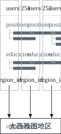
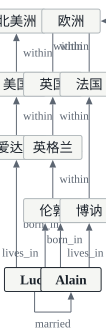

这是 DDIA 读书笔记的第二篇。[第一篇](/posts/ddia-01/)讲的是可靠性、可扩展性和可维护性，第二章换了一个角度：同一份数据，可以用关系、文档、图等不同的**数据模型**来表达，每种模型又有自己的查询语言。文中的英文引文出自原书，其余是我自己的复述和整理。

这一章开头引了维特根斯坦《逻辑哲学论》里的一句话：

> The limits of my language mean the limits of my world.

数据模型就是我们描述问题时用的语言。书里说，数据模型可能是软件开发中最重要的部分，因为它的影响很深：不只影响软件怎么写，也影响我们怎么去思考要解决的问题。

## 数据模型是一层一层叠起来的

大多数应用都是把一种数据模型叠在另一种之上搭起来的。对每一层来说，关键的问题都是：**它用下一层怎么表示？**

| 层次 | 由谁考虑 | 怎么表示 |
| --- | --- | --- |
| 应用 | 应用开发者 | 把现实世界建模成对象或数据结构，以及操作它们的 API，通常是这个应用特有的 |
| 通用数据模型 | 应用开发者 | 存储这些数据结构时，用 JSON 或 XML 文档、关系数据库里的表、图这类通用的模型来表达 |
| 字节 | 数据库工程师 | 决定 JSON、XML、关系或图数据在内存、磁盘和网络上用什么字节表示，这种表示决定了数据能怎样被查询、搜索、修改和处理 |
| 物理信号 | 硬件工程师 | 用电流、光脉冲、磁场等表示字节 |

每一层都用一个干净的数据模型，把下面各层的复杂性藏起来。有了这些抽象，不同的人群才能有效地协作，比如数据库厂商的工程师和使用这个数据库的应用开发者。

每种数据模型都带着对使用方式的假设：有的用法很方便，有的根本不支持；有的操作很快，有的性能很差；有的数据转换很自然，有的很别扭。光是精通一种数据模型就要花很多功夫（想想讲关系数据建模的书有多少），但数据模型对上层软件能做什么、不能做什么影响如此之大，所以值得为应用选一个合适的。

这一章比较的是第二层，也就是通用数据模型：关系模型、文档模型和几种图模型，以及在它们之上查询数据的语言。这些模型在下一层怎样实现，是第 3 章存储引擎的内容。

## 关系模型与文档模型

### 关系模型的来历

今天最有名的数据模型大概是 SQL，它基于 Edgar Codd 在 1970 年提出的**关系模型**：数据组织成**关系**（SQL 里叫表），每个关系是**元组**（SQL 里叫行）的无序集合。

关系模型最初只是一个理论设想，很多人怀疑它能不能被高效地实现。但到 1980 年代中期，关系数据库管理系统（RDBMS）和 SQL 已经成了大多数需要存储、查询结构化数据的人的首选工具，这种统治地位延续了大约 25 到 30 年，在计算机的历史上几乎算是永恒。

关系数据库起源于**商业数据处理**，典型的场景是事务处理（录入销售或银行交易、订机票）和批处理（给客户开发票、发工资、出报表）。当时的其他数据库要求应用开发者花很多心思考虑数据在数据库内部是怎么表示的，而关系模型的目标，就是把这些实现细节藏到一个更干净的接口后面。

### NoSQL 的出现

到了 2010 年代，**NoSQL** 成了推翻关系模型统治地位的最新一次尝试。这个名字其实起得不好，它并不指代任何具体的技术：最初只是 2009 年一场讨论开源、分布式、非关系数据库的聚会在 Twitter 上用的话题标签，后来才被重新解释成 Not Only SQL（不只是 SQL）。

推动人们采用 NoSQL 的力量主要有四个：

1. 需要关系数据库难以轻松达到的**可扩展性**，比如超大的数据集，或者极高的写入吞吐量；
2. 相比商业数据库产品，更偏爱**自由开源软件**；
3. 有些**特殊的查询操作**，关系模型支持得不好；
4. 受够了关系**模式**（schema）的限制，想要更动态、更有表现力的数据模型。

不同的应用有不同的需求，一个用例的最佳技术选择，未必适合另一个用例。所以在可预见的未来，关系数据库很可能会和各种非关系的数据存储一起使用，这种做法有时被称为**多语言持久化**（polyglot persistence）。

### 对象与表之间的阻抗失配

今天的应用大多用面向对象的语言开发。如果数据存在关系表里，应用代码里的对象和数据库里的表、行、列之间就需要一个别扭的转换层，这种模型之间的脱节被称为**阻抗失配**（impedance mismatch）[^impedance]。ActiveRecord、Hibernate 这类对象关系映射（ORM）框架能减少这层转换的样板代码，但不能完全掩盖两种模型的差异。

书里用一份简历（LinkedIn 个人档案）做例子。`first_name`、`last_name` 这样的字段每个用户只有一个，可大多数人做过不止一份工作，上过几段学，联系方式也可能有好几种，这些都是从用户到条目的**一对多**关系。在 SQL 里表示一对多，有三种做法：

| 做法 | 说明 |
| --- | --- |
| 拆成多张表，用外键关联 | SQL:1999 之前最常见的规范化表示：职位、教育经历、联系方式各放一张表，用外键指回 users 表 |
| 结构化类型、XML 或 JSON 列 | 后来的 SQL 标准支持把多值数据存在一行里，还能在其中查询和建索引；Oracle、IBM DB2、SQL Server、PostgreSQL 的支持程度各不相同，DB2、MySQL、PostgreSQL 还支持 JSON 类型 |
| 把 JSON 或 XML 编码后存进文本列 | 由应用来解析它的结构，数据库没法查询里面的值 |

而对简历这种基本自成一体的文档，直接用 JSON 表示相当合适。MongoDB、RethinkDB、CouchDB、Espresso 等面向文档的数据库，支持的就是这种模型。下面是书中示例的一个删减版：

```json
{
  "user_id": 251,
  "first_name": "Bill",
  "last_name": "Gates",
  "region_id": "us:91",
  "industry_id": 131,
  "positions": [
    { "job_title": "Co-chair", "organization": "Bill & Melinda Gates Foundation" },
    { "job_title": "Co-founder, Chairman", "organization": "Microsoft" }
  ],
  "education": [
    { "school_name": "Harvard University", "start": 1973, "end": 1975 },
    { "school_name": "Lakeside School, Seattle", "start": null, "end": null }
  ]
}
```

和多张表的方案相比，JSON 有两个好处：

- **局部性更好**：在关系模式里取一份完整的档案，要么按 `user_id` 分别查询每张表，要么做一个麻烦的多路连接；JSON 文档把所有相关信息放在一处，查一次就够了；
- **树形结构是显式的**：从用户到职位、教育经历的一对多关系，本质上是一棵树，JSON 把这棵树直接写了出来。

有些开发者认为，JSON 模型减少了应用代码和存储层之间的阻抗失配。

### 多对一和多对多

上面的 JSON 里，`region_id` 和 `industry_id` 存的是 ID，而不是 Greater Seattle Area、Philanthropy 这样的文字。用 ID 指向一张标准化的列表（界面上通常是下拉菜单或自动补全）有这些好处：

- 所有档案的写法和拼写一致；
- 避免歧义，比如有好几个同名的城市；
- 名字只存在一处，需要改时（比如某个城市因为政治原因改名）一次就能改完；
- 列表可以本地化，按浏览者的语言显示；
- 搜索更好：要找华盛顿州的慈善家，地区列表可以记录“西雅图在华盛顿州”这个事实，单看字符串是看不出来的。

存 ID 还是存文字，本质上是**重复**的问题。用 ID 时，对人有意义的信息只存在一处，其他地方都通过 ID 引用它；直接存文字，就是在每条用到它的记录里重复这份信息。ID 对人没有意义，所以**永远不需要改**；而任何对人有意义的东西，将来都可能要改，如果它被复制了很多份，每一份都得更新，既有写入的开销，也有不一致的风险。消除这种重复，正是数据库**规范化**（normalization）背后的核心思想[^normal]。

问题是，规范化需要**多对一**的关系（很多人住在同一个地区，很多人在同一个行业工作），而多对一并不适合放进文档模型：



在关系数据库里，用 ID 引用其他表的行是家常便饭，因为连接（join）很容易；文档数据库通常不需要用连接来处理一对多的树，对连接的支持也往往很弱。如果数据库本身不支持连接，就只能在应用代码里模拟：多查几次数据库，自己把结果拼起来。地区和行业的列表很小、很少变化，应用可以直接把它们放在内存里，但无论如何，做连接的工作都从数据库转移到了应用代码里。

更麻烦的是，即使应用的第一版很适合不带连接的文档模型，**随着功能增加，数据之间的联系往往越来越多**。书里举了两个扩展：

- **把组织和学校变成实体**。现在 `organization` 和 `school_name` 只是字符串，如果每个组织、每所学校都有自己的页面（logo、新闻动态），简历就该引用这些实体，而不是只存一个名字；
- **推荐**。一个用户可以给另一个用户写推荐，推荐显示在被推荐人的简历上，同时带着推荐人的名字和照片。推荐人换了照片，所有推荐都要显示新照片，所以推荐应该引用推荐人的档案。

这两个扩展都引入了**多对多**的关系。

### 文档数据库在重复历史吗

关系数据库靠连接来处理多对一和多对多，文档数据库和 NoSQL 则重新挑起了“这类关系该怎么表示”的争论。这场争论其实比 NoSQL 老得多，可以一直追溯到最早的计算机化数据库系统。

#### 层次模型

1970 年代最流行的商业数据处理数据库，是 IBM 的 IMS（Information Management System）。它最初是为阿波罗登月计划管理库存而开发的，1968 年首次商业发布。

IMS 用的是**层次模型**，把所有数据表示成一棵记录嵌套记录的树，和 JSON 很像。它擅长一对多，难以处理多对多，也不支持连接，开发者只能在复制数据（反规范化）和手动解析引用之间二选一。这些 1960、70 年代的问题，和今天开发者在文档数据库上遇到的问题非常相似。

为了解决层次模型的局限，人们提出过好几种方案，其中最著名的两种是**关系模型**（后来成了 SQL，统治了世界）和**网络模型**（一度很受欢迎，后来逐渐被遗忘）。

#### 网络模型

网络模型由一个叫 CODASYL（Conference on Data Systems Languages）的委员会标准化，所以也叫 CODASYL 模型。它是层次模型的推广：树里每条记录只有一个父节点，网络模型里一条记录可以有多个父节点。比如“大西雅图地区”只有一条记录，住在那里的每个用户都可以链接到它，多对一和多对多就这样表示出来了。

但这些链接不是外键，而更像编程语言里的指针（只不过存在磁盘上）。访问一条记录的唯一方式，是从某条根记录出发，沿着一串链接一路走过去，这条路叫**访问路径**（access path）。

在多对多的世界里，到达同一条记录可能有好几条路径，程序员必须把它们都记在脑子里；查询就是在数据库里移动游标（cursor），遍历记录列表、沿着访问路径前进。连 CODASYL 委员会的成员都承认，这就像在一个 n 维的数据空间里导航。手上没有通往目标数据的路径时，事情就很麻烦：可以改访问路径，但随之要翻遍大量手写的数据库查询代码并重写，修改应用的数据模型因此很难。

#### 关系模型的回答

关系模型的做法则是把所有数据摊开：一个关系（表）只是一组元组（行），仅此而已，没有迷宫一样的嵌套结构，看数据也不需要沿着复杂的访问路径走。可以按任意条件读出表里的任意行或全部行，可以把某些列指定为键、按键读出特定的行，也可以往任何一张表里插入新行，不用操心它和其他表的外键关系[^fk]。

在关系数据库里，**查询优化器**自动决定查询的各部分按什么顺序执行、用哪些索引。这些选择实际上就是访问路径，区别在于它们由优化器自动做出，而不是由应用开发者手写，所以我们很少需要去想它们。想用新的方式查询数据，只要声明一个新索引，查询就会自动用上最合适的索引，不需要改查询本身。

查询优化器是很复杂的东西，耗费了多年的研究和开发。但关系模型的一个关键洞察是：

> you only need to build a query optimizer once, and then all applications that use the database can benefit from it.

没有查询优化器时，给某个查询手写访问路径确实比写一个通用的优化器容易，但从长远看，通用的方案会胜出。

#### 文档数据库处在哪里

在一个方面，文档数据库回到了层次模型：把嵌套的记录（一对多关系）存在父记录里，而不是单独的表里。

但在多对一和多对多上，它和关系数据库没有本质区别：被引用的条目都用一个唯一标识符来表示，关系模型里叫外键，文档模型里叫文档引用，在读取时通过连接或后续查询来解析。到目前为止，文档数据库没有走 CODASYL 的老路。

### 今天怎么选

两种模型各自的主要论据：

| 模型 | 支持它的理由 |
| --- | --- |
| 文档模型 | 模式灵活；局部性带来更好的性能；对某些应用来说，更接近应用里的数据结构 |
| 关系模型 | 连接支持更好；能更好地处理多对一和多对多关系 |

#### 哪种模型让应用代码更简单

如果应用里的数据是文档式的（一棵一对多的树，通常整棵一起加载），文档模型可能就合适。关系数据库把文档式结构拆成多张表的做法叫 **shredding**（拆解），它会带来笨重的模式和不必要的复杂代码。

文档模型也有局限。它不能直接引用文档里嵌套的某个条目，只能说“用户 251 的职位列表里的第二项”，很像层次模型里的访问路径；不过只要文档嵌套得不深，这通常不是问题。连接支持弱是不是问题，要看应用：比如一个用文档数据库记录“什么事件在什么时候发生”的分析应用，可能永远不需要多对多关系。

但如果应用确实要用多对多，文档模型就没那么吸引人了。反规范化可以减少对连接的需要，但应用要做额外的工作来保持反规范化数据的一致；在应用代码里模拟连接，复杂性同样转移到了应用里，而且通常比数据库内部专门的连接代码慢。总的来说，哪种模型让代码更简单，取决于数据项之间是什么样的关系：

> For highly interconnected data, the document model is awkward, the relational model is acceptable, and graph models are the most natural.

#### 模式的灵活性

文档数据库有时被说成**无模式**（schemaless），这个说法有误导性：读数据的代码通常总会假设某种结构，也就是说模式是存在的，只是**隐式**的，数据库不去强制它。更准确的说法是：

| 说法 | 含义 | 类比 |
| --- | --- | --- |
| 读时模式（schema-on-read） | 数据的结构是隐式的，读取时才去解释 | 动态（运行时）类型检查 |
| 写时模式（schema-on-write） | 模式是显式的，数据库保证写入的数据都符合它，这是关系数据库的传统做法 | 静态（编译时）类型检查 |

就像静态类型和动态类型的支持者为各自的优劣争论不休一样，数据库要不要强制模式也是一个有争议的话题，一般说来没有对错之分。

两者的区别，在应用需要改数据格式时最明显。比如原来把用户的全名存在一个字段里，现在想把名和姓分开存。用文档数据库，直接开始写带新字段的文档，再在应用里处理读到旧文档的情况：

```javascript
if (user && user.name && !user.first_name) {
  // 2013 年 12 月 8 日之前写入的文档没有 first_name
  user.first_name = user.name.split(" ")[0];
}
```

用写时模式的数据库，通常要做一次迁移：

```sql
ALTER TABLE users ADD COLUMN first_name text;
UPDATE users SET first_name = split_part(name, ' ', 1);      -- PostgreSQL
UPDATE users SET first_name = substring_index(name, ' ', 1); -- MySQL
```

模式变更向来名声不好，被认为又慢又要停机。书里说这个名声并不完全公道：大多数关系数据库执行 `ALTER TABLE` 只要几毫秒。MySQL 是个明显的例外，它会复制整张表，在大表上可能意味着几分钟甚至几小时的停机，不过有各种工具可以绕开这个限制[^mysql]。在大表上执行 `UPDATE` 则在任何数据库上都可能很慢，因为每一行都要重写；如果不能接受，可以先让 `first_name` 保持默认的 NULL，读取时再填上，就像文档数据库那样。

读时模式在两种情况下比较有利：

- 对象的类型很多，不可能每种都单独建一张表；
- 数据的结构由你控制不了、随时可能变化的外部系统决定。

反过来，如果所有记录都应该有相同的结构，模式就是一种有用的机制，能把这个结构写清楚并强制执行。

#### 查询的数据局部性

文档通常存成一个连续的字符串，编码成 JSON、XML 或它们的二进制变体（比如 MongoDB 的 BSON）。如果应用经常要访问整个文档（比如在网页上渲染它），这种存储上的局部性会带来性能优势；数据分散在多张表里时，要查好几次索引才能取全，可能要更多次磁盘寻道，也更花时间。

但局部性只有在**同时需要文档的大部分内容**时才有用。即使只读一小部分，数据库通常也要把整个文档加载进来，对大文档来说很浪费；更新文档时，通常整个文档都要重写，只有不改变编码后大小的修改才能原地完成。所以一般建议文档保持得比较小，避免会让文档变大的写入。这些性能上的限制，大大缩小了文档数据库适用的场景。

把相关的数据放在一起以获得局部性，也不是文档模型独有的：Google 的 Spanner 允许在模式里声明，一张表的行要交错（嵌套）存放在父表里；Oracle 有多表索引簇表（multi-table index cluster tables）；Bigtable 数据模型（Cassandra、HBase 都在用）里的列族（column family），也是为了管理局部性。第 3 章还会讲到更多。

#### 两种模型在靠拢

大多数关系数据库（MySQL 除外）从 2000 年代中期起就支持 XML，可以对 XML 文档做局部修改，也能在其中建索引和查询；PostgreSQL 9.3、MySQL 5.7、IBM DB2 10.5 起，对 JSON 文档也有了类似的支持。

文档数据库这边，RethinkDB 的查询语言支持类似关系数据库的连接，一些 MongoDB 驱动会自动解析文档引用。后者相当于在客户端做连接，因为多了网络往返、优化也少，通常比数据库里的连接慢。

关系数据库和文档数据库随着时间推移越来越像，这是好事：两种数据模型可以互补。如果一个数据库能处理文档式的数据，也能对它做关系查询，应用就可以按自己的需要组合使用两者。书里认为，关系模型和文档模型的混合是数据库未来的一条好路[^codd]。

## 数据查询语言

### 声明式与命令式

关系模型引入时，也带来了一种新的数据查询方式：SQL 是**声明式**的查询语言，而 IMS 和 CODASYL 都用**命令式**的代码查询数据库。

比如从动物列表里找出所有鲨鱼。命令式的写法告诉计算机按什么顺序执行哪些操作，你可以想象逐行执行代码、判断条件、更新变量、决定要不要再循环一次：

```javascript
function getSharks() {
  var sharks = [];
  for (var i = 0; i < animals.length; i++) {
    if (animals[i].family === "Sharks") {
      sharks.push(animals[i]);
    }
  }
  return sharks;
}
```

用关系代数写只有一行：sharks = σ<sub>family = "Sharks"</sub>(animals)，其中 σ 是选择运算符。SQL 几乎是它的直译：

```sql
SELECT * FROM animals WHERE family = 'Sharks';
```

声明式的语言只描述想要的数据满足什么模式：结果要符合哪些条件，数据要怎样转换（排序、分组、聚合），**但不说怎样达到这个目标**。用哪些索引、哪种连接方法、按什么顺序执行查询的各个部分，都由数据库的查询优化器决定。

声明式有三个好处：

1. **更简洁，更容易使用**。
2. **隐藏了数据库引擎的实现细节**，数据库可以改进性能，而不要求改动查询。比如数据库为了回收磁盘空间，可能要把记录挪来挪去，改变它们的顺序。SQL 本来就不保证结果的顺序，所以不在乎顺序变化；如果查询是命令式的代码，数据库永远没法确定代码是否依赖了这个顺序。SQL 在功能上的限制，反而给了数据库更大的自动优化空间。
3. **更适合并行执行**。如今 CPU 靠增加核心数变快，而不是靠大幅提高主频。命令式代码规定了指令必须按特定顺序执行，很难分散到多个核心、多台机器上并行；声明式语言只描述结果的模式，不规定算法，更有机会在并行执行中变快。

### Web 上的例子：CSS 与 JavaScript

声明式的好处不限于数据库。设想一个介绍海洋动物的网站，导航栏里当前选中的 Sharks 带着 `selected` 类，我们想让选中页面的标题有蓝色背景。用 CSS 写只要一条规则：

```css
li.selected > p {
  background-color: blue;
}
```

选择器 `li.selected > p` 声明了要应用样式的元素的模式：所有直接父元素是带 `selected` 类的 `<li>` 的 `<p>` 元素。用 XSL 时，XPath 表达式 `li[@class='selected']/p` 起的是同样的作用。

换成命令式的 JavaScript，就要先取出所有 `<li>`，逐个检查类名，再遍历每个 `<li>` 的子节点，找到 `<p>` 之后设置样式，写下来有十几行。除了啰嗦，它还有两个更严重的问题：

- 如果 `selected` 类被移除（用户点了另一个页面），蓝色并不会消失，即使重新运行这段代码也一样，要一直等到整个页面重新加载。用 CSS 时，浏览器会自动发现规则不再适用，类一移除就去掉蓝色背景；
- 想用 `document.getElementsByClassName("selected")` 这样性能更好的新 API，就得重写代码；浏览器厂商则可以在不破坏兼容性的前提下，改进 CSS 和 XPath 的性能。

在浏览器里，声明式的 CSS 比用 JavaScript 命令式地操作样式好得多；同样，在数据库里，SQL 这样的声明式查询语言，也被证明比命令式的查询 API 好得多。

### MapReduce 查询

**MapReduce** 是 Google 推广开来的一种编程模型，用来在很多台机器上批量处理大量数据。MongoDB、CouchDB 等 NoSQL 数据存储支持一种受限形式的 MapReduce，用来在很多文档上执行只读查询。MapReduce 本身会在第 10 章详细讲。

MapReduce 既不是声明式的查询语言，也不是完全命令式的查询 API，而是介于两者之间：查询的逻辑写成一些代码片段，由处理框架反复调用。

书里的例子：一位海洋生物学家每次在海里看到动物，就往数据库里加一条观察记录，现在要生成一份报表，列出每个月看到了多少条鲨鱼。用 PostgreSQL 写是这样：

```sql
SELECT date_trunc('month', observation_timestamp) AS observation_month,
       sum(num_animals) AS total_animals
FROM observations
WHERE family = 'Sharks'
GROUP BY observation_month;
```

`date_trunc('month', timestamp)` 把时间戳截断到所在月份的第一天。这个查询先筛出鲨鱼的观察记录，再按月份分组，把每组看到的动物数量加起来。

用 MongoDB 的 MapReduce 是这样：

```javascript
db.observations.mapReduce(
  function map() {
    var year  = this.observationTimestamp.getFullYear();
    var month = this.observationTimestamp.getMonth() + 1;
    emit(year + "-" + month, this.numAnimals);
  },
  function reduce(key, values) {
    return Array.sum(values);
  },
  {
    query: { family: "Sharks" },
    out: "monthlySharkReport"
  }
);
```

- 只看鲨鱼的过滤条件，可以声明式地写在 `query` 里，这是 MongoDB 对 MapReduce 的扩展；
- 每个符合条件的文档调用一次 `map`，`this` 指向这个文档。它发出（emit）一个键（年月字符串，比如 `"1995-12"`）和一个值（这次观察到的动物数量）；
- `map` 发出的键值对按键分组，同一个键的所有值调用一次 `reduce`，把这个月所有观察的动物数量加起来；
- 最终结果写进 `monthlySharkReport` 集合。

比如 1995 年 12 月有两条鲨鱼的观察记录，分别看到 3 条和 4 条，`map` 会发出 `("1995-12", 3)` 和 `("1995-12", 4)`，`reduce` 收到 `("1995-12", [3, 4])`，返回 7。

`map` 和 `reduce` 必须是**纯函数**：只用传进来的数据，不能再查数据库，也不能有任何副作用。有了这些限制，数据库就可以在任何地方、以任何顺序运行它们，失败了还能重跑。

不过，SQL 并没有被限制只能在单机上运行，MapReduce 也没有垄断分布式查询。

#### 聚合管道

MapReduce 在可用性上有个问题：要写两个精心配合的 JavaScript 函数，这往往比写一个查询更难；而且声明式语言给查询优化器留下了更多提升性能的机会。所以 MongoDB 2.2 加入了一种叫**聚合管道**（aggregation pipeline）的声明式查询语言[^mapreduce]，同样的报表写出来是这样：

```javascript
db.observations.aggregate([
  { $match: { family: "Sharks" } },
  { $group: {
      _id: {
        year:  { $year:  "$observationTimestamp" },
        month: { $month: "$observationTimestamp" }
      },
      totalAnimals: { $sum: "$numAnimals" }
  } }
]);
```

聚合管道在表达能力上相当于 SQL 的一个子集，只是用了基于 JSON 的语法。书里的评价是：

> a NoSQL system may find itself accidentally reinventing SQL, albeit in disguise.

## 图数据模型

### 什么时候用图

如果应用里主要是一对多关系（树形数据），或者记录之间根本没有关系，文档模型就很合适。但如果**多对多关系非常普遍**呢？关系模型能处理简单的多对多，可随着数据之间的联系越来越复杂，把数据建模成**图**会更自然。

图由两种对象组成：**顶点**（vertex，也叫节点或实体）和**边**（edge，也叫关系或弧）。很多数据天然就是图：

| 图 | 顶点 | 边 |
| --- | --- | --- |
| 社交图 | 人 | 谁认识谁 |
| 网页图 | 网页 | 指向其他网页的 HTML 链接 |
| 公路或铁路网 | 路口 | 路口之间的公路或铁路 |

很多著名的算法都在图上运行：汽车导航要找两点之间的最短路径，PageRank 用网页图判断网页的受欢迎程度，进而决定它在搜索结果里的排名。

图也不限于这种同类的数据，它同样可以用一种统一的方式，把**完全不同类型的对象**存在同一个数据存储里。比如 Facebook 维护着一张包含很多种顶点和边的大图：顶点有人、地点、事件、签到、评论；边表示谁和谁是好友、哪次签到发生在哪个地点、谁评论了哪条帖子、谁参加了哪个活动。

这一节后面一直用同一个例子：来自美国爱达荷州的 Lucy 和来自法国博讷的 Alain 结了婚，住在伦敦。



这张小图已经能看出现实数据的一些麻烦：

- 不同国家的行政区划结构不同，法国有大区和省，美国有县和州；
- 历史留下的怪现象，比如国中之国：英格兰在英国之内；
- 数据的粒度不一致：Lucy 的现居地精确到城市，出生地只精确到州。

后面几种查询语言都用它回答同一个问题：**找出所有从美国移居欧洲的人**。也就是找出这样的顶点：它有一条 `BORN_IN` 边指向美国境内的某个地点，还有一条 `LIVES_IN` 边指向欧洲境内的某个地点，然后返回这些人的名字。

### 属性图

在**属性图**（property graph）模型里（Neo4j、Titan、InfiniteGraph 都实现了它），顶点和边是这样组成的：

| 组成 | 包含 |
| --- | --- |
| 顶点 | 唯一标识符；出边的集合；入边的集合；一组属性（键值对） |
| 边 | 唯一标识符；尾顶点（边的起点）；头顶点（边的终点）；描述关系类型的标签；一组属性（键值对） |

可以把属性图想成两张关系表，一张存顶点，一张存边：

```sql
CREATE TABLE vertices (
  vertex_id   integer PRIMARY KEY,
  properties  json
);

CREATE TABLE edges (
  edge_id     integer PRIMARY KEY,
  tail_vertex integer REFERENCES vertices (vertex_id),
  head_vertex integer REFERENCES vertices (vertex_id),
  label       text,
  properties  json
);

CREATE INDEX edges_tails ON edges (tail_vertex);
CREATE INDEX edges_heads ON edges (head_vertex);
```

这个模型有几个重要的特点：

1. 任何顶点都可以用边连到任何其他顶点，**没有模式**限制哪些东西能和哪些东西关联；
2. 给定任意一个顶点，都能高效地找到它的入边和出边，从而沿着一串顶点向前或向后遍历整个图，这就是上面给 `tail_vertex` 和 `head_vertex` 都建了索引的原因；
3. 给不同类型的关系用**不同的标签**，就能在同一个图里存多种信息，同时保持数据模型的整洁。

这让图很适合**演化**：应用加功能时，图很容易扩展。比如要记录每个人的食物过敏，可以给每种过敏原加一个顶点，在人和过敏原之间连一条边表示过敏，再把过敏原和含有它的食物连起来，然后就能查询每个人能安全地吃什么。

### Cypher 查询语言

**Cypher** 是为 Neo4j 图数据库设计的、用于属性图的声明式查询语言。它的名字来自电影《黑客帝国》里的一个角色，和密码学里的 cipher 无关。

插入数据时，每个顶点有一个符号名（比如 `USA`、`Idaho`），边用箭头语法创建：`(Idaho) -[:WITHIN]-> (USA)` 创建一条标签为 `WITHIN` 的边，Idaho 是尾节点，USA 是头节点。

“从美国移居欧洲”的查询只有四行：

```cypher
MATCH
  (person) -[:BORN_IN]->  () -[:WITHIN*0..]-> (us:Location {name:'United States'}),
  (person) -[:LIVES_IN]-> () -[:WITHIN*0..]-> (eu:Location {name:'Europe'})
RETURN person.name
```

它的意思是，找出同时满足两个条件的顶点，称为 `person`：

1. `person` 有一条出边 `BORN_IN` 指向某个顶点，从那个顶点出发，沿着 `WITHIN` 出边一路走下去，最终能到达一个 `name` 属性为 United States 的 Location 顶点；
2. 同一个 `person` 还有一条出边 `LIVES_IN`，沿着它和一串 `WITHIN` 边，最终能到达 `name` 为 Europe 的 Location 顶点。

对每个这样的顶点，返回它的 `name` 属性。其中 `:WITHIN*0..` 的意思是“沿着 `WITHIN` 边走零次或多次”，就像正则表达式里的 `*`。图 2 里，从出生地或居住地到国家、到大洲的链条长短不一，正好需要这种可变长度的匹配。

和所有声明式语言一样，写查询时不用指定执行细节，查询优化器会自动选择它预测最高效的策略。比如可以先扫描所有人，逐个检查出生地和居住地；也可以反过来，先用 `name` 上的索引找到 United States 和 Europe 两个顶点，沿着入边 `WITHIN` 找出它们境内的所有地点，再沿入边 `BORN_IN` 和 `LIVES_IN` 找到人。

### 用 SQL 做图查询

既然图可以存进关系表，能不能用 SQL 查询图数据呢？可以，但有些难度。在关系数据库里，查询需要哪些连接，通常事先就知道；图查询则可能要遍历**数量不定**的边，才能找到要找的顶点，也就是说，连接的次数事先并不确定。上面的例子里，`LIVES_IN` 边可能直接指向一个国家，也可能指向一座城市，城市在某个地区之内，地区又在某个国家之内……

从 SQL:1999 开始，这种可变长度的遍历可以用**递归公共表表达式**（`WITH RECURSIVE`）来写，PostgreSQL、IBM DB2、Oracle、SQL Server 都支持。比如求出美国境内所有地点的顶点 ID：

```sql
WITH RECURSIVE in_usa(vertex_id) AS (
    SELECT vertex_id FROM vertices WHERE properties->>'name' = 'United States'
  UNION
    SELECT edges.tail_vertex FROM edges
      JOIN in_usa ON edges.head_vertex = in_usa.vertex_id
      WHERE edges.label = 'within'
)
SELECT vertex_id FROM in_usa;
```

查询从 United States 这个顶点出发，每一轮递归都沿着 `within` 边往回走一步，把指向集合里已有顶点的那些顶点加进来，直到没有新的顶点为止。欧洲境内的地点同理；再写两个 CTE，分别找出出生在美国的人和住在欧洲的人，最后把它们连接起来。完整的查询，书里写了 29 行。

同一个查询，一种语言写 4 行，另一种要 29 行，这说明不同的数据模型是为满足不同的用例而设计的，为应用选一个合适的数据模型很重要[^pgq]。

### 三元组存储与 SPARQL

**三元组存储**（triple-store）模型和属性图模型基本等价，只是用不同的词来描述同样的想法。在三元组存储里，所有信息都以非常简单的三段式陈述存储：**（主语，谓语，宾语）**。比如在三元组（Jim，likes，bananas）里，Jim 是主语，likes 是谓语（动词），bananas 是宾语。

主语相当于图里的顶点，宾语则有两种可能：

| 宾语是 | 相当于 | 例子 |
| --- | --- | --- |
| 基本类型的值，比如字符串或数字 | 主语顶点上的一个属性，谓语是属性的键，宾语是属性的值 | （lucy，age，33）相当于顶点 lucy 带有属性 `{"age": 33}` |
| 图里的另一个顶点 | 一条边：主语是尾顶点，谓语是边的标签，宾语是头顶点 | （lucy，marriedTo，alain） |

#### Turtle 格式

书里用 Turtle 格式（Notation3 的一个子集）写出了同样的数据。顶点写作 `_:someName`，这个名字在文件之外没有任何意义，只是用来标出哪些三元组说的是同一个顶点；用分号可以对同一个主语连着说好几件事，读起来相当清楚：

```turtle
@prefix : <urn:example:>.
_:lucy  a :Person;   :name "Lucy";          :bornIn _:idaho.
_:idaho a :Location; :name "Idaho";         :type "state";   :within _:usa.
_:usa   a :Location; :name "United States"; :type "country"; :within _:namerica.
```

#### 语义网

读到三元组存储，很容易被卷进一大堆讲语义网的文章，但三元组存储这个数据模型和语义网完全是两回事。

语义网的想法是：网站已经发布了给人看的文字和图片，为什么不同时发布给计算机读的、机器可读的数据？**RDF**（Resource Description Framework，资源描述框架）就是为此设计的，让不同的网站用一致的格式发布数据，这些数据可以自动合并成一张数据之网，相当于一个覆盖整个互联网的“万物数据库”。

可惜语义网在 2000 年代初被过度炒作，至少到书写作时，还看不到它在实践中实现的迹象。但抛开这些失败，其中也有很多好的工作：即使对在语义网上发布 RDF 数据毫无兴趣，三元组也可以是应用内部一种不错的数据模型。

RDF 有个怪癖：主语、谓语和宾语通常都是 URI，比如谓语写成 `<http://my-company.com/namespace#within>`，而不只是 `WITHIN`。这样设计是为了能把你的数据和别人的数据合并：即使别人给 within 赋予了不同的含义，两边的谓语其实是不同的 URI，也不会冲突。这个 URL 不需要真的能访问，它只是一个命名空间。

#### SPARQL

**SPARQL** 是 RDF 三元组存储的查询语言，名字是 SPARQL Protocol and RDF Query Language 的缩写，读作 sparkle。它比 Cypher 早，Cypher 的模式匹配就借鉴自 SPARQL，所以两者看起来很像。同样的移居查询，用 SPARQL 写比 Cypher 还短：

```sparql
PREFIX : <urn:example:>

SELECT ?personName WHERE {
  ?person :name ?personName.
  ?person :bornIn  / :within* / :name "United States".
  ?person :livesIn / :within* / :name "Europe".
}
```

下面每组里的两种写法是等价的：

```text
(person) -[:BORN_IN]-> () -[:WITHIN*0..]-> (location)   # Cypher
?person :bornIn / :within* ?location.                   # SPARQL

(usa {name:'United States'})                             # Cypher
?usa :name "United States".                              # SPARQL
```

RDF 不区分属性和边，两者都用谓语表示，所以匹配属性和匹配边用的是同一种语法。即使语义网永远不会实现，SPARQL 也可以是应用在内部使用的一个强大工具。

### 图数据库不是 CODASYL 卷土重来

乍一看，CODASYL 的网络模型和图模型很像。图数据库是换了个样子的 CODASYL 吗？不是，它们在几个重要方面不同：

| 方面 | CODASYL 网络模型 | 图数据库 |
| --- | --- | --- |
| 模式 | 数据库有模式，规定哪种记录类型可以嵌套在哪种记录类型之下 | 没有这种限制，任何顶点都可以有边连到任何其他顶点，更容易适应需求的变化 |
| 访问 | 到达一条记录的唯一方式是遍历某条访问路径 | 可以用唯一 ID 直接引用任何顶点，也可以用索引找到具有某个值的顶点 |
| 顺序 | 一条记录的子记录是有序集合，数据库要维护这个顺序（这会影响存储布局），插入新记录时应用还要操心它的位置 | 顶点和边没有顺序，只能在查询时对结果排序 |
| 查询 | 所有查询都是命令式的，难写，模式一变就容易坏 | 愿意的话也可以写命令式的遍历代码，但大多数图数据库支持 Cypher、SPARQL 这样的高级声明式语言 |

### Datalog

**Datalog** 比 SPARQL、Cypher 老得多，1980 年代被学术界广泛研究过。软件工程师对它不太熟悉，但它很重要，因为后来的查询语言都建立在它提供的基础之上。实际使用中，Datomic 用它做查询语言，Cascalog 是在 Hadoop 上查询大数据集的 Datalog 实现。

Datalog 的数据模型和三元组存储类似，只是把（主语，谓语，宾语）写成 谓语(主语, 宾语)：

```datalog
name(namerica, 'North America').
type(namerica, continent).
within(usa, namerica).
name(idaho, 'Idaho').
within(idaho, usa).
born_in(lucy, idaho).
```

同样的移居查询，用 Datalog 写是这样：

```datalog
within_recursive(Location, Name) :- name(Location, Name).     /* 规则 1 */

within_recursive(Location, Name) :- within(Location, Via),    /* 规则 2 */
                                    within_recursive(Via, Name).

migrated(Name, BornIn, LivingIn) :- name(Person, Name),       /* 规则 3 */
                                    born_in(Person, BornLoc),
                                    within_recursive(BornLoc, BornIn),
                                    lives_in(Person, LivingLoc),
                                    within_recursive(LivingLoc, LivingIn).

?- migrated(Who, 'United States', 'Europe').
/* Who = 'Lucy'. */
```

Cypher 和 SPARQL 一上来就是 SELECT，Datalog 则一小步一小步地来：先定义**规则**，告诉数据库有哪些新的谓词。这里的 `within_recursive` 和 `migrated` 不是存在数据库里的三元组，而是**由数据或其他规则推导出来**的。规则可以引用其他规则，就像函数可以调用其他函数，也可以递归地调用自己，复杂的查询就这样一步步搭起来。

规则里以大写字母开头的词是变量。`name(Location, Name)` 能匹配 `name(namerica, 'North America')`，此时 `Location = namerica`，`Name = 'North America'`。规则的应用过程大致是：

1. 数据里有 `name(namerica, 'North America')`，规则 1 适用，推出 `within_recursive(namerica, 'North America')`；
2. 数据里有 `within(usa, namerica)`，上一步又推出了 `within_recursive(namerica, 'North America')`，规则 2 适用，推出 `within_recursive(usa, 'North America')`；
3. 同理，由 `within(idaho, usa)` 推出 `within_recursive(idaho, 'North America')`。

反复应用规则 1 和 2，`within_recursive` 就能列出数据库里北美洲（或任何其他地点）境内的所有地点，规则 3 再据此找出出生在某处、住在另一处的人。

Datalog 需要一种和本章其他查询语言都不同的思维方式，但它非常强大，因为规则可以在不同的查询之间组合和复用。对简单的一次性查询，它不太方便；数据越复杂，它的优势越明显。

## 小结

数据最初被表示成一棵大树（层次模型），但树不擅长表示多对多关系，于是有了关系模型。后来开发者发现，有些应用也不适合关系模型，新的非关系型 NoSQL 数据存储主要朝两个方向分化：

- **文档数据库**：数据以自成一体的文档出现，文档之间很少有关系；
- **图数据库**：正好相反，任何东西都可能和任何东西有关系。

三种模型今天都在广泛使用，各自擅长自己的领域。一种模型可以用另一种来模拟，比如把图数据存进关系数据库，但结果往往很别扭。这就是为什么我们有面向不同用途的不同系统，而不是一个包打天下的方案。

| 数据的样子 | 合适的模型 | 关系怎么表示 | 查询语言 |
| --- | --- | --- | --- |
| 自成一体的文档，彼此很少关联 | 文档模型 | 一对多嵌在文档里；引用靠文档 ID，读取时再解析 | 各家的查询 API，比如 MongoDB 的聚合管道 |
| 有一些多对一和多对多 | 关系模型 | 外键，查询时连接 | SQL，可变长度的遍历用递归 CTE |
| 任何东西都可能和任何东西相关 | 图模型 | 带标签的边 | Cypher、SPARQL、Datalog |

文档数据库和图数据库还有一个共同点：它们通常不对存储的数据强制模式，这让应用更容易适应需求的变化。但应用很可能仍然假设数据有某种结构，区别只在于模式是**显式的**（写入时强制），还是**隐式的**（读取时处理）。

这一章没有覆盖所有的数据模型。研究基因组数据的人要做序列相似性搜索，也就是把一个很长的字符串和大量相似但不完全相同的字符串比对，GenBank 这样的专门数据库就是为此而生的；粒子物理学家几十年来一直在做大规模的数据分析，大型强子对撞机（LHC）这样的项目要处理数百 PB 的数据，必须用定制的方案才能防止硬件成本失控；全文搜索也可以算是一种常和数据库一起使用的数据模型，第 3 章和第三部分会讲到一些。

几条和其他章节的联系：

- 读时模式和写时模式之争，和第 1 章的可演化性有关，第 4 章会专门讲数据格式和模式的演化；
- 这些数据模型在磁盘上怎么存，是第 3 章存储引擎的内容；
- 规范化和反规范化、缓存和派生数据，第三部分还会系统地讨论。

## 术语表

| 英文 | 中文 | 含义 |
| --- | --- | --- |
| data model | 数据模型 | 表示数据、思考数据的方式 |
| relation / tuple | 关系 / 元组 | SQL 里的表 / 行 |
| NoSQL | NoSQL | 非关系型数据存储的统称，后来被解释成 Not Only SQL |
| polyglot persistence | 多语言持久化 | 在一个应用里组合使用多种数据存储 |
| impedance mismatch | 阻抗失配 | 应用里的对象和数据库里的表之间的脱节 |
| ORM | 对象关系映射 | 在对象和表之间做转换的框架 |
| one-to-many | 一对多 | 一个用户有多段工作经历，构成一棵树 |
| many-to-one / many-to-many | 多对一 / 多对多 | 很多人住在同一个地区 / 实体之间互相引用 |
| normalization | 规范化 | 消除重复，对人有意义的信息只存一处 |
| denormalization | 反规范化 | 有意复制数据，比如为了读取性能 |
| shredding | 拆解 | 把文档式的结构拆成多张表 |
| hierarchical model | 层次模型 | IMS 的模型：记录嵌套记录的树 |
| network model / CODASYL | 网络模型 | 记录可以有多个父节点，靠访问路径访问 |
| access path | 访问路径 | 从根记录出发、沿着链接到达目标记录的路径 |
| query optimizer | 查询优化器 | 自动决定执行顺序和使用哪些索引 |
| schema-on-read | 读时模式 | 结构是隐式的，读取时才解释，类似动态类型 |
| schema-on-write | 写时模式 | 模式是显式的，写入时强制，类似静态类型 |
| data locality | 数据局部性 | 把常常一起读取的数据存在一起 |
| declarative | 声明式 | 描述想要什么样的结果，不规定怎么做 |
| imperative | 命令式 | 规定按什么顺序执行哪些操作 |
| MapReduce | MapReduce | 用 map 和 reduce 两个函数表达批量计算的编程模型 |
| aggregation pipeline | 聚合管道 | MongoDB 基于 JSON 语法的声明式查询语言 |
| vertex / edge | 顶点 / 边 | 图里的事物 / 事物之间的联系 |
| property graph | 属性图 | 顶点和边都带键值属性、边带有标签的图模型 |
| triple-store | 三元组存储 | 所有信息都存成（主语，谓语，宾语） |
| RDF | 资源描述框架 | 语义网用来发布机器可读数据的格式 |
| recursive CTE | 递归公共表表达式 | SQL:1999 引入的 `WITH RECURSIVE`，用于可变长度的遍历 |
| Cypher | Cypher | Neo4j 的属性图声明式查询语言 |
| SPARQL | SPARQL | RDF 三元组存储的查询语言，读作 sparkle |
| Datalog | Datalog | 基于规则的查询语言，后来几种图查询语言的基础 |

[^impedance]: 这个词借自电子学。电路的输入端和输出端都有一定的阻抗（对交流电的阻碍），把一个电路的输出接到另一个电路的输入时，两边的阻抗匹配，传过去的功率才最大；阻抗不匹配会导致信号反射等问题。

[^normal]: 讲关系模型的文献区分了好几种范式（normal form），但这些区别在实践中意义不大。一个经验法则是：如果你在重复存储一些本可以只存在一处的值，这个模式就没有规范化。

[^fk]: 外键约束可以限制哪些修改是允许的，但关系模型本身并不要求外键约束。而且即使有约束，按外键做的连接也是在查询时完成的；CODASYL 的链接则在插入记录时就已经建好，相当于连接在插入时就做完了。

[^mysql]: 这是 2017 年的情况。MySQL 从 8.0.12（2018 年）起，加列可以用 `ALGORITHM=INSTANT` 完成，只修改数据字典，不再复制整张表。

[^codd]: Codd 最初描述的关系模型，其实允许在关系模式里放和 JSON 文档很像的东西，他称之为非简单域（nonsimple domains）：一行里的值不一定是数字、字符串这样的基本类型，也可以是一个嵌套的关系（表），于是一个值本身就可以是任意嵌套的树。这和 30 多年后 SQL 加入的 JSON、XML 支持非常相似。

[^mapreduce]: 书写于 2017 年。MongoDB 从 5.0（2021 年）起已经把 mapReduce 标为弃用，官方建议改用聚合管道。

[^pgq]: 书出版之后，SQL 标准也补上了图查询：SQL:2023 新增了第 16 部分 Property Graph Queries（SQL/PGQ），可以把关系表定义成属性图，用和 Cypher 相近的 MATCH 语法查询；2024 年，ISO 又发布了独立的图查询语言标准 GQL。
