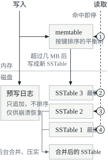
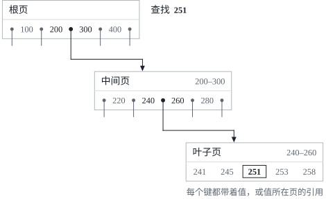
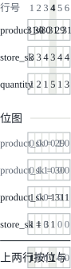

这是 DDIA 读书笔记的第三篇。[第二篇](/posts/ddia-02/)讲的是数据模型与查询语言，也就是应用交给数据库的数据长什么样、怎么去问它；第三章往下走一层，看数据库自己怎样把数据存到磁盘上，又怎样在需要时把它找回来。文中的英文引文出自原书，其余是我自己的复述和整理。

这一章开头引了一句德国谚语：

> Wer Ordnung hält, ist nur zu faul zum Suchen.
> (If you keep things tidily ordered, you're just too lazy to go searching.)

大意是：把东西收拾得井井有条的人，只是懒得去找。放在这一章很贴切，因为索引说到底就是事先把数据整理好，查找时就不必到处翻。

往最根本处说，数据库只做两件事：你把数据交给它，它存下来；你以后再来要，它还给你。应用开发者很少自己写存储引擎，通常是从现成的里面挑一个，但还是值得知道它内部大致怎么工作：这样才能为应用选出合适的引擎，需要时也知道怎么调。特别是，为事务型负载优化的引擎和为分析型负载优化的引擎差别很大，这一章后半部分会专门讲后者。

前半部分讲两类存储引擎：**日志结构**（log-structured）的存储引擎，以及以 B 树为代表的**面向页**（page-oriented）的存储引擎。

## 驱动数据库的数据结构

书里先用两个 Bash 函数搭了一个最简单的键值数据库：

```bash
db_set () {
    echo "$1,$2" >> database
}

db_get () {
    grep "^$1," database | sed -e "s/^$1,//" | tail -n 1
}
```

`db_set` 把一对键值以 `key,value` 的形式追加到文件末尾。同一个键再写一次时，旧的那行不会被覆盖，新值只是追加在后面，所以 `db_get` 要用 `tail -n 1` 取最后一次出现的值。

这个“数据库”写起来其实很快，因为往文件末尾追加是很高效的操作，不少真实的数据库内部也有这样一个只追加的数据文件。书里说的**日志**（log）就是这个一般意义上的词：一个只能往后追加的记录序列，不一定是给人看的应用日志，也可以是只给程序读的二进制格式。

读就是另一回事了：`db_get` 每次都要把整个文件从头扫到尾，开销是 O(n)，记录数翻一倍，查找时间也翻一倍。要高效地按键找到值，需要另一种数据结构：**索引**（index）。索引是在主数据旁边额外维护的一些元数据，像路标一样帮你找到想要的数据；想用几种不同的方式查同一份数据，就可能要在它的不同部分上建几个不同的索引。

索引是从主数据派生出来的附加结构，加上或去掉索引不会改变数据库的内容，只影响查询的性能。但维护索引是有代价的：每次写入都要顺带更新索引，而很难有什么写法比单纯往文件末尾追加更快。这是存储系统里一个重要的取舍：

> well-chosen indexes speed up read queries, but every index slows down writes.

所以数据库一般不会默认给所有东西都建索引，而是让应用开发者或数据库管理员根据应用典型的查询模式手动挑选，用尽量少的额外开销换来最大的好处。

### 哈希索引

先看键值数据的索引。大多数编程语言里都有的哈希表（hash map），就可以用来给磁盘上的数据建索引。

最简单的做法是：数据仍然只往文件末尾追加，同时在内存里维护一个哈希表，把每个键映射到它的值在数据文件里的字节偏移量。写入一个键值对时，除了追加到文件，还要把这个键在哈希表里的偏移量改成新的位置（新键和已有的键都一样）；查找时，先从哈希表里查出偏移量，再跳到文件的那个位置读出值。

听起来过于简单，但确实可行，Riak 默认的存储引擎 **Bitcask** 就是这么做的。它要求所有的键都能放进内存，值可以比内存大，放在磁盘上，读一个值通常只要一次磁盘寻道；如果那部分数据文件已经在文件系统的缓存里，连磁盘 I/O 都省了。这种引擎适合每个键的值都频繁更新的场景，比如键是一个猫咪视频的 URL，值是它被播放的次数：写入很多，但不同的键没那么多，内存放得下。

#### 分段与合并

一直往同一个文件里追加，磁盘空间迟早会用完。办法是把日志切成一定大小的**段**（segment）：当前的段文件写到一定大小就关闭，之后的写入转到新的段文件。然后对这些段做**压实（compaction）**：扔掉日志里重复的键，每个键只保留最近一次写入的值。

压实通常会让段小很多（一个键往往被覆盖了好几次），所以还可以在压实的同时把几个段**合并**成一个。段写完之后就不再修改，合并的结果写进一个新文件，所以合并可以放在后台线程里做：进行期间，读请求照常读旧的段，写请求照常写当前的段；合并完成后，读请求切换到新的段，旧的段文件就可以删掉了。

每个段在内存里有自己的哈希表。查找一个键时，先查最新的段的哈希表，没有再查次新的，依此类推。合并让段的数量保持在少数几个，所以查找不用翻太多个哈希表。

#### 真正实现时的细节

要把这个想法做成能用的引擎，还有不少细节：

| 问题 | 做法 |
| --- | --- |
| 文件格式 | 不用 CSV，而用二进制格式：先写出字符串的字节长度，后面跟原始字符串，不需要转义 |
| 删除记录 | 追加一条特殊的删除记录，叫**墓碑**（tombstone）；合并时见到墓碑，就丢掉这个键之前的所有值 |
| 崩溃恢复 | 重启后内存里的哈希表没了，可以把每个段从头读一遍来重建，但段很大时太慢；Bitcask 把每个段的哈希表快照存在磁盘上，载入快得多 |
| 写了一半的记录 | 数据库可能在追加一条记录的中途崩溃；Bitcask 的文件带校验和，能发现并忽略这种损坏的部分 |
| 并发控制 | 写入要严格按顺序追加，通常只用一个写线程；段文件只追加、写完不变，可以被多个线程同时读 |

#### 为什么只追加

乍看之下，只追加很浪费：为什么不在文件里原地把旧值覆盖掉？书里给了几个理由：

- 追加和合并段都是**顺序写**，一般比随机写快得多，在机械硬盘上尤其如此；在基于闪存的固态硬盘（SSD）上，顺序写在一定程度上也更好；
- 段文件只追加或者干脆不可变，并发和崩溃恢复都简单得多，比如不用担心崩溃恰好发生在覆盖一个值的中途，留下半个旧值、半个新值；
- 合并旧的段，可以避免数据文件随着时间推移变得零碎。

#### 哈希索引的局限

哈希表索引有两个限制：

- **哈希表必须放得进内存**。键非常多就不行了。原则上可以把哈希表放到磁盘上，但磁盘上的哈希表很难做得好：要做大量的随机 I/O，表满了扩容的代价很高，处理哈希冲突也需要很多琐碎的逻辑；
- **范围查询效率低**。比如想找出 `kitty00000` 到 `kitty99999` 之间的所有键，哈希表帮不上忙，只能把每个键都单独查一遍。

下面这种索引结构没有这两个限制。

### SSTable 与 LSM 树

对上面的段文件格式做一个小改动：要求段里的键值对**按键排序**。这种格式叫**排序字符串表**（Sorted String Table），简称 **SSTable**。它还要求每个键在每个合并后的段文件里只出现一次，这一点压实已经保证了。

按键排序似乎会让顺序写变得不可能，这个问题后面再说，先看排序带来的三个好处。

第一，**合并段又简单又高效**，即使文件比可用内存还大。做法就是归并排序里的那个合并：同时打开几个输入文件，各读出第一个键，把最小的那个连同它的值写进输出文件，再从它所在的文件读下一个键，如此反复。每个输入段里的每个键都会进入输出，输出的新段同样按键排序。如果同一个键出现在好几个输入段里，就保留最新那个段里的值，丢掉更旧的段里的值：每个段只包含某一段时间内的写入，新段里的值一定比旧段里的新。

第二，**内存里不再需要所有键的索引**。比如要找 `handiwork`，不知道它在段文件里的确切偏移量，但知道 `handbag` 和 `handsome` 的偏移量；文件是排好序的，`handiwork` 一定在这两者之间，从 `handbag` 的位置往后扫一小段就能找到它，或者确认它不存在。所以内存里的索引可以是**稀疏**的：每隔几 KB 的段文件记一个键就够了，因为几 KB 的数据扫一遍非常快。

第三，读请求反正要扫描一个范围内的若干键值对，那就可以把这些记录**分成块，压缩后再写到磁盘上**，稀疏索引的每一项指向一个压缩块的开头。这样既省磁盘空间，也少占 I/O 带宽。

#### 构建和维护 SSTable

写入是以任意顺序到来的，怎样让数据按键排好序？在磁盘上维护有序结构是可以的（后面的 B 树就是），但在内存里维护要容易得多：红黑树、AVL 树这类平衡树，可以按任意顺序插入键，再按顺序读出来。于是存储引擎这样工作：

1. 写入到来时，把它插入内存里的一棵平衡树，这棵树叫 **memtable**；
2. memtable 超过某个阈值（通常是几 MB）时，把它作为一个 SSTable 文件写到磁盘上。树本来就是有序的，这一步很高效。新的 SSTable 成为数据库最新的段；写盘期间，新来的写入进入一个新的 memtable；
3. 读请求先查 memtable，再依次查磁盘上最新的段、次新的段，直到最旧的段；
4. 后台不时地对段文件做合并和压实，丢掉被覆盖或已删除的值。

这套方案只有一个问题：数据库崩溃时，memtable 里还没写到磁盘上的最近写入就丢了。所以磁盘上还要另外保留一份日志，每次写入都立刻追加进去。这份日志不用排序，因为它唯一的用途是崩溃之后重建 memtable；memtable 写成 SSTable 之后，对应的日志就可以丢掉。它起的作用和后面 B 树的预写日志一样，图 1 里也这样叫它。



#### 从 SSTable 到 LSM 树

上面这套算法，基本就是 LevelDB 和 RocksDB 所用的。这两个都是设计来嵌入其他应用的键值存储引擎库，LevelDB 还可以在 Riak 里替代 Bitcask。Cassandra 和 HBase 里也有类似的存储引擎，它们都受了 Google Bigtable 论文的启发，memtable 和 SSTable 这两个词就出自那篇论文。

这种索引结构最早由 Patrick O'Neil 等人在 1996 年以 Log-Structured Merge-Tree 的名字提出，也就是 **LSM 树**，它建立在更早的日志结构文件系统的研究之上。基于“合并、压实有序文件”这一原理的存储引擎，通常就叫 LSM 存储引擎。

全文搜索引擎 Lucene（Elasticsearch 和 Solr 都用它）存词典（term dictionary）用的也是类似的方法。全文索引比键值索引复杂得多，但基本思路相近：给定查询里的一个词，找出所有提到这个词的文档。这可以实现成一个键值结构，键是词（term），值是包含这个词的所有文档的 ID 列表（postings list）。在 Lucene 里，词到 ID 列表的映射存在类似 SSTable 的有序文件里，需要时在后台合并。

#### 性能优化

查找一个根本不存在的键时，LSM 树会很慢：要先查 memtable，再把所有的段一直查到最旧的那个（每个都可能要读磁盘），才能确定它不存在。为此，存储引擎通常会加上**布隆过滤器**（Bloom filter）。它是一种很省内存的数据结构，用来近似地表示一个集合：它能告诉你某个键**一定不在**数据库里，于是对不存在的键省掉了许多不必要的磁盘读。

决定 SSTable 什么时候、按什么顺序压实和合并，也有不同的策略，最常见的两种是：

- **大小分级**（size-tiered）：较新、较小的 SSTable 陆续合并进较旧、较大的 SSTable；
- **分层**（leveled）：键的范围被切成多个较小的 SSTable，较旧的数据挪到单独的“层”里，压实因此可以更渐进地进行，占用的磁盘空间也更少。

LevelDB 和 RocksDB 用分层压实（LevelDB 的名字就是这么来的），HBase 用大小分级，Cassandra 两种都支持。

细节虽然多，LSM 树的基本思路，也就是在后台不断合并一串 SSTable，既简单又有效：数据集远大于内存时依然好用；数据按键排序，范围查询很高效；磁盘写入都是顺序的，所以能支撑非常高的写入吞吐量。

### B 树

日志结构的索引越来越常见，但用得最广的索引结构是另一种：**B 树**。它在 1970 年提出，不到十年就被人称为“无处不在”，几乎所有关系数据库的标准索引实现都是它，很多非关系数据库也在用。

和 SSTable 一样，B 树也让键值对按键有序，所以按键查找和范围查询都很高效，但两者的设计哲学截然不同。日志结构的索引把数据库切成大小不一的段，通常有几 MB 甚至更大，并且总是顺序写入；B 树则把数据库切成**固定大小**的块，也就是**页**（page），传统上是 4 KB（有时更大），每次读写一整页。这更贴近底层硬件，因为磁盘本身也是由固定大小的块组成的。

每个页都有一个地址，页与页之间可以互相引用，就像指针，只不过是在磁盘上而不是在内存里。这些引用把页组织成一棵树。查找从**根页**开始：根页里有若干个键和若干个指向子页的引用，每个子页负责一段连续范围的键，引用之间的键标出了这些范围的边界。

比如要查找键 251：在根页里，它落在边界 200 和 300 之间，于是沿着这两个键之间的引用往下走；下一层的页把 200 到 300 这个范围再切成更小的子范围，再选对应的引用往下走，最后到达一个存着单个键的**叶子页**。叶子页里，每个键要么直接带着它的值，要么带着值所在页的引用。



一个页里子页引用的个数叫**分支因子**（branching factor）。图 2 为了画得下，每页只有 5 个引用；实际的分支因子取决于存页引用和范围边界要占多少空间，通常有几百个。

更新一个已有键的值时，先找到包含它的叶子页，改掉值，再把整页写回磁盘，所有指向这一页的引用都保持不变。插入新键时，找到范围包含它的那一页，把键加进去；页里放不下的话，就把它分裂成两个半满的页，并更新父页，反映新的范围划分。

这样做能保证树始终是**平衡**的：有 n 个键的 B 树，深度总是 O(log n)。大多数数据库的 B 树只有三四层，查找时不用跟着太多引用走。书里给了一个数字：页大小 4 KB、分支因子 500 的四层 B 树，最多能存 256 TB。

#### 让 B 树可靠

B 树最基本的写操作，是**用新数据覆盖磁盘上的某一页**，并且假定覆盖不会改变页的位置，所有指向它的引用在覆盖之后仍然有效。这和 LSM 树正好相反：LSM 树只追加文件（最后删除过时的文件），从不原地修改。

覆盖一页可以看成一个实打实的硬件操作：在机械硬盘上，要把磁头移到正确的位置，等盘片转到那个位置，再用新数据覆盖相应的扇区；SSD 更复杂一些，因为 SSD 每次都必须擦除并重写存储芯片上一个相当大的块。

有些操作还要覆盖好几页。比如插入导致页分裂时，要写下分裂出来的两页，还要覆盖父页、更新其中的引用。这很危险：要是只写完其中一部分页数据库就崩溃了，索引就坏了，比如留下一个没有任何父页指向的孤儿页。

为了能从崩溃中恢复，B 树的实现通常会在磁盘上额外维护一个**预写日志**（write-ahead log，WAL，也叫 redo log）。它是一个只追加的文件，对 B 树的每一次修改都必须先写进这个日志，然后才能应用到树的页上。数据库崩溃重启后，用这个日志把 B 树恢复到一致的状态。

原地更新页还带来了并发上的麻烦：多个线程同时访问 B 树时，如果没有仔细的并发控制，一个线程可能看到树处在不一致的中间状态。通常的做法是用**闩锁**（latch，一种轻量级的锁）保护树的数据结构。日志结构的方法在这方面简单得多：合并在后台进行，不妨碍正在进来的查询，做完之后再原子地用新段换掉旧段。

#### B 树的优化

B 树已经存在了很久，积累了很多优化，书里列了这几种：

- 有些数据库（比如 LMDB）不用“覆盖页 + 预写日志”来做崩溃恢复，而是**写时复制**（copy-on-write）：改过的页写到新的位置，再创建新版本的父页，指向这个新位置。这对并发控制也有好处，第 7 章讲快照隔离时还会提到；
- **缩写键**以节省页里的空间。特别是在树的内部页里，键只要能起到划分范围的作用就够了，不必存完整的键。一页能放下更多的键，分支因子就更高，树的层数就更少；
- 页原则上可以放在磁盘上的任何位置，相邻范围的页不一定在磁盘上挨着。如果查询经常要按顺序扫描一大段键，一页一页地读可能要不停地寻道，所以很多 B 树实现会尽量让叶子页在磁盘上按顺序排列，但树一直在长，这一点很难维持。LSM 树在合并时一次重写一大段数据，要让相邻的键在磁盘上靠在一起就容易得多；
- 给树加额外的指针，比如每个叶子页带着指向左右兄弟页的引用，按顺序扫描键时就不用跳回父页；
- **分形树**（fractal tree）等 B 树的变体，借鉴了日志结构的一些思想来减少磁盘寻道。

### 比较 B 树和 LSM 树

B 树的实现通常比 LSM 树成熟，但 LSM 树的性能特点也很有吸引力。一个经验法则是：LSM 树通常写得更快，B 树则被认为读得更快。LSM 树读起来慢一些，是因为它要查好几个不同的数据结构，以及处于不同压实阶段的多个 SSTable。

不过基准测试的结论常常并不确定，而且对负载的细节非常敏感，要用自己的实际负载测过，比较才有意义。下面是评估存储引擎性能时值得考虑的几点。

#### LSM 树的优点

B 树索引的每一份数据至少要写两次：一次写进预写日志，一次写进树的页本身（页分裂时还要再写）。而且即使页里只改了几个字节，也要付出写一整页的开销。有些存储引擎甚至会把同一页写两遍，以免断电时留下一个只更新了一半的页。

日志结构的索引也会多次重写数据，因为 SSTable 要反复地压实、合并。一次数据库写入在数据库的整个生命周期里引起多次磁盘写入，这叫**写放大**（write amplification）。它在 SSD 上尤其值得关注，因为 SSD 的块只能覆盖有限的次数，之后就会磨损。

对写入密集的应用来说，瓶颈很可能就是数据库往磁盘写的速度，这时写放大直接影响性能：存储引擎往磁盘写得越多，在可用的磁盘带宽内每秒能处理的写入就越少。

LSM 树通常能支撑比 B 树更高的写入吞吐量。原因一是它有时写放大更低（取决于引擎的配置和负载），二是它顺序地写出紧凑的 SSTable 文件，而不用覆盖树里的好几个页。第二点在机械硬盘上尤其重要，因为那上面顺序写比随机写快得多。

LSM 树还能压缩得更好，磁盘上的文件通常比 B 树小。B 树会因为碎片留下一些用不上的磁盘空间：页分裂时，或者一行在现有的页里放不下时，页里就会有一部分空着。LSM 树不是面向页的，又会定期重写 SSTable 消除碎片，所以存储开销更低，用分层压实时尤其如此。

在很多 SSD 上，固件内部本来就用日志结构的算法，把随机写转换成对底层存储芯片的顺序写，所以存储引擎的写入模式在 SSD 上影响没那么明显。但更低的写放大和更少的碎片在 SSD 上仍然有好处：数据表示得越紧凑，同样的 I/O 带宽内能处理的读写请求就越多。

#### LSM 树的缺点

日志结构存储的一个缺点是，压实有时会干扰正在进行的读写。磁盘的资源有限，一个请求很容易要等磁盘做完一次昂贵的压实。它对吞吐量和平均响应时间的影响通常很小，但在较高的百分位上（响应时间的百分位见第 1 章），日志结构存储引擎的查询有时会慢得多，B 树的表现则更可预测。

写入吞吐量很高时还有一个问题：磁盘有限的写带宽，要由初始写入（写日志、把 memtable 写到磁盘）和后台的压实线程分享。数据库刚开始还是空的时候，全部带宽都能给初始写入用；数据库越大，压实需要的带宽就越多。

如果写入吞吐量很高、压实又没有仔细配置，压实就可能跟不上写入。这时磁盘上未合并的段越来越多，直到磁盘空间耗尽；读也会变慢，因为要查的段文件变多了。书里说，基于 SSTable 的存储引擎通常不会因为压实跟不上而限制写入的速度，所以需要专门监控这种情况[^stall]。

B 树的一个优点是，每个键在索引里只存在于一个地方，而在日志结构的存储引擎里，同一个键可能在不同的段里有好几份。这让 B 树在需要强事务语义的数据库里很有吸引力：很多关系数据库用键范围上的锁来实现事务隔离，在 B 树索引里，这些锁可以直接挂在树上。第 7 章会细讲。

把两边的取舍放在一起：

| 方面 | LSM 树 | B 树 |
| --- | --- | --- |
| 写入方式 | 顺序写出 SSTable，后台合并、压实 | 先写预写日志，再原地覆盖固定大小的页 |
| 写入吞吐量 | 通常更高 | 通常较低 |
| 读 | 要查 memtable 和多个 SSTable，通常较慢 | 被认为更快 |
| 磁盘空间 | 压缩得更好，碎片少 | 页里有碎片，空间用不满 |
| 响应时间 | 压实可能拉高高百分位的响应时间 | 更可预测 |
| 同一个键 | 可能在多个段里各有一份 | 只在一个地方，范围锁可以直接挂在树上 |

B 树已经深深扎根在数据库的架构里，在很多负载下都有稳定良好的性能，短期内不会消失；而在新的数据存储里，日志结构的索引越来越流行。至于哪一种适合你的应用：

> There is no quick and easy rule for determining which type of storage engine is better for your use case, so it is worth testing empirically.

### 其他索引结构

前面讲的都是键值索引，相当于关系模型里的**主键**索引：主键唯一地标识关系表里的一行、文档数据库里的一个文档或者图数据库里的一个顶点，数据库里的其他记录可以用主键（或 ID）引用它，索引则负责解析这种引用。

**二级索引**（secondary index）也很常见。关系数据库里可以用 `CREATE INDEX` 在同一张表上建好几个二级索引，它们往往是高效执行连接的关键。二级索引同样可以用键值索引来构建，主要的区别在于键不唯一：可能有很多行在被索引的字段上取值相同。解决办法有两种：让索引里的每个值变成一个列表，装着所有匹配行的标识符（就像全文索引里的文档 ID 列表）；或者在每个键后面拼上行标识符，让键变得唯一。B 树和日志结构的索引都可以拿来做二级索引。

#### 在索引里存值

索引的键是查询要找的东西，值则有两种可能：要么就是那一行（文档、顶点）本身，要么是指向存在别处的那一行的引用。后一种情况下，存放行的地方叫**堆文件**（heap file），里面的数据没有特定的顺序（它可以只追加，也可以记下被删除的行，以后用新数据覆盖它们）。堆文件的做法很常见，因为有多个二级索引时可以避免数据重复：每个索引都只引用堆文件里的一个位置，实际的数据只存在一处。

只更新值、不改键时，堆文件很高效：只要新值不比旧值大，记录就可以原地覆盖。新值更大时就麻烦了，记录可能得挪到堆里一个空间足够的新位置：要么更新所有索引，让它们指向新位置；要么在旧位置留下一个转发指针。

有时从索引到堆文件多跳一次，对读来说代价太大，这时可以把被索引的行直接存在索引里，叫**聚簇索引**（clustered index）。比如 MySQL 的 InnoDB 存储引擎里，表的主键总是聚簇索引，二级索引引用的是主键，而不是堆文件里的位置；SQL Server 则允许每张表指定一个聚簇索引。

在聚簇索引（整行存在索引里）和非聚簇索引（索引里只存引用）之间还有一种折中，叫**覆盖索引**（covering index），也叫带包含列的索引（index with included columns）：它在索引里存表的一部分列，有些查询只靠索引就能回答，这时就说索引“覆盖”了这个查询。

和任何数据重复一样，聚簇索引和覆盖索引能加快读，但要额外的存储空间，也增加了写的开销。数据库还要多费些功夫来保证事务语义，因为应用不应该因为数据重复而看到不一致的结果。

#### 多列索引

上面的索引都只把一个键映射到一个值。如果要同时按一张表的多个列（或者文档里的多个字段）查询，这就不够了。

最常见的多列索引是**联合索引**（concatenated index），它按索引定义里指定的顺序，把几个字段拼成一个键。老式的纸质电话簿就是这样一个按（姓，名）排序的索引：可以用它找出所有姓某个姓的人，或者找某个特定的姓名组合；但要找所有叫某个名字的人，它就没用了。

**多维索引**是一次查询多个列的更一般的办法，对地理空间数据尤其重要。比如一个找餐厅的网站，用户在地图上看着一块矩形区域，要找出里面所有的餐厅，就需要这样的二维范围查询：

```sql
SELECT * FROM restaurants
WHERE latitude  > 51.4946 AND latitude  < 51.5079
  AND longitude > -0.1162 AND longitude < -0.1004;
```

普通的 B 树或 LSM 树索引没法高效地回答它：可以找出纬度在这个范围内的所有餐厅（经度任意），或者经度在这个范围内的所有餐厅（纬度任意），但不能同时按两个条件缩小范围。一种办法是用空间填充曲线把二维的位置转换成一个数，再用普通的 B 树索引；更常见的是用专门的空间索引，比如 R 树。PostGIS 就借助 PostgreSQL 的通用搜索树（GiST）机制，把地理空间索引实现成 R 树。

多维索引的用处不止于地理位置。电商网站可以在（红，绿，蓝）三个维度上建索引，按颜色范围搜索商品；天气观测数据可以在（日期，温度）上建二维索引，高效地找出 2013 年所有温度在 25 到 30 °C 之间的观测。只有一维索引的话，就得先扫出 2013 年的全部记录（不管温度），再按温度过滤，或者反过来；二维索引能同时按日期和温度缩小范围。HyperDex 用的就是这种技术。

#### 全文搜索和模糊索引

前面所有的索引都假定数据是精确的，只能查一个键的确切值，或者有序的键的一个范围。它们不能用来找**相似**的键，比如拼错的单词，这种模糊查询需要别的技术。

全文搜索引擎通常允许把对一个词的搜索扩展到它的同义词，忽略词的语法变化，查找在同一篇文档里彼此靠近的词，还支持各种依赖语言分析的功能。为了应对文档或查询里的拼写错误，Lucene 可以搜索一定**编辑距离**之内的词（编辑距离为 1，表示加了、删了或者换了一个字母）。

前面说过，Lucene 的词典用的是类似 SSTable 的结构，它需要一个小小的内存索引，告诉查询要到有序文件的哪个偏移量去找一个键。LevelDB 里，这个内存索引是一组稀疏的键；Lucene 里，它是一个建立在键的字符之上的有限状态自动机，和字典树（trie）很像。这个自动机可以转换成 **Levenshtein 自动机**，用来高效地搜索给定编辑距离之内的词。

#### 全部放在内存里

这一章到目前为止的数据结构，都是在应对磁盘的局限。和内存相比，磁盘用起来很别扭：无论机械硬盘还是 SSD，数据都要精心排布，读写性能才会好。我们之所以忍受这些，是因为磁盘有两个重要的优点：它是持久的，断电后内容不会丢；每 GB 的成本也比内存低。

内存越来越便宜，成本这条理由已经站不太住了。很多数据集其实没那么大，完全可以整个放在内存里，必要时分布在几台机器上，于是有了**内存数据库**。

有些内存键值存储，比如 Memcached，只用作缓存，机器重启时数据丢了也无妨。另一些内存数据库则追求持久性，办法包括：用特殊硬件（比如带电池的内存），把变更日志写到磁盘，定期把快照写到磁盘，或者把内存里的状态复制到别的机器上。重启时，它要从磁盘或通过网络从副本重新载入状态（除非用了特殊硬件）。尽管也写磁盘，它仍然是内存数据库：磁盘只是为了持久性而追加写的日志，读请求完全由内存提供。写磁盘还有运维上的好处，磁盘上的文件很容易用外部工具备份、检查和分析。

VoltDB、MemSQL[^memsql] 和 Oracle TimesTen 是采用关系模型的内存数据库，它们的厂商声称，去掉管理磁盘数据结构的开销之后，性能能提升很多。RAMCloud 是一个开源的、带持久性的内存键值存储，它对内存里和磁盘上的数据都用日志结构的方法。Redis 和 Couchbase 则异步地写磁盘，只提供较弱的持久性。

内存数据库为什么快？书里的回答有点反直觉：

> Counterintuitively, the performance advantage of in-memory databases is not due to the fact that they don't need to read from disk.

只要内存足够，基于磁盘的存储引擎也可能根本不用读磁盘，因为操作系统本来就会把最近用过的磁盘块缓存在内存里。内存数据库更快的真正原因是，它不必把内存里的数据结构编码成能写到磁盘上的格式，省掉了这部分开销。

除了性能，内存数据库还能提供用磁盘索引很难实现的数据模型。比如 Redis 为优先队列、集合等各种数据结构提供了类似数据库的接口；所有数据都在内存里，这些做起来就比较简单。

还有研究表明，内存数据库的架构可以扩展到支持比内存更大的数据集，又不带来以磁盘为中心的架构的那些开销。这种**反缓存**（anti-caching）的做法是：内存不够时，把最近最少使用的数据从内存逐出到磁盘，以后再被访问时再载入内存。这和操作系统的虚拟内存、交换文件很像，但数据库能以单条记录为粒度管理内存，而不是以整个内存页为粒度，所以比操作系统更高效。不过，这种做法仍然要求索引能整个放进内存。

如果**非易失性内存**（non-volatile memory，NVM）技术得到更广泛的采用，存储引擎的设计可能还要进一步改变[^nvm]。

## 事务处理还是分析

在商业数据处理的早期，一次数据库写入通常对应一笔真实的商业交易（transaction）：卖出一件商品、向供应商下一张订单、给员工发一次工资。后来数据库用到了不涉及钱款往来的领域，**事务**（transaction）这个词却留了下来，指构成一个逻辑单元的一组读和写。

事务不一定具备 ACID（原子性、一致性、隔离性、持久性）这些性质，那是第 7 章的话题。这里说的事务处理，只是指客户端能做低延迟的读和写，与之相对的是只定期运行的批处理作业。

后来数据库里存的东西五花八门，博客的评论、游戏里的动作、通讯录里的联系人，但基本的访问模式仍然和处理商业交易差不多：应用通常用索引按某个键查出少量记录，再根据用户的输入插入或更新记录。这类应用是交互式的，这种访问模式因此叫**在线事务处理**（online transaction processing，OLTP）。

数据库也越来越多地用于**数据分析**，它的访问模式很不一样：分析查询通常要扫描大量记录，每条只读几列，算出计数、求和、平均值之类的汇总统计，而不是把原始数据返回给用户。比如对一张销售交易表，分析师可能想知道：每家门店一月份的总收入是多少？最近一次促销期间，香蕉比平时多卖了多少？哪个牌子的婴儿食品最常和某个牌子的纸尿裤一起买？这类查询通常由业务分析师来写，产出的报表帮管理层做决策，这叫**商业智能**（business intelligence）。为了和事务处理区分，这种使用模式叫**在线分析处理**（online analytic processing，OLAP）。

书里用一张表对比了两者：

| 特性 | 事务处理系统（OLTP） | 分析系统（OLAP） |
| --- | --- | --- |
| 主要的读模式 | 每次查询读少量记录，按键查找 | 对大量记录做聚合 |
| 主要的写模式 | 随机访问、低延迟的写入，来自用户输入 | 批量导入（ETL）或事件流 |
| 主要的使用者 | 最终用户或客户，通过 Web 应用 | 内部的分析师，用于决策支持 |
| 数据代表什么 | 数据的最新状态（当前时刻） | 一段时间里发生过的事件的历史 |
| 数据集大小 | GB 到 TB | TB 到 PB |

起初，事务处理和分析查询用的是同一个数据库，SQL 足够灵活，两类查询都写得出来。但从 1980 年代末、1990 年代初开始，越来越多的公司不再在 OLTP 系统上跑分析，而是把分析放到一个单独的数据库里，这个数据库叫**数据仓库**（data warehouse）。

### 数据仓库

一家企业可能有几十个不同的事务处理系统：面向客户的网站、实体店的收银系统、仓库的库存跟踪、车辆的路线规划、供应商管理、员工管理，等等。每个系统都很复杂，通常由各自的团队维护，彼此基本独立地运行。

这些 OLTP 系统一般要求高可用、低延迟，因为业务的运转离不开它们。所以数据库管理员会严密地守着自己的 OLTP 数据库，不太愿意让业务分析师在上面跑临时的分析查询：这种查询往往代价很高，要扫描数据集的一大部分，会拖慢同时执行的事务。

数据仓库则是一个单独的数据库，分析师想怎么查就怎么查，不影响 OLTP 的运行。它装着公司各个 OLTP 系统里数据的一份只读副本：数据从 OLTP 数据库里提取出来（用定期的数据转储，或者持续的更新流），转换成便于分析的模式，清洗之后再加载进数据仓库。这个过程叫**提取—转换—加载**（Extract–Transform–Load，ETL）。

几乎所有大企业都有数据仓库，小公司则很少有：它们的 OLTP 系统不多，数据量也小，用普通的 SQL 数据库查询就行，甚至用电子表格分析就够了。

单独建一个数据仓库，而不是直接查询 OLTP 系统，一个很大的好处是数据仓库可以针对分析型的访问模式来优化。这一章前半部分的索引算法很适合 OLTP，却不擅长回答分析查询。

#### OLTP 数据库和数据仓库的分化

数据仓库的数据模型最常见的是关系模型，因为 SQL 通常很适合分析查询。很多图形化的数据分析工具会生成 SQL 查询、把结果可视化，让分析师通过下钻（drill-down）、切片和切块（slicing and dicing）等操作探索数据。

表面上，数据仓库和关系型的 OLTP 数据库很像，都提供 SQL 查询接口；但内部实现差别很大，因为它们是为截然不同的查询模式优化的。现在很多数据库厂商只专注于事务处理或分析中的一种，而不是两者都做。有些数据库，比如 Microsoft SQL Server 和 SAP HANA，在同一个产品里同时支持事务处理和数据仓库，但越来越像是两套分开的存储和查询引擎，只是恰好能通过同一个 SQL 接口访问。

Teradata、Vertica、SAP HANA、ParAccel 等数据仓库厂商以昂贵的商业许可出售自己的系统，Amazon Redshift 则是 ParAccel 的托管版本。近年还出现了一批开源的 SQL-on-Hadoop 项目，它们还很年轻，但想和商业数据仓库竞争，包括 Apache Hive、Spark SQL、Cloudera Impala、Facebook Presto、Apache Tajo 和 Apache Drill，其中一些借鉴了 Google Dremel 的思想。

### 星型和雪花型：分析用的模式

事务处理领域按应用的需要使用各种各样的数据模型，第 2 章就讲了好几种；分析领域里，数据模型的种类要少得多。很多数据仓库都用一种相当公式化的模式，叫**星型模式**（star schema），也叫维度建模（dimensional modeling）。

书里的例子是一家杂货零售商的数据仓库。模式的中心是一张**事实表**（fact table），这里叫 `fact_sales`，它的每一行代表某个时刻发生的一个事件，在这里是一位顾客买了一件商品；如果分析的是网站流量，每一行就可能是一次页面浏览或一次点击。

事实一般按单个事件记录下来，这样以后分析时最灵活。代价是事实表会变得非常大：Apple、Walmart、eBay 这样的大企业，数据仓库里可能有几十 PB 的交易历史，大部分都在事实表里。

事实表里有些列是属性，比如商品的售价和从供应商那里进货的成本（两者相减就是利润）。另一些列是**外键**，引用别的表，这些被引用的表叫**维度表**（dimension table）。事实表的每一行是一个事件，维度则描述这个事件的人物、对象、地点、时间、方式和原因（who、what、where、when、how、why）。

比如维度表 `dim_product` 里，每一行是一种在售的商品，记着它的库存单位（SKU）、描述、品牌、类别、脂肪含量、包装大小等等；`fact_sales` 的每一行用一个外键指向 `dim_product`，说明这次交易卖的是哪种商品。（简单起见，顾客一次买了几种不同的商品时，在事实表里记成几行。）

连日期和时间也常常用维度表来表示，这样可以记下关于日期的额外信息，比如是不是公共假日，查询就能区分节假日和平日的销售。

“星型模式”这个名字来自把表之间的关系画出来的样子：事实表在中间，维度表围在四周，事实表指向各个维度表的连线就像星星的光芒。

它的一个变体叫**雪花模式**（snowflake schema），维度被进一步拆成子维度。比如品牌和商品类别可以各有一张表，`dim_product` 的每一行用外键引用品牌和类别，而不是把它们作为字符串存在 `dim_product` 里。雪花模式比星型模式更规范化，但星型模式往往更受欢迎，因为分析师用起来更简单。

典型的数据仓库里，表往往非常宽：事实表常有 100 多列，有时几百列。维度表也可能很宽，因为它们收录了所有可能和分析相关的元数据，比如 `dim_store` 表可能记着每家门店提供哪些服务、有没有店内面包房、面积多大、哪天开业、最近一次装修在什么时候、离最近的高速公路有多远。

## 列式存储

事实表里有上万亿行、几 PB 数据时，怎样高效地存储和查询它们就成了难题。维度表通常小得多（几百万行），所以这一节关心的主要是事实表的存储。

事实表虽然常有 100 多列，一个典型的数据仓库查询却一次只访问其中四五列，分析里很少需要 `SELECT *`。书里举的查询想看看：人们更倾向于买新鲜水果还是糖果，这是否和星期几有关。写出来大致是这样：

```sql
-- 2013 年里，新鲜水果和糖果在一周每一天各卖出多少件
SELECT d.weekday, p.category, SUM(f.quantity) AS quantity_sold
FROM fact_sales f
  JOIN dim_date d    ON f.date_key   = d.date_key
  JOIN dim_product p ON f.product_sk = p.product_sk
WHERE d.year = 2013
  AND p.category IN ('Fresh fruit', 'Candy')
GROUP BY d.weekday, p.category;
```

它要访问大量的行（2013 年每一次有人买水果或糖果），但只用到 `fact_sales` 的三列：`date_key`、`product_sk` 和 `quantity`，其余的列都用不着。

怎样高效地执行这个查询？大多数 OLTP 数据库的存储是**面向行**的：一行的所有值挨着存放。文档数据库也类似，一个文档通常存成一段连续的字节。即使在 `date_key` 或 `product_sk` 上建了索引，告诉存储引擎某个日期或某种商品的销售记录在哪里，面向行的存储引擎仍然要把这些行（每行 100 多个属性）整个从磁盘读进内存、解析，再把不满足条件的过滤掉，这可能很花时间。

**列式存储**（column-oriented storage）的想法很简单：不要把一行的所有值存在一起，而是把每一列的所有值存在一起。如果每一列都存在单独的文件里，查询就只需要读取和解析它用到的那几列，能省下大量的工作。

列式存储在关系模型里最好理解，但它同样适用于非关系数据，比如 Parquet 就是一种支持文档数据模型的列式存储格式，它基于 Google 的 Dremel。

列式存储依赖一个前提：每个列文件里行的顺序都相同。要拼回一整行，就从每个列文件里取出第 k 项，合起来就是表的第 k 行。

### 列压缩

除了只从磁盘读查询需要的列，还可以压缩数据，进一步降低对磁盘吞吐量的需求。列式存储恰好很适合压缩。

每一列里的值常常有大量重复，这对压缩是个好兆头。按列里数据的不同，可以用不同的压缩技术，其中在数据仓库里特别有效的一种是**位图编码**（bitmap encoding）。

一列里不同取值的个数，往往比行数小得多。比如一家零售商可能有几十亿条销售交易，但只有 10 万种不同的商品。于是可以把一个有 n 个不同取值的列变成 n 张单独的位图：每个取值一张，每行占一位，这一行取这个值就是 1，否则是 0。

如果 n 很小（比如“国家”这一列大约只有 200 个不同的值），位图可以每行存一位；n 再大些，大多数位图里就会是长串的 0（称为稀疏），这时还可以对位图再做**游程编码**（run-length encoding），只记录连续的 0 和 1 各有多少个。这样一列可以编码得非常紧凑。

这种位图索引很适合数据仓库里常见的查询：

- `WHERE product_sk IN (30, 68, 69)`：载入 `product_sk = 30`、`product_sk = 68` 和 `product_sk = 69` 这三张位图，算出它们的按位或（OR），这一步可以做得非常快；
- `WHERE product_sk = 31 AND store_sk = 3`：载入 `product_sk = 31` 和 `store_sk = 3` 两张位图，算出按位与（AND）。这行得通，是因为各列里行的顺序相同，一列的位图里的第 k 位和另一列的位图里的第 k 位对应的是同一行。



顺带一提，Cassandra 和 HBase 有一个从 Bigtable 继承来的概念，叫**列族**（column family），但说它们是面向列的就误会了：在每个列族里，它们仍然把一行的所有列和行键存在一起，也不做列压缩。所以 Bigtable 模型基本上还是面向行的。

#### 内存带宽和向量化处理

对需要扫描几百万行的数据仓库查询来说，一大瓶颈是把数据从磁盘读进内存的带宽。但这不是唯一的瓶颈：分析型数据库的开发者还要操心怎样高效地利用从主存到 CPU 缓存的带宽，避免分支预测失败和 CPU 指令流水线里的气泡，并用上现代 CPU 的 SIMD（单指令多数据）指令。

列式布局除了减少从磁盘读的数据量，也有利于高效地使用 CPU。比如查询引擎可以取一块正好放得进 CPU 一级缓存（L1 cache）的压缩列数据，在一个没有函数调用的紧凑循环里遍历它；这样的循环比每处理一条记录都要调很多函数、做很多判断的代码快得多。列压缩让同样大小的 L1 缓存能装下更多行的数据，前面的按位与、按位或这类运算也可以设计成直接在压缩的列数据块上操作。这种技术叫**向量化处理**（vectorized processing）。

### 列存储里的排序

在列存储里，行按什么顺序存放不一定重要。最简单的是按插入顺序，插入一行就是往每个列文件末尾追加一个值。但也可以像 SSTable 那样规定一个顺序，把它当作一种索引机制。

单独给每一列排序是没有意义的，因为那样就不知道各列里哪些值属于同一行了：之所以能拼回一行，靠的正是一列的第 k 项和另一列的第 k 项属于同一行。所以即使数据按列存储，排序也必须以整行为单位进行。

数据库管理员可以根据对常见查询的了解，选择按哪些列排序。比如查询经常针对某个日期范围（像“上个月”），就可以把 `date_key` 作为第一个排序键，查询优化器就只用扫描上个月的那些行，比扫描全部行快得多。

第二个排序键决定第一列取值相同的行之间的顺序。比如第一个排序键是 `date_key`，第二个可以是 `product_sk`，这样同一天同一种商品的销售在存储里挨在一起，有利于在某个日期范围内按商品分组或过滤的查询。

排序还有一个好处：有助于压缩列。如果第一个排序列的不同取值不多，排好序之后它就会出现很长的、同一个值连续重复的序列，简单的游程编码就能把这一列压到几 KB，哪怕表有几十亿行。

这种压缩效果在第一个排序键上最强。第二、第三个排序键就比较杂乱，不会有那么长的重复序列；排序优先级再靠后的列，基本上是随机的顺序，大概也压缩不了多少。但前几列有序，总体上仍然是划算的。

#### 几种不同的排序

C-Store 引入了一个巧妙的扩展，后来被商业数据仓库 Vertica 采用：不同的查询适合不同的排序，那何不把同一份数据按几种不同的顺序各存一份？数据反正要复制到多台机器上，以免一台机器坏了丢数据，不如让这些冗余的副本各自按不同的方式排序，处理查询时选最合适的那一份。

在列存储里存几种排序，有点像在面向行的存储里建几个二级索引。区别在于，面向行的存储把每一行放在一个地方（堆文件或聚簇索引），二级索引里只是指向匹配行的指针；列存储里通常没有指向别处数据的指针，只有存着值的列。

### 往列式存储里写

这些优化在数据仓库里是合理的，因为负载的大头是分析师跑的大型只读查询。列式存储、压缩和排序都能让读查询更快，代价是写入更难了。

B 树那种原地更新的做法，对压缩过的列行不通。要在一张排好序的表中间插入一行，很可能得重写所有的列文件；而且行是靠它在列里的位置来标识的，插入必须一致地更新所有的列。

好在这一章前面已经有了一个好办法：LSM 树。所有的写入先进入内存里的存储，加进一个有序的结构，准备写到磁盘上；这个内存里的存储是面向行还是面向列都无所谓。攒够了一批写入之后，再把它们和磁盘上的列文件合并，批量写成新的文件。Vertica 基本上就是这么做的。

查询需要同时检查磁盘上的列数据和内存里最近的写入，并把两者结合起来，不过查询优化器会对用户隐藏这个区别。在分析师看来，插入、更新或删除的数据会立刻反映在之后的查询结果里。

### 聚合：数据立方体和物化视图

并不是每个数据仓库都是列存储，传统的面向行的数据库和其他一些架构也在用。但列式存储在临时的分析查询上快得多，所以正在迅速流行。

数据仓库还有一个值得一提的方面：**物化聚合**（materialized aggregates）。数据仓库查询经常用到 SQL 的 COUNT、SUM、AVG、MIN、MAX 这类聚合函数。如果很多查询都用到同样的聚合，每次都从原始数据重新算一遍就太浪费了，不如把最常用的计数或求和缓存起来。

建这种缓存的一个办法是**物化视图**（materialized view）。在关系模型里，它的定义方式通常和标准的（虚拟）视图一样：一个类似表的对象，内容是某个查询的结果。区别在于，物化视图是查询结果的一份实际副本，写在磁盘上；虚拟视图只是写查询的一种简写，从虚拟视图读数据时，SQL 引擎会当场把它展开成底层的查询再执行。

底层数据变化时，物化视图也要跟着更新，因为它是数据的一份反规范化副本。数据库可以自动更新，但这会让写入更昂贵，所以 OLTP 数据库里很少用物化视图；在读多写少的数据仓库里它就更说得通（能不能真的提高读性能，要看具体情况）。

物化视图的一个常见特例是**数据立方体**（data cube），也叫 OLAP 立方体：按不同维度分组的聚合值网格。比如假设每条事实只有两个维度表的外键，日期和商品，就可以画一张二维表，一个轴是日期，另一个轴是商品，每个格子里是这个日期和这种商品组合下所有事实的某个属性（比如 `net_price`）的聚合值（比如 SUM）。再沿着每一行或每一列做同样的聚合，就得到少了一个维度的汇总：沿日期汇总，得到每种商品的销售额（不论日期）；沿商品汇总，得到每天的销售额（不论商品）。

事实的维度往往不止两个。比如有五个维度：日期、商品、门店、促销和顾客。五维的超立方体很难想象，但道理一样：每个格子是某个日期、商品、门店、促销、顾客组合下的销售额，这些值可以沿着每个维度一再汇总。

物化的数据立方体的好处是，某些查询会变得非常快，因为结果其实已经预先算好了。比如想知道昨天每家门店的总销售额，只要读出对应维度上的汇总值，不用扫描几百万行。

缺点是数据立方体不如直接查询原始数据灵活。比如没法算出售价超过 100 美元的商品在销售额里占多大比例，因为价格不是维度之一。所以大多数数据仓库会尽量保留原始数据，只把数据立方体这样的聚合当作对某些查询的加速手段。

## 小结

这一章想回答的是：数据库怎样存储交给它的数据，又怎样在需要时把它找回来。从高处看，存储引擎分成两大类，为事务处理（OLTP）优化的和为分析（OLAP）优化的，因为两者的访问模式差别很大：

- OLTP 系统通常面向用户，要处理海量的请求。为了扛住负载，应用每次只触及少量记录，按某个键请求数据，存储引擎用索引找到这个键对应的数据。这里的瓶颈往往是磁盘寻道时间；
- 数据仓库和类似的分析系统没那么为人熟知，它们主要由业务分析师而不是最终用户使用。查询的数量比 OLTP 少得多，但每个查询通常都很重，要在很短的时间里扫描几百万条记录。这里的瓶颈往往是磁盘带宽（而不是寻道时间），列式存储是越来越流行的解决办法。

OLTP 这边，存储引擎主要有两个流派：

| 流派 | 做法 | 例子 |
| --- | --- | --- |
| 日志结构 | 只追加文件、删除过时的文件，写好的文件从不修改 | Bitcask、SSTable、LSM 树、LevelDB、Cassandra、HBase、Lucene |
| 原地更新 | 把磁盘看作一组可以覆盖的固定大小的页 | B 树，所有主流关系数据库和很多非关系数据库都在用 |

日志结构的存储引擎出现得相对较晚，它的关键思想是系统地把磁盘上的随机写变成顺序写，借着机械硬盘和 SSD 的性能特点获得更高的写入吞吐量。两个流派之外，这一章还简单看了更复杂的索引结构（二级索引、多列索引、全文和模糊索引），以及把所有数据放在内存里的数据库。

分析负载之所以和 OLTP 如此不同，是因为查询要顺序扫描大量的行时，索引就不那么重要了；重要的是把数据编码得非常紧凑，尽量减少查询要从磁盘读的数据量。列式存储、列压缩和按行排序都是为此服务的，数据立方体和物化视图则用预先算好的聚合换取某些查询的速度。

了解了存储引擎的内部，应用开发者就更清楚哪种工具适合自己的应用；要调数据库的参数时，也能想象调高或调低一个值大概会有什么效果。这一章不会让人成为调优某个存储引擎的专家，但应该足以让人读懂所选数据库的文档。

几条和其他章节的联系：

- 响应时间的百分位是第 1 章的内容，LSM 树的压实影响的正是高百分位；
- 键范围上的锁、写时复制和快照隔离，第 7 章讲事务时还会出现；
- 这一章讲数据在磁盘上怎么组织，第 4 章接着讲数据怎样编码成字节，以及编码格式怎样随着应用演化。

## 术语表

| 英文 | 中文 | 含义 |
| --- | --- | --- |
| storage engine | 存储引擎 | 数据库里负责存储和检索数据的部分 |
| log | 日志 | 只能往后追加的记录序列 |
| index | 索引 | 从主数据派生出来、用来加快查找的附加结构 |
| hash index | 哈希索引 | 内存里的哈希表，把键映射到数据文件里的字节偏移量 |
| segment | 段 | 日志切分出来的、写完就不再修改的文件 |
| compaction | 压实 | 丢掉日志里重复的键，每个键只保留最新的值 |
| merge | 合并 | 把几个段合成一个新段 |
| tombstone | 墓碑 | 表示删除一个键的特殊记录 |
| SSTable | SSTable | 键值对按键排序、每个键只出现一次的段文件 |
| memtable | memtable | 内存里按键排序的平衡树，超过阈值后写成 SSTable |
| LSM-tree | LSM 树 | 由 memtable 和一串不断合并、压实的 SSTable 组成的存储结构 |
| sparse index | 稀疏索引 | 每隔一段只记一个键的索引 |
| Bloom filter | 布隆过滤器 | 省内存的集合近似表示，能断定一个键一定不存在 |
| size-tiered / leveled compaction | 大小分级 / 分层压实 | 两种决定何时合并哪些 SSTable 的策略 |
| B-tree | B 树 | 由固定大小的页组成、原地更新的平衡树 |
| page | 页 | B 树读写的固定大小的块，传统上是 4 KB |
| branching factor | 分支因子 | 一个页里子页引用的个数 |
| write-ahead log (WAL) | 预写日志 | 修改先追加到这里，再应用到数据结构上，用于崩溃恢复 |
| latch | 闩锁 | 保护内存或磁盘上数据结构的轻量级锁 |
| copy-on-write | 写时复制 | 修改写到新位置，再更新父页指向它，而不覆盖原页 |
| write amplification | 写放大 | 一次数据库写入在整个生命周期里引起多次磁盘写入 |
| secondary index | 二级索引 | 建在非主键列上、键可以重复的索引 |
| heap file | 堆文件 | 存放行的文件，索引只存指向它的引用 |
| clustered index | 聚簇索引 | 把整行直接存在索引里 |
| covering index | 覆盖索引 | 在索引里存一部分列，有些查询只靠索引就能回答 |
| concatenated index | 联合索引 | 按指定顺序把几个字段拼成一个键 |
| multi-dimensional index | 多维索引 | 能同时按多个列的范围查询，比如 R 树 |
| edit distance | 编辑距离 | 把一个词变成另一个词要加、删或换的字母数 |
| in-memory database | 内存数据库 | 读请求完全由内存提供的数据库 |
| anti-caching | 反缓存 | 内存不够时按记录把最久未用的数据逐出到磁盘 |
| OLTP / OLAP | 在线事务处理 / 在线分析处理 | 按键读写少量记录 / 对大量记录做聚合 |
| data warehouse | 数据仓库 | 供分析用的、汇集各 OLTP 系统数据的只读副本 |
| ETL | 提取—转换—加载 | 把数据从 OLTP 系统弄进数据仓库的过程 |
| star schema / snowflake schema | 星型模式 / 雪花模式 | 事实表在中间引用维度表 / 维度再拆成子维度 |
| fact table / dimension table | 事实表 / 维度表 | 每行一个事件 / 描述事件的谁、什么、哪里、何时等 |
| column-oriented storage | 列式存储 | 把每一列的值存在一起，而不是每一行 |
| bitmap encoding | 位图编码 | 每个不同取值一张位图，每行一位 |
| run-length encoding | 游程编码 | 只记录连续相同的值各有多少个 |
| vectorized processing | 向量化处理 | 在紧凑循环里直接处理放得进 CPU 缓存的压缩列数据块 |
| materialized view | 物化视图 | 写在磁盘上的查询结果副本 |
| data cube / OLAP cube | 数据立方体 | 按多个维度预先算好的聚合值网格 |

[^stall]: 书里说的是一般情况。RocksDB 其实会在压实跟不上时主动减慢甚至暂停写入，叫 write stall，比如 L0 层的文件太多，或者等待压实的数据量太大的时候。

[^memsql]: 书写于 2017 年。MemSQL 在 2020 年改名为 SingleStore。

[^nvm]: 书写于 2017 年。此后 Intel 在 2019 年推出了基于 3D XPoint 技术的 Optane 持久内存，可以像内存一样按字节访问，断电后数据也不会丢；但 Intel 在 2022 年宣布停止整个 Optane 业务。
