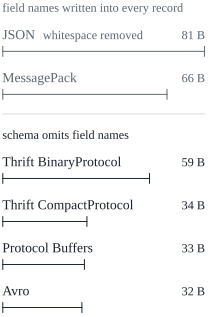
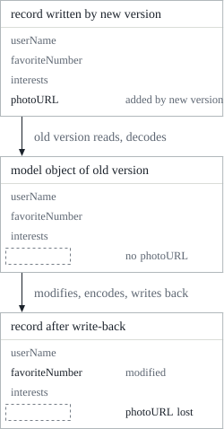

This is the fourth post in my DDIA reading notes. The [third post](/en/posts/ddia-03/) covered storage and retrieval—how databases put data on disk and find it again. Chapter 4 is about how data gets encoded into bytes, and how old and new versions of code, old and new data formats, coexist in the same system as applications keep evolving. The English quotations in the text are from the original book; the rest is my own retelling and organization.

The chapter opens with a saying of Heraclitus, as relayed by Plato in the *Cratylus*:

> Everything changes and nothing stands still.

Applications are no exception. When Chapter 1 discussed **evolvability**, it said that applications always change over time: new features are added, requirements are understood differently, and the business environment shifts. When features change, the data stored often has to change too—an extra field to record, or a different way of recording it.

Chapter 2 covered two attitudes toward schemas. Relational databases assume all data conforms to one schema; the schema can be changed through migrations, but only one schema is in effect at any moment. Schema-on-read ("schemaless") databases don't enforce a schema, so the database can hold data in both old and new formats at the same time.

When the data format changes, the code that reads and writes it has to change too. But in a large application, code changes can't happen all at once:

- Server-side applications usually do **rolling upgrades** (also called staged rollout): each new version is deployed to only a few nodes at a time, and the rollout continues once it's confirmed to work. This allows deployments without downtime, which in turn allows more frequent releases.
- Client-side applications are at the mercy of users, some of whom don't install updates for a long time.

As a result, old and new versions of code, and old and new data formats, may exist in the system at the same time. For the system to keep working, compatibility has to hold in both directions:

| Direction | Meaning | Difficulty |
| --- | --- | --- |
| Backward compatibility | New code can read data written by old code | Usually not hard: the person writing the new code knows the old format and can handle it explicitly |
| Forward compatibility | Old code can read data written by new code | Harder: it requires old code to ignore things added by newer versions |

This chapter first looks at several formats for encoding data—JSON, XML, Protocol Buffers, Thrift, and Avro—focusing on how they handle schema changes and support systems where old and new data and code coexist. Then it looks at how these formats are used in storage and communication: databases, REST- and RPC-style service calls, and message-passing systems like actors and message queues.

## Formats for encoding data

Data in a program has at least two representations:

- **In-memory representation**: objects, structs, lists, arrays, hash tables, trees, and so on, optimized for efficient access and manipulation by the CPU, usually making heavy use of pointers.
- **A sequence of bytes**: to write data to a file or send it over the network, it has to be encoded as some kind of self-contained byte sequence, such as a JSON document. Pointers are meaningless to another process, so this representation looks very different from the in-memory one.

Converting from the in-memory representation to a byte sequence is called **encoding**, also known as serialization or marshalling. The reverse is **decoding**, also known as parsing, deserialization, or unmarshalling. The term serialization is actually more common, but it has a completely different meaning in Chapter 7 on transactions (serializable), so the book consistently says encoding.

### Language-specific formats

Many programming languages have built-in support for encoding in-memory objects into bytes: Java has `java.io.Serializable`, Ruby has `Marshal`, Python has `pickle`, and there are third-party libraries like Kryo. They're convenient—a few lines of code can save an object and restore it—but the problems run deep:

1. **Tied to one language.** Data stored in one language's format is hard to read from another language, which means locking yourself into your current language for the long term and making integration with organizations using other languages difficult.
2. **Security risks.** To restore data to its original object types, the decoding process has to be able to instantiate arbitrary classes. If an attacker can get an application to decode a byte sequence they've crafted, they can make the application instantiate arbitrary classes, which often means the ability to execute arbitrary code remotely. The book cites an article published in 2015 by the security firm Foxglove Security, which showed that common Java software like WebLogic, WebSphere, JBoss, Jenkins, and OpenNMS were all affected by this kind of problem.
3. **Versioning is an afterthought.** These libraries aim for quick and convenient encoding; the troublesome matters of forward and backward compatibility are often ignored.
4. **Efficiency is also an afterthought.** The CPU time spent encoding and decoding, and the size of the encoded output, are often barely considered. Java's built-in serialization is notorious for poor performance and bloated encodings.

So, except for very short-lived, temporary purposes, language-specific encoding should generally be avoided.

### JSON, XML, and their binary variants

When you want a standardized encoding that many languages can read and write, the first things that come to mind are JSON and XML. They are widely known, widely supported, and almost as widely disliked: XML is often criticized for being too verbose and too complicated; JSON became popular mainly because browsers support it natively (it's a subset of JavaScript) and it's simpler than XML. CSV is another popular, language-independent format, just less capable.

These are all textual formats, somewhat human-readable, but they have some less obvious problems:

- **Ambiguity in encoding numbers.** XML and CSV can't distinguish between a number and a string that happens to consist of digits (unless you refer to an external schema). JSON distinguishes strings from numbers, but not integers from floating-point numbers, and it doesn't specify a precision. This causes problems with large numbers: integers greater than 2<sup>53</sup> can't be represented exactly in IEEE 754 double-precision floating-point, so parsing them in languages like JavaScript that represent numbers as floats makes them inaccurate. Twitter uses 64-bit numbers to identify each tweet, and in the JSON returned by its API, the tweet ID appears twice—once as a JSON number and once as a decimal string—precisely to work around the inaccuracy of parsing in JavaScript applications.
- **No support for binary strings.** JSON and XML support Unicode strings (human-readable text) well, but not binary strings—byte sequences without a character encoding. The usual workaround is to encode binary data as text using Base64, and use the schema to indicate that the value should be interpreted as Base64. This works, but it's a bit of a hack, and the data grows by 33%.
- **Schema support is optional and complicated.** Both XML and JSON have optional schema languages, which are powerful and therefore complicated to learn and implement. XML schemas are fairly widely used, while many JSON-based tools simply don't use a schema. But how numbers and binary strings should be interpreted depends precisely on information in the schema, so applications that don't use one have to hard-code the corresponding encoding and decoding logic.
- **CSV has no schema, and the format is vague.** What each row and column means is entirely up to the application to define, and when the application changes by adding a row or column, that has to be handled manually. What about values containing commas or newlines? The escaping rules are formally specified in RFC 4180, but not all parsers implement them correctly.

Despite these flaws, JSON, XML, and CSV are good enough for many purposes and will remain popular, especially as formats for exchanging data between different organizations. In such settings, as long as everyone agrees on the format, how pretty or efficient it is often doesn't matter, because:

> The difficulty of getting different organizations to agree on anything outweighs most other concerns.

#### Binary encoding

If data is only used within your organization, you don't have to settle for the lowest-common-denominator format; you can choose a more compact, faster-to-parse format. When datasets are small, the gains are negligible; at the terabyte scale, the choice of data format makes a big difference.

JSON is more concise than XML, but compared to binary formats, both are bulky. So a whole family of binary encodings for JSON (MessagePack, BSON, BJSON, UBJSON, BISON, Smile, and others) and for XML (WBXML, Fast Infoset, and others) has appeared. They have users in their respective niches, but none is as widespread as the textual versions of JSON and XML.

Some of these formats extend the data types—distinguishing integers from floats, for example, or supporting binary strings—but the data model remains the same as JSON and XML. In particular, they don't prescribe a schema, so all field names have to be written into the encoded data. The example record used throughout this chapter is:

```json
{
  "userName": "Martin",
  "favoriteNumber": 1337,
  "interests": ["daydreaming", "hacking"]
}
```

When encoded with MessagePack, the first byte `0x83` says that what follows is an object (high 4 bits `0x80`) with 3 fields (low 4 bits `0x03`); the second byte `0xa8` says that what follows is a string of 8 bytes (`0xa0` plus the length `0x08`); the next 8 bytes are the ASCII-encoded field name `userName`. The length is given up front, so there's no need to mark where the string ends, and no escaping. The remaining values and fields follow the same pattern.

The whole record encodes to 66 bytes, only 15 bytes less than the whitespace-stripped textual JSON (81 bytes), and all binary encodings of JSON are similar in this respect. Whether losing human readability is worth such a small space saving (and perhaps faster parsing) is, the book says, unclear. As we'll see next, the same record can be encoded in just 32 bytes.

### Thrift and Protocol Buffers

Apache Thrift and Protocol Buffers (protobuf) are two binary encoding libraries based on the same principle. Protocol Buffers was originally developed at Google, Thrift originally at Facebook, and both were open-sourced around 2007–2008. Both require a schema to encode any data, and the schema is written in their respective **interface definition languages** (IDLs). The record above, described in Thrift's IDL, looks like this:

```thrift
struct Person {
  1: required string       userName,
  2: optional i64          favoriteNumber,
  3: optional list<string> interests
}
```

In Protocol Buffers, it looks like this[^proto3]:

```protobuf
message Person {
    required string user_name       = 1;
    optional int64  favorite_number = 2;
    repeated string interests       = 3;
}
```

Both come with a code generation tool: it reads a schema definition like this and generates classes in various programming languages that implement the schema. Application code calls the generated code to encode and decode records.

Thrift has two commonly used binary encoding formats:

- **BinaryProtocol**: the same record encodes to 59 bytes. Like MessagePack, each field has a type annotation (saying whether it's a string, integer, list, etc.) and, where needed, a length (string length, number of list elements); strings are encoded as UTF-8 as before. The big difference is that there are **no field names**—instead there are **field tags**, the numbers 1, 2, 3 from the schema.
- **CompactProtocol**: semantically the same as BinaryProtocol, but only 34 bytes. It packs the field type and tag number into a single byte, and uses **variable-length integers**: 1337 doesn't need to occupy 8 bytes, only 2, with the high bit of each byte indicating whether more bytes follow. Numbers from -64 to 63 take one byte, numbers from -8192 to 8191 take two bytes, and larger numbers take more bytes[^zigzag].

Protocol Buffers has only one binary encoding format, and the same record is 33 bytes. Its bit-packing is slightly different, but otherwise it's very similar to Thrift's CompactProtocol.

It's worth noting that whether a field is marked required or optional in the schema has no effect on how it's encoded—you can't tell from the binary data whether a field was required. The difference is only that required triggers a runtime check that the field has been set, which helps catch bugs.

#### Field tags and schema evolution

Schemas inevitably change over time; this is called **schema evolution**. How do Thrift and protobuf maintain both backward and forward compatibility as schemas change?

An encoded record is just the concatenation of its encoded fields: each field is identified by its tag number and annotated with a data type; fields that aren't set are simply omitted. So field tags are crucial to understanding encoded data. A field tag is like an alias for the field—a compact way of saying which field it is, without spelling out the field name. From this, several rules follow:

- **Field names can change, tags cannot.** Encoded data never refers to field names, so renaming is fine; change a tag number, and all existing encoded data becomes invalid.
- **New fields get new tag numbers.** When old code reads data written by new code, it can simply ignore any tag number it doesn't recognize, using the type annotation to figure out how many bytes to skip. This preserves forward compatibility.
- **Newly added fields must be optional or have a default value.** As long as each field's tag number is unique, new code can always read old data, because the meaning of the tag numbers hasn't changed. The only issue is that a newly added field can't be required: when new code reads data written by old code, the field won't be there, and the check will fail. So for backward compatibility, any field added after the schema's initial deployment must be optional or have a default value.
- **Removing a field is like adding one, with the concerns reversed in the two directions.** You can only remove optional fields (required fields can never be removed), and a tag number can never be reused, because data with that old tag number may still be stored somewhere, and new code must ignore it.

#### Data types and schema evolution

Changing a field's data type is possible (check the documentation), but risks losing precision or getting truncated. For example, changing a 32-bit integer to 64-bit: new code reading old data is fine, since the parser fills in the missing bits with zeros; old code reading new data will still put the value into a 32-bit variable, and if the decoded 64-bit value doesn't fit, it gets truncated.

Protocol Buffers has an interesting detail: it has no list or array type. Instead, in addition to required and optional, it offers a third field marker, `repeated`. A repeated field is encoded simply by the same field tag appearing multiple times in the record. This has a nice consequence: you can change an optional (single-valued) field into a repeated (multi-valued) field. New code reading old data sees a list with zero or one elements (depending on whether the field was present); old code reading new data sees only the last element of the list[^repeated].

Thrift has a dedicated list type, parameterized by the element type, like `list<string>`. It doesn't support this single-to-multi evolution, but it does support nested lists.

### Avro

Apache Avro is another binary encoding format, with some interesting differences from protobuf and Thrift. It started in 2009 as a subproject of Hadoop, because Thrift didn't fit Hadoop's use cases well.

Avro also uses a schema to describe the structure of the encoded data. It has two schema languages: an Avro IDL intended for human editing, and a JSON-based one that's easier for machines to read. The schema for the same record, written in Avro IDL, is:

```avdl
record Person {
    string               userName;
    union { null, long } favoriteNumber = null;
    array<string>        interests;
}
```

The equivalent JSON representation is:

```json
{
  "type": "record",
  "name": "Person",
  "fields": [
    {"name": "userName",       "type": "string"},
    {"name": "favoriteNumber", "type": ["null", "long"], "default": null},
    {"name": "interests",      "type": {"type": "array", "items": "string"}}
  ]
}
```

Notice there are no tag numbers in the schema. Encoding the record above with this schema takes just 32 bytes—the most compact encoding seen in this chapter.

Nothing in the encoding identifies a field or its data type; the values are simply concatenated in order. A string is a length prefix followed by UTF-8 bytes, but nothing in the encoded data says it's a string—it could be an integer, or something else entirely. Integers use variable-length encoding, like Thrift's CompactProtocol.

To parse such binary data, you have to walk through the fields in the order they appear in the schema, relying on the schema to know each field's data type. This means the data can only be decoded correctly if the code reading it and the code writing it use **exactly the same** schema; any mismatch between the two schemas produces a wrong decoding.

At this point we've seen several encodings of the same record; here they are side by side:



If the reader's and writer's schemas have to match, how does Avro support schema evolution?

#### Writer's schema and reader's schema

When an application encodes data (writes it to a file or database, sends it over the network, etc.), it uses whatever version of the schema it knows—for example, the schema compiled into the application. This is called the **writer's schema**.

When an application decodes data, it expects the data to conform to some schema, called the **reader's schema**. This is the schema the application code depends on; the code may have been generated from it at build time.

Avro's key idea is that the writer's schema and the reader's schema **don't have to be the same—they only have to be compatible**. When decoding, the Avro library resolves the two schemas side by side, translating the data from the writer's schema into the reader's schema. The Avro specification defines precisely how this **schema resolution** works:

- The order of fields in the two schemas doesn't matter; resolution matches fields by **field name**;
- If the code reading the data encounters a field that appears in the writer's schema but not in the reader's schema, it ignores it;
- If the code reading the data expects a field whose name isn't in the writer's schema, it fills in the default value declared in the reader's schema.


#### Rules for schema evolution

For Avro, forward compatibility means you can use a new version of the schema as the writer's schema and an old version as the reader's schema; backward compatibility is the reverse—new version as reader's schema, old version as writer's schema.

To maintain compatibility, you can only add or remove fields that **have a default value**, like `favoriteNumber` above, whose default is null. Suppose you add a field with a default value, so the new schema has it and the old one doesn't: a reader with the new schema reading a record written by the old schema fills in the default for the missing field. If the added field has no default, the new reader can't read data written by the old writer, breaking backward compatibility; if the removed field has no default, the old reader can't read data written by the new writer, breaking forward compatibility.

In some programming languages, null can be the default value of any variable; Avro is not like that. For a field to allow null, it has to use a **union type**. For example, `union { null, long, string } field;` means the field can be a number, a string, or null. Only when null is one branch of the union can null be used as the default. This is a bit more verbose than making everything nullable by default, but spelling out what can and can't be null helps prevent bugs. For the same reason, Avro has no optional and required markers like protobuf and Thrift; it uses union types and default values instead.

Changing a field's data type is also possible, as long as Avro can convert the type. Changing a field's name is possible too, with a caveat: the reader's schema can declare **aliases** for a field, used to match the field name in an older writer's schema. So renaming a field is backward compatible but not forward compatible. Adding a branch to a union type is the same: backward compatible, but not forward compatible.

#### Where does the writer's schema come from?

One question was skipped earlier: how does the reader know which writer's schema a given piece of data was encoded with? You can't attach the full schema to every record—the schema would likely be larger than the encoded data, defeating the space savings of binary encoding. The answer depends on the context in which Avro is used:

| Context | Where the writer's schema lives |
| --- | --- |
| Large file with many records | This is a common use of Avro, especially in Hadoop: millions of records in a file are all encoded with the same schema, so the writer just includes the writer's schema once at the beginning of the file. Avro specifies a file format for this, called an **object container file** |
| Database with individually written records | Different records may be written at different times with different writer's schemas. The simplest approach is to put a version number at the start of each encoded record, and keep a list of schema versions in the database. A reader fetches a record, reads the version number, looks up the corresponding writer's schema, and uses it to decode the rest of the record. LinkedIn's Espresso works this way |
| Sending records over a network connection | When two processes communicate over a bidirectional network connection, they can negotiate the schema version when the connection is established, and use that schema for the lifetime of the connection. The Avro RPC protocol works this way |

In any case, having a database of schema versions is a good thing: it serves as documentation, and it gives you a chance to check schemas for compatibility. The version number can be an incrementing integer or a hash of the schema.

#### Dynamically generated schemas

Compared to protobuf and Thrift, one advantage of Avro is that the schema has no tag numbers. But what's the problem with leaving a few numbers in the schema?

The difference is that Avro is friendlier to **dynamically generated** schemas. Suppose you want to export the contents of a relational database to files, and to avoid the problems of textual formats (JSON, CSV, SQL) discussed earlier, you want to use a binary format. With Avro, you can easily generate an Avro schema (in its JSON representation) from the relational schema: each table becomes a record schema, each column becomes a field in the record, and the column name becomes the field name. Then you encode the database contents with this schema and write everything into an Avro object container file.

If the database schema changes (say a table gains or loses a column), you just regenerate the Avro schema from the new database schema and export the data with the new schema. The export process doesn't have to worry about schema changes at all—it simply re-derives the schema on every run. Anyone reading the new data files will see that the record fields have changed, but since fields are identified by name, the updated writer's schema can still be matched against an old reader's schema.

If you did this with Thrift or protobuf, the field tags would likely have to be assigned by hand: every time the database schema changes, an administrator would have to manually update the mapping from column names to field tags. This could perhaps be automated, but the program generating the schemas would have to be very careful never to assign a previously used tag. Dynamically generated schemas were simply not a design goal of Thrift and protobuf—but they were a design goal of Avro.

#### Code generation and dynamically typed languages

Thrift and protobuf rely on code generation: after defining a schema, you can generate code implementing that schema in the programming language of your choice. This is useful in statically typed languages like Java, C++, and C#: decoded data can be placed in efficient in-memory structures, and code that accesses these structures benefits from type checking and IDE autocompletion.

In dynamically typed languages like JavaScript, Ruby, and Python, code generation is much less meaningful, since there's no compile-time type checking to satisfy. These languages generally avoid an explicit compilation step, and code generation is often unwelcome there. Moreover, for dynamically generated schemas (like an Avro schema generated from a database table), code generation is just an unnecessary obstacle to getting at the data.

Avro provides optional code generation for statically typed languages, but it can be used perfectly well without generating any code. An object container file has the writer's schema embedded in it, so you can open it with the Avro library and look at the data inside as if it were a JSON file: the file carries all the necessary metadata and is **self-describing**. This is especially useful with dynamically typed data processing languages like Apache Pig: in Pig, you can open some Avro files and start analyzing them, then write derived datasets out as Avro-format output files, without ever thinking about schemas.

### The merits of schemas

Protocol Buffers, Thrift, and Avro all use a schema to describe a binary encoding format. Their schema languages are much simpler than XML Schema or JSON Schema, which support far more detailed validation rules, like "the string in this field must match this regular expression" or "this integer must be between 0 and 100." Precisely because they are easier to implement and use, they have grown to support a wide range of programming languages.

The ideas behind these encodings are not new at all. They have a lot in common with **ASN.1**, a schema definition language first standardized in 1984: ASN.1 has been used to define various network protocols, and its binary encoding (DER) is still used to encode SSL certificates (X.509); it also uses tag numbers to support schema evolution, like protobuf and Thrift. But ASN.1 is very complex and poorly documented, so it's probably not a good fit for new applications.

Many data systems also implement their own proprietary binary encodings for their data. For example, most relational databases have a network protocol for sending queries and receiving results. These protocols are usually specific to a particular database, and the database vendor provides drivers (through APIs like ODBC or JDBC) that decode the responses from the database network protocol into in-memory data structures.

So while textual formats like JSON, XML, and CSV are widespread, schema-based binary encodings are also a viable choice. They have several nice properties:

1. They can be much more compact than the various "binary JSON" formats, because field names can be omitted from the encoded data;
2. The schema is a valuable form of documentation, and since decoding requires it, you can be sure it's up to date—whereas hand-maintained documentation easily drifts from reality;
3. Keeping a database of schemas allows you to check schema changes for forward and backward compatibility before deploying anything;
4. For users of statically typed languages, generating code from the schema is useful, enabling compile-time type checking.

In short, schema evolution provides the same flexibility as schemaless, schema-on-read JSON databases, while giving better guarantees about the data and better tooling.

## Modes of dataflow

As noted at the start of this chapter, to send data to a process that doesn't share memory with you—over the network or into a file—you have to encode it as a byte sequence. We've discussed various encodings and how they achieve forward and backward compatibility. Compatibility is important for evolvability: with it, different parts of a system can be upgraded independently, without changing everything at once.

Compatibility is a relationship between two processes: one process encodes the data, another decodes it. There are many ways data can flow from one process to another—who encodes, who decodes? The rest of this chapter looks at the three most common:

- Through databases;
- Through service calls;
- Through asynchronous message passing.

### Dataflow through databases

In a database, the process writing to the database encodes the data, and the process reading from the database decodes it. There may be only one process accessing the database—in that case, the reader is simply a later version of the same process, and storing something in the database is like sending a message to your future self. Backward compatibility is clearly necessary here; otherwise your future self can't decode what you wrote in the past.

More generally, several processes access a database at the same time: perhaps several different applications or services, or just several instances of the same service (running in parallel for scalability or fault tolerance). In a changing application, it's likely that some processes are running new code while others are still running old code—for example, during a rolling upgrade, where some instances have been updated and others haven't.

This means a value in the database may be written by a newer version of the code and later read by an older version that's still running. So dataflow through databases **needs not only backward compatibility, but usually forward compatibility as well**.

There's also a subtler problem. Suppose you add a field to a record's schema, and the new code writes a record with this new field to the database. Later, an older version of the code that doesn't know about the new field reads the record, modifies it, and writes it back. The ideal behavior is usually for the old code to preserve the new field as-is, even if it can't understand it.

The encoding formats discussed earlier all support preserving such unknown fields[^unknown], but sometimes extra care is needed at the application layer. For example, if the application decodes a database value into model objects and later re-encodes those model objects, unknown fields can get lost in the conversion:



This problem isn't hard to solve, as long as you're aware of it.

#### Values written at different times

A database generally allows any value to be updated at any time, so the same database may contain a value written five milliseconds ago and a value written five years ago.

When you deploy a new version of an application (at least a server-side one), the old version can be completely replaced within minutes. The contents of a database are different: data from five years ago still sits there in its original encoding, unless you've explicitly rewritten it since. This phenomenon is sometimes summed up in the phrase: data outlives code.

Rewriting (migrating) data into a new schema is certainly possible, but it's expensive on large datasets, so most databases try to avoid it. Most relational databases allow simple schema changes, like adding a column with a null default, without rewriting existing data; when reading an old row, the database fills in null for columns missing from the encoded data on disk. MySQL is an exception—it often rewrites the entire table even when it isn't necessary[^mysql]. LinkedIn's document database Espresso stores data using Avro, so it can take advantage of Avro's schema evolution rules.

In this way, schema evolution makes the whole database look as though it were encoded with a single schema, even though the underlying storage contains a mixture of records encoded with various historical schema versions.

#### Archival storage

From time to time you may take a snapshot of your database, for backup or for loading into a data warehouse. In this case, the exported data is usually encoded with the latest schema, even though the source database contains a mix of schema versions from different eras: since you're copying the data anyway, you might as well encode the copy consistently.

The exported data is written once and never changed afterward, so formats like Avro object container files are a good fit. This is also a good opportunity to encode the data in an analytics-friendly column-oriented format like Parquet (Chapter 3 covered column-oriented storage). Chapter 10 will discuss how to use data in archival storage.

### Dataflow through services: REST and RPC

When processes need to communicate over a network, the most common arrangement is to split them into two roles: **clients** and **servers**. The server exposes an API over the network, and clients connect and make requests to that API. The API exposed by the server is called a **service**.

The web works this way: browsers send GET requests to web servers to download HTML, CSS, JavaScript, images, and so on, and POST requests to submit data. The API here is a set of standardized protocols and data formats (HTTP, URLs, SSL/TLS, HTML, etc.), which browsers, servers, and website authors broadly follow, so (at least in theory) any browser can access any website.

Browsers aren't the only clients. Native apps on phones or desktops can also make network requests to servers, and a client-side JavaScript application running in a browser can become an HTTP client using XMLHttpRequest (a technique called Ajax). In this case, the server's response is usually not HTML for humans to look at, but encoded data for the client code to process further, such as JSON. HTTP may be used as the transport protocol, but the API implemented on top of it is application-specific, and the client and server have to agree on the details of that API.

A server can itself be a client of another service—a typical web application server, for example, is a client of a database. This approach is often used to break a large application into smaller services by function; when one service needs another's functionality or data, it makes a request to it. This way of building applications is traditionally called **service-oriented architecture** (SOA), and more recently, refined and rebranded as **microservices**.

In some ways, services are similar to databases: both typically allow clients to submit and query data. But databases allow arbitrary queries using the query languages discussed in Chapter 2, while services expose an application-specific API that only permits inputs and outputs predetermined by the service's business logic (application code). This restriction provides a degree of encapsulation: services can impose fine-grained limits on what clients can and cannot do.

A key design goal of service-oriented and microservice architectures is to make services **independently deployable and evolvable**, making applications easier to change and maintain. For example, each service is owned by a team, and that team should be able to release new versions frequently without coordinating with other teams. In other words, old and new versions of servers and clients will be running at the same time, so the data encoding they use must be compatible across versions of the service API—which is exactly what this chapter has been about.

#### Web services

When HTTP is used as the underlying protocol for talking to a service, it's called a **web service**. The name is perhaps a bit misleading, because web services are used not only on the web, but in several contexts:

1. A client application on a user's device (like a native app on a phone, or a JavaScript web app using Ajax) makes requests to a service over HTTP, typically across the public internet;
2. As part of a service-oriented or microservice architecture, one service makes requests to another service in the same organization, often in the same datacenter (software supporting this use case is sometimes called **middleware**);
3. One service makes requests over the internet to a service in another organization, for exchanging data between the backend systems of different organizations. Public APIs offered by online services fall into this category, such as credit card payment systems, or OAuth for sharing access to user data.

There are two popular approaches to web services: REST and SOAP. They are almost diametrically opposed in philosophy, and their respective proponents often argue fiercely.

**REST** is not a protocol, but a design philosophy built on the principles of HTTP. It emphasizes simple data formats, using URLs to identify resources, and using HTTP's own features for cache control, authentication, and content type negotiation. At least for cross-organizational service integration, REST has become increasingly popular over SOAP, and it's often associated with microservices. APIs designed according to REST principles are called RESTful APIs; they tend toward simpler approaches and usually make less use of code generation and automated tooling. Definition formats like OpenAPI (also known as Swagger) can be used to describe RESTful APIs and generate documentation.

**SOAP**, on the other hand, is an XML-based protocol for making network API requests. (Despite the similar name, SOAP is not a prerequisite for SOA: SOAP is a specific technology, while SOA is a general approach to building systems.) Although it's most commonly used over HTTP, it aims to be independent of HTTP and avoids most of HTTP's features, instead bringing its own sprawling set of related standards (collectively known as WS-\*) to provide various capabilities.

The API of a SOAP web service is described using WSDL (Web Services Description Language), an XML-based language. WSDL supports code generation, so a client can access a remote service using local classes and method calls, with the framework encoding the calls into XML messages and decoding them back. This is useful in statically typed languages, less so in dynamically typed ones. WSDL is not designed to be human-readable, and SOAP messages are often too complex to construct by hand, so SOAP users rely heavily on tooling, code generation, and IDEs; if your language isn't among those supported by SOAP vendors, integrating with SOAP services is difficult. SOAP and its various extensions are nominally standardized, but interoperability problems between different vendors' implementations are common. For these reasons, although SOAP is still used in many large enterprises, it has fallen out of favor in most smaller companies.

#### The problems with remote procedure calls

Web services are just the latest in a long line of technologies for making API requests over a network, many of which were heavily hyped but all had serious problems: Enterprise JavaBeans (EJB) and Java's Remote Method Invocation (RMI) are limited to Java; the Distributed Component Object Model (DCOM) is limited to Microsoft platforms; the Common Object Request Broker Architecture (CORBA) is excessively complex and doesn't provide backward or forward compatibility.

They are all based on the idea of **remote procedure calls** (RPC), which has been around since the 1970s. The RPC model tries to make a request to a remote network service look the same as calling a function or method in the same process—an abstraction called **location transparency**. The book's judgment is blunt:

> Although RPC seems convenient at first, the approach is fundamentally flawed.

Because a network request is very different from a local function call:

- A local function call is predictable: it succeeds or fails based only on parameters you control. A network request is unpredictable: the request or response may be lost due to network problems, the remote machine may be slow or unavailable—all completely outside your control. Network problems are common and must be anticipated, for example by retrying failed requests.
- A local function call either returns a result, throws an exception, or never returns (infinite loop or process crash). A network request has another possible outcome: it returns with no result at all because of a timeout. In that case you have no idea what happened: if you didn't receive a response from the remote service, you can't know whether the request got through. Chapter 8 discusses this problem in detail.
- When you retry a failed network request, it's possible the requests actually all got through and only the responses were lost. In that case, retrying causes the same operation to be performed multiple times, unless the protocol has a built-in mechanism for deduplication (**idempotence**). Chapter 11 will return to idempotence. Local function calls don't have this problem.
- Every time you call a local function, it usually takes about the same amount of time. A network request is much slower than a function call, and its latency varies wildly: it can complete in under a millisecond when things go well, or take several seconds to do exactly the same thing when the network is congested or the remote service is overloaded.
- When calling a local function, you can efficiently pass references (pointers) to objects in local memory. When making a network request, all parameters have to be encoded into a byte sequence that can be sent over the network. That's fine for primitive types like numbers and strings, but large objects quickly become a problem.
- The client and the service may be implemented in different programming languages, so the RPC framework must translate data types from one language to another. Not all languages have the same types, and the result can be ugly—recall the earlier problem of JavaScript handling numbers greater than 2<sup>53</sup>. This problem doesn't exist within a single process written in a single language.

These factors mean there's no point in trying to make a remote service look too much like a local object in your programming language, because it's a fundamentally different thing. Part of REST's appeal is that it doesn't try to hide the fact that it's a network protocol (although that apparently hasn't stopped people from building RPC libraries on top of REST).

#### New directions for RPC

Despite all these problems, RPC isn't going away. RPC frameworks have been built on top of all the encodings mentioned in this chapter: Thrift and Avro come with RPC support, gRPC is an RPC implementation using Protocol Buffers, Finagle also uses Thrift, and Rest.li uses JSON over HTTP.

The new generation of RPC frameworks is more explicit about the fact that a remote request is different from a local function call. For example, Finagle and Rest.li use **futures** (also called promises) to encapsulate asynchronous operations that may fail; futures also simplify things when you need to make requests to several services in parallel and combine their results. gRPC supports **streams**: a call consists not just of one request and one response, but a series of requests and responses over time. Some frameworks also provide **service discovery**, allowing a client to find out at which IP address and port a service can be found; Chapter 6 will return to this when discussing request routing.

Custom RPC protocols with binary encoding can achieve better performance than a generic approach like JSON over REST. But RESTful APIs have other important advantages: they're good for experimentation and debugging (you can make requests directly with a browser or the command-line tool curl, without code generation or installing software), they're supported by all mainstream programming languages and platforms, and there's a vast ecosystem of tools (servers, caches, load balancers, proxies, firewalls, monitoring, debugging, and testing tools).

For these reasons, REST seems to be the dominant style for public APIs, while RPC frameworks are mainly used for services within the same organization, typically in the same datacenter.

#### Data encoding and evolution for RPC

For evolvability, an RPC client and server must be able to change and be deployed independently. Compared to dataflow through databases, dataflow through services can make a simplifying assumption: all servers are upgraded first, and all clients afterward. Thus, requests only need backward compatibility (new servers must be able to read requests from old clients), and responses only need forward compatibility (old clients must be able to read responses from new servers).

The backward and forward compatibility of an RPC scheme is inherited from the encoding it uses:

- Thrift, gRPC (Protocol Buffers), and Avro RPC can evolve according to the compatibility rules of their respective encoding formats;
- SOAP requests and responses are described with XML schemas and can evolve, but there are some subtle pitfalls;
- RESTful APIs most commonly use JSON (with no formally specified schema) for responses, and JSON or URI-encoded/form-encoded parameters for requests. Adding optional request parameters and adding new fields to response objects are usually considered compatible changes.

There's a harder side to service compatibility: RPC is often used for cross-organizational communication, where the service provider often has no control over its clients and can't force them to upgrade. So compatibility needs to be maintained for a long time, perhaps indefinitely. If a breaking change must be made, the service provider often ends up maintaining several versions of the service API simultaneously.

There's no agreed-upon approach to API versioning—that is, how a client indicates which version of the API it wants to use. For RESTful APIs, a common approach is to put the version number in the URL or in the HTTP Accept header. For services that identify clients with an API key, the server can store the API version requested by each client and allow changing that choice through a separate administrative interface.

### Dataflow through message passing

We've looked at two kinds of dataflow: through databases (one process encodes, some future process decodes) and through services (REST and RPC, where one process sends a request and expects a response as soon as possible). Finally, let's look at **asynchronous message-passing** systems, which sit somewhere between the two.

It's like RPC in that a client's request (usually called a **message**) is delivered to another process with low latency; it's like a database in that the message goes not through a direct network connection, but via an intermediary called a **message broker** (also known as a message queue or message-oriented middleware), which stores the message temporarily.

Compared to direct RPC, using a message broker has several advantages:

- It can act as a buffer if the recipient is unavailable or overloaded, improving system reliability;
- It can automatically redeliver messages to a process that crashed, preventing message loss;
- The sender doesn't need to know the IP address and port of the recipient, which is especially useful in cloud deployments where virtual machines come and go;
- One message can be sent to several recipients;
- It logically decouples the sender from the recipient: the sender just publishes messages and doesn't care who consumes them.

One difference from RPC, though: message passing is usually **one-way**—the sender generally doesn't expect a reply. A process can send a response, but it usually goes on a separate channel. This communication pattern is **asynchronous**: the sender doesn't wait for the message to be delivered; it sends it and moves on.

#### Message brokers

In the past, message brokers were largely the domain of commercial enterprise software from companies like TIBCO, IBM WebSphere, and webMethods. In recent years, open source implementations like RabbitMQ, ActiveMQ, HornetQ, NATS, and Apache Kafka have become popular; Chapter 11 will compare them.

The detailed delivery semantics vary by implementation and configuration, but the general pattern is: a process sends a message to a named **queue** or **topic**, and the broker ensures that the message is delivered to one or more **consumers** (or subscribers) of that queue or topic. There can be many producers and many consumers on the same topic.

A topic provides only one-way dataflow. However, a consumer can itself publish messages to another topic, chaining them together (as Chapter 11 will discuss), or to a reply queue consumed by the sender of the original message, creating a request/response dataflow similar to RPC.

Message brokers typically don't enforce any particular data model: a message is just a sequence of bytes with some metadata, so any encoding format can be used. If the encoding is backward and forward compatible, publishers and consumers have the greatest flexibility to change independently and deploy in any order.

If a consumer republishes messages to another topic, it may need to be careful to preserve unknown fields, to avoid the problem shown in Figure 3.

#### Distributed actor frameworks

The **actor model** is a programming model for concurrency within a single process. Rather than dealing directly with threads (and the attendant race conditions, locking, and deadlock problems), logic is encapsulated in actors. Each actor typically represents one client or entity, may have some local state (not shared with other actors), and communicates with other actors by sending and receiving asynchronous messages. Message delivery is not guaranteed: in certain error scenarios, messages are lost. Each actor processes only one message at a time, so there's no need to worry about threads, and the framework can schedule each actor independently.

**Distributed actor frameworks** use this programming model to scale an application across multiple nodes. The same message-passing mechanism is used whether the sender and recipient are on the same node or not; when they're on different nodes, the message is transparently encoded into a byte sequence, sent over the network, and decoded on the other side.

Location transparency works better in the actor model than in RPC, because the actor model already assumes messages may be lost, even within a single process. Latency over the network is likely higher than within a process, but with the actor model, the fundamental difference between local and remote communication is less stark.

A distributed actor framework essentially integrates a message broker and the actor programming model into one framework. But to do rolling upgrades of an actor-based application, you still have to think about forward and backward compatibility, because messages may be sent from nodes running the new version to nodes running the old version, and vice versa. The book looks at how three popular distributed actor frameworks handle message encoding:

| Framework | Message encoding | Rolling upgrades |
| --- | --- | --- |
| Akka | Uses Java's built-in serialization by default, which provides no forward or backward compatibility | Can be switched to an encoding like Protocol Buffers, enabling rolling upgrades[^akka] |
| Orleans | Uses a custom encoding format by default, which doesn't support rolling upgrade deployments | Deploying a new version requires creating a new cluster, moving traffic from the old cluster to the new one, and shutting down the old cluster; like Akka, custom serialization plugins can be used[^orleans] |
| Erlang OTP | Changing the schema of records is surprisingly hard, despite the system's many features designed for high availability | Rolling upgrades are possible but require careful planning; the experimental maps type (a JSON-like structure) introduced in Erlang R17 in 2014 may make this easier in the future |

## Summary

This chapter looked at several ways of turning data structures into bytes on the network or on disk. The details of these encodings affect not only efficiency, but more importantly the architecture of applications and the options available when deploying them.

In particular, many services need to support rolling upgrades: new versions are deployed gradually to a few nodes at a time, rather than to all nodes simultaneously. Rolling upgrades allow new releases to be deployed without downtime, which encourages frequent small releases rather than rare big ones; they also make deployments less risky, since a bad release can be detected and rolled back before it affects many users. These properties are a big benefit for evolvability—the ease of changing an application.

During a rolling upgrade, or for various other reasons, we must assume that different nodes are running different versions of the application's code. Therefore, all data flowing through the system must be encoded in a way that is both backward compatible (new code can read old data) and forward compatible (old code can read new data). The compatibility of the several kinds of encoding formats:

| Format | Examples | Compatibility | Caveats |
| --- | --- | --- | --- |
| Language-specific encodings | Java's `Serializable`, Python's `pickle` | Often provide no forward or backward compatibility | Locked into one language |
| Textual formats | JSON, XML, CSV | Depends on how they're used; optional schema languages exist, sometimes helpful, sometimes a hindrance | Vague about data types; care needed with numbers and binary strings |
| Schema-based binary formats | Thrift, Protocol Buffers, Avro | Well-defined forward and backward compatibility semantics | Compact and efficient; schemas serve as documentation and enable code generation in statically typed languages; but data must be decoded before humans can read it |

The several modes of dataflow, corresponding to different scenarios for encoded data:

- **Databases**: the process writing to the database encodes, the process reading from the database decodes;
- **RPC and REST APIs**: the client encodes the request, the server decodes the request and encodes the response, and the client finally decodes the response;
- **Asynchronous message passing** (via message brokers or actors): nodes send messages to each other, with the sender encoding and the recipient decoding.

The book's conclusion is that, with a little care, backward compatibility, forward compatibility, and rolling upgrades are all entirely achievable. The chapter ends with a wish:

> May your application's evolution be rapid and your deployments be frequent.

## Glossary

| English | Chinese | Meaning |
| --- | --- | --- |
| evolvability | 可演化性 | The ease with which an application can be modified as requirements change |
| rolling upgrade / staged rollout | 滚动升级 / 分阶段发布 | Deploying a new version to only a few nodes at a time, gradually progressing |
| backward compatibility | 向后兼容 | New code can read data written by old code |
| forward compatibility | 向前兼容 | Old code can read data written by new code |
| encoding / decoding | 编码 / 解码 | Converting between in-memory representation and byte sequences |
| serialization / marshalling | 序列化 / 编组 | Aliases for encoding; the book avoids the former because it clashes with serializable in transactions |
| binary string | 二进制字符串 | A byte sequence without a character encoding |
| Base64 | Base64 | A method of encoding binary data as text; data grows by 33% |
| IDL (interface definition language) | 接口定义语言 | The language used by Thrift, protobuf, etc. to write schemas |
| code generation | 代码生成 | Generating classes implementing a schema from the schema |
| field tag | 字段标签 | The number assigned to each field in a schema, used in encoded data instead of the field name |
| variable-length integer | 变长整数 | An integer encoding where smaller numbers take fewer bytes |
| required / optional / repeated | 必填 / 可选 / 重复 | The three field markers in protobuf |
| schema evolution | 模式演化 | Schemas changing over time while maintaining compatibility |
| writer's schema / reader's schema | 写者模式 / 读者模式 | The schema used for encoding / the schema expected when decoding |
| schema resolution | 模式解析 | Avro's process of translating data from the writer's schema to the reader's schema by field name during decoding |
| union type | 联合类型 | A value that can be one of several types; Avro uses it to represent nullable fields |
| alias | 别名 | An old name declared for a field in the reader's schema, used to match data written before a rename |
| object container file | 对象容器文件 | An Avro file format that stores the writer's schema once at the beginning, followed by many records |
| dynamically generated schema | 动态生成的模式 | A schema generated automatically by a program, e.g. from database tables |
| self-describing | 自描述 | A file carrying all the metadata needed to interpret it |
| ASN.1 | ASN.1 | A schema definition language first standardized in 1984, also using tag numbers for evolution |
| dataflow | 数据流 | Data flowing from the process that encodes it to the process that decodes it |
| unknown field | 未知字段 | A new field that old code doesn't recognize; should be preserved as-is when read and written back |
| data outlives code | 数据比代码活得久 | Old data remains in the database in its original encoding for a long time |
| archival storage | 归档存储 | A snapshot of data exported for backup or loading into a data warehouse |
| service | 服务 | An application-specific API exposed by a server over the network |
| SOA / microservices | 面向服务的架构 / 微服务 | Breaking a large application into services that can be deployed and evolved independently |
| web service | Web 服务 | A service using HTTP as the underlying protocol |
| REST | REST | A design philosophy built on the principles of HTTP |
| SOAP / WSDL | SOAP / WSDL | An XML-based web service protocol / the language describing its API |
| RPC | 远程过程调用 | A model that makes network requests look like local function calls |
| location transparency | 位置透明 | Remote calls looking the same as local calls |
| idempotence | 幂等 | Performing the same operation multiple times has the same effect as performing it once |
| future / promise | future / promise | Represents the result of an asynchronous operation that may fail |
| service discovery | 服务发现 | Letting clients find out the IP address and port where a service is located |
| message broker | 消息代理 | An intermediary that stores messages temporarily and delivers them to recipients |
| queue / topic | 队列 / 主题 | A named destination to which messages are sent |
| producer / consumer | 生产者 / 消费者 | The party publishing messages / the party receiving them |
| actor model | actor 模型 | A concurrency model that encapsulates logic in actors communicating only via asynchronous messages |
| distributed actor framework | 分布式 actor 框架 | A framework integrating the actor model with a message broker, running across multiple nodes |

[^proto3]: The Protocol Buffers example in the book uses proto2 syntax. Proto3, released in 2016, removed required fields.

[^zigzag]: "-64 to 63 in one byte, -8192 to 8191 in two bytes" refers to Thrift's CompactProtocol: it first uses zigzag encoding to map signed integers to unsigned integers (0, -1, 1, -2 become 0, 1, 2, 3), then applies variable-length encoding. Protocol Buffers' variable-length integers also use the high bit of each byte to indicate whether more bytes follow, but ordinary int32 and int64 fields always take 10 bytes for negative numbers; only sint32 and sint64 use zigzag encoding.

[^repeated]: The book's statement holds for unpacked repeated fields. In proto3, repeated fields of numeric types (including bool and enum) are encoded in packed format by default, which old code expecting a single-valued field can't parse, so the official documentation says changing optional to repeated is generally not safe for numeric types; it still works for string, bytes, and message fields (old code reading a message field merges all elements rather than taking only the last).

[^unknown]: Proto3 versions 3.0 through 3.4 discarded unknown fields during parsing; version 3.5, released in 2017, restored the behavior of preserving unknown fields.

[^mysql]: This was the situation in 2017. Since MySQL 8.0.12 (2018), adding a column can be done with `ALGORITHM=INSTANT`, without copying the entire table; see the footnote in the [second post](/en/posts/ddia-02/).

[^akka]: The book was written in 2017. Since Akka 2.6 (2019), Java serialization is disabled by default, and Jackson-based serialization is recommended instead.

[^orleans]: The book was written in 2017. Orleans 7.0 (2022) introduced a new serializer that tolerates version differences and supports rolling upgrades.
