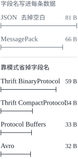
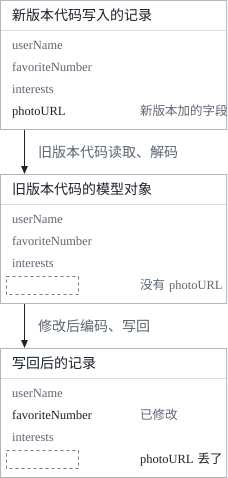

这是 DDIA 读书笔记的第四篇。[第三篇](/posts/ddia-03/)讲的是存储与检索，也就是数据库怎样把数据存到磁盘上、又怎样把它找回来；第四章关心的是数据怎样编码成字节，以及应用不断演化的时候，新旧两版代码、新旧两种数据格式怎样在同一个系统里共存。文中的英文引文出自原书，其余是我自己的复述和整理。

这一章开头引了赫拉克利特的一句话，是柏拉图在《克拉底鲁篇》里转述的：

> Everything changes and nothing stands still.

应用也一样。第 1 章讲**可演化性**（evolvability）时说过，应用总会随着时间变化：加新功能，对需求有了新的理解，业务环境也在变。功能一变，存下来的数据往往也要跟着变，比如多记一个字段，或者换一种记法。

第 2 章讲过两种对待模式的态度。关系数据库假定所有数据都符合同一个模式，模式可以通过迁移来改，但任一时刻只有一个模式生效；读时模式（“无模式”）的数据库不强制模式，库里可以同时存着新旧两种格式的数据。

数据格式变了，读写它的代码也要跟着改。可在一个大应用里，代码的变更没法一瞬间完成：

- 服务端应用通常做**滚动升级**（rolling upgrade，也叫分阶段发布，staged rollout）：每次只把新版本部署到少数几个节点上，确认运行正常再继续，这样部署不用停机，也就可以更频繁地发布；
- 客户端应用就只能看用户的意思了，有的用户很长时间都不装更新。

结果是，新旧两版代码、新旧两种数据格式，可能同时存在于系统里。要让系统照常运转，兼容性要在两个方向上都成立：

| 方向 | 含义 | 难易 |
| --- | --- | --- |
| 向后兼容（backward compatibility） | 新代码能读旧代码写的数据 | 通常不难：写新代码的人知道旧格式，可以显式地处理它 |
| 向前兼容（forward compatibility） | 旧代码能读新代码写的数据 | 更难一些：要求旧代码能忽略新版本加进来的东西 |

这一章先看几种编码数据的格式：JSON、XML、Protocol Buffers、Thrift 和 Avro，重点是它们怎样应对模式的变化，怎样支撑新旧数据和代码共存的系统；然后看这些格式怎样用在存储和通信里：数据库、REST 和 RPC 风格的服务调用，以及 actor 和消息队列这样的消息传递系统。

## 编码数据的格式

程序里的数据至少有两种表示：

- **内存里的表示**：对象、结构体、列表、数组、哈希表、树等等，为 CPU 高效地访问和操作而优化，通常大量用到指针；
- **字节序列**：要把数据写进文件或者通过网络发出去，就得把它编码成某种自包含的字节序列，比如一个 JSON 文档。指针对别的进程毫无意义，所以这种表示和内存里的样子很不一样。

从内存表示转成字节序列叫**编码**（encoding），也叫序列化（serialization）或编组（marshalling）；反过来叫**解码**（decoding），也叫解析（parsing）、反序列化（deserialization）或解编组（unmarshalling）。序列化这个词其实更常见，但它在第 7 章讲事务时另有完全不同的意思（serializable，中文通常译作可串行化），所以书里统一说编码。

### 语言自带的格式

很多编程语言自带了把内存对象编码成字节的功能：Java 有 `java.io.Serializable`，Ruby 有 `Marshal`，Python 有 `pickle`，还有 Kryo 这样的第三方库。它们用起来很方便，几行代码就能把对象存下来再恢复，但问题也很深：

1. **和一种语言绑死**。数据用某种语言的格式存下来，换一种语言就很难读，相当于长期把自己绑在当前这门语言上，也没法和用别的语言的组织集成。
2. **安全隐患**。为了把数据恢复成原来的对象类型，解码过程要能实例化任意的类。攻击者如果能让应用去解码一段他构造的字节序列，就能让应用实例化任意的类，这常常意味着能远程执行任意代码。书里引的是安全公司 Foxglove Security 在 2015 年发表的一篇文章，文中指出 WebLogic、WebSphere、JBoss、Jenkins、OpenNMS 这些常见的 Java 软件都受这类问题影响。
3. **版本管理是事后才想到的**。这类库追求的是快速方便地编码，向前、向后兼容这些麻烦事常常被忽略。
4. **效率也是事后才想到的**。编码解码花的 CPU 时间、编码后的大小，往往都没怎么考虑，Java 内置的序列化就以性能差、编码臃肿出名。

所以，除了非常短暂的临时用途，一般不该用语言自带的编码。

### JSON、XML 及其二进制变体

想换成很多语言都能读写的标准化编码，最先想到的就是 JSON 和 XML。它们广为人知，广受支持，也几乎同样广受嫌弃：XML 常被批评太啰嗦、太复杂；JSON 流行起来，主要是因为浏览器原生支持它（它是 JavaScript 的一个子集），而且比 XML 简单。CSV 是另一种流行的、和语言无关的格式，只是能力弱一些。

这几种都是文本格式，多少有点人类可读，但也有一些不那么显眼的问题：

- **数字的编码有歧义**。XML 和 CSV 分不清数字和恰好由数字组成的字符串（除非参照外部的模式）。JSON 分得清字符串和数字，却分不清整数和浮点数，也不规定精度。这在大数上就出了问题：大于 2<sup>53</sup> 的整数没法用 IEEE 754 双精度浮点数精确表示，在 JavaScript 这类用浮点数表示数字的语言里解析，就会变得不准。Twitter 用 64 位数字标识每条推文，它的 API 返回的 JSON 里，推文 ID 出现两次，一次是 JSON 数字，一次是十进制字符串，就是为了绕开 JavaScript 应用解析不准的问题。
- **不支持二进制字符串**。JSON 和 XML 对 Unicode 字符串（人类可读的文本）支持得很好，但不支持二进制字符串，也就是没有字符编码的字节序列。通常的做法是用 Base64 把二进制数据编码成文本，再用模式注明这个值要按 Base64 解读。这行得通，但有点取巧，而且数据会大 33%。
- **模式支持是可选的，而且复杂**。XML 和 JSON 都有可选的模式语言，功能强大，学起来、实现起来也就都很复杂。XML 模式用得相当广，很多基于 JSON 的工具则干脆不用模式。可数字、二进制字符串该怎么解读，正取决于模式里的信息，不用模式的应用只好把相应的编解码逻辑硬编码进去。
- **CSV 没有模式，格式也含糊**。每行每列是什么意思全靠应用自己定义，应用变更加了一行或一列，也得手动处理。值里有逗号或换行怎么办？转义规则虽然在 RFC 4180 里正式规定过，但不是所有解析器都实现得对。

尽管有这些毛病，JSON、XML 和 CSV 对很多用途来说已经够好，也会一直流行下去，特别是作为不同组织之间交换数据的格式。在这种场合，只要大家对格式达成一致，格式好不好看、效率高不高往往无关紧要，因为：

> The difficulty of getting different organizations to agree on anything outweighs most other concerns.

#### 二进制编码

如果数据只在组织内部使用，就不必迁就最大公约数式的格式，可以选更紧凑、解析更快的格式。数据集小的时候，这点收益可以忽略；到了 TB 级，数据格式的选择就会有很大影响。

JSON 比 XML 简洁，但和二进制格式比，两者都很占地方。于是出现了一大批 JSON 的二进制编码（MessagePack、BSON、BJSON、UBJSON、BISON、Smile 等）和 XML 的二进制编码（WBXML、Fast Infoset 等）。它们在各自的小圈子里有人用，但没有一种像文本版的 JSON 和 XML 那样普及。

其中一些格式扩充了数据类型，比如区分整数和浮点数，或者支持二进制字符串，但数据模型和 JSON、XML 一样。特别是，它们不规定模式，所以必须把所有字段名都写进编码后的数据里。书里贯穿这一章的例子是这样一条记录：

```json
{
  "userName": "Martin",
  "favoriteNumber": 1337,
  "interests": ["daydreaming", "hacking"]
}
```

用 MessagePack 编码时，第一个字节 `0x83` 表示接下来是一个对象（高 4 位 `0x80`），有 3 个字段（低 4 位 `0x03`）；第二个字节 `0xa8` 表示接下来是一个长 8 个字节的字符串（`0xa0` 加上长度 `0x08`）；再往后的 8 个字节，就是 ASCII 编码的字段名 `userName`。长度事先已经给出，所以既不需要标记字符串在哪里结束，也不用转义。后面的值和字段依此类推。

整条记录编码成 66 字节，比去掉空白的文本 JSON（81 字节）只少了 15 字节，所有 JSON 的二进制编码在这一点上都差不多。为了这么一点空间（也许解析也快一些）丢掉人类可读性，值不值得，书里说并不清楚。接下来会看到，同一条记录可以只用 32 字节编码出来。

### Thrift 与 Protocol Buffers

Apache Thrift 和 Protocol Buffers（protobuf）是基于同一原理的两个二进制编码库。Protocol Buffers 最初由 Google 开发，Thrift 最初由 Facebook 开发，都在 2007 到 2008 年间开源。两者编码任何数据都需要模式，模式用各自的**接口定义语言**（IDL）来写。上面那条记录，用 Thrift 的 IDL 描述是这样：

```thrift
struct Person {
  1: required string       userName,
  2: optional i64          favoriteNumber,
  3: optional list<string> interests
}
```

用 Protocol Buffers 描述是这样[^proto3]：

```protobuf
message Person {
    required string user_name       = 1;
    optional int64  favorite_number = 2;
    repeated string interests       = 3;
}
```

两者都带一个代码生成工具：读入这样的模式定义，生成各种编程语言里实现这个模式的类，应用代码调用生成的代码来编码、解码记录。

Thrift 有两种常用的二进制编码格式：

- **BinaryProtocol**：同一条记录编码成 59 字节。和 MessagePack 一样，每个字段都有一个类型注解（说明它是字符串、整数还是列表等），需要时还有长度（字符串的长度、列表的元素个数），字符串照样按 UTF-8 编码。最大的区别是**没有字段名**，取而代之的是**字段标签**（field tag），也就是模式里的数字 1、2、3。
- **CompactProtocol**：语义和 BinaryProtocol 相同，但只用 34 字节。它把字段类型和标签号塞进同一个字节，并且使用**变长整数**：1337 不必占满 8 个字节，只用 2 个字节，每个字节的最高位表示后面还有没有字节。这样，-64 到 63 之间的数用一个字节，-8192 到 8191 之间的数用两个字节，数越大用的字节越多[^zigzag]。

Protocol Buffers 只有一种二进制编码格式，同一条记录是 33 字节。它的位打包方式略有不同，其他方面和 Thrift 的 CompactProtocol 很像。

值得注意的是，模式里一个字段标成 required 还是 optional，对它怎么编码没有任何影响，二进制数据里看不出一个字段是不是必填的。区别只在于 required 会在运行时检查这个字段有没有设置，有助于发现 bug。

#### 字段标签与模式演化

模式难免要随时间变化，这叫**模式演化**（schema evolution）。Thrift 和 protobuf 怎样在模式变化时同时保持向后和向前兼容？

一条编码后的记录，就是它的各个字段编码后拼在一起：每个字段由标签号标识，带着数据类型注解；没有设置值的字段直接省略。可见字段标签对理解编码数据至关重要。字段标签就像字段的别名，用一种紧凑的方式说明是哪个字段，而不必把字段名拼出来。由此可以得出几条规则：

- **字段可以改名，标签不能改**。编码数据从不引用字段名，所以改名没有关系；改了标签号，已有的编码数据就全都失效了。
- **新字段用新的标签号**。旧代码读到新代码写的数据，遇到不认识的标签号，可以直接忽略那个字段，靠类型注解就能算出要跳过多少字节。这就保持了向前兼容。
- **新加的字段必须是 optional 或者有默认值**。只要每个字段的标签号唯一，新代码总能读旧数据，因为标签号的含义没变。唯一的问题是新加的字段不能是 required：新代码读旧代码写的数据时，旧数据里没有这个字段，检查就会失败。所以为了向后兼容，模式首次部署之后再加的字段，都必须是 optional 或者有默认值。
- **删字段和加字段一样，只是两个方向的顾虑反过来**。只能删 optional 的字段（required 的字段永远不能删），而且同一个标签号永远不能再用，因为某处可能还存着带这个旧标签号的数据，新代码必须忽略它。

#### 数据类型与模式演化

改字段的数据类型也许可以（要查文档），但有丢失精度或者被截断的风险。比如把 32 位整数改成 64 位：新代码读旧数据没问题，解析器把缺的位补零就行；旧代码读新数据，仍然用 32 位变量来装这个值，解码出的 64 位值如果装不下，就会被截断。

Protocol Buffers 有个有意思的细节：它没有列表或数组类型，而是在 required、optional 之外，给字段提供了第三种标记 `repeated`。repeated 字段的编码方式，就是同一个字段标签在记录里出现多次。这带来一个好处：可以把一个 optional（单值）字段改成 repeated（多值）字段。新代码读旧数据，看到的是一个含零个或一个元素的列表（取决于这个字段在不在）；旧代码读新数据，只看到列表的最后一个元素[^repeated]。

Thrift 有专门的列表类型，用元素的类型来参数化，比如 `list<string>`。它不支持从单值到多值的这种演化，好处是支持嵌套的列表。

### Avro

Apache Avro 是另一种二进制编码格式，和 protobuf、Thrift 有一些有趣的不同。它在 2009 年作为 Hadoop 的子项目诞生，起因是 Thrift 不太适合 Hadoop 的用例。

Avro 同样用模式描述被编码数据的结构。它有两种模式语言：一种是给人编辑的 Avro IDL，一种基于 JSON，更方便机器读取。同一条记录的模式，用 Avro IDL 写是这样：

```avdl
record Person {
    string               userName;
    union { null, long } favoriteNumber = null;
    array<string>        interests;
}
```

等价的 JSON 表示是这样：

```json
{
  "type": "record",
  "name": "Person",
  "fields": [
    {"name": "userName",       "type": "string"},
    {"name": "favoriteNumber", "type": ["null", "long"], "default": null},
    {"name": "interests",      "type": {"type": "array", "items": "string"}}
  ]
}
```

注意模式里没有标签号。用这个模式编码前面那条记录，只要 32 字节，是这一章里见过的最紧凑的编码。

编码里没有任何东西标识字段或者它的数据类型，只是把各个值依次拼在一起。字符串就是一个长度前缀加上 UTF-8 字节，但编码数据里没有任何东西说明它是字符串，它也可能是一个整数，或者完全别的什么东西。整数用的是变长编码，和 Thrift 的 CompactProtocol 一样。

要解析这样的二进制数据，就得按模式里字段出现的顺序逐个往下读，靠模式知道每个字段的数据类型。这意味着，只有读数据的代码和写数据的代码用的是**完全相同**的模式，数据才能被正确解码；读写两边的模式有任何不一致，解码出来的就是错的。

到这里，同一条记录的几种编码都已经见过了，放在一起比较：



既然读写两边的模式必须对得上，Avro 又是怎样支持模式演化的？

#### 写者模式与读者模式

应用要编码数据时（写进文件或数据库、通过网络发送等），用的是它所知道的那个版本的模式，比如编译进应用里的模式，这叫**写者模式**（writer's schema）。

应用要解码数据时，期望数据符合某个模式，这叫**读者模式**（reader's schema）。这是应用代码所依赖的模式，代码可能就是在构建时从它生成的。

Avro 的关键想法是：写者模式和读者模式**不必相同，只要兼容**。解码时，Avro 库把写者模式和读者模式并排放在一起比对，把数据从写者模式翻译成读者模式。Avro 的规范精确地规定了这种**模式解析**（schema resolution）怎样进行：

- 两边字段的顺序不同没有关系，模式解析按**字段名**匹配字段；
- 读数据的代码遇到一个写者模式里有、读者模式里没有的字段，就忽略它；
- 读数据的代码期望某个字段，而写者模式里没有这个名字的字段，就用读者模式里声明的默认值填上。


#### 模式演化的规则

对 Avro 来说，向前兼容意味着可以用新版本的模式做写者模式、旧版本做读者模式；向后兼容则反过来，新版本做读者模式、旧版本做写者模式。

为了保持兼容，只能添加或删除**有默认值**的字段，比如上面 `favoriteNumber` 的默认值就是 null。假设加了一个有默认值的字段，新模式里有、旧模式里没有：用新模式的读者读旧模式写的记录，缺的字段就填上默认值。如果加的字段没有默认值，新的读者就读不了旧的写者写的数据，破坏了向后兼容；如果删的字段没有默认值，旧的读者就读不了新的写者写的数据，破坏了向前兼容。

在有些编程语言里，null 可以作为任何变量的默认值，Avro 不是这样：一个字段要允许为 null，就得用**联合类型**（union）。比如 `union { null, long, string } field;` 表示这个字段可以是数字、字符串或者 null。只有 null 是联合类型的一个分支时，才能拿 null 作默认值。这比默认什么都可以为空要啰嗦一点，但把什么能为 null、什么不能写清楚，有助于防止 bug。也因为这样，Avro 没有 protobuf 和 Thrift 那样的 optional 和 required 标记，而是用联合类型和默认值来代替。

改字段的数据类型也可以，只要 Avro 能转换这个类型。改字段名也行，但有点讲究：读者模式里可以给字段声明**别名**（aliases），用来匹配旧的写者模式里的字段名。所以改字段名是向后兼容的，但不是向前兼容的。给联合类型加一个分支也一样，向后兼容，但不向前兼容。

#### 写者模式从哪里来

还有一个问题刚才被跳过了：读者怎么知道某一段数据是用哪个写者模式编码的？不可能每条记录都附上完整的模式，模式很可能比编码后的数据还大，二进制编码省下的空间就白省了。答案取决于 Avro 用在什么场合：

| 场合 | 写者模式放在哪里 |
| --- | --- |
| 存着大量记录的大文件 | 这是 Avro 的常见用法，尤其在 Hadoop 里：一个文件里几百万条记录都用同一个模式编码，写者只要在文件开头写一次写者模式。Avro 为此规定了一种文件格式，叫**对象容器文件**（object container file） |
| 逐条写入记录的数据库 | 不同的记录可能在不同时间、用不同的写者模式写入。最简单的办法是在每条编码记录的开头放一个版本号，并在数据库里保存一份模式版本的列表。读者取出记录，读出版本号，查到对应的写者模式，再用它解码记录的其余部分。LinkedIn 的 Espresso 就是这样做的 |
| 通过网络连接发送记录 | 两个进程在双向的网络连接上通信时，可以在建立连接时协商模式版本，然后在连接存续期间一直用这个模式。Avro RPC 协议就是这样工作的 |

无论如何，有一个存放模式版本的数据库都是件好事：它本身就是文档，也让你有机会检查模式之间是否兼容。版本号可以是一个递增的整数，也可以是模式的哈希值。

#### 动态生成的模式

和 protobuf、Thrift 相比，Avro 的一个好处是模式里没有标签号。可在模式里留几个数字，又有什么问题呢？

区别在于，Avro 更适合**动态生成**的模式。比如要把一个关系数据库的内容导出到文件里，为了避开前面说的文本格式（JSON、CSV、SQL）的那些问题，想用二进制格式。用 Avro 的话，可以很容易地从关系模式生成一个 Avro 模式（JSON 表示）：每张表生成一个记录模式，每一列成为记录里的一个字段，列名就是字段名。然后用这个模式编码数据库的内容，全部写进一个 Avro 对象容器文件。

数据库的模式变了（比如一张表加了一列、删了一列），只要从新的数据库模式重新生成 Avro 模式，按新模式导出数据就行。导出过程完全不用操心模式的变化，每次运行时重新转换一遍模式即可。读新数据文件的人会发现记录的字段变了，但字段是按名字标识的，更新后的写者模式仍然能和旧的读者模式对上。

如果用 Thrift 或 protobuf 做这件事，字段标签很可能得手工分配：每次数据库模式变化，管理员都要手动更新列名到字段标签的映射。这也许能自动化，但生成模式的程序必须非常小心，绝不能分配以前用过的标签。动态生成的模式根本不是 Thrift 和 protobuf 的设计目标，却是 Avro 的设计目标。

#### 代码生成与动态类型语言

Thrift 和 protobuf 依赖代码生成：定义好模式之后，可以用自己选的编程语言生成实现这个模式的代码。在 Java、C++、C# 这样的静态类型语言里这很有用：解码出来的数据可以放进高效的内存结构，写访问这些数据结构的代码时，还有类型检查和 IDE 的自动补全。

在 JavaScript、Ruby、Python 这样的动态类型语言里，生成代码就没什么意义，因为没有编译期的类型检查需要满足。这些语言本来就避免显式的编译步骤，代码生成在那里常常不受欢迎。而且对动态生成的模式（比如从数据库表生成的 Avro 模式）来说，代码生成只是拿到数据之前一道多余的障碍。

Avro 为静态类型语言提供了可选的代码生成，但不生成代码也完全能用。对象容器文件里嵌着写者模式，可以直接用 Avro 库打开它，像看 JSON 文件一样看里面的数据：文件带着所有必要的元数据，是**自描述**的。这在配合 Apache Pig 这类动态类型的数据处理语言时特别有用：在 Pig 里可以直接打开一些 Avro 文件开始分析，再把派生出的数据集写成 Avro 格式的输出文件，完全不用考虑模式。

### 模式的好处

Protocol Buffers、Thrift 和 Avro 都用模式来描述一种二进制编码格式。它们的模式语言比 XML Schema、JSON Schema 简单得多，后两者支持详细得多的校验规则，比如“这个字段的字符串必须匹配某个正则表达式”“这个整数必须在 0 到 100 之间”。正因为更容易实现、也更容易使用，它们才发展到支持相当多的编程语言。

这些编码背后的想法一点也不新。它们和 1984 年首次标准化的模式定义语言 **ASN.1** 有很多共同之处：ASN.1 被用来定义各种网络协议，它的二进制编码（DER）至今还在用来编码 SSL 证书（X.509）；它也用标签号来支持模式演化，和 protobuf、Thrift 类似。但 ASN.1 非常复杂，文档也很糟糕，大概不适合用在新应用里。

很多数据系统也给自己的数据实现了某种私有的二进制编码。比如大多数关系数据库都有一个网络协议，用来发送查询、取回结果。这些协议通常是某个数据库专有的，数据库厂商提供驱动（比如通过 ODBC 或 JDBC 这样的 API），把数据库网络协议返回的响应解码成内存里的数据结构。

所以，虽然 JSON、XML、CSV 这样的文本格式很普遍，基于模式的二进制编码也是一个可行的选择。它们有几个很好的性质：

1. 可以比各种“二进制 JSON”紧凑得多，因为编码数据里可以省掉字段名；
2. 模式是一种很有价值的文档，而且解码离不开模式，所以可以肯定它是最新的，手工维护的文档则很容易和实际脱节；
3. 保存一个模式数据库，就能在部署任何东西之前，检查模式变更是否向前、向后兼容；
4. 对静态类型语言的使用者来说，能从模式生成代码很有用，可以在编译期做类型检查。

总之，模式演化提供了和无模式、读时模式的 JSON 数据库一样的灵活性，同时对数据有更好的保证，工具也更好。

## 数据流的几种模式

这一章开头说过，要把数据发给一个不和你共享内存的进程，比如通过网络发送或者写进文件，就要把它编码成字节序列。前面讨论了各种编码，以及它们怎样做到向前和向后兼容。兼容性对可演化性很重要：有了它，系统的各个部分可以分别升级，而不必一次改完所有东西。

兼容性是两个进程之间的关系：一个进程编码数据，另一个进程解码。数据从一个进程流到另一个进程的方式有很多，谁编码，谁解码？这一章剩下的部分看三种最常见的方式：

- 经过数据库；
- 经过服务调用；
- 经过异步的消息传递。

### 经过数据库的数据流

在数据库里，写数据库的进程编码数据，读数据库的进程解码数据。也可能只有一个进程访问数据库，这时读者只是同一个进程的后来版本，往数据库里存东西，就像给未来的自己发一条消息。这里显然需要向后兼容，否则未来的自己就解不开以前写下的东西。

更一般的情况是，好几个进程同时访问一个数据库：可能是几个不同的应用或服务，也可能只是同一个服务的几个实例（为了可扩展性或容错而并行运行）。在一个不断变化的应用里，很可能有的进程跑着新代码，有的还跑着旧代码，比如正在做滚动升级，一部分实例已经更新，另一部分还没有。

这意味着，数据库里的一个值可能由新版本的代码写入，随后又被仍在运行的旧版本代码读取。所以，经过数据库的数据流**不只需要向后兼容，通常也需要向前兼容**。

还有一个更隐蔽的问题。假设给记录的模式加了一个字段，新代码往数据库写了一条带这个新字段的记录；随后，一个还不知道这个新字段的旧版本代码读出这条记录，修改，再写回去。这时，理想的行为通常是旧代码原样保留这个新字段，即使它看不懂。

前面讨论的编码格式都支持这种未知字段的保留[^unknown]，但有时需要在应用层多加小心。比如应用把数据库里的值解码成模型对象，之后再把模型对象重新编码，未知字段就可能在这个转换过程中丢掉：



这个问题并不难解决，只要意识到它就行。

#### 不同时间写入的值

数据库一般允许随时更新任何值，所以同一个数据库里，可能有 5 毫秒前写的值，也有 5 年前写的值。

部署新版本的应用时（至少对服务端应用来说），几分钟之内就能把旧版本整个换掉。数据库的内容却不是这样：5 年前的数据仍然以原来的编码躺在那里，除非你在那之后显式地重写过它。这个现象有时被概括为一句话：数据比代码活得久（data outlives code）。

把数据重写（迁移）成新的模式当然可以，但在大数据集上代价很高，所以大多数数据库会尽量避免。大多数关系数据库允许做简单的模式变更，比如加一个默认值为 null 的列，而不用重写已有的数据；读旧行时，数据库给磁盘上编码数据里缺的列填上 null。MySQL 是个例外，它经常重写整张表，即使并不必要[^mysql]。LinkedIn 的文档数据库 Espresso 用 Avro 存储数据，因此可以用上 Avro 的模式演化规则。

这样，模式演化让整个数据库看起来像是用同一个模式编码的，尽管底层存储里混着用各个历史版本的模式编码的记录。

#### 归档存储

也许你会不时给数据库拍个快照，用来备份，或者导入数据仓库。这时导出的数据通常用最新的模式编码，即使源数据库里混着各个时期的模式版本：既然反正要把数据复制一遍，不如把副本的编码统一起来。

导出的数据一次写完，之后不再改变，所以 Avro 对象容器文件这样的格式很合适。这也是把数据编码成便于分析的列式格式（比如 Parquet，第 3 章讲过列式存储）的好时机。第 10 章还会讲怎样使用归档存储里的数据。

### 经过服务的数据流：REST 与 RPC

进程之间要通过网络通信时，最常见的安排是分成两种角色：**客户端**和**服务器**。服务器通过网络暴露一个 API，客户端连上来向这个 API 发请求。服务器暴露的 API 叫**服务**（service）。

Web 就是这样工作的：浏览器向 Web 服务器发 GET 请求，下载 HTML、CSS、JavaScript、图片等，发 POST 请求提交数据。这里的 API 是一组标准化的协议和数据格式（HTTP、URL、SSL/TLS、HTML 等），浏览器、服务器和网站作者大体上都遵守这些标准，所以（至少在理论上）任何浏览器都能访问任何网站。

浏览器不是唯一的客户端。手机或桌面上的原生应用也可以向服务器发网络请求；浏览器里运行的客户端 JavaScript 应用，可以用 XMLHttpRequest 变成一个 HTTP 客户端（这种技术叫 Ajax）。这时服务器的响应通常不是给人看的 HTML，而是便于客户端代码进一步处理的编码数据，比如 JSON。HTTP 虽然可以用作传输协议，但在它之上实现的 API 是应用特有的，客户端和服务器要对这个 API 的细节达成一致。

服务器本身也可以是另一个服务的客户端，比如一个典型的 Web 应用服务器就是数据库的客户端。这种做法常被用来把一个大应用按功能拆成一些小服务，一个服务需要另一个服务的功能或数据时，就向它发请求。这种构建应用的方式，传统上叫**面向服务的架构**（service-oriented architecture，SOA），近来经过改进，又换了个名字叫**微服务架构**（microservices）。

在某些方面，服务和数据库很像：通常都允许客户端提交和查询数据。但数据库允许用第 2 章讲的那些查询语言做任意查询，服务暴露的则是应用特有的 API，只允许服务的业务逻辑（应用代码）事先定好的输入和输出。这种限制提供了一定程度的封装：服务可以对客户端能做什么、不能做什么施加细粒度的限制。

面向服务和微服务架构的一个关键设计目标，是让服务可以**独立部署、独立演化**，从而让应用更容易修改和维护。比如每个服务归一个团队所有，这个团队应该能频繁地发布新版本，而不必和其他团队协调。换句话说，新旧版本的服务器和客户端会同时运行，所以它们用的数据编码，必须在服务 API 的各个版本之间兼容，这正是这一章一直在讲的事情。

#### Web 服务

用 HTTP 作为和服务通信的底层协议时，这个服务就叫 **Web 服务**。这个名字也许有点名不副实，因为 Web 服务不只用在 Web 上，还用在好几种场合：

1. 用户设备上的客户端应用（比如手机上的原生应用，或者用 Ajax 的 JavaScript Web 应用）通过 HTTP 向服务发请求，这些请求通常要经过公共互联网；
2. 作为面向服务或微服务架构的一部分，一个服务向同一组织的另一个服务发请求，两者常常在同一个数据中心里（支持这种场景的软件有时叫**中间件**，middleware）；
3. 一个服务通过互联网向另一个组织的服务发请求，用于不同组织的后端系统之间交换数据。在线服务提供的公共 API 属于这一类，比如信用卡支付系统，或者用来共享用户数据访问权限的 OAuth。

Web 服务有两种流行的做法：REST 和 SOAP。两者在理念上几乎截然相反，各自的支持者常为此争得不可开交。

**REST** 不是一种协议，而是建立在 HTTP 原则之上的一种设计理念。它强调简单的数据格式，用 URL 标识资源，用 HTTP 自身的功能来做缓存控制、身份验证和内容类型协商。至少在跨组织的服务集成上，REST 比 SOAP 越来越受欢迎，也常和微服务联系在一起。按 REST 原则设计的 API 叫 RESTful API，它们倾向于更简单的做法，通常较少用到代码生成和自动化工具。OpenAPI（也叫 Swagger）这样的定义格式可以用来描述 RESTful API，并生成文档。

**SOAP** 则是一种基于 XML 的协议，用来发网络 API 请求（名字虽然像，SOAP 并不是 SOA 的前提：SOAP 是一种具体的技术，SOA 是构建系统的一种总体思路）。它虽然最常跑在 HTTP 上，目标却是独立于 HTTP，避开了 HTTP 的大部分功能，转而自带一大堆庞杂的相关标准（统称 WS-\*）来提供各种功能。

SOAP Web 服务的 API 用一种基于 XML 的语言 WSDL（Web Services Description Language）描述。WSDL 支持代码生成，客户端可以用本地的类和方法调用访问远程服务，由框架把调用编码成 XML 消息、再解码回来。这在静态类型语言里有用，在动态类型语言里就没那么有用。WSDL 不是为人类阅读设计的，SOAP 消息也常常复杂得没法手工构造，所以 SOAP 的用户非常依赖工具、代码生成和 IDE；用的语言如果不在 SOAP 厂商的支持范围内，和 SOAP 服务集成就很困难。SOAP 和它的各种扩展名义上是标准化的，不同厂商的实现之间却常有互操作问题。由于这些原因，SOAP 虽然还在很多大企业里使用，在大多数小公司里已经失宠了。

#### 远程过程调用的问题

Web 服务只是通过网络发 API 请求的一长串技术里最新的一种，这些技术很多都被大肆炒作过，但都有严重的问题：Enterprise JavaBeans（EJB）和 Java 的远程方法调用（RMI）只能用于 Java；分布式组件对象模型（DCOM）只能用于微软的平台；公共对象请求代理体系结构（CORBA）过于复杂，而且不提供向后或向前兼容。

它们都基于**远程过程调用**（remote procedure call，RPC）的想法，这个想法从 1970 年代就有了。RPC 模型试图让向远程网络服务发请求，看起来和在同一个进程里调用一个函数或方法一样，这种抽象叫**位置透明**（location transparency）。书里的判断很直接：

> Although RPC seems convenient at first, the approach is fundamentally flawed.

因为网络请求和本地函数调用很不一样：

- 本地函数调用是可预测的，成功还是失败，只取决于你能控制的参数。网络请求是不可预测的：请求或响应可能因为网络问题丢失，远程机器可能很慢或者不可用，这些都完全不受你控制。网络问题很常见，必须事先预料到，比如重试失败的请求。
- 本地函数调用要么返回结果，要么抛出异常，要么永不返回（陷入死循环或者进程崩溃）。网络请求还有另一种结局：因为超时，什么结果都没有就返回了。这时你根本不知道发生了什么：没收到远程服务的响应，就无从知道请求到底送达没有。第 8 章会详细讲这个问题。
- 重试失败的网络请求时，可能请求其实都送达了，只是响应丢了。这时重试会让同一个操作执行好几次，除非在协议里内建去重（**幂等**，idempotence）的机制，第 11 章会再讲幂等。本地函数调用没有这个问题。
- 每次调用本地函数，执行时间通常差不多。网络请求比函数调用慢得多，延迟还变化剧烈：顺利时不到 1 毫秒就能完成，网络拥塞或者远程服务过载时，做完全一样的事可能要好几秒。
- 调用本地函数时，可以高效地传入指向本地内存里对象的引用（指针）。发网络请求时，所有参数都要编码成能通过网络发送的字节序列。参数是数字、字符串这样的基本类型还好，对象一大就成问题了。
- 客户端和服务可能用不同的编程语言实现，RPC 框架必须把数据类型从一种语言翻译成另一种。并不是所有语言都有相同的类型，结果可能很难看，想想前面说的 JavaScript 处理大于 2<sup>53</sup> 的数字的问题。用同一种语言写的单个进程里，不存在这个问题。

这些因素意味着，没必要让远程服务看起来太像编程语言里的本地对象，因为它根本是另一种东西。REST 的部分吸引力就在于，它不试图隐藏自己是一个网络协议的事实（虽然这似乎也没能阻止人们在 REST 之上构建 RPC 库）。

#### RPC 的新方向

尽管有这么多问题，RPC 并不会消失。这一章提到的每种编码之上，都有人构建了 RPC 框架：Thrift 和 Avro 自带 RPC 支持，gRPC 是用 Protocol Buffers 实现的 RPC，Finagle 也用 Thrift，Rest.li 用的是基于 HTTP 的 JSON。

新一代的 RPC 框架更明确地承认，远程请求和本地函数调用是两回事。比如 Finagle 和 Rest.li 用 **future**（也叫 promise）来封装可能失败的异步操作；需要并行地向多个服务发请求、再把结果合并起来时，future 也让事情简单一些。gRPC 支持**流**（stream）：一次调用不只是一个请求和一个响应，而是随时间推移的一串请求和响应。有些框架还提供**服务发现**（service discovery），让客户端查出某个服务在哪个 IP 地址和端口上，第 6 章讲请求路由时会再谈。

使用二进制编码的自定义 RPC 协议，性能可以比 JSON over REST 这种通用方案更好。但 RESTful API 另有一些重要的优点：便于试验和调试（用浏览器或命令行工具 curl 就能直接发请求，不用生成代码，也不用装软件），所有主流的编程语言和平台都支持，还有庞大的工具生态（服务器、缓存、负载均衡、代理、防火墙、监控、调试和测试工具等）。

由于这些原因，REST 看来是公共 API 的主流风格，RPC 框架则主要用在同一组织内部的服务之间，通常在同一个数据中心里。

#### RPC 的数据编码与演化

要有可演化性，RPC 的客户端和服务器就要能各自独立地修改和部署。和经过数据库的数据流相比，经过服务的数据流可以做一个简化的假设：所有服务器先升级，所有客户端后升级。这样，请求只需要向后兼容（新服务器要能读旧客户端发来的请求），响应只需要向前兼容（旧客户端要能读新服务器返回的响应）。

一个 RPC 方案的向后、向前兼容性，是从它用的编码继承来的：

- Thrift、gRPC（Protocol Buffers）和 Avro RPC，可以按各自编码格式的兼容规则演化；
- SOAP 的请求和响应用 XML 模式描述，可以演化，但有一些微妙的陷阱；
- RESTful API 的响应最常用 JSON（没有正式规定的模式），请求则用 JSON 或者 URI 编码、表单编码的参数。加可选的请求参数、给响应对象加新字段，通常被认为是保持兼容的改动。

服务的兼容性还有更难的一面：RPC 常被用来跨组织通信，服务的提供方往往控制不了它的客户端，也没法强迫它们升级。所以兼容性需要维持很长时间，也许是无限期的。如果必须做破坏兼容的改动，服务提供方往往最后要同时维护好几个版本的服务 API。

API 的版本管理，也就是客户端怎样说明自己要用哪个版本的 API，并没有公认的做法。RESTful API 常见的做法是把版本号放在 URL 里，或者放在 HTTP 的 Accept 头里；对于用 API 密钥识别客户端的服务，还可以在服务器上保存每个客户端请求的 API 版本，再通过单独的管理界面来修改这个选择。

### 消息传递中的数据流

前面看了两种数据流：经过数据库（一个进程编码，将来某个进程解码），和经过服务（REST 和 RPC，一个进程发请求，期望尽快得到响应）。最后看看介于两者之间的**异步消息传递**系统。

它像 RPC 的地方在于，客户端的请求（通常叫**消息**）以较低的延迟送到另一个进程；像数据库的地方在于，消息不是通过直接的网络连接发送，而是经过一个叫**消息代理**（message broker，也叫消息队列或面向消息的中间件）的中间方，由它暂时存着消息。

和直接用 RPC 相比，用消息代理有几个好处：

- 接收方不可用或者过载时，代理可以充当缓冲区，提高系统的可靠性；
- 可以自动把消息重新投递给崩溃过的进程，防止消息丢失；
- 发送方不需要知道接收方的 IP 地址和端口，这在虚拟机经常来来去去的云部署里特别有用；
- 一条消息可以发给好几个接收方；
- 在逻辑上把发送方和接收方解耦：发送方只管发布消息，不关心谁来消费。

不过和 RPC 有一点不同：消息传递通常是**单向**的，发送方一般不期待收到回复。进程也可以发送响应，但通常走另一个单独的通道。这种通信模式是**异步**的：发送方不等消息送达，发出去就不管了。

#### 消息代理

过去，消息代理基本是 TIBCO、IBM WebSphere、webMethods 这些公司的商业企业软件的天下。近年来，RabbitMQ、ActiveMQ、HornetQ、NATS、Apache Kafka 这些开源实现流行起来，第 11 章会比较它们。

具体的投递语义因实现和配置而异，但一般的用法是：一个进程把消息发到一个有名字的**队列**或**主题**（topic），代理确保消息被送到这个队列或主题的一个或多个**消费者**（或订阅者）。同一个主题上可以有很多生产者，也可以有很多消费者。

一个主题只提供单向的数据流。不过消费者自己也可以把消息发布到另一个主题上，把它们串起来（第 11 章会讲）；或者发到一个回复队列，由原消息的发送方来消费，这样就有了类似 RPC 的请求/响应数据流。

消息代理通常不强制任何数据模型：消息只是带一些元数据的字节序列，所以可以用任何编码格式。如果编码是向后、向前兼容的，发布者和消费者就有最大的灵活性，可以各自独立地修改，按任意顺序部署。

如果消费者要把消息重新发布到另一个主题，可能也要小心保留未知字段，避免图 3 那样的问题。

#### 分布式 actor 框架

**actor 模型**是单个进程里的一种并发编程模型。它不直接和线程打交道（以及随之而来的竞态条件、加锁、死锁问题），而是把逻辑封装在 actor 里。每个 actor 通常代表一个客户端或实体，可以有一些本地状态（不和其他 actor 共享），通过收发异步消息和其他 actor 通信。消息的投递没有保证，在某些出错的情况下消息会丢。每个 actor 一次只处理一条消息，所以不用操心线程，框架可以独立地调度每个 actor。

**分布式 actor 框架**用这种编程模型把应用扩展到多个节点上。无论发送方和接收方在不在同一个节点，用的都是同一种消息传递机制；在不同节点上时，消息被透明地编码成字节序列，通过网络发出去，在另一边解码。

位置透明在 actor 模型里比在 RPC 里管用，因为 actor 模型本来就假设消息可能丢失，即使在单个进程里也是如此。网络上的延迟很可能比进程内高，但用 actor 模型时，本地通信和远程通信之间的根本差别没那么大。

分布式 actor 框架实质上是把消息代理和 actor 编程模型整合进了一个框架。但要对基于 actor 的应用做滚动升级，仍然得考虑向前和向后兼容，因为消息可能从运行新版本的节点发到运行旧版本的节点，反过来也一样。书里看了三个流行的分布式 actor 框架怎样处理消息编码：

| 框架 | 消息编码 | 滚动升级 |
| --- | --- | --- |
| Akka | 默认用 Java 内置的序列化，不提供向前或向后兼容 | 可以换成 Protocol Buffers 之类的编码，从而能做滚动升级[^akka] |
| Orleans | 默认用一种自定义的编码格式，不支持滚动升级部署 | 部署新版本要建一个新集群，把流量从旧集群移过去，再关掉旧集群；和 Akka 一样，可以用自定义的序列化插件[^orleans] |
| Erlang OTP | 修改记录（record）的模式出人意料地难，尽管这个系统有很多为高可用设计的功能 | 滚动升级可以做，但要仔细规划；2014 年 Erlang R17 引入的实验性 maps 类型（一种类似 JSON 的结构）将来也许能让这件事容易些 |

## 小结

这一章看了把数据结构变成网络上或磁盘上的字节的几种方式。这些编码的细节不只影响效率，更重要的是影响应用的架构，以及部署应用时有哪些选择。

特别是，很多服务需要支持滚动升级：新版本逐步部署到少数几个节点上，而不是同时部署到所有节点。滚动升级让新版本的发布不用停机，从而鼓励频繁的小版本，而不是难得一次的大版本；也让部署的风险更小，有问题的版本在影响大量用户之前就能被发现和回滚。这些性质对可演化性，也就是修改应用的容易程度，有很大的好处。

在滚动升级期间，或者出于其他种种原因，我们必须假设不同的节点跑着不同版本的应用代码。所以系统里流动的所有数据，都要用既向后兼容（新代码能读旧数据）、又向前兼容（旧代码能读新数据）的方式编码。几类编码格式的兼容性：

| 格式 | 例子 | 兼容性 | 要注意的 |
| --- | --- | --- | --- |
| 语言自带的编码 | Java 的 `Serializable`、Python 的 `pickle` | 往往不提供向前、向后兼容 | 绑死在一种语言上 |
| 文本格式 | JSON、XML、CSV | 取决于怎么用；有可选的模式语言，有时有帮助，有时是障碍 | 对数据类型比较含糊，数字和二进制字符串要小心 |
| 基于模式的二进制格式 | Thrift、Protocol Buffers、Avro | 有明确定义的向前、向后兼容语义 | 紧凑高效，模式可以当文档，也能在静态类型语言里生成代码；但数据要先解码，人才能读 |

数据流的几种模式，对应编码数据的不同场景：

- **数据库**：写数据库的进程编码，读数据库的进程解码；
- **RPC 和 REST API**：客户端编码请求，服务器解码请求、编码响应，客户端最后解码响应；
- **异步消息传递**（用消息代理或 actor）：节点之间互相发消息，由发送方编码、接收方解码。

书里的结论是，只要稍加小心，向后兼容、向前兼容和滚动升级都是完全做得到的。这一章以一句祝愿结尾：

> May your application's evolution be rapid and your deployments be frequent.

## 术语表

| 英文 | 中文 | 含义 |
| --- | --- | --- |
| evolvability | 可演化性 | 应用随需求变化而修改的容易程度 |
| rolling upgrade / staged rollout | 滚动升级 / 分阶段发布 | 每次只把新版本部署到少数节点，逐步推进 |
| backward compatibility | 向后兼容 | 新代码能读旧代码写的数据 |
| forward compatibility | 向前兼容 | 旧代码能读新代码写的数据 |
| encoding / decoding | 编码 / 解码 | 在内存表示和字节序列之间相互转换 |
| serialization / marshalling | 序列化 / 编组 | 编码的别名；书里不用前者，因为它和事务里的可串行化撞名 |
| binary string | 二进制字符串 | 没有字符编码的字节序列 |
| Base64 | Base64 | 把二进制数据编成文本的方法，数据会大 33% |
| IDL (interface definition language) | 接口定义语言 | Thrift、protobuf 等用来写模式的语言 |
| code generation | 代码生成 | 从模式生成实现它的类 |
| field tag | 字段标签 | 模式里给每个字段的编号，编码数据里用它代替字段名 |
| variable-length integer | 变长整数 | 数越小占的字节越少的整数编码 |
| required / optional / repeated | 必填 / 可选 / 重复 | protobuf 字段的三种标记 |
| schema evolution | 模式演化 | 模式随时间变化，同时保持兼容 |
| writer's schema / reader's schema | 写者模式 / 读者模式 | 编码时用的模式 / 解码时期望的模式 |
| schema resolution | 模式解析 | Avro 解码时按字段名把数据从写者模式翻译成读者模式 |
| union type | 联合类型 | 值可以是几种类型之一，Avro 用它表示字段可为 null |
| alias | 别名 | 读者模式里给字段声明的旧名字，用来匹配改名前写的数据 |
| object container file | 对象容器文件 | 开头存一次写者模式、后面跟着大量记录的 Avro 文件格式 |
| dynamically generated schema | 动态生成的模式 | 由程序自动生成的模式，比如从数据库表生成 |
| self-describing | 自描述 | 文件里带着解读它所需的全部元数据 |
| ASN.1 | ASN.1 | 1984 年首次标准化的模式定义语言，也用标签号支持演化 |
| dataflow | 数据流 | 数据从编码它的进程流到解码它的进程 |
| unknown field | 未知字段 | 旧代码不认识的新字段，读出再写回时应该原样保留 |
| data outlives code | 数据比代码活得久 | 旧数据会以原来的编码长期留在数据库里 |
| archival storage | 归档存储 | 为备份或导入数据仓库而导出的数据快照 |
| service | 服务 | 服务器通过网络暴露的、应用特有的 API |
| SOA / microservices | 面向服务的架构 / 微服务 | 把大应用按功能拆成能独立部署、独立演化的服务 |
| web service | Web 服务 | 用 HTTP 作底层协议的服务 |
| REST | REST | 建立在 HTTP 原则之上的一种设计理念 |
| SOAP / WSDL | SOAP / WSDL | 基于 XML 的 Web 服务协议 / 描述其 API 的语言 |
| RPC | 远程过程调用 | 让网络请求看起来像本地函数调用的模型 |
| location transparency | 位置透明 | 远程调用和本地调用看起来一样 |
| idempotence | 幂等 | 同一操作执行多次和执行一次效果相同 |
| future / promise | future / promise | 代表一个可能失败的异步操作的结果 |
| service discovery | 服务发现 | 让客户端查出服务所在的 IP 地址和端口 |
| message broker | 消息代理 | 暂存消息、再投递给接收方的中间方 |
| queue / topic | 队列 / 主题 | 消息发往的、有名字的目的地 |
| producer / consumer | 生产者 / 消费者 | 发布消息的一方 / 接收消息的一方 |
| actor model | actor 模型 | 把逻辑封装在只靠异步消息通信的 actor 里的并发模型 |
| distributed actor framework | 分布式 actor 框架 | 把 actor 模型和消息代理整合起来、跨多个节点运行的框架 |

[^proto3]: 书里的 Protocol Buffers 例子用的是 proto2 的语法。2016 年发布的 proto3 去掉了 required 字段。

[^zigzag]: “-64 到 63 用一个字节，-8192 到 8191 用两个字节”说的是 Thrift 的 CompactProtocol：它先用 zigzag 编码把有符号整数映射成无符号整数（0、-1、1、-2 依次变成 0、1、2、3），再做变长编码。Protocol Buffers 的变长整数同样用每个字节的最高位表示后面还有没有字节，但普通的 int32、int64 字段存负数时总是占 10 个字节，只有 sint32、sint64 才用 zigzag 编码。

[^repeated]: 书里的说法对不打包（unpacked）的 repeated 字段成立。proto3 里数值类型（包括 bool 和 enum）的 repeated 字段默认按打包（packed）格式编码，期望单值字段的旧代码解析不了，所以官方文档说，把 optional 改成 repeated 对数值类型一般并不安全；对 string、bytes 和 message 字段仍然可以（旧代码读 message 字段时会把所有元素合并起来，而不是只取最后一个）。

[^unknown]: proto3 的 3.0 到 3.4 版在解析时会丢弃未知字段，2017 年的 3.5 版才恢复了保留未知字段的行为。

[^mysql]: 这是 2017 年的情况。MySQL 从 8.0.12（2018 年）起，加列可以用 `ALGORITHM=INSTANT` 完成，不再复制整张表，见[第二篇](/posts/ddia-02/)的脚注。

[^akka]: 书写于 2017 年。Akka 从 2.6 版（2019 年）起默认禁用 Java 序列化，推荐改用基于 Jackson 的序列化。

[^orleans]: 书写于 2017 年。Orleans 7.0（2022 年）换上了能容忍版本差异的新序列化器，支持滚动升级。
