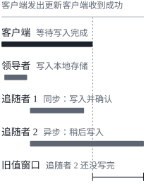
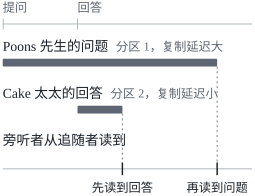
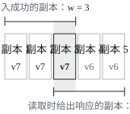

这是 DDIA 读书笔记的第五篇。前四章是全书的第一部分，讲的都是数据存在一台机器上时的事情，[第四篇](/posts/ddia-04/)讲完编码与演化，第一部分就结束了。从第五章起是第二部分“分布式数据”，问题换成了：数据的存储和检索牵涉到多台机器时，会发生什么。这一篇先简单记一下第二部分的开头，再进入第五章：复制。文中的英文引文出自原书，其余是我自己的复述和整理。

## 分布式数据

想把一个数据库分布到多台机器上，通常出于这几个原因：

- **可扩展性**：数据量、读负载或写负载大到一台机器扛不住，就把负载分散到多台机器上；
- **容错和高可用**：一台机器（或者几台机器、网络、整个数据中心）出了问题，应用还要能继续工作，就用多台机器提供冗余，一台坏了，另一台顶上；
- **延迟**：用户遍布全世界，就在各地都放上服务器，让每个用户都由离自己近的数据中心服务，免得网络包绕半个地球。

### 共享内存、共享磁盘与无共享

要扛住更高的负载，最简单的办法是买一台更强的机器，也就是[第一篇](/posts/ddia-01/)说的垂直扩展。很多 CPU、内存条和磁盘接在同一个操作系统下面，任何 CPU 都能访问任何一块内存或磁盘，这叫**共享内存架构**（shared-memory architecture）。它的问题是成本涨得比线性还快：CPU、内存和磁盘都翻倍的机器，价格通常远不止翻倍；受各种瓶颈限制，两倍大的机器也不一定扛得住两倍的负载。高端机器的部件可以热插拔，能提供一点容错，但整台机器只能放在一个地方。

另一种是**共享磁盘架构**（shared-disk architecture）：几台机器各有自己的 CPU 和内存，数据存在它们共用的磁盘阵列上，通过高速网络连接（NAS 或 SAN）。有些数据仓库负载会用它，但争用和加锁的开销限制了它的可扩展性。

第二部分关注的是第三种，**无共享架构**（shared-nothing architecture），也就是水平扩展。运行数据库软件的每台机器或虚拟机叫一个**节点**（node），各自独立使用自己的 CPU、内存和磁盘，节点之间的协调全在软件层面、通过普通的网络完成。它不需要特殊的硬件，可以挑性价比最好的机器；还可以把数据分布到多个地理区域，降低用户的延迟，甚至挺过整个数据中心的损失。有了云上的虚拟机，不是 Google 那样的规模也用得上这种架构，小公司现在也能做多区域的分布式部署。

书里专门说明，挑这种架构来讲，不是因为它对所有场景都最好，而是因为它最需要应用开发者小心：数据分布在多个节点上，就有一系列约束和权衡，数据库没法神奇地把它们全藏起来。它常常给应用带来额外的复杂度，有时还限制了能用的数据模型。有些情况下，一个简单的单线程程序，性能会远远好过一个有上百个 CPU 核的集群。

### 复制与分区

数据分布到多个节点上，有两种常见的方式：

- **复制**（replication）：在几个不同的节点上（可能在不同的地方）保存同一份数据的副本。它提供冗余，一些节点不可用时，数据还能从别的节点读到，也能提高性能。这是第五章的主题；
- **分区**（partitioning）：把一个大数据库拆成较小的子集，叫**分区**，不同的分区可以放在不同的节点上，也叫**分片**（sharding）。这是第六章的主题。

两者是不同的机制，但常常一起用：数据库拆成几个分区，每个分区又在几个节点上各存一份副本。这两章之后，第 7 章讲事务，第 8、9 章讲分布式系统的根本局限。

## 为什么要复制

第五章开头引了道格拉斯·亚当斯的小说《基本无害》（*Mostly Harmless*）里的一句话：

> The major difference between a thing that might go wrong and a thing that cannot possibly go wrong is that when a thing that cannot possibly go wrong goes wrong it usually turns out to be impossible to get at or repair.

复制本来是为出错准备的后手，这一章却有不少篇幅在讲后手本身怎样出错。

复制就是在通过网络连接的几台机器上保存同一份数据的副本。想这样做，有这几个原因：

- 让数据在地理上离用户更近，降低延迟；
- 系统的一部分出了故障，整体还能继续工作，提高可用性；
- 增加能处理读请求的机器，提高读吞吐量。

这一章假设数据集小到每台机器都存得下一整份，存不下、必须拆开的情况留给第六章。

如果要复制的数据从来不变，复制就很简单：把数据往每个节点拷一次就完了。书里一句话点明了难处在哪里：

> All of the difficulty in replication lies in handling changes to replicated data.

在节点之间复制变更，流行的算法有三种：**单领导者**（single-leader）、**多领导者**（multi-leader）和**无领导者**（leaderless）复制。几乎所有分布式数据库都用其中的一种，它们各有利弊。复制还有很多要权衡的地方，比如用同步复制还是异步复制、怎样处理失效的副本。这些通常是数据库的配置项，各家的细节不同，但原理大体相通。

数据库的复制是个老话题，原理从 1970 年代起就没怎么变过，因为网络的基本约束一直没变。可在研究之外，很多开发者长期以为一个数据库只有一个节点，分布式数据库成为主流是比较晚近的事。所以很多应用开发者对复制还不熟，最终一致性这样的概念也常被误解。这一章后面会把它讲得更准确一些，并介绍读己之写、单调读这样的保证。

## 领导者与追随者

存着一份数据库副本的节点叫**副本**（replica）。有了多个副本，马上就有一个问题：怎样保证所有数据都到了所有副本上？每次写入都要被每个副本处理，否则副本里的数据就不再相同。最常见的解法是**基于领导者的复制**（leader-based replication），也叫主动/被动（active/passive）复制或主从复制：

1. 其中一个副本被指定为**领导者**（leader，也叫 master 或 primary）。客户端要写数据库，必须把请求发给领导者，领导者先把新数据写进自己的本地存储；
2. 其他副本叫**追随者**（follower，也叫只读副本、slave、secondary 或热备）。领导者每写入一次新数据，就把这次数据变更作为**复制日志**（replication log）或**变更流**（change stream）的一部分发给所有追随者。每个追随者从领导者那里取到日志，按领导者处理写入的同一顺序，把所有写入应用到自己的本地副本上；
3. 客户端读数据时，可以查领导者，也可以查任何一个追随者；但只有领导者接受写入，在客户端看来，追随者是只读的。

很多关系数据库都内置了这种复制，比如 PostgreSQL（从 9.0 版起）、MySQL、Oracle Data Guard 和 SQL Server 的 AlwaysOn 可用性组；一些非关系数据库也用它，比如 MongoDB、RethinkDB 和 Espresso。它也不限于数据库：Kafka 这样的分布式消息代理、RabbitMQ 的高可用队列都用它，一些网络文件系统和 DRBD 这样的复制块设备也类似。

### 同步复制与异步复制

复制系统有一个重要的细节：复制是**同步**（synchronous）的还是**异步**（asynchronous）的。关系数据库里这通常是一个配置项，别的系统则常常写死了其中一种。

书里的例子是用户更新头像：客户端把请求发给领导者，领导者收到后把数据变更转发给追随者，最后告诉客户端更新成功。假设有两个追随者：领导者要等追随者 1 确认收到了写入，才向用户报告成功，追随者 1 就是同步的；领导者把变更发给追随者 2 就不管了，不等它的回应，追随者 2 就是异步的。

正常情况下复制相当快，大多数数据库系统不到一秒就能把变更应用到追随者上，但没有任何保证。追随者可能落后领导者好几分钟甚至更久：它可能正在从故障中恢复，系统可能接近满负荷，节点之间的网络也可能出了问题。

同步复制的好处是，追随者保证有一份和领导者一致的最新数据，领导者突然失效，数据在追随者上还在。坏处是，同步的追随者一旦没有回应（崩溃了、网络出了故障，或者别的什么原因），写入就没法处理：领导者必须阻塞所有写入，等那个同步副本恢复。

所以让所有追随者都同步是不现实的，任何一个节点出故障都会让整个系统停下来。实践中，在数据库上启用同步复制，通常意味着一个追随者是同步的，其余是异步的；这个同步追随者不可用或者变慢了，就把一个异步追随者改成同步的。这样至少有两个节点（领导者和一个同步追随者）有最新的数据。这种配置有时叫**半同步**（semi-synchronous）。

基于领导者的复制也常常配置成完全异步。这时领导者一旦失效且无法恢复，所有还没复制到追随者的写入都会丢失：一次写入即使已经向客户端确认过，也不保证持久。好处是即使所有追随者都落后了，领导者也能继续处理写入。削弱持久性听起来是个糟糕的交换，但异步复制用得仍然很广，追随者很多或者分布在不同地方的时候尤其如此。

异步复制丢数据是个严重的问题，研究者一直在找不丢数据、性能和可用性又好的复制方法。比如**链式复制**（chain replication）就是同步复制的一个变种：写入从链头沿着一串节点依次往下传，传到链尾才算完成。它已经在 Microsoft Azure Storage 等少数系统里成功实现。复制的一致性和**共识**（consensus，让几个节点就某个值达成一致）关系很深，第 9 章会再讲。

### 设置新的追随者

有时需要加新的追随者，比如增加副本的数量，或者替换坏掉的节点。怎样保证新追随者拿到的是领导者数据的准确副本？

直接把数据文件从一个节点拷到另一个节点通常不够：客户端一直在写，数据总在变，拷出来的文件里，不同的部分是不同时刻的样子。可以锁住数据库，暂时不让写，但这违背了高可用的目标。好在通常不用停机也能做到：

1. 在某个时刻给领导者的数据库拍一个一致的快照，最好不用锁住整个数据库。大多数数据库为了备份本来就有这个功能，有时要借助第三方工具，比如 MySQL 的 innobackupex；
2. 把快照拷到新的追随者节点上；
3. 追随者连上领导者，请求快照之后发生的所有数据变更。这要求快照能对应到领导者复制日志里的一个确切位置，这个位置在 PostgreSQL 里叫**日志序列号**（log sequence number，LSN），在 MySQL 里叫 **binlog 坐标**（binlog coordinates）；
4. 追随者处理完快照之后积压的变更，就算**赶上**（caught up）了领导者，此后可以继续处理领导者那边新发生的数据变更。

具体步骤因数据库而异，有的系统全自动，有的要管理员手工走一套相当晦涩的多步流程。

### 处理节点宕机

系统里任何节点都可能宕机，可能是因为故障，也可能是因为计划内的维护（比如重启机器装内核安全补丁）。能在不停机的情况下重启单个节点，对运维是很大的好处。目标是让整个系统在单个节点失效时继续运行，把节点宕机的影响降到最小。

#### 追随者失效：追赶恢复

每个追随者都在本地磁盘上记着从领导者收到的数据变更日志。追随者崩溃重启，或者和领导者之间的网络暂时断了，恢复起来都很容易：从日志里就知道故障前处理的最后一个事务是哪个，于是连上领导者，请求断开期间的所有数据变更，应用完就赶上了。这叫**追赶恢复**（catch-up recovery）。

#### 领导者失效：故障转移

领导者失效要麻烦得多：得把一个追随者提升为新的领导者，客户端要改成把写入发给新领导者，其他追随者要改成从新领导者那里接收数据变更。这个过程叫**故障转移**（failover）。

故障转移可以手动做（管理员收到领导者失效的通知，动手建立新的领导者），也可以自动做。自动故障转移通常分三步：

1. **确认领导者已经失效**。可能出问题的地方很多：崩溃、断电、网络问题等等，没有万无一失的检测办法，大多数系统干脆用超时：节点之间频繁地互发消息，一个节点在一段时间内（比如 30 秒）没有回应，就认为它死了。（计划内的维护主动下线领导者时，不走这一步。）
2. **选出新的领导者**。可以通过选举（由剩下副本里的多数选出新领导者），也可以由事先选出的**控制器节点**（controller node）指定。最好的人选通常是拥有领导者最新数据的那个副本，这样丢的数据最少。让所有节点就新领导者达成一致，是一个共识问题，第 9 章细讲。
3. **让系统改用新的领导者**。客户端要把写请求发给新领导者（第 6 章讲请求路由时会谈到怎么做）。旧领导者如果回来了，可能还以为自己是领导者，不知道其他副本已经让它下台；系统要保证它变成追随者，承认新的领导者。

故障转移的每一步都可能出错：

- 用异步复制时，新领导者可能还没收到旧领导者失效前的全部写入。新领导者选出来之后，旧领导者又回到集群里，那些写入怎么办？新领导者在此期间可能已经收到了冲突的写入。最常见的办法是直接丢掉旧领导者没复制出去的写入，这可能违背客户端对持久性的预期。
- 数据库之外还有别的存储系统要和数据库的内容保持一致时，丢写入尤其危险。书里举了 GitHub 的一次事故：一个落后的 MySQL 追随者被提升为领导者。数据库用自增计数器给新行分配主键，新领导者的计数器落后于旧领导者，于是重用了一些旧领导者已经分配出去的主键。这些主键同时也用在一个 Redis 存储里，主键重用让 MySQL 和 Redis 的数据对不上了，结果一些私人数据被泄露给了错误的用户。
- 在某些故障情况下（第 8 章），可能出现两个节点都认为自己是领导者的情况，叫**脑裂**（split brain）。两个领导者都接受写入，又没有解决冲突的机制，数据很可能丢失或损坏。作为一道保险，有些系统在检测到两个领导者时会关掉其中一个，这种做法有时叫**隔离**（fencing），说得更直白一点叫 STONITH（Shoot The Other Node In The Head）。可这个机制要是设计得不仔细，最后可能两个节点都被关掉。
- 宣布领导者死亡之前，超时设多长才对？超时越长，领导者失效时恢复得越慢；超时太短，又会有不必要的故障转移。比如一次临时的负载高峰可能让节点的响应时间超过超时，一次网络抖动也可能让数据包延迟。系统本来就在高负载或网络问题里挣扎，不必要的故障转移只会让情况更糟。

这些问题都没有简单的解法。所以即使软件支持自动故障转移，有些运维团队还是宁愿手动做。节点失效、不可靠的网络、副本一致性与持久性、可用性和延迟之间的权衡，都是分布式系统的根本问题，第 8、9 章会深入讨论。

### 复制日志的实现

基于领导者的复制，在底层是怎么做的？实践中用到的有几种方法。

#### 基于语句的复制

最简单的做法是，领导者把它执行的每个写请求（**语句**）记下来，把这份语句日志发给追随者。对关系数据库来说，就是把每条 INSERT、UPDATE 或 DELETE 语句转发给追随者，每个追随者像收到客户端的请求那样，解析并执行这条 SQL 语句。

听起来很合理，但有几种情况会让复制出问题：

- 调用了非确定性函数的语句，比如用 `NOW()` 取当前时间、用 `RAND()` 取随机数，在每个副本上很可能得到不同的值；
- 用了自增列的语句，或者依赖数据库里现有数据的语句（比如 `UPDATE … WHERE <某个条件>`），必须在每个副本上按完全相同的顺序执行，否则效果可能不同。有多个事务并发执行时，这会成为限制；
- 有副作用的语句（触发器、存储过程、用户自定义函数），除非副作用是完全确定的，否则在每个副本上可能产生不同的副作用。

这些问题也能绕过去，比如领导者在记录语句时，把非确定性的函数调用换成它确定的返回值，所有追随者就拿到同一个值。但边界情况实在太多，现在一般更愿意用别的复制方法。

MySQL 在 5.1 版之前用的就是基于语句的复制。它很紧凑，所以今天有时还在用，但书里说，MySQL 现在默认会在语句有任何不确定性时改用基于行的复制[^binlog]。VoltDB 也用基于语句的复制，它要求事务必须是确定的，以此保证安全。

#### 传输预写日志

[第三篇](/posts/ddia-03/)讲过，存储引擎通常把每次写入都追加到一份日志里：

- 日志结构的存储引擎（SSTable 和 LSM 树），日志本身就是主要的存储，日志段在后台压实、做垃圾回收；
- 原地覆盖磁盘块的 B 树，每次修改都先写进预写日志，崩溃后靠它把索引恢复到一致的状态。

不管哪种，日志都是一个只追加的字节序列，包含了对数据库的所有写入。那就可以用同一份日志在另一个节点上建一个副本：领导者除了把日志写到磁盘，还通过网络把它发给追随者；追随者处理这份日志，就建出了和领导者完全相同的数据结构。PostgreSQL 和 Oracle 等数据库用的就是这种**传输预写日志**（WAL shipping）的做法。

它的主要缺点是日志描述数据的层次很低：预写日志记的是哪些磁盘块里的哪些字节被改了。这让复制和存储引擎紧紧绑在一起，数据库的存储格式一旦随版本改变，通常就没法让领导者和追随者运行不同版本的数据库软件。

这看起来像个实现细节，对运维的影响却很大。如果复制协议允许追随者运行比领导者新的软件版本，就可以先升级追随者，再做一次故障转移，让一个升级过的节点当新领导者，从而实现数据库软件的零停机升级。如果复制协议不允许版本不一致（传输预写日志常常如此），这样的升级就要停机。

#### 逻辑日志复制

另一种办法是给复制和存储引擎用不同的日志格式，把复制日志和存储引擎的内部实现解耦。这种复制日志叫**逻辑日志**（logical log），以区别于存储引擎（物理的）数据表示。

关系数据库的逻辑日志，通常是一串以行为粒度描述表写入的记录：

- 插入一行，日志里有所有列的新值；
- 删除一行，日志里有能唯一标识这一行的信息，通常是主键；表没有主键时，就要记下所有列的旧值；
- 更新一行，日志里有能唯一标识这一行的信息，以及所有列的新值（至少是所有改过的列的新值）。

修改了多行的事务会产生多条这样的记录，后面再跟一条表示事务已提交的记录。MySQL 的 binlog 配置成基于行的复制时，用的就是这种做法。

逻辑日志和存储引擎的内部解耦，所以更容易保持向后兼容，领导者和追随者可以运行不同版本的数据库软件，甚至用不同的存储引擎。它对外部应用来说也更容易解析：可以把数据库的内容发给外部系统，比如发到数据仓库做离线分析，或者用来建自定义的索引和缓存。这种技术叫**变更数据捕获**（change data capture），第 11 章还会讲。

#### 基于触发器的复制

前面几种复制都由数据库系统自己完成，不涉及应用代码，很多时候这正是想要的。但有些情况需要更多的灵活性：比如只想复制一部分数据，或者想从一种数据库复制到另一种数据库，或者需要冲突解决的逻辑（见后面的“处理写冲突”）。这时可能就要把复制挪到应用层去做。

有些工具（比如 Oracle GoldenGate）可以读数据库的日志，把数据变更交给应用。另一种办法是利用很多关系数据库都有的**触发器**（trigger）和存储过程。触发器让你注册一段自定义的应用代码，数据库里发生数据变更（写事务）时自动执行。触发器可以把这次变更记到一张单独的表里，由外部进程从这张表里读出变更，执行必要的应用逻辑，再把数据变更复制到另一个系统。Oracle 的 Databus 和 Postgres 的 Bucardo 就是这样工作的。

基于触发器的复制通常比其他复制方法开销大，也比数据库内置的复制更容易出 bug、限制更多。不过它灵活，所以仍然有用武之地。

## 复制延迟的问题

能容忍节点失效只是想要复制的原因之一，另外两个是可扩展性（处理一台机器处理不了的请求量）和延迟（把副本放得离用户近一些）。

基于领导者的复制要求所有写入都经过一个节点，但只读的查询可以发给任何副本。对于大部分是读、只有一小部分是写的负载（Web 上很常见），一个诱人的做法是建很多追随者，把读请求分给它们：既减轻了领导者的负担，又能让离用户近的副本来服务读请求。

在这种**读扩展**（read-scaling）的架构里，只要加追随者，就能提高处理只读请求的能力。但它实际上只能用异步复制：如果同步复制到所有追随者，任何一个节点失效或者网络中断，整个系统都没法写入。节点越多，有节点宕机的可能就越大，完全同步的配置会非常不可靠。

可从异步的追随者读数据，追随者要是落后了，读到的就可能是过时的信息。同一时刻在领导者和追随者上执行同一个查询，可能得到不同的结果，因为不是所有写入都已经反映到了追随者上。这种不一致只是暂时的：停止写入，等一会儿，追随者最终会赶上来，和领导者一致。这叫**最终一致性**（eventual consistency）[^eventual]。

“最终”这个词是故意含糊的：一般来说，副本能落后多远并没有上限。正常运行时，从写入领导者到反映在追随者上，中间的**复制延迟**（replication lag）可能只有几分之一秒，实际中察觉不到。可系统接近满负荷，或者网络出了问题，延迟很容易涨到几秒甚至几分钟。

延迟这么大的时候，它带来的不一致就不只是理论问题，而是应用实实在在的问题了。书里举了三个例子。

### 读己之写

很多应用让用户提交一些数据，然后查看自己提交的内容，比如客户数据库里的一条记录，或者讨论帖里的一条评论。新数据必须发给领导者，用户查看时却可能从追随者读。数据经常被看、只是偶尔被写的时候，这样做尤其合适。

异步复制在这里有个问题：用户写完马上去看，新数据可能还没到达他读的那个副本。在用户看来，好像刚提交的数据丢了，难怪会不高兴。

这时需要的是**写后读一致性**（read-after-write consistency），也叫**读己之写**（read-your-writes）：用户重新加载页面，总能看到自己提交过的更新。它不对其他用户作承诺，别人的更新可能要过一会儿才看得到，但它让用户确信自己的输入已经正确保存了。

在基于领导者的复制系统里，有几种实现办法：

- 读用户可能改过的东西时，从领导者读，其他的从追随者读。这要有办法不经查询就知道某个东西可能被改过。比如社交网络上的个人资料通常只有本人能编辑，一个简单的规则就是：用户自己的资料总从领导者读，别人的资料从追随者读；
- 应用里大部分东西都可能被用户编辑时，上面的办法就不管用了，大多数东西都得从领导者读，读扩展的好处也就没了。这时可以用别的标准，比如记下最后一次更新的时间，更新后一分钟内的读都走领导者；也可以监控追随者的复制延迟，不让落后领导者一分钟以上的追随者处理查询；
- 客户端记住自己最近一次写入的时间戳，系统保证为这个用户服务读请求的副本，至少已经反映了到这个时间戳为止的更新。副本不够新，就换一个副本读，或者等它赶上来。时间戳可以是**逻辑时间戳**（表示写入先后顺序的东西，比如日志序列号），也可以是实际的系统时钟，后者让时钟同步变得至关重要（第 8 章）；
- 副本分布在多个数据中心时（为了离用户近或者为了可用性），还有额外的复杂性：凡是需要由领导者服务的请求，都要路由到领导者所在的数据中心。

同一个用户从多个设备访问服务时，比如电脑上的浏览器和手机上的应用，又多了一层麻烦。这时需要的是**跨设备**的写后读一致性：用户在一个设备上输入了信息，到另一个设备上也应该看得到。要考虑的问题有：

- 记住用户最后一次更新的时间戳更难了，因为一个设备上的代码不知道另一个设备上发生过什么更新，这些元数据需要集中存放；
- 副本分布在不同的数据中心时，不能保证不同设备的连接会被路由到同一个数据中心（比如电脑走家里的宽带，手机走蜂窝网络，两者的网络路由可能完全不同）。如果办法要求从领导者读，可能得先把同一个用户所有设备的请求都路由到同一个数据中心。

### 单调读

第二个例子是用户看到时间倒流。用户从不同的副本读了好几次，就可能出现这种情况。

比如用户 2345 把同一个查询做了两次，第一次发到一个延迟很小的追随者，第二次发到一个延迟较大的追随者（用户刷新网页，每个请求随机路由到某台服务器，这种情况就很可能发生）。第一次查询返回了用户 1234 刚加的一条评论，第二次却什么都没返回，因为落后的追随者还没收到这次写入。第二次查询看到的，其实是比第一次更早的系统状态。要是第一次也什么都没返回，问题还不大，用户 2345 大概根本不知道有这条评论；可评论先出现、又消失，就让人非常困惑了。

**单调读**（monotonic reads）保证不会出现这种异常。它比强一致性弱，但比最终一致性强：读数据时可能看到旧值，单调读只保证同一个用户按顺序读好几次时，不会看到时间倒流，也就是读到较新的数据之后，不会再读到较旧的数据。

一种实现办法是让每个用户总从同一个副本读（不同的用户可以从不同的副本读），比如按用户 ID 的哈希选副本，而不是随机选。不过那个副本要是失效了，用户的查询还得重新路由到别的副本。

### 一致前缀读

第三个例子违反的是因果关系。书里用的是 Poons 先生和 Cake 太太的一段对话。Poons 先生问：“Cake 太太，您能看到多远的未来？”Cake 太太答：“通常是十秒左右，Poons 先生。”

两句话之间有因果关系：Cake 太太是听到问题之后才回答的。现在假设有第三个人通过追随者旁听这段对话。Cake 太太说的话经过一个延迟很小的追随者，Poons 先生说的话却经过一个延迟较大的追随者，旁听者就会先听到回答、再听到问题，好像 Cake 太太在 Poons 先生开口之前就答上了。这种未卜先知的本事固然了不起，却让人一头雾水。

防止这种异常需要另一种保证，叫**一致前缀读**（consistent prefix reads）：一系列写入按某个顺序发生，任何人读这些写入，看到的也是同样的顺序。

这在分区（分片）的数据库里尤其是个问题。如果数据库总以同样的顺序应用写入，读到的总是一个一致的前缀，这种异常就不会发生。可在很多分布式数据库里，不同的分区各自独立运作，写入没有全局的顺序：读数据库时，可能看到一部分处于较旧的状态，另一部分处于较新的状态。

一种解法是保证有因果关系的写入都写进同一个分区，但有些应用没法高效地做到这一点。还有一些算法会显式地追踪因果依赖，后面讲“先于”关系的时候会提到。

### 复制延迟的解决办法

用最终一致的系统时，值得想一想：复制延迟涨到几分钟甚至几个小时，应用会怎样？如果答案是“没问题”，那很好；如果用户体验会很糟，就要把系统设计得能提供更强的保证，比如写后读一致性。书里有一句话说得很直白：

> Pretending that replication is synchronous when in fact it is asynchronous is a recipe for problems down the line.

应用可以提供比底层数据库更强的保证，比如让某些读请求走领导者。但在应用代码里处理这些问题很复杂，也很容易出错。要是应用开发者不必操心这些微妙的复制问题，只要相信数据库会“做正确的事”就好了。这正是**事务**存在的原因：它是数据库提供更强保证的一种方式，让应用可以更简单。

单节点上的事务已经存在很久了。可在转向分布式（复制和分区的）数据库时，很多系统抛弃了事务，说事务的性能和可用性代价太高，在可扩展的系统里最终一致性不可避免。这话有几分道理，但过于简单化，书的后面会形成更细致的看法：第 7 章和第 9 章回到事务，第三部分再讨论一些别的机制。

## 多领导者复制

基于领导者的复制有一个大缺点：只有一个领导者，所有写入都得经过它[^partition-leader]。因为任何原因连不上领导者（比如你和领导者之间的网络断了），就没法写数据库。

一个自然的扩展是允许多个节点接受写入。复制的方式不变：每个处理写入的节点，都要把数据变更转发给所有其他节点。这叫**多领导者**（multi-leader）配置，也叫主主复制（master-master）或主动/主动复制（active/active）。在这种设置里，每个领导者同时也是其他领导者的追随者。

### 多领导者复制的适用场景

在一个数据中心里用多领导者，几乎总是得不偿失，好处抵不上增加的复杂度。但在几种情况下它是合理的。

#### 多数据中心

假设数据库的副本分布在几个不同的数据中心里（也许是为了容忍整个数据中心失效，也许是为了离用户更近）。用普通的基于领导者的复制，领导者只能在其中一个数据中心，所有写入都要经过那个数据中心。

多领导者配置可以在每个数据中心各放一个领导者：每个数据中心内部是普通的领导者–追随者复制，数据中心之间，由各自的领导者把自己数据中心的变更复制给其他数据中心的领导者。

在多数据中心的部署里，两种配置的比较：

| | 单领导者 | 多领导者 |
| --- | --- | --- |
| 性能 | 每次写入都要经过互联网，到达领导者所在的数据中心，可能大大增加写入延迟，违背了建多个数据中心的初衷 | 每次写入都在本地数据中心处理，再异步复制到其他数据中心，用户感觉不到数据中心之间的网络延迟 |
| 容忍数据中心宕机 | 领导者所在的数据中心失效，要做故障转移，把另一个数据中心的追随者提升为领导者 | 每个数据中心都能独立于其他数据中心继续运行，失效的数据中心恢复后，复制再赶上来 |
| 容忍网络问题 | 数据中心之间的流量通常走公共互联网，不如数据中心内部的本地网络可靠；写入要同步地经过这条链路，所以对它的问题非常敏感 | 异步复制通常能更好地容忍网络问题，临时的网络中断不会妨碍写入 |

有些数据库默认就支持多领导者配置，但它也常常用外部工具实现，比如 MySQL 的 Tungsten Replicator、PostgreSQL 的 BDR 和 Oracle 的 GoldenGate。

多领导者的好处很多，但也有个大缺点：同一份数据可能在两个数据中心被同时修改，这些**写冲突**必须解决（见下面的“处理写冲突”）。而且在很多数据库里，多领导者复制是后来加上去的功能，常常有微妙的配置陷阱，和数据库的其他功能（比如自增键、触发器、完整性约束）放在一起时也会出意想不到的问题。所以多领导者复制常被看作应该尽量避开的危险地带。

#### 离线工作的客户端

另一种情况是应用断网时也要能继续工作。比如手机、笔记本电脑和其他设备上的日历应用：不管设备当下有没有网络，都要能随时查看会议（读请求）、添加新会议（写请求）。离线时做的修改，要在设备下次联网时和服务器、其他设备同步。

这时每个设备都有一个充当领导者的本地数据库（它接受写请求），所有设备上的日历副本之间，有一个异步的多领导者复制过程（也就是同步）。复制延迟可能是几小时甚至几天，取决于什么时候能上网。

从架构上看，这和数据中心之间的多领导者复制本质上一样，只是走到了极端：每个设备都是一个“数据中心”，它们之间的网络连接极不可靠。日历同步做坏了的例子层出不穷，可见多领导者复制很难做对。有一些工具想让这种多领导者配置更容易，比如 CouchDB 就是为这种工作方式设计的。

#### 协同编辑

**实时协同编辑**的应用让好几个人同时编辑一份文档，比如 Etherpad 和 Google Docs。我们通常不把协同编辑看成数据库复制问题，但它和离线编辑的情况有很多共同之处：一个用户编辑文档时，修改立即应用到他的本地副本上（浏览器或客户端应用里的文档状态），再异步地复制到服务器和正在编辑同一文档的其他用户那里。

要保证不会有编辑冲突，应用必须在用户编辑之前给文档加锁，另一个用户想编辑，就得等第一个用户提交修改、释放锁。这种协作模式相当于单领导者复制，再加上领导者上的事务。可为了协作得更快，可能希望修改的单位非常小（比如一次按键），并且不加锁。这让多个用户可以同时编辑，但也带来了多领导者复制的所有难题，包括要解决冲突。

### 处理写冲突

多领导者复制最大的问题是会出现写冲突，所以需要冲突解决。

比如一个 wiki 页面同时被两个用户编辑：用户 1 把页面标题从 A 改成 B，用户 2 同时把它从 A 改成 C。每个用户的修改都成功应用到了各自的本地领导者上，可等到修改被异步复制过去，就发现了冲突。单领导者的数据库不会有这个问题。

#### 同步与异步的冲突检测

在单领导者数据库里，第二个写者要么阻塞，等第一个写入完成，要么被中止，让用户重试。多领导者的设置里，两个写入都成功了，冲突要到之后某个时刻才被异步地检测出来，那时再让用户解决冲突，可能已经太晚了。

原则上也可以让冲突检测同步进行：等写入复制到所有副本之后，才告诉用户写入成功。但这样就失去了多领导者复制的主要好处，也就是让每个副本独立地接受写入。要同步检测冲突，还不如直接用单领导者复制。

#### 避免冲突

处理冲突最简单的策略是避免冲突：只要应用能保证某条记录的所有写入都经过同一个领导者，冲突就不会发生。很多多领导者复制的实现处理冲突的能力都很差，所以避免冲突常常是推荐的做法。

比如在用户编辑自己数据的应用里，可以保证同一个用户的请求总是路由到同一个数据中心，读写都用那个数据中心的领导者。不同的用户可以有不同的“归属”数据中心（也许按地理上离谁近来选），但从任何一个用户的角度看，这个配置本质上还是单领导者的。

但有时需要改变某条记录的指定领导者，比如一个数据中心失效了，要把流量重新路由到另一个数据中心；或者用户搬到了别的地方，离另一个数据中心更近了。这时避免冲突就不灵了，必须面对不同领导者上并发写入的可能。

#### 收敛到一致的状态

单领导者的数据库按顺序应用写入：同一个字段有好几次更新，最后一次写入决定它的最终值。多领导者的配置里，写入没有确定的顺序，最终值应该是什么就不清楚了。在 wiki 的例子里，领导者 1 上标题先变成 B 再变成 C，领导者 2 上先变成 C 再变成 B，哪个顺序都不比另一个“更正确”。

如果每个副本只是按自己看到的顺序应用写入，数据库最终会处于不一致的状态：领导者 1 上是 C，领导者 2 上是 B。这是不能接受的，任何复制方案都必须保证所有副本上的数据最终相同。所以数据库必须以**收敛**（convergent）的方式解决冲突：所有变更都复制完以后，所有副本都得到同一个最终值。实现收敛的冲突解决，有几种办法：

- 给每次写入一个唯一的 ID（比如时间戳、一个很长的随机数、UUID，或者键和值的哈希），挑 ID 最大的写入作为胜者，其余的丢掉。用时间戳时，这种做法叫**最后写入胜出**（last write wins，LWW）。它很流行，但很容易丢数据；
- 给每个副本一个唯一的 ID，规定来自编号较大的副本的写入总是优先。这同样意味着丢数据；
- 想办法把几个值合并起来，比如按字母顺序排好再拼接（wiki 的例子里，合并后的标题可能是“B/C”）；
- 用一个显式的数据结构记下冲突，保留所有信息，再写应用代码在之后某个时候解决冲突（也许是提示用户）。

#### 自定义的冲突解决逻辑

最合适的解决办法往往取决于应用，所以大多数多领导者复制工具都允许用应用代码写冲突解决的逻辑。这段代码可能在写入时执行，也可能在读取时执行：

- **写入时**：数据库系统一在复制过来的变更日志里检测到冲突，就调用冲突处理程序。比如 Bucardo 允许为此写一段 Perl 代码。这种处理程序通常不能提示用户，它在后台进程里运行，必须执行得很快；
- **读取时**：检测到冲突时，把所有冲突的写入都存下来，下次读这份数据时，把这几个版本都返回给应用。应用可以提示用户，或者自动解决冲突，再把结果写回数据库。CouchDB 就是这样工作的。

注意，冲突解决通常作用于单独的一行或一个文档，而不是整个事务。一个事务原子地做了好几处写入（第 7 章），在冲突解决时，每处写入仍然是分开考虑的。

#### 自动冲突解决

冲突解决的规则很快就会变得复杂，自定义的代码也容易出错。亚马逊是一个常被引用的例子：有段时间，购物车的冲突解决逻辑会保留加进购物车的商品，却不保留从购物车里删掉的商品，于是顾客有时会看到删掉的商品又回到了购物车里。

有一些研究在探索怎样自动解决并发修改数据造成的冲突：

| 方向 | 做法 |
| --- | --- |
| 无冲突复制数据类型（conflict-free replicated datatypes，CRDT） | 一族可以被多个用户并发编辑的数据结构，包括集合、映射、有序列表、计数器等，能以合理的方式自动解决冲突。Riak 2.0 实现了其中的一些 |
| 可合并的持久数据结构（mergeable persistent data structures） | 像 Git 那样显式地追踪历史，用三方合并函数（CRDT 用的是两方合并） |
| 操作变换（operational transformation，OT） | Etherpad 和 Google Docs 这类协同编辑应用背后的冲突解决算法，专门为并发编辑有序列表（比如构成文本文档的字符列表）设计 |

书写作的时候，这些算法在数据库里的实现还很年轻，但它们很可能会被集成到更多的复制数据系统里。自动冲突解决可以让应用处理多领导者的数据同步简单得多。

#### 什么算冲突

有些冲突一目了然，比如 wiki 的例子里，两个写入并发地修改了同一条记录的同一个字段，把它设成了两个不同的值。

有些冲突就隐蔽得多。比如一个会议室预订系统，记录哪个房间在什么时间被哪组人预订了。应用要保证同一个房间在同一时间只被一组人预订，也就是同一个房间的预订不能重叠。这时，如果同一个房间同一时段有了两个不同的预订，就是冲突。即使应用在允许预订之前先检查了房间是否空闲，两个预订分别在两个领导者上进行时，照样会冲突。

这个问题没有现成的速效答案，第 7 章会看到更多冲突的例子，第 12 章再讨论在复制系统里检测和解决冲突的可扩展方法。

### 多领导者复制的拓扑

**复制拓扑**（replication topology）描述的是写入从一个节点传播到另一个节点的通信路径。只有两个领导者时，拓扑只有一种：领导者 1 把所有写入发给领导者 2，反过来也一样。领导者超过两个，就有好几种可能的拓扑：

- **全对全**（all-to-all）：每个领导者把自己的写入发给其他所有领导者，这是最一般的拓扑；
- **环形**（circular）：每个节点从一个节点接收写入，再把这些写入（加上它自己的写入）转发给另一个节点。MySQL 默认只支持环形拓扑；
- **星形**（star）：由一个指定的根节点把写入转发给其他所有节点。星形可以推广成树形。

在环形和星形拓扑里，一次写入可能要经过好几个节点才能到达所有副本，所以节点要转发从其他节点收到的数据变更。为了防止无限的复制循环，每个节点都有一个唯一的标识，复制日志里的每次写入都标记着它经过的所有节点的标识。一个节点收到带着自己标识的数据变更，就知道这个变更已经处理过，直接忽略。

环形和星形拓扑的问题是，只要一个节点失效，就可能中断其他节点之间的复制消息流，直到这个节点修好为止。可以重新配置拓扑，绕开失效的节点，但在大多数部署里这得手动做。连接更密的拓扑（比如全对全）容错性更好，消息可以沿不同的路径传播，避免了单点故障。

不过全对全拓扑也有它的问题：有些网络链路可能比别的快（比如因为网络拥塞），一些复制消息可能会“超车”。比如客户端 A 在领导者 1 上往表里插入一行，客户端 B 在领导者 3 上更新这一行，领导者 2 收到这两个写入的顺序却可能反过来：先收到更新（在它看来，是在更新一个数据库里不存在的行），后收到对应的插入（本应在更新之前）。

这是一个因果性的问题，和一致前缀读里的问题类似：更新依赖于之前的插入，所以要保证所有节点都先处理插入，再处理更新。只给每次写入附上时间戳是不够的，因为没法保证各个时钟同步到足以在领导者 2 上正确排出这两个事件的顺序（第 8 章）。

要给这些事件正确地排序，可以用一种叫**版本向量**（version vectors）的技术，这一章后面会讲。但很多多领导者复制系统的冲突检测都实现得很差。比如在书写作的时候，PostgreSQL BDR 不提供写入的因果排序，MySQL 的 Tungsten Replicator 甚至不尝试检测冲突。

用多领导者复制的系统，值得了解这些问题，仔细读文档，并彻底测试数据库，确认它真的提供了你以为它提供的保证。

## 无领导者复制

前面讲的单领导者和多领导者复制，都基于同一个想法：客户端把写请求发给一个节点（领导者），由数据库系统负责把这次写入复制到其他副本。领导者决定写入按什么顺序处理，追随者按同样的顺序应用领导者的写入。

有些数据存储系统换了一种做法：抛弃领导者的概念，允许任何副本直接接受客户端的写入。最早的一些复制数据系统就是无领导者的，但在关系数据库称霸的年代，这个想法基本被遗忘了。亚马逊把它用在内部的 Dynamo 系统上之后，它又成了一种时髦的数据库架构[^dynamo]。Riak、Cassandra 和 Voldemort 都是受 Dynamo 启发、采用无领导者复制的开源数据存储，所以这类数据库也叫 **Dynamo 风格**（Dynamo-style）的数据库[^riak]。

在有些无领导者的实现里，客户端直接把写入发给几个副本；在另一些实现里，由一个**协调节点**（coordinator node）代表客户端去发。但和领导者不同，协调节点不强制写入的顺序。后面会看到，这个设计上的差别对数据库的使用方式影响深远。

### 节点宕机时写入数据库

假设一个数据库有三个副本，其中一个暂时不可用，也许正在重启安装系统更新。在基于领导者的配置里，要继续处理写入，可能需要故障转移。在无领导者的配置里，根本没有故障转移这回事：客户端（用户 1234）把写入并行地发给三个副本，两个可用的副本接受了写入，不可用的那个错过了它。假设三个副本里有两个确认了写入就够了：用户 1234 收到两个 ok 响应，就认为写入成功，至于有一个副本错过了这次写入，客户端直接忽略。

现在假设那个不可用的节点恢复了，客户端开始从它读数据。节点宕机期间发生的写入，它都没有，所以从它那里读，可能得到陈旧（过时）的值。

为了解决这个问题，客户端读数据库时，不只把请求发给一个副本，而是把读请求也并行地发给好几个节点。客户端可能从不同节点得到不同的响应，比如一个节点给的是最新值，另一个给的是陈旧的值，再靠**版本号**判断哪个值更新（见后面的“检测并发写入”）。

#### 读修复与反熵

复制方案应该保证所有数据最终都复制到每个副本上。一个不可用的节点恢复以后，怎样补上它错过的写入？Dynamo 风格的数据存储常用两种机制：

- **读修复**（read repair）：客户端并行地从几个节点读数据时，可以发现陈旧的响应。比如用户 2345 从副本 3 读到版本 6 的值，从副本 1 和 2 读到版本 7 的值，客户端就知道副本 3 的值是旧的，把新值写回这个副本。这种办法对经常被读的值很管用；
- **反熵**（anti-entropy）：有些数据存储还有一个后台进程，不断查找副本之间的数据差异，把缺的数据从一个副本拷到另一个副本。和基于领导者的复制里的复制日志不同，反熵过程不按任何特定的顺序复制写入，数据被拷过去之前可能有相当长的延迟。

不是所有系统都两种都实现，比如 Voldemort 当时就没有反熵过程。没有反熵过程，很少被读的值可能在某些副本上一直缺着，持久性因此降低，因为读修复只在应用读这个值的时候才会发生。

### 读写的法定人数

上面的例子里，写入只在三个副本中的两个上处理过，就被认为成功了。要是只有一个副本接受了写入呢？这个数能压到多低？

如果知道每次成功的写入都保证至少在三个副本中的两个上，那就意味着最多只有一个副本是陈旧的。所以只要至少从两个副本读，就能确定其中至少有一个是最新的。第三个副本宕机或者响应很慢，读请求照样能返回最新的值。

更一般地说，有 n 个副本，每次写入必须由 w 个节点确认才算成功，每次读至少要查询 r 个节点。（上面的例子里 n = 3，w = 2，r = 2。）只要 w + r > n，读的时候就能期望拿到最新的值，因为读的 r 个节点里，至少有一个必然是最新的。遵守这样的 r 和 w 值的读写，叫**法定人数**（quorum）读写[^strict]。可以把 r 和 w 看成读或写有效所需的最少票数。

Dynamo 风格的数据库里，参数 n、w、r 通常都可以配置。常见的选择是让 n 取奇数（通常是 3 或 5），w = r = (n + 1) / 2（向上取整）。但也可以按需要调整，比如写很少、读很多的负载，可以设 w = n、r = 1，这样读更快，坏处是只要有一个节点失效，所有写入都会失败[^n-nodes]。

法定人数条件 w + r > n，让系统可以这样容忍不可用的节点：

- w < n 时，有节点不可用，仍然能处理写入；
- r < n 时，有节点不可用，仍然能处理读取；
- n = 3、w = 2、r = 2 时，能容忍一个节点不可用；
- n = 5、w = 3、r = 3 时，能容忍两个节点不可用。

通常，读和写总是并行地发给全部 n 个副本，参数 w 和 r 决定的是要等多少个节点，也就是 n 个节点里要有多少个报告成功，才认为这次读或写成功了。

可用的节点少于所需的 w 或 r 个时，写或读就返回错误。节点不可用的原因有很多：宕机了（崩溃、断电），执行操作出错了（比如磁盘满了写不进去），客户端和节点之间的网络断了，等等。我们只关心节点有没有返回成功的响应，不需要区分是哪种故障。

### 法定人数一致性的局限

有 n 个副本，选的 w 和 r 满足 w + r > n，一般可以期望每次读都返回某个键最近写入的值，因为写入的节点集合和读取的节点集合必然有重叠，读的节点里至少有一个有最新的值。

r 和 w 常常取多数（多于 n/2），这样既能保证 w + r > n，又能容忍最多 n/2 个节点失效。但法定人数不一定非得是多数，只要读和写用的节点集合至少重叠一个节点就行。其他的分配方式也是可能的，这给分布式算法的设计留了一些灵活性。

也可以把 w 和 r 设得更小，使 w + r ≤ n，也就是不满足法定人数条件。这时读和写仍然发给 n 个节点，只是需要的成功响应更少。w 和 r 越小，越可能读到陈旧的值，因为读到的节点里更可能没有那个有最新值的节点。好处是延迟更低、可用性更高：网络中断导致很多副本连不上时，更有机会继续处理读写，只有可达的副本少于 w 个或 r 个，数据库才分别没法写或没法读。

不过，即使 w + r > n，也可能有一些边界情况会返回陈旧的值。具体取决于实现，可能的情况有：

1. 用了宽松的法定人数（见下一节），w 个写入可能落在和 r 个读取不同的节点上，读写的节点集合不再保证有重叠；
2. 两个写入并发发生，分不清哪个先发生。这时唯一安全的办法是合并并发的写入（见前面的“处理写冲突”）。如果按时间戳挑胜者（最后写入胜出），时钟偏差可能让写入丢失，后面的“检测并发写入”还会讲；
3. 写入和读取并发发生时，写入可能只反映在一部分副本上，读到的是旧值还是新值就说不准了；
4. 写入在一些副本上成功、在另一些副本上失败（比如有些节点的磁盘满了），总共成功的副本少于 w 个，已经成功的那些副本却不会回滚。也就是说，一次报告失败的写入，之后的读可能读到它的值，也可能读不到；
5. 一个带着新值的节点失效了，又从一个带着旧值的副本恢复数据，存着新值的副本数就可能跌到 w 以下，破坏了法定人数条件；
6. 即使一切正常，也可能有时机不凑巧的边界情况，第 9 章讲线性一致性和法定人数时会看到。

所以，法定人数看起来保证了读能返回最新写入的值，实践中却没那么简单。Dynamo 风格的数据库通常是为能容忍最终一致性的场景优化的。参数 w 和 r 可以调整读到陈旧值的概率，但明智的做法是别把它们当成绝对的保证。

尤其是，前面“复制延迟的问题”里讲的那些保证（读己之写、单调读、一致前缀读），在这里通常都得不到，那些异常在应用里照样可能发生。更强的保证一般需要事务或共识，第 7 章和第 9 章再讲。

#### 监控陈旧程度

从运维的角度看，监控数据库是否返回最新的结果很重要。即使应用能容忍陈旧的读，也要了解复制的健康状况：复制明显落后了，应该发出告警，好去调查原因（比如网络出了问题，或者某个节点过载）。

基于领导者的复制，数据库通常会暴露复制延迟的指标，可以接进监控系统。这之所以做得到，是因为写入在领导者和追随者上按同样的顺序应用，每个节点在复制日志里都有一个位置（在本地应用过的写入数）。用领导者的当前位置减去追随者的当前位置，就是复制延迟的量。

无领导者复制的系统里，写入没有固定的应用顺序，监控就更难。而且如果数据库只用读修复（没有反熵），一个值能有多旧就没有上限：一个值很少被读的话，陈旧副本返回的可能是很久以前的值。

已经有一些研究在测量无领导者复制的数据库里副本的陈旧程度，并根据参数 n、w、r 预测读到陈旧值的比例[^pbs]，可惜还没成为惯常的做法。书里觉得，最好把陈旧程度纳入数据库的标准指标：最终一致性是一种故意含糊的保证，但为了可操作性，要能把“最终”量化出来。

### 宽松的法定人数与提示移交

配置得当的法定人数，让数据库不用故障转移就能容忍单个节点失效；也能容忍单个节点变慢，因为请求不必等全部 n 个节点响应，w 个或 r 个节点响应了就可以返回。这些特点让无领导者复制的数据库很适合要求高可用、低延迟，又能容忍偶尔读到陈旧值的场景。

不过，前面描述的法定人数并没有做到它本可以做到的那么容错。一次网络中断很容易就把客户端和大量数据库节点隔开。这些节点其实还活着，别的客户端也许还连得上，可对被隔开的这个客户端来说，它们和死了没什么两样。这时剩下的可达节点很可能少于 w 个或 r 个，客户端凑不齐法定人数。

在一个大集群里（节点数明显多于 n），网络中断时，客户端很可能还能连上一些数据库节点，只是连不上为某个值凑齐法定人数所需的那些节点。这时数据库的设计者要做一个权衡：

- 凡是凑不齐 w 个或 r 个节点的请求，都返回错误？
- 还是照样接受写入，把它们写到一些可达、但不在这个值通常所在的 n 个节点之内的节点上？

后者叫**宽松的法定人数**（sloppy quorum）：读写仍然需要 w 个和 r 个成功的响应，但这些响应可以来自指定的 n 个“归属”节点之外的节点。打个比方，你把自己锁在了门外，可以去敲邻居家的门，问能不能在他家沙发上暂住一晚。

网络中断修复以后，一个节点替另一个节点临时接受的写入，都会被发回相应的“归属”节点，这叫**提示移交**（hinted handoff）。（等你找到了家门钥匙，邻居会客气地请你从沙发上起来，回自己家去。）

宽松的法定人数对提高写入的可用性特别有用：只要有任意 w 个节点可用，数据库就能接受写入。但这意味着即使 w + r > n，也不能确定读到的是某个键的最新值，因为最新值可能被临时写到了 n 个节点之外的一些节点上。

所以，宽松的法定人数其实根本不是传统意义上的法定人数。它只是一种持久性的保证，也就是数据存在某处的 w 个节点上；在提示移交完成之前，读 r 个节点并不保证能看到它。

在常见的 Dynamo 实现里，宽松的法定人数都是可选的：Riak 默认启用，Cassandra 和 Voldemort 默认不启用。

#### 多数据中心

前面把跨数据中心的复制当作多领导者复制的一个用例来讲。无领导者复制同样适合在多个数据中心里运行，因为它本来就是为了容忍冲突的并发写入、网络中断和延迟尖峰而设计的。

Cassandra 和 Voldemort 在普通的无领导者模型里实现多数据中心支持：副本数 n 包括所有数据中心里的节点，配置里可以指定每个数据中心各放 n 个副本中的几个。客户端的每次写入都发给所有副本，不管它在哪个数据中心，但客户端通常只等本地数据中心里的法定人数个节点确认，这样就不受跨数据中心链路上的延迟和中断影响。写到其他数据中心的高延迟写入，通常配置成异步进行，不过配置上有一定的灵活性。

Riak 则把客户端和数据库节点之间的通信都限制在一个数据中心里，所以 n 指的是一个数据中心之内的副本数。数据库集群之间的跨数据中心复制在后台异步进行，风格和多领导者复制类似。

### 检测并发写入

Dynamo 风格的数据库允许几个客户端并发地写同一个键，这意味着即使用了严格的法定人数，也会出现冲突。这和多领导者复制的情况类似，不过在 Dynamo 风格的数据库里，读修复和提示移交的过程中也可能出现冲突。

问题在于，由于网络延迟不定、局部失效，事件到达不同节点的顺序可能不同。比如两个客户端 A 和 B 同时写一个三节点数据存储里的键 X：

- 节点 1 收到了 A 的写入，但因为一次短暂的故障，一直没收到 B 的写入；
- 节点 2 先收到 A 的写入，再收到 B 的写入；
- 节点 3 先收到 B 的写入，再收到 A 的写入。

如果每个节点只是在收到写请求时直接覆盖这个键的值，节点之间就会永久地不一致：节点 2 认为 X 的最终值是 B，其他节点认为是 A。

为了做到最终一致，副本应该收敛到同一个值。它们怎样做到？也许你希望复制数据库能自动处理好，可惜大多数实现都做得相当差：想不丢数据，应用开发者就得对数据库处理冲突的内部机制了解很多。前面“处理写冲突”简单讲过一些冲突解决的技术，这一章结束之前，再更细地看看这个问题。

#### 最后写入胜出

实现最终收敛的一种办法是：每个副本只需要存“最近”的值，允许“较旧”的值被覆盖、丢弃。只要有办法无歧义地判断哪个写入“较近”，并且每次写入最终都会复制到每个副本，副本最终就会收敛到同一个值。

“最近”加了引号，是因为这个想法其实很有误导性。在上面的例子里，两个客户端发送写请求时都不知道对方的存在，说不清哪个先发生。实际上，说哪个“先”发生根本没有意义：这两个写入是**并发**的，它们的顺序是未定义的。

写入没有自然的顺序，但可以强加一个任意的顺序。比如给每次写入附上一个时间戳，挑最大的时间戳作为“最近”的，丢掉所有时间戳更早的写入。这种冲突解决算法就是**最后写入胜出**（LWW），它是 Cassandra 唯一支持的冲突解决方式，在 Riak 里是一个可选的功能。

LWW 实现了最终收敛的目标，代价是持久性：同一个键有几个并发的写入，即使它们都向客户端报告了成功（因为都写到了 w 个副本上），也只有一个能留下来，其余的都被悄悄丢掉。而且第 8 章会讲到，LWW 甚至可能丢掉并不并发的写入。

有些场景能接受丢写入，比如缓存。如果不能接受丢数据，LWW 就是解决冲突的糟糕选择。用 LWW 的数据库，唯一安全的用法是保证每个键只写一次，之后视为不可变，这样就不会有对同一个键的并发更新。比如 Cassandra 推荐的用法，是用 UUID 作为键，让每次写操作都有一个唯一的键。

#### “先于”关系与并发

怎么判断两个操作是不是并发的？看两个例子：

- 前面全对全拓扑里插入和更新的例子，两个写入不是并发的：A 的插入先于 B 的更新，因为 B 更新的正是 A 插入的那一行。换句话说，B 的操作建立在 A 的操作之上，所以 B 的操作一定发生得更晚。也可以说 B **因果依赖**（causally dependent）于 A；
- 键 X 的例子里，两个写入是并发的：每个客户端开始操作时，都不知道另一个客户端也在对同一个键做操作，两个操作之间没有因果依赖。

如果操作 B 知道操作 A，或者依赖于 A，或者以某种方式建立在 A 之上，就说 A **先于**（happens before）B。一个操作是否先于另一个操作，是定义并发的关键：两个操作谁也不先于谁（也就是谁都不知道对方），就说它们是并发的。

所以，任意两个操作 A 和 B 只有三种可能：A 先于 B，B 先于 A，或者 A 和 B 并发。我们需要一个算法来判断两个操作是不是并发的：一个先于另一个，后发生的操作应该覆盖先发生的；两个操作并发，就有冲突需要解决。

“并发”听起来像是“同时发生”，但两个操作在时间上是不是真的重叠并不重要。分布式系统里的时钟有各种问题（第 8 章），其实很难判断两件事是不是恰好同时发生。定义并发时，确切的时间无关紧要：只要两个操作都不知道对方，就说它们是并发的，不管它们实际发生在什么物理时间。有人把这个原则和狭义相对论联系起来：信息不能比光传得快，所以相隔一段距离的两个事件，如果间隔的时间短于光走过这段距离的时间，就不可能互相影响。而在计算机系统里，即使光速原则上允许一个操作影响另一个，两个操作也可能是并发的：比如当时网络很慢或者断了，两个操作即使相隔一段时间发生，仍然是并发的，因为网络问题让一个操作没法知道另一个。

#### 捕获“先于”关系

来看一个判断两个操作是并发、还是一个先于另一个的算法。为了简单，先从只有一个副本的数据库开始，弄清楚单副本上怎么做，再推广到有多个副本的无领导者数据库。

书里的例子是两个客户端同时往同一个购物车里加商品（嫌这个例子太无聊的话，可以想象两个空管员同时往自己负责的扇区里加飞机）。购物车一开始是空的，两个客户端一共往数据库写了五次：

| 步骤 | 客户端的写入 | 带的版本号 | 写入后服务器上的值 |
| --- | --- | --- | --- |
| 1 | 客户端 1 加入牛奶：[牛奶] | 无 | v1 [牛奶] |
| 2 | 客户端 2 加入鸡蛋：[鸡蛋]，它不知道客户端 1 加了牛奶 | 无 | v1 [牛奶]，v2 [鸡蛋] |
| 3 | 客户端 1 加入面粉：[牛奶，面粉] | 1 | v2 [鸡蛋]，v3 [牛奶，面粉] |
| 4 | 客户端 2 合并上次收到的两个值，再加入火腿：[鸡蛋，牛奶，火腿] | 2 | v3 [牛奶，面粉]，v4 [鸡蛋，牛奶，火腿] |
| 5 | 客户端 1 合并上次收到的两个值，再加入培根：[牛奶，面粉，鸡蛋，培根] | 3 | v4 [鸡蛋，牛奶，火腿]，v5 [牛奶，面粉，鸡蛋，培根] |

每次写入后，服务器都把当前所有的值连同最新的版本号返回给客户端。第 3 步，服务器从版本号 1 看出 [牛奶，面粉] 取代了 [牛奶]，但和 [鸡蛋] 是并发的，于是覆盖 v1，保留 v2；第 4 步，版本号 2 说明 [鸡蛋，牛奶，火腿] 取代了 [鸡蛋]，但和 [牛奶，面粉] 是并发的；第 5 步同理。这个例子里，客户端从来没有完全跟上服务器上的数据，因为总有另一个操作在并发进行。但旧版本的值最终都被覆盖了，也没有丢失任何写入。

注意，服务器只看版本号就能判断两个操作是不是并发的，不需要解读值本身（所以值可以是任何数据结构）。算法是这样的：

- 服务器为每个键维护一个版本号，每写一次这个键就把版本号加一，把新的版本号和写入的值一起存下来；
- 客户端读一个键时，服务器返回所有没有被覆盖的值，以及最新的版本号。客户端在写之前必须先读；
- 客户端写一个键时，必须带上之前读到的版本号，并且把之前读到的所有值合并在一起。（写请求的响应可以像读请求那样返回所有当前的值，这样就可以像购物车的例子那样，把几次写入串起来。）
- 服务器收到带着某个版本号的写入时，可以覆盖所有版本号小于等于它的值（因为知道它们已经合并进新值里了），但必须保留所有版本号更大的值（因为那些值和这次写入是并发的）。

写入带着之前读到的版本号，就说明了这次写入基于之前的哪个状态。不带版本号的写入，和其他所有写入都是并发的，所以它不会覆盖任何东西，只会作为之后读到的值之一返回。

#### 合并并发写入的值

这个算法保证不会悄悄丢掉数据，可惜要客户端多做些工作：几个操作并发发生了，客户端事后要把并发写入的值合并起来，收拾干净。Riak 把这些并发的值叫**兄弟**（siblings）。

合并兄弟值，本质上和多领导者复制里的冲突解决是同一个问题。一种简单的办法是根据版本号或时间戳挑其中一个值（最后写入胜出），但这意味着丢数据，所以可能要在应用代码里做些更聪明的事。

拿购物车来说，合理的合并办法是取并集。上面例子最后的两个兄弟值是 [牛奶，面粉，鸡蛋，培根] 和 [鸡蛋，牛奶，火腿]；注意牛奶和鸡蛋在两个值里都出现了，尽管它们各自只被写过一次。合并后的值可能是 [牛奶，面粉，鸡蛋，培根，火腿]，没有重复。

可如果还允许用户从购物车里删东西，取并集就未必对了：合并两个兄弟购物车时，一件商品只在其中一个里被删掉，它就会在并集里重新出现。为了防止这个问题，删除商品时不能简单地把它从数据库里删掉，而是要留下一个带着适当版本号的标记，表示合并兄弟值时这件商品已经删掉了。这种删除标记叫**墓碑**（tombstone），第三篇讲哈希索引的日志压实时见过。

在应用代码里合并兄弟值既复杂又容易出错，所以有人在设计能自动合并的数据结构，就是前面“自动冲突解决”里讲的那些。比如 Riak 的数据类型支持就用了一族叫 CRDT 的数据结构，能以合理的方式自动合并兄弟值，包括保留删除。

#### 版本向量

购物车的例子只用了一个副本。有多个副本，又没有领导者的时候，算法要怎么改？

购物车的例子用一个版本号来捕获操作之间的依赖，但多个副本并发地接受写入时，这就不够了。需要的是每个副本、每个键各有一个版本号：每个副本处理写入时递增自己的版本号，同时记下它从其他每个副本那里见过的版本号。这些信息说明了哪些值要覆盖，哪些值要作为兄弟值保留。

所有副本的版本号合在一起，叫**版本向量**（version vector）。这个想法有几种变体，最有意思的大概是 Riak 2.0 用的**点版本向量**（dotted version vector）。书里没有展开细节，它的工作方式和购物车的例子很像。

和购物车例子里的版本号一样，读值时，数据库副本把版本向量发给客户端；之后写这个值时，客户端要把它发回数据库。（Riak 把版本向量编码成一个字符串，叫**因果上下文**，causal context。）版本向量让数据库能区分覆盖和并发写入。

和单副本的例子一样，应用可能需要合并兄弟值。版本向量的结构保证了从一个副本读、再写回另一个副本是安全的。这样做可能会产生兄弟值，但只要正确地合并兄弟值，就不会丢数据。

版本向量有时也被叫作**向量时钟**（vector clock），但两者并不完全一样。区别很微妙，书里让读者去看参考文献；简单地说，比较副本的状态时，版本向量才是该用的数据结构。

## 小结

这一章讲的是复制问题。复制可以服务于几个目的：

- **高可用**：一台机器（或者几台机器、整个数据中心）宕机时，系统仍然能运行；
- **断网时继续工作**：网络中断时，应用还能继续工作；
- **延迟**：把数据放在地理上离用户近的地方，用户能更快地和它交互；
- **可扩展性**：在副本上读，能处理比一台机器更大的读请求量。

在几台机器上保存同一份数据的副本，目标听起来很简单，复制却是个非常棘手的问题。它需要仔细考虑并发，以及所有可能出错的地方，并处理这些故障的后果。至少要应对节点不可用和网络中断，这还没算上更隐蔽的故障，比如软件 bug 造成的数据悄悄损坏。

三种主要的复制方法：

| 方法 | 做法 |
| --- | --- |
| 单领导者复制 | 客户端把所有写入发给一个节点（领导者），领导者把数据变更事件流发给其他副本（追随者）。任何副本都能读，但从追随者读到的可能是陈旧的 |
| 多领导者复制 | 客户端把每次写入发给几个领导者节点中的一个，哪个领导者都能接受写入。领导者之间互相发送数据变更事件流，也发给所有追随者 |
| 无领导者复制 | 客户端把每次写入发给几个节点，读的时候也并行地从几个节点读，以发现并修正有陈旧数据的节点 |

每种方法都有利有弊。单领导者复制相当容易理解，也不用操心冲突解决，所以很流行。多领导者和无领导者复制在节点失效、网络中断和延迟尖峰面前更健壮，代价是更难推理，而且只提供很弱的一致性保证。

复制可以是同步的，也可以是异步的，这对出故障时系统的行为影响深远。系统运行顺利时，异步复制可以很快，但一定要想清楚复制延迟变大、服务器失效时会发生什么：领导者失效了，又把一个异步更新的追随者提升为新领导者，最近提交的数据就可能会丢。

这一章还看了复制延迟可能造成的一些奇怪现象，以及几种一致性模型，它们帮助决定应用在复制延迟下应该怎样表现：

- **写后读一致性**：用户总能看到自己提交的数据；
- **单调读**：用户看到某个时间点的数据之后，不会再看到更早时间点的数据；
- **一致前缀读**：用户看到的数据状态在因果上说得通，比如先看到问题，再看到回答。

最后，多领导者和无领导者复制允许多个写入并发发生，所以可能出现冲突。这一章看了一个算法，数据库可以用它判断一个操作是先于另一个操作，还是两者并发；也简单讲了怎样通过合并并发的更新来解决冲突。

下一章从复制的另一面，继续看分布在多台机器上的数据：把一个大数据集拆成分区。

## 术语表

| 英文 | 中文 | 含义 |
| --- | --- | --- |
| shared-memory / shared-disk architecture | 共享内存 / 共享磁盘架构 | 所有部件当作一台机器用 / 几台机器共用一个磁盘阵列 |
| shared-nothing architecture | 无共享架构 | 各节点独立使用自己的硬件，只通过普通网络协调 |
| node | 节点 | 无共享架构里运行数据库软件的一台机器或虚拟机 |
| replication | 复制 | 在几个节点上保存同一份数据的副本 |
| partitioning / sharding | 分区 / 分片 | 把大数据库拆成子集，放到不同的节点上 |
| replica | 副本 | 存着一份数据库副本的节点 |
| leader / follower | 领导者 / 追随者 | 接受写入的副本 / 按复制日志应用领导者写入的只读副本 |
| replication log / change stream | 复制日志 / 变更流 | 领导者发给追随者的数据变更 |
| synchronous / asynchronous replication | 同步复制 / 异步复制 | 领导者等 / 不等追随者确认，就向客户端报告成功 |
| semi-synchronous | 半同步 | 一个追随者同步，其余的异步 |
| chain replication | 链式复制 | 写入沿一串节点依次传递的同步复制变种 |
| log sequence number / binlog coordinates | 日志序列号 / binlog 坐标 | 复制日志里的位置，分别是 PostgreSQL 和 MySQL 的叫法 |
| catch-up recovery | 追赶恢复 | 追随者按本地日志，向领导者补齐断开期间的变更 |
| failover | 故障转移 | 把一个追随者提升为新的领导者 |
| split brain | 脑裂 | 两个节点都认为自己是领导者 |
| fencing / STONITH | 隔离 | 检测到两个领导者时关掉其中一个 |
| statement-based replication | 基于语句的复制 | 把写语句发给追随者执行 |
| WAL shipping | 传输预写日志 | 把存储引擎的预写日志发给追随者 |
| logical (row-based) log | 逻辑日志（基于行） | 以行为粒度描述写入、与存储引擎解耦的复制日志 |
| change data capture | 变更数据捕获 | 把数据库的变更交给外部系统 |
| trigger-based replication | 基于触发器的复制 | 用触发器把变更记到表里，由外部进程复制 |
| read-scaling architecture | 读扩展架构 | 靠增加追随者来扩展读能力 |
| replication lag | 复制延迟 | 从写入领导者到反映在追随者上的时间 |
| eventual consistency | 最终一致性 | 停止写入以后，副本最终会一致 |
| read-after-write consistency / read-your-writes | 写后读一致性 / 读己之写 | 用户总能看到自己提交的更新 |
| monotonic reads | 单调读 | 读到较新的数据之后，不会再读到较旧的数据 |
| consistent prefix reads | 一致前缀读 | 按某个顺序发生的写入，读者看到的也是这个顺序 |
| multi-leader replication | 多领导者复制 | 允许多个节点接受写入，也叫主主复制 |
| write conflict | 写冲突 | 不同领导者上对同一份数据的并发修改 |
| conflict avoidance | 避免冲突 | 让一条记录的写入都经过同一个领导者 |
| convergent conflict resolution | 收敛的冲突解决 | 所有变更复制完以后，所有副本得到同一个值 |
| last write wins (LWW) | 最后写入胜出 | 按时间戳留下“最近”的写入，丢掉其余的 |
| CRDT | 无冲突复制数据类型 | 能自动、合理地合并并发修改的数据结构 |
| operational transformation | 操作变换 | 协同编辑应用背后的冲突解决算法 |
| replication topology | 复制拓扑 | 写入在节点之间传播的路径：全对全、环形、星形 |
| leaderless replication / Dynamo-style | 无领导者复制 / Dynamo 风格 | 任何副本都直接接受客户端的写入 |
| coordinator node | 协调节点 | 代表客户端把读写发给副本的节点，不强制写入顺序 |
| read repair | 读修复 | 读的时候发现陈旧的副本，把新值写回去 |
| anti-entropy | 反熵 | 后台进程比较副本之间的差异，补上缺的数据 |
| quorum | 法定人数 | 满足 w + r > n 的读写，读写的节点集合必有重叠 |
| sloppy quorum | 宽松的法定人数 | 凑不齐归属节点时，用别的可达节点凑数 |
| hinted handoff | 提示移交 | 网络恢复后，把临时代存的写入发回归属节点 |
| staleness | 陈旧程度 | 副本上的值落后最新值多少 |
| concurrent | 并发 | 两个操作谁都不知道对方 |
| happens-before | 先于 | B 知道、依赖或建立在 A 之上，就说 A 先于 B |
| causal dependency | 因果依赖 | 一个操作建立在另一个操作之上 |
| siblings | 兄弟值 | 同一个键上几个并发写入的值 |
| tombstone | 墓碑 | 表示已经删除的标记 |
| version vector / dotted version vector | 版本向量 / 点版本向量 | 每个副本一个版本号的集合，用来区分覆盖和并发写入 |
| causal context | 因果上下文 | Riak 编码成字符串的版本向量 |
| vector clock | 向量时钟 | 常和版本向量混用，但并不相同 |

[^binlog]: 书里描述的其实是 MySQL 的 MIXED 格式：平时按语句记录，遇到不安全的语句才改成按行记录。MySQL 从 5.7.7（2015 年）起，`binlog_format` 的默认值就已经是 ROW，一律按行复制；8.0.34（2023 年）起，这个选项本身也被标为弃用，将来按行记录会是唯一的格式。

[^eventual]: 这个词由 Douglas Terry 等人提出，经 Werner Vogels 推广，成了很多 NoSQL 项目的口号。但不只是 NoSQL 数据库才最终一致：异步复制的关系数据库，追随者也有同样的特性。

[^partition-leader]: 数据库分区以后（第 6 章），每个分区都有一个领导者。不同分区的领导者可以在不同的节点上，但每个分区仍然只能有一个领导者节点。

[^dynamo]: Dynamo 不对亚马逊以外的用户开放。容易混淆的是，AWS 提供的托管数据库 DynamoDB 用的是完全不同的架构，基于单领导者复制。亚马逊 2022 年发表的 DynamoDB 论文也印证了这一点：每个分区的几个副本组成一个复制组，用 Multi-Paxos 选出领导者，只有领导者能处理写入和强一致的读。

[^riak]: 书出版的 2017 年，Riak 背后的 Basho 公司就倒闭了。bet365 买下它的资产以后，把 Riak 连同原来只有企业版才有的功能全部开源，此后 Riak 由社区维护。

[^strict]: 这种法定人数有时叫严格法定人数（strict quorum），以区别于后面讲的宽松的法定人数（sloppy quorum）。

[^n-nodes]: 集群里的节点可以多于 n 个，但任何一个值只存在其中的 n 个节点上。这样数据集就可以分区，支持一个节点放不下的数据集，第 6 章讲分区。

[^pbs]: 比如 Peter Bailis 等人 2012 年的论文 *Probabilistically Bounded Staleness for Practical Partial Quorums*，提出了概率有界陈旧性（probabilistically bounded staleness，PBS）的模型。
