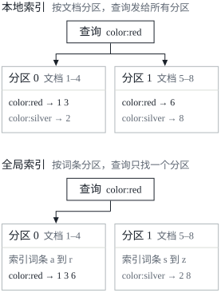
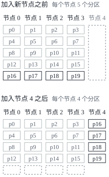
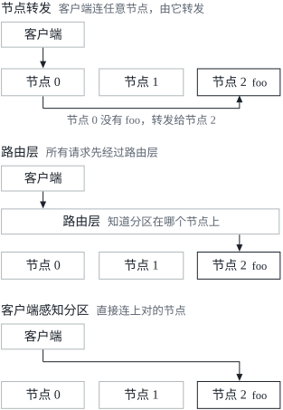

这是 DDIA 读书笔记的第六篇。[第五篇](/posts/ddia-05/)讲的是复制，也就是在几个节点上保存同一份数据的副本；可数据集非常大，或者查询吞吐量非常高的时候，光有复制还不够，还得把数据拆开，分到很多台机器上。这就是第六章的主题：分区。文中的英文引文出自原书，其余是我自己的复述和整理。

这一章开头引了格蕾丝·霍珀（Grace Murray Hopper）1962 年的一段话：

> Clearly, we must break away from the sequential and not limit the computers. We must state definitions and provide for priorities and descriptions of data. We must state relationships, not procedures.

六十多年前说的“摆脱顺序”，放在这一章开头，大概是想说：数据分到很多台机器上以后，就不能再指望一台机器从头到尾地处理它了。

## 什么是分区

把数据拆成**分区**（partition），也叫**分片**（sharding）。这个概念在不同的系统里叫法很乱：

| 系统 | 分区的叫法 |
| --- | --- |
| MongoDB、Elasticsearch、SolrCloud | shard（分片） |
| HBase | region |
| Bigtable | tablet |
| Cassandra、Riak | vnode |
| Couchbase | vBucket |

书里统一用 partition，因为它是最成熟的叫法。注意它和第 8 章要讲的**网络分区**（network partition，节点之间的网络故障）不是一回事。

分区的划分方式通常保证每条数据（每条记录、每一行或每个文档）恰好属于一个分区。实际上，每个分区自己就是一个小数据库，尽管数据库也可能支持同时涉及多个分区的操作。

想要分区，主要是为了**可扩展性**。在无共享集群里，不同的分区可以放在不同的节点上，一个大数据集就能分散到很多块磁盘上，查询负载也能分散到很多个处理器上。只涉及一个分区的查询，每个节点可以独立地执行自己分区上的查询，所以加节点就能提高查询吞吐量。大而复杂的查询也有可能跨多个节点并行执行，只是难得多。

分区数据库在 1980 年代由 Teradata 和 Tandem NonStop SQL 这样的产品开创，近年又被 NoSQL 数据库和基于 Hadoop 的数据仓库重新发现。有的系统为事务型负载设计，有的为分析型负载设计（第 3 章），这会影响系统的调优方式，但分区的基本原理对两种负载都适用。

这一章先看给大数据集分区的几种办法，以及数据的索引和分区怎样相互影响；然后讲再平衡，也就是在集群里增减节点时要做的事；最后看数据库怎样把请求路由到正确的分区上，以及怎样执行查询。

## 分区与复制

分区通常和复制一起用，每个分区的副本存在多个节点上。这意味着，即使每条记录只属于一个分区，它也可能存在几个不同的节点上，以便容错。

一个节点可能存着不止一个分区。用领导者–追随者的复制模型时，分区和复制组合起来是这样的：每个分区的领导者被分配到一个节点上，它的追随者被分配到其他节点上。每个节点可能是某些分区的领导者，同时又是另一些分区的追随者。

[第五篇](/posts/ddia-05/)讲的数据库复制的一切，同样适用于分区的复制。分区方案的选择和复制方案的选择大体上是独立的，所以这一章为了简单，不再考虑复制。

## 键值数据的分区

假设有大量的数据要分区，怎样决定哪些记录存在哪些节点上？

分区的目标是把数据和查询负载均匀地分散到各个节点上。如果每个节点都承担公平的一份，那么在理论上（先不考虑复制），10 个节点就应该能处理 10 倍于单个节点的数据量和读写吞吐量。

如果分区不公平，有些分区的数据或查询比别的分区多，就叫**偏斜**（skew）。偏斜会让分区的效果大打折扣：极端情况下，所有负载都落在一个分区上，10 个节点里有 9 个闲着，瓶颈就是那一个忙碌的节点。负载高得不成比例的分区叫**热点**（hot spot）。

避免热点最简单的办法，是把记录随机地分配给节点。这样数据会分布得相当均匀，但有个大缺点：读某一条记录时，没法知道它在哪个节点上，只好并行地查询所有节点。

可以做得更好。先假设数据模型是简单的键值模型，总是通过主键访问记录。比如老式的纸质百科全书，按词条的标题查，所有词条都按标题的字母顺序排好，很快就能找到想要的那一条。

### 按键范围分区

一种分区办法是给每个分区分配一段连续的键范围（从某个最小值到某个最大值），就像纸质百科全书分成好几卷。知道了范围之间的边界，很容易就能确定某个键在哪个分区；再知道哪个分区分配给了哪个节点，就能直接向相应的节点发请求（对百科全书来说，就是从书架上取下对的那一卷）。

键的范围不一定是均匀的，因为数据本身可能分布不均。比如百科全书的第 1 卷只收 A 和 B 开头的词条，第 12 卷却从 T 一直收到 Z。要是每两个字母一卷，有些卷就会比别的卷厚得多。为了让数据分布均匀，分区的边界要适应数据。

分区边界可以由管理员手动选，也可以由数据库自动选（后面讲再平衡时细说）。Bigtable、它的开源对应物 HBase、RethinkDB，以及 2.4 版之前的 MongoDB，用的都是这种分区方式。

每个分区里，可以让键保持有序（参见[第三篇](/posts/ddia-03/)的 SSTable 和 LSM 树）。这样做的好处是范围扫描很容易，还可以把键当作联合索引，一次查询取回好几条相关的记录。比如一个存储传感器网络数据的应用，键是测量的时间戳（年-月-日-时-分-秒），范围扫描就很有用，可以轻松取出某个月的所有读数。

按键范围分区的缺点是，某些访问模式会造成热点。键是时间戳的话，分区就对应时间范围，比如每天一个分区。可传感器的数据是测量一发生就写进数据库的，所以所有写入都涌向同一个分区（今天的那个），它被写入压垮了，其他分区却闲着。

为了在传感器数据库里避免这个问题，键的第一个元素要换成时间戳以外的东西。比如在每个时间戳前面加上传感器的名字，先按传感器名分区，再按时间分区。假设同时有很多传感器在工作，写入负载就会比较均匀地分散到各个分区上。代价是，要取一个时间范围内好几个传感器的数据时，得为每个传感器名各做一次范围查询。

### 按键的哈希分区

因为有偏斜和热点的风险，很多分布式数据存储用哈希函数来决定一个键属于哪个分区。

一个好的哈希函数能把偏斜的数据变得均匀分布。假设有一个 32 位的哈希函数，接受一个字符串，每给它一个新字符串，它就返回一个 0 到 232 − 1 之间看起来随机的数。即使输入的字符串非常相似，它们的哈希值也会均匀地分布在这个范围里。

用来分区的哈希函数不需要密码学强度。比如 Cassandra 和 MongoDB 用 MD5[^murmur]，Voldemort 用 Fowler–Noll–Vo 函数。很多编程语言内置了简单的哈希函数（给哈希表用的），但它们可能不适合分区：比如 Java 的 `Object.hashCode()` 和 Ruby 的 `Object#hash`，同一个键在不同的进程里可能得到不同的哈希值。

有了合适的键哈希函数，就可以给每个分区分配一段哈希值的范围（而不是键的范围），哈希值落在某个分区范围里的键，都存在那个分区里。这种技术很擅长把键公平地分给各个分区。分区边界可以均匀地划分，也可以伪随机地选取，后者有时叫**一致性哈希**（consistent hashing）。

一致性哈希这个词是 Karger 等人定义的，指在内容分发网络（CDN）这样的互联网级缓存系统里均匀分摊负载的一种办法：用随机选取的分区边界，避免中央控制或分布式共识。注意这里的“一致”和副本的一致性（第 5 章）或 ACID 的一致性（第 7 章）都没有关系，它描述的是一种特定的再平衡方式。书里说，这种做法用在数据库上效果其实不太好，所以实践中很少用（有些数据库的文档仍然自称用了一致性哈希，但往往并不准确）。因为太容易混淆，最好不用一致性哈希这个词，直接说哈希分区。

可是用键的哈希分区，就失去了按键范围分区的一个好性质：高效的范围查询。原本相邻的键现在散落在所有分区里，排序没了。在 MongoDB 里，启用了基于哈希的分片模式之后，任何范围查询都要发给所有分区；Riak、Couchbase 和 Voldemort 则不支持在主键上做范围查询。

Cassandra 在两种分区策略之间取了一个折中。Cassandra 里的表可以声明一个由几列组成的**复合主键**（compound primary key）：只有键的第一部分被哈希，用来决定分区，其余的列被用作联合索引，在 Cassandra 的 SSTable 里给数据排序。所以查询没法在复合键的第一列上搜索一个范围，但只要给第一列指定一个固定的值，就能在键的其他列上高效地做范围扫描。

这种联合索引的做法，给一对多的关系提供了一种优雅的数据模型。比如社交网站上，一个用户可能发很多条动态。如果动态的主键选成 `(user_id, update_timestamp)`，就可以高效地取出某个用户在某段时间内发的所有动态，并且按时间戳排好序。不同的用户可能存在不同的分区上，但同一个用户的动态按时间戳有序地存在一个分区里。

### 负载偏斜与热点消除

前面说过，用键的哈希决定分区，可以帮助减少热点，但没法完全避免：极端情况下，所有读写都针对同一个键，所有请求还是会被路由到同一个分区。

这种负载也许不寻常，但并非闻所未闻。比如社交网站上，一个有几百万关注者的名人做点什么，就可能引发一阵风暴，对同一个键（也许是名人的用户 ID，或者大家在评论的那条动态的 ID）产生大量写入。哈希这个键也没用，两个相同的 ID，哈希值还是相同的。

今天的大多数数据系统都没法自动补偿这种高度偏斜的负载，减少偏斜是应用的责任。比如已知某个键非常热，一个简单的办法是在键的开头或结尾加一个随机数。只要一个两位的十进制随机数，就能把对这个键的写入均匀地分到 100 个不同的键上，这些键可以分布在不同的分区里。

不过，写入分散到不同的键上以后，读就要多做些工作：得把 100 个键的数据都读出来，再合并到一起。这种技术还需要额外的记账：只有少数热键值得加随机数，对绝大多数写入吞吐量很低的键来说，这只是不必要的开销。所以还需要某种办法，记下哪些键被拆开了。

也许将来的数据系统能自动检测并补偿偏斜的负载，但眼下，还得自己为自己的应用想清楚其中的权衡。

## 分区与二级索引

前面讲的分区方案都依赖键值数据模型。如果记录只通过主键访问，就能从键确定分区，用它把读写请求路由到负责这个键的分区。

涉及二级索引时，情况就复杂了。二级索引通常不唯一地标识一条记录，而是用来搜索某个值出现在哪里：找出用户 123 的所有操作，找出所有包含 hogwash 这个词的文章，找出所有红色的车，等等。

二级索引是关系数据库的看家本领，在文档数据库里也很常见。很多键值存储（比如 HBase 和 Voldemort）因为实现复杂而回避了二级索引，但也有一些（比如 Riak）因为它对数据建模太有用，开始加上了它。对 Solr 和 Elasticsearch 这样的搜索服务器来说，二级索引更是它们存在的理由。

二级索引的问题在于，它没法整齐地对应到分区上。给带二级索引的数据库分区，主要有两种办法：按文档分区和按词条分区。

### 按文档分区的二级索引

假设你在运营一个卖二手车的网站。每条车辆信息有一个唯一的 ID，叫文档 ID，数据库按文档 ID 分区（比如 ID 0 到 499 在分区 0，500 到 999 在分区 1，以此类推）。

你想让用户按颜色和品牌筛选车辆，所以需要在颜色和品牌上建二级索引（在文档数据库里它们是字段，在关系数据库里是列）。声明了索引，数据库就能自动维护它[^diy-index]。比如每往数据库里加一辆红色的车，它所在的分区就自动把它加进索引条目 `color:red` 的文档 ID 列表里。

在这种索引方式里，每个分区完全独立：每个分区维护自己的二级索引，只覆盖本分区里的文档，不关心其他分区里存了什么。每次写数据库（添加、删除或更新一个文档），只需要处理你写的那个文档 ID 所在的分区。所以按文档分区的索引也叫**本地索引**（local index），与下一节的全局索引相对。

可从按文档分区的索引里读，就要小心了：除非专门对文档 ID 做过什么处理，没有理由认为某个颜色或某个品牌的车都在同一个分区里。红车在分区 0 里有，在分区 1 里也有。所以要搜索红车，就得把查询发给所有分区，再把返回的结果全部合起来。

这种查询分区数据库的方式有时叫**分散/聚集**（scatter/gather），它可能让二级索引上的读查询相当昂贵。即使并行地查询各个分区，分散/聚集也容易受[尾部延迟放大](/posts/ddia-01/)的影响。尽管如此，它用得很广：MongoDB、Riak、Cassandra、Elasticsearch、SolrCloud 和 VoltDB 都用按文档分区的二级索引。大多数数据库厂商建议把分区方案设计成让二级索引查询只由一个分区服务，但这不总是做得到，特别是一个查询同时用到几个二级索引的时候（比如同时按颜色和品牌筛选车辆）。

### 按词条分区的二级索引

另一种办法是不让每个分区有自己的二级索引（本地索引），而是建一个覆盖所有分区数据的**全局索引**（global index）。但这个索引不能只存在一个节点上，否则它很可能成为瓶颈，违背了分区的初衷。全局索引也必须分区，只是可以用和主键索引不同的方式分区。

比如所有分区里的红车，都出现在索引的 `color:red` 下面，但索引按颜色的首字母分区：a 到 r 开头的颜色在分区 0，s 到 z 开头的在分区 1。品牌的索引也类似地分区（分界在 f 和 h 之间）。

这种索引叫**按词条分区**（term-partitioned）的索引，因为要找的词条决定了索引所在的分区，这里的词条就是 `color:red` 这样的东西。“词条”这个名字来自全文索引（一种特殊的二级索引），在那里，词条就是文档里出现的所有词。

和前面一样，索引可以按词条本身分区，也可以按词条的哈希分区。按词条本身分区便于范围扫描（比如在车的报价这样的数值属性上），按词条的哈希分区则让负载分布得更均匀。

全局（按词条分区的）索引比按文档分区的索引好的地方，是读更高效：不用对所有分区做分散/聚集，客户端只要向包含所需词条的那个分区发请求。坏处是写更慢、更复杂，因为写一个文档现在可能影响索引的好几个分区（文档里的每个词条都可能在不同的分区、不同的节点上）。

理想情况下，索引应该总是最新的，写进数据库的每个文档都立即反映到索引里。但对按词条分区的索引来说，这需要一个跨越所有受影响分区的分布式事务，不是所有数据库都支持（第 7 章和第 9 章）。

实践中，全局二级索引的更新常常是异步的，也就是写入后马上去读索引，刚做的修改可能还没反映出来。比如 Amazon DynamoDB 声明，它的全局二级索引在正常情况下不到一秒就会更新，但在基础设施出故障时，传播延迟可能更长。

全局的按词条分区索引还用在 Riak 的搜索功能，以及 Oracle 数据仓库里（它让你在本地索引和全局索引之间选）。第 12 章还会回到按词条分区的二级索引怎样实现的话题。

## 分区再平衡

数据库里的情况会随时间变化：

- 查询吞吐量增加了，想加 CPU 来处理负载；
- 数据集变大了，想加磁盘和内存来存它；
- 一台机器坏了，要由别的机器接过它的职责。

这些变化都要求把数据和请求从一个节点挪到另一个节点。把负载从集群里的一个节点挪到另一个节点的过程，叫**再平衡**（rebalancing）。

不管用哪种分区方案，再平衡通常都要满足几个最低要求：

- 再平衡之后，负载（数据存储、读写请求）应该在集群的节点之间公平分担；
- 再平衡进行时，数据库应该继续接受读写；
- 节点之间只挪动必要的数据，让再平衡快一点，并尽量减少网络和磁盘 I/O 的负担。

### 再平衡的策略

把分区分配给节点，有几种不同的办法。

#### 反面教材：哈希取模

按键的哈希分区时，前面说最好把可能的哈希值分成几段范围，每段分给一个分区。你也许会问，为什么不直接取模（很多编程语言里的 `%` 运算符）？比如 hash(key) mod 10 会返回 0 到 9 之间的一个数（把哈希值写成十进制，取模 10 就是它的最后一位）。有 10 个节点、编号 0 到 9 的话，这似乎是给每个键分配节点的简便办法。

mod N 的问题在于，节点数 N 一变，大部分键都要从一个节点挪到另一个节点。比如 hash(key) = 123456：

| 节点数 | 123456 mod N | 这个键所在的节点 |
| --- | --- | --- |
| 10 | 6 | 节点 6 |
| 11 | 3 | 节点 3（要搬家） |
| 12 | 0 | 节点 0（又要搬家） |

这样频繁地搬动，让再平衡的代价高得离谱。需要一种不会多搬数据的办法。

#### 固定数量的分区

好在有一个相当简单的解法：创建比节点多得多的分区，给每个节点分配好几个分区。比如在一个 10 个节点的集群上运行的数据库，可以一开始就分成 1000 个分区，每个节点分到大约 100 个。

这样，集群里加了一个节点，新节点就从每个现有节点那里“偷”走几个分区，直到分区重新公平地分布。从集群里去掉一个节点，过程反过来。

在节点之间移动的只是整个的分区。分区的数量不变，键到分区的分配也不变，唯一变的是分区到节点的分配。这种分配的变化不是瞬间完成的，通过网络传输大量数据要花些时间，所以传输期间发生的读写，仍然用旧的分区分配。

原则上，甚至可以照顾集群里配置不一的硬件：给性能更强的节点分配更多的分区，让它们承担更大的一份负载。

Riak、Elasticsearch、Couchbase 和 Voldemort 用的就是这种再平衡方式。

在这种配置里，分区的数量通常在数据库刚建好时就定下来，之后不再改变。原则上，分区也可以拆分和合并（见下一节），但固定数量的分区在运维上更简单，所以很多用固定分区的数据库干脆不实现分区拆分。这样，一开始配置的分区数，就是将来能有的节点数的上限，所以要选得足够大，以容纳将来的增长。可每个分区也有管理开销，选得太大反而适得其反。

数据集的总大小变化很大的时候（比如一开始很小，后来可能变得大得多），选对分区的数量就很难。因为每个分区包含总数据的一个固定比例，每个分区的大小会随集群里的数据总量成比例增长。分区很大的话，再平衡和从节点故障中恢复都很昂贵；分区太小，又会产生太多的开销。分区大小“恰到好处”、不大不小的时候性能最好，可分区数固定、数据集大小又在变，这就很难做到。

#### 动态分区

对按键范围分区的数据库来说，固定数量、固定边界的分区会非常不方便：边界一旦划错，可能所有数据都挤在一个分区里，其他分区全是空的。手动重新配置分区边界又非常繁琐。

所以，HBase 和 RethinkDB 这些按键范围分区的数据库会动态地创建分区。一个分区增长到超过配置的大小（HBase 默认是 10 GB），就拆成两个分区，大约一半数据在拆分点的一边，一半在另一边。反过来，如果删了大量数据，分区缩小到某个阈值以下，就可以和相邻的分区合并。这个过程和 B 树顶层发生的事情很像（[第三篇](/posts/ddia-03/)讲过 B 树的页分裂）。

和固定数量的分区一样，每个分区分配给一个节点，每个节点可以处理多个分区。一个大分区拆分之后，可以把其中一半转移到另一个节点上，以平衡负载。HBase 的分区文件是通过底层的分布式文件系统 HDFS 转移的。

动态分区的好处是分区的数量能适应数据总量：数据少，少数几个分区就够了，开销很小；数据多，每个分区的大小也被限制在一个可配置的最大值之内。

不过有个问题：一个空的数据库从一个分区开始，因为没有任何先验信息告诉它分区边界该划在哪里。在数据集还小、第一个分区还没拆分的时候，所有写入都只能由一个节点处理，其他节点都闲着。为了缓解这个问题，HBase 和 MongoDB 允许在空数据库上配置一组初始的分区，这叫**预切分**（pre-splitting）。对按键范围分区来说，预切分要求事先知道键的分布会是什么样子。

动态分区不只适合按键范围分区的数据，同样能用在按哈希分区的数据上。MongoDB 从 2.4 版起同时支持按键范围和按哈希分区，两种情况下都动态地拆分分区。

#### 按节点比例分区

动态分区的分区数和数据集的大小成正比，因为拆分和合并让每个分区的大小保持在某个固定的最小值和最大值之间。固定数量的分区，则是每个分区的大小和数据集的大小成正比。这两种情况下，分区数都和节点数无关。

第三种办法是 Cassandra 和 Ketama 用的：让分区数和节点数成正比，也就是每个节点有固定数量的分区。这时节点数不变的话，每个分区的大小随数据集的大小成比例增长；节点数增加了，分区又会变小。数据量更大通常就需要更多的节点来存，所以这种办法也让每个分区的大小保持得相当稳定。

一个新节点加入集群时，它随机选出固定数量的现有分区，把每个都拆开，拿走每个被拆分区的一半，另一半留在原地。随机化可能造成不公平的拆分，但在较多的分区上平均下来（Cassandra 默认每个节点 256 个分区[^vnodes]），新节点最终会从现有节点那里分到公平的一份负载。Cassandra 3.0 引入了另一种能避免不公平拆分的再平衡算法。

随机选取分区边界，要求用的是按哈希分区（这样才能从哈希函数产生的数值范围里选边界）。这种做法其实最接近一致性哈希的原始定义。较新的哈希函数能以更低的元数据开销达到类似的效果。

几种策略放在一起比较：

| 策略 | 分区数 | 每个分区的大小 | 例子 |
| --- | --- | --- | --- |
| 固定数量的分区 | 一开始定好，不再改变 | 随数据总量成比例增长 | Riak、Elasticsearch、Couchbase、Voldemort |
| 动态分区 | 随数据总量增减 | 保持在最小值和最大值之间 | HBase、RethinkDB、MongoDB |
| 按节点比例分区 | 和节点数成正比 | 相当稳定 | Cassandra、Ketama |

### 自动还是手动再平衡

关于再平衡，还有一个重要的问题：再平衡是自动进行，还是手动进行？

从全自动的再平衡（系统自己决定什么时候把分区从一个节点挪到另一个节点，不需要管理员的任何干预），到全手动的再平衡（分区到节点的分配由管理员显式配置，只有管理员显式地重新配置时才会改变），中间是一个渐变的光谱。比如 Couchbase、Riak 和 Voldemort 会自动生成一个建议的分区分配，但要管理员确认提交之后才生效。

全自动的再平衡很方便，日常维护的运维工作更少。但它可能难以预料。再平衡是一个昂贵的操作，要重新路由请求，还要把大量数据从一个节点挪到另一个节点。做得不小心，这个过程可能让网络或节点过载，在再平衡进行期间损害其他请求的性能。

这种自动化和自动的故障检测结合起来，可能很危险。比如一个节点过载了，暂时响应很慢，其他节点就断定这个过载的节点死了，自动地再平衡集群，把负载从它身上挪走。这给过载的节点、其他节点和网络都增加了负担，让情况变得更糟，还可能引起级联故障。

所以，在再平衡的环节里让人参与进来，可能是件好事。它比全自动的过程慢，但能帮助防止运维上的意外。

## 请求路由

现在数据集已经分区到多台机器上的多个节点上了。还剩一个开放的问题：客户端想发请求时，怎么知道该连哪个节点？分区再平衡的时候，分区到节点的分配会变，总得有人跟踪这些变化，才能回答这个问题：我要读写键“foo”，该连哪个 IP 地址和端口？

这是一个更一般的问题，叫**服务发现**（service discovery），并不限于数据库。任何能通过网络访问的软件都有这个问题，追求高可用（以冗余的方式运行在多台机器上）的软件尤其如此。很多公司写了自己内部的服务发现工具，其中很多已经开源。

从高处看，这个问题有几种不同的解法：

1. 允许客户端连任意一个节点（比如通过轮询的负载均衡器）。如果这个节点恰好拥有请求对应的分区，它就直接处理请求；否则，它把请求转发给合适的节点，收到回复后再传给客户端；
2. 客户端的所有请求先发到一个**路由层**（routing tier），由它决定该由哪个节点处理每个请求，并相应地转发过去。路由层自己不处理任何请求，只充当一个能感知分区的负载均衡器；
3. 要求客户端知道分区方式和分区到节点的分配。这时客户端可以直接连上合适的节点，不需要任何中间人。

不管哪种办法，关键问题都是：做路由决策的那个组件（可能是某个节点、路由层或者客户端），怎样得知分区到节点的分配发生了变化？

这是个有挑战性的问题，因为所有参与者必须达成一致，否则请求会被发到错误的节点上，得不到正确的处理。分布式系统里有达成共识的协议，但很难正确地实现（第 9 章）。

很多分布式数据系统依赖一个独立的协调服务来跟踪集群的元数据，比如 ZooKeeper。每个节点在 ZooKeeper 里注册自己，ZooKeeper 维护着分区到节点的权威映射。路由层或者能感知分区的客户端这样的参与者，可以在 ZooKeeper 里订阅这份信息。每当分区换了主人，或者有节点加入、离开，ZooKeeper 就通知路由层，让它的路由信息保持最新。

比如 LinkedIn 的 Espresso 用 Helix 做集群管理（Helix 又依赖 ZooKeeper），实现的就是上面的路由层。HBase、SolrCloud 和 Kafka 也用 ZooKeeper 跟踪分区的分配[^kafka]。MongoDB 的架构类似，但它依赖自己实现的**配置服务器**（config server），由 mongos 守护进程充当路由层。

Cassandra 和 Riak 换了一种办法：它们在节点之间用**流言协议**（gossip protocol）传播集群状态的任何变化。请求可以发给任何一个节点，由那个节点转发给负责所请求分区的合适节点（上面的第 1 种办法）。这种模式让数据库节点更复杂，但避免了对 ZooKeeper 这样的外部协调服务的依赖。

Couchbase 不自动再平衡，这让设计简单了一些。它通常配置一个叫 moxi 的路由层，从集群节点那里得知路由的变化。

用路由层，或者把请求发给随机的节点时，客户端仍然要找到该连的 IP 地址。这些地址不像分区到节点的分配变得那么快，所以用 DNS 通常就够了。

### 并行查询执行

到这里，这一章关注的都是读写单个键的非常简单的查询（再加上按文档分区的二级索引上的分散/聚集查询）。大多数 NoSQL 分布式数据存储支持的访问，差不多就是这个水平。

可是常用于分析的**大规模并行处理**（massively parallel processing，MPP）关系数据库产品，支持的查询要复杂得多。一个典型的数据仓库查询包含好几个连接、过滤、分组和聚合操作。MPP 的查询优化器把这样的复杂查询拆成好几个执行阶段和分区，其中很多可以在数据库集群的不同节点上并行执行。要扫描数据集一大部分的查询，尤其能从这种并行执行中受益。

数据仓库查询的快速并行执行是一个专门的话题，考虑到分析对商业的重要性，它吸引了大量的商业兴趣。第 10 章会讨论并行查询执行的一些技术，更详细的综述书里给了参考文献。

## 小结

这一章探讨了把大数据集分成较小子集的几种方式。数据多到在一台机器上存储和处理都不再可行时，就需要分区。

分区的目标是把数据和查询负载均匀地分散到多台机器上，避免热点（负载高得不成比例的节点）。这需要选择适合数据的分区方案，并在集群里增减节点时再平衡分区。

两种主要的分区方式：

| 方式 | 做法 | 长处 | 短处 |
| --- | --- | --- | --- |
| 按键范围分区 | 键是有序的，一个分区拥有从某个最小值到某个最大值的所有键 | 可以做高效的范围查询 | 应用经常访问排序上相近的键时，有热点的风险。分区通常在太大时拆成两个子范围，以此动态地再平衡 |
| 按哈希分区 | 对每个键应用哈希函数，一个分区拥有一段哈希值的范围 | 负载可能分布得更均匀 | 破坏了键的顺序，范围查询变得低效。通常事先创建固定数量的分区，给每个节点分几个，增减节点时整个分区地挪动；也可以用动态分区 |

也可以混合使用，比如用复合主键：用键的一部分确定分区，另一部分决定排序。

这一章还讨论了分区和二级索引之间的相互作用。二级索引也需要分区，有两种办法：

- **按文档分区的索引**（本地索引）：二级索引和主键、值存在同一个分区里。写的时候只需要更新一个分区，但读二级索引需要对所有分区做分散/聚集；
- **按词条分区的索引**（全局索引）：二级索引按被索引的值单独分区，二级索引里的一个条目可能包含来自主键所有分区的记录。写一个文档时，需要更新二级索引的好几个分区，但读可以由一个分区服务。

最后，这一章讨论了把查询路由到合适分区的技术，从简单的能感知分区的负载均衡，到复杂的并行查询执行引擎。

按照设计，每个分区大体上独立运作，这正是分区数据库能扩展到多台机器的原因。可需要写好几个分区的操作就很难推理：比如写一个分区成功了，写另一个分区却失败了，会怎样？接下来几章会回答这个问题。

## 术语表

| 英文 | 中文 | 含义 |
| --- | --- | --- |
| partition / partitioning | 分区 | 把大数据集拆成的子集，每条数据恰好属于一个分区 |
| shard / region / tablet / vnode / vBucket | 分片等 | 不同系统里对分区的叫法 |
| network partition | 网络分区 | 节点之间的网络故障，和这里的分区无关 |
| skew | 偏斜 | 有些分区的数据或查询比别的多 |
| hot spot | 热点 | 负载高得不成比例的分区 |
| key range partitioning | 按键范围分区 | 每个分区拥有一段连续的键 |
| hash partitioning | 按哈希分区 | 每个分区拥有一段键的哈希值的范围 |
| consistent hashing | 一致性哈希 | 用随机选取的边界分摊缓存负载的办法，这个词最好避免 |
| compound primary key | 复合主键 | 第一部分决定分区、其余部分决定排序的主键 |
| concatenated index | 联合索引 | 按顺序把几个字段拼成一个键 |
| secondary index | 二级索引 | 按值搜索记录的索引 |
| document-partitioned index / local index | 按文档分区的索引 / 本地索引 | 每个分区只索引自己的文档 |
| term-partitioned index / global index | 按词条分区的索引 / 全局索引 | 覆盖所有分区的数据、按词条分区的索引 |
| term | 词条 | 要查的值，比如 color:red；源自全文索引里的词 |
| scatter/gather | 分散/聚集 | 把查询发给所有分区，再合并结果 |
| rebalancing | 再平衡 | 把负载从一个节点挪到另一个节点 |
| hash mod N | 哈希取模 | 节点数一变，大部分键都要搬家 |
| fixed number of partitions | 固定数量的分区 | 分区远多于节点，增减节点时整个分区地挪动 |
| dynamic partitioning | 动态分区 | 分区太大就拆分，太小就合并 |
| pre-splitting | 预切分 | 在空数据库上配置初始的一组分区 |
| partitioning proportionally to nodes | 按节点比例分区 | 每个节点有固定数量的分区 |
| cascading failure | 级联故障 | 自动再平衡加重过载，引发连锁的失效 |
| request routing | 请求路由 | 让请求找到负责它的节点 |
| service discovery | 服务发现 | 找出某个服务在哪个 IP 地址和端口上 |
| routing tier | 路由层 | 能感知分区、只转发请求的负载均衡层 |
| coordination service | 协调服务 | 比如 ZooKeeper，维护集群元数据的权威副本 |
| gossip protocol | 流言协议 | 节点之间互相传播集群状态的变化 |
| massively parallel processing (MPP) | 大规模并行处理 | 把复杂查询拆成多个阶段，在多个节点上并行执行 |

[^murmur]: 书里这一处在出版时就已经过时：Cassandra 从 1.2 版（2013 年）起，默认的分区器是 Murmur3Partitioner，用的是 MurmurHash3；用 MD5 的是更早的 RandomPartitioner。

[^diy-index]: 如果数据库只支持键值模型，你可能会想在应用代码里自己实现二级索引，建一个从值到文档 ID 的映射。走这条路就要非常小心，保证索引和底层数据一致：竞态条件和间歇性的写入失败（一部分修改保存了，另一部分没有）很容易让两者不同步，第 7 章讲多对象事务时会谈到。

[^vnodes]: 书写于 2017 年。Cassandra 4.0（2021 年）把每个节点的默认分区数（`num_tokens`）从 256 降到了 16，同时默认启用新的 token 分配算法，用更少的分区达到差不多的均衡。

[^kafka]: 书写于 2017 年。Kafka 后来用自己基于 Raft 的 KRaft 协议取代了 ZooKeeper，2025 年发布的 Kafka 4.0 已经完全不再支持 ZooKeeper。
