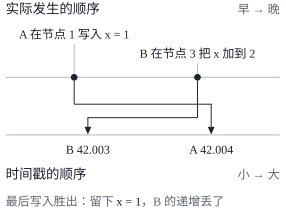
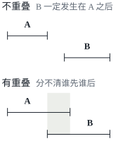

这是 DDIA 读书笔记的第八篇。[第七篇](/posts/ddia-07/)讲的事务，基本都是一台机器上的事。前几章其实已经谈了不少故障：领导者失效、复制延迟、并发冲突。第八章说，这些还是太乐观了，干脆假设一切可能出错的都会出错，看看分布式系统里到底有哪些东西靠不住。这一篇按我理解的几条主线整理，不按书的小节顺序。文中的英文引文出自原书，其余是我自己的整理。

这一章开头引了 Kyle Kingsbury 2013 年的 *Carly Rae Jepsen and the Perils of Network Partitions*，改编自流行歌 Call Me Maybe 的歌词：

> Hey I just met you\
> The network's laggy\
> But here's my data\
> So store it maybe

Kingsbury 那一系列专门检查分布式数据库在网络分区这类故障下有没有兑现承诺的测试，就叫 Jepsen。歌词里那句“数据给你了，存不存得下看运气”，大概就是这一章的基调。

## 部分失效

单台计算机的行为是确定的：硬件正常时，同样的操作总是得到同样的结果；硬件出了问题，通常是整台机器直接崩溃，而不是返回一个错误的结果。这是有意的设计：宁可死机，也不要给出错误的答案。

分布式系统没有这个便宜可占。几台机器通过网络连在一起，很可能某些部分坏了，另一些部分还好好的，这叫**部分失效**（partial failure）。更麻烦的是它**不确定**：一个涉及多个节点的操作，可能有时成功、有时失败，你甚至可能不知道它到底成功了没有。

不同的系统对此态度不同。超级计算机把部分失效升级成完全失效：定期存检查点，任何一个节点坏了就停下整个作业，修好以后从检查点重来。互联网服务做不到这一点：它们要随时在线、低延迟地服务用户，用的是失效率更高的普通商用机器，规模大到总有东西是坏的。所以只能在软件里容忍部分失效，用不可靠的部件搭出可靠的系统。这并不矛盾：TCP 就是在会丢包、会乱序的 IP 之上提供了可靠的传输，只是它藏得起丢包，藏不起延迟。

书里给这一章定的态度是：

> In distributed systems, suspicion, pessimism, and paranoia pay off.

## 网络：沉默无法解释

这本书讨论的是无共享系统，机器之间唯一的联系就是网络，而数据中心和互联网用的都是**异步分组网络**（asynchronous packet network）：发出去的包什么时候到、会不会到，网络都不保证。

你发了一个请求，迟迟没有回音，可能是请求在路上丢了，可能还在某个队列里排着，可能对方已经挂了，可能对方正卡在一次长时间的垃圾回收里，可能对方处理完了、响应在回来的路上丢了，也可能响应只是慢了。从发送方看，这些情况一模一样：

> If you send a request to another node and don't receive a response, it is impossible to tell why.

网络故障也比想象的常见。一项研究发现，一个中等规模的数据中心每月大约有 12 次网络故障；增加冗余的网络设备帮助有限，因为很多故障来自人为的配置错误。还有更离奇的：鲨鱼咬坏海底光缆，网卡只丢进来的包，发出去的包却都正常。

### 超时没有正确答案

检测故障，最后几乎只能靠**超时**（timeout）。有时也能得到明确的信号，比如对方的操作系统回一个 RST 包拒绝连接，但不能指望它：即使 TCP 确认包已经送达，应用也可能在处理之前就崩了。

超时设多长是个两难：设长了，节点真挂了要等很久才发现；设短了，暂时慢一下的节点会被误判为死亡。误判的代价不小：它手上的工作可能被别的节点重做一遍（比如邮件发两次）；它的负载转给别的节点，如果大家本来就过载，就可能引发**级联失效**（cascading failure）。

如果网络保证每个包在时间 d 内送达，节点保证在时间 r 内处理完请求，超时设成 2d + r 就行了。可现实中两个保证都没有，网络的延迟是**无界的**（unbounded）。延迟的波动主要来自排队：交换机要把同时发往同一目的地的包排成队，目标机器的 CPU 忙时操作系统要排队，虚拟机被暂停时虚拟机监视器要排队，TCP 的流量控制还会让包在发出之前就排队。在共享的云环境里，隔壁租户的批处理作业就能把你的延迟搅乱。

所以超时只能靠实测：在很多机器上长期测量往返时间的分布，再在检测速度和误判风险之间权衡。更好的做法是像 Phi Accrual 故障检测器（Akka 和 Cassandra 都用它）那样，持续观测响应时间，自动调整超时。

### 为什么不把网络做成可预测的

固定电话网络就很可预测：打电话时沿途为这次通话预留好固定的带宽（一条**电路**），没有排队，最大延迟是固定的。为什么计算机网络不这样做？

因为数据中心和互联网的流量是突发的：请求一个网页、传一个文件，没有固定的带宽需求，只希望尽快完成。为它预留带宽，预留少了传得慢，预留多了浪费。分组交换让大家动态地争抢带宽，代价是排队和延迟的波动，换来的是线路的利用率，也就是更低的成本。CPU 在线程之间动态共享，也是同样的道理。

> Variable delays in networks are not a law of nature, but simply the result of a cost/benefit trade-off.

延迟有保证的环境是能做出来的，只是贵。在多租户的数据中心和公有云里，只能假设网络拥塞、排队和无界延迟都会发生。

## 时钟：每台机器各有各的时间

应用用时钟做两类事：量一段时间（请求超时了吗，响应时间是多少），以及标记一个时间点（这篇文章什么时候发布的，缓存什么时候过期）。在分布式系统里，两件事都比看上去难。

### 两种时钟

计算机至少有两种时钟，用途不能混：

| | 日历时钟（time-of-day clock） | 单调时钟（monotonic clock） |
| --- | --- | --- |
| 返回什么 | 当前的日期和时间，比如自 1970 年 1 月 1 日以来的秒数 | 自某个任意起点以来经过的时间 |
| 例子 | `clock_gettime(CLOCK_REALTIME)`、`System.currentTimeMillis()` | `clock_gettime(CLOCK_MONOTONIC)`、`System.nanoTime()` |
| 会不会往回跳 | 会：NTP 发现它快了太多，可能直接把它拨回去 | 不会，只往前走（NTP 最多把它调快或调慢 0.05%） |
| 适合做什么 | 标记时间点，不同机器之间（理想情况下）可以比较 | 测量持续时间，比如超时；不同机器之间的值没法比较 |

用单调时钟测超时，在分布式系统里通常没问题；麻烦出在依赖日历时钟、并且假设各台机器的时钟已经同步的做法上。

### 同步有多不准

日历时钟靠 NTP 和外部的时间服务器同步，可这件事远没有想象的可靠：

- 石英钟会**漂移**。Google 假设服务器的漂移是 200 ppm，也就是每 30 秒同步一次会差 6 毫秒，每天同步一次会差 17 秒；
- 通过互联网用 NTP 同步，误差至少几十毫秒，网络拥塞时会飙到上百毫秒甚至一秒；
- NTP 服务器可能配错，机器可能被防火墙挡住，很久没同步也没人发现；
- 闰秒让一分钟变成 59 秒或 61 秒，弄崩过不少大系统[^leap]；
- 虚拟机被暂停时，时钟在应用看来会突然往前跳；用户的手机和电脑上的时钟，用户想怎么改就怎么改。

要做到很准也不是不可能。欧盟的 MiFID II 法规要求高频交易机构把时钟和 UTC 的误差控制在 100 微秒以内[^mifid]，靠的是 GPS 接收器、精确时间协议（PTP）和细致的监控，成本很高。

时钟不准还有一个特别危险的地方：它不会让系统崩溃，只会悄悄地出错。CPU 坏了、网线断了，很快就会被发现；时钟慢慢漂走，大部分功能照常工作，数据却在一点点地出问题。所以依赖同步时钟的系统，必须监控所有机器之间的时钟偏差，偏差太大的节点要踢出集群。

### 不能用时间戳给事件排序

最危险的用法，是用日历时钟的时间戳判断两个事件谁先谁后。书里的例子发生在多领导者复制的数据库里：客户端 A 在节点 1 上写入 x = 1，这次写入复制到了节点 3；客户端 B 在节点 3 上读到它，把 x 加到 2。两次写入最后都复制到节点 2，节点 2 用**最后写入胜出**（last write wins，LWW）决定保留哪一个。节点 3 的时钟比节点 1 慢了不到 3 毫秒，于是后发生的写入拿到了更小的时间戳。

B 的加一就这样悄无声息地丢了，没有任何报错。LWW 还有两个问题：它分不清两次写入是先后发生的还是真正并发的；时间戳还可能撞车。哪怕时钟同步得很好，NTP 的精度本身也受网络往返时间的限制，按两台机器各自的时钟算，一个包可能“在发出之前就到达了”。要给事件排序，应该用基于计数器的**逻辑时钟**（logical clock），第 9 章会讲。

### 时钟读数是一个区间

与其把时钟读数当作一个精确的时间点，不如把它看成一个**置信区间**（confidence interval），比如“有 95% 的把握，现在在这一分钟的第 10.3 秒到第 10.5 秒之间”。时间戳精确到微秒，并不意味着它准到微秒。可大多数系统并不告诉你这个区间有多宽。

Google Spanner 的 TrueTime API 是个例外：问它现在几点，它返回 `[earliest, latest]` 两个值。两个事件的区间不重叠，先后就是确定的；重叠了，就分不清。

Spanner 用这一点跨数据中心实现了快照隔离：提交一个读写事务之前，故意等待一个置信区间的长度，让之后的事务和它的区间不可能重叠，时间戳的先后就和因果关系一致了。等待的时间越短越好，所以 Google 在每个数据中心都部署了 GPS 接收器或原子钟，把不确定性压到大约 7 毫秒。书写作时，Google 以外的主流数据库还没有这样做[^clockbound]。

## 进程暂停：节点自己都不知道睡了多久

设想一个靠**租约**（lease）确认自己是领导者的节点：租约像一把带超时的锁，到期之前要续约。它处理每个请求之前，先看一眼租约还剩多久，不够了就续约，然后处理请求。问题在于，如果线程刚检查完租约、还没处理请求，就被暂停了 15 秒，它醒来时租约早已过期，别的节点可能已经接任领导者，而它毫不知情，照样处理了请求。

线程真的会停这么久吗？会。原因多得很：

- 垃圾回收的“全局停顿”（stop-the-world），有时长达几分钟[^cms]；
- 虚拟机被挂起、实时迁移到另一台主机，笔记本合上了盖子；
- 操作系统或虚拟机监视器切换到别的线程或虚拟机，机器负载高时要等很久才轮回来；
- 同步的磁盘 I/O，包括意想不到的那种，比如 Java 在第一次用到一个类时才去加载它；磁盘如果是网络存储，还要再加上网络延迟；
- 内存不够时换页，极端情况下系统忙于换进换出，几乎什么也做不了；
- 有人给进程发了 SIGSTOP。

所以，一个节点必须假设自己的执行随时可能被暂停很长时间，甚至停在一个函数的中间；这期间世界照常运转，别人可能已经宣布它死了。单机上写多线程程序，还有互斥锁、原子变量这些工具；分布式系统没有共享内存，这些工具都用不上。

能不能干脆消除暂停？**硬实时**（hard real-time）系统做到了，比如控制安全气囊的系统，可那需要实时操作系统，要限制动态内存分配，要清楚每个库函数最坏情况下的执行时间，代价极高，吞吐量往往还更低。服务器端的数据系统不会这样做，只能减轻暂停的影响：比如把 GC 当作计划内的短暂停机，GC 之前先把请求从这个节点上引开；或者只对短命的对象做 GC，定期重启进程。

## 一个节点能相信什么

节点能知道的，只有它收到（或没收到）的消息。一个节点可能自以为好好的，其他节点却已经认定它死了：可能网络只断了一个方向，它收得到消息，发出去的却都丢了；也可能它刚经历了一分钟的 GC 停顿，醒来时以为什么都没发生。所以，一个节点不能完全相信自己对局面的判断。

### 真相由多数决定

分布式算法因此常常依靠**法定人数**（quorum）投票：一个决定需要足够多的节点同意，通常是超过半数（见[第五篇](/posts/ddia-05/)）。如果多数节点宣布某个节点死了，它就算死了，即使它自己觉得还活着，也必须服从，退下来。多数派的好处是不可能同时存在两个，所以不会出现两个相互冲突的决定。

### 防护令牌

系统里常常有“只能有一个”的东西：一个分区只能有一个领导者，一把锁只能有一个持有者，一个用户名只能被一个人注册。即使一个节点相信自己就是那一个，也不代表多数节点同意。书里提到 HBase 出过这样的 bug：持有租约的客户端暂停太久，租约过期后别人拿到了租约，它醒来还以为租约有效，两个客户端同时写一个文件，把文件写坏了。

解决办法是**防护**（fencing）。[第五篇](/posts/ddia-05/)讲脑裂时见过这个词，那里指关掉多余的领导者。这里的做法是：锁服务每授予一次锁或租约，就附上一个单调递增的**防护令牌**（fencing token）；客户端每次写存储都要带上它；存储服务记住见过的最大令牌，拒绝更小的。

关键在于检查必须由资源本身来做，不能指望客户端自觉。用 ZooKeeper 做锁服务时，事务 ID `zxid` 或者节点版本 `cversion` 就可以当防护令牌用。

### 拜占庭故障

防护令牌防得住无意中犯错的节点，防不住存心撒谎的节点：伪造一个令牌就行了。节点可能发送任意错误甚至恶意的消息，这叫**拜占庭故障**（Byzantine fault），名字来自拜占庭将军问题：一群将军要商定作战计划，其中有叛徒在传假消息。

这本书假设节点不可靠，但是诚实。航空航天（辐射会让内存出错）和互不信任的多方系统（比如比特币这样的区块链）才需要拜占庭容错。在一个公司自己的数据中心里，节点都归自己管，而拜占庭容错的协议又复杂又贵，通常要求超过三分之二的节点正常工作。它也防不了软件 bug，因为所有节点跑的是同一份代码，除非你有好几个独立的实现。

不过，防一防“小谎”还是值得的：在应用层加校验和，防止损坏的网络包漏过 TCP 的校验；认真检查用户的输入；NTP 客户端配置多个服务器，把明显报错时间的那个当作离群值排除掉。

## 系统模型：在不确定中推理

面对这么多不确定，算法的正确性要放在一个**系统模型**（system model）里讨论，也就是把我们假设会发生哪些故障写清楚。常用的模型有两个维度：

| 维度 | 模型 | 假设 |
| --- | --- | --- |
| 时序 | 同步 | 网络延迟、进程暂停、时钟误差都有固定的上界（不现实） |
| 时序 | 部分同步 | 大多数时候像同步系统，偶尔超出上界，而且超出时可以任意大 |
| 时序 | 异步 | 不做任何时序假设，连时钟都没有 |
| 节点 | 崩溃-停止 | 节点只会崩溃，崩溃后永远不再回来 |
| 节点 | 崩溃-恢复 | 节点可能崩溃，过一阵又回来；内存丢失，磁盘上的数据保留 |
| 节点 | 拜占庭 | 节点可能做任何事，包括撒谎 |

最贴近现实的组合是部分同步加崩溃-恢复。

在模型之内，用算法的性质来定义正确。以防护令牌为例：令牌唯一、令牌单调递增，这两条是**安全性**（safety），意思是坏事不会发生，一旦违反就无法挽回，而且能指出违反发生在哪一刻；请求令牌的节点只要没崩溃，最终会收到响应，这是**活性**（liveness），意思是好事最终会发生，定义里常带着“最终”两个字（最终一致性就是一种活性）。分布式算法通常要求安全性在任何情况下都成立，活性则可以附带条件，比如“多数节点没有崩溃，并且网络最终恢复”。

模型终究是现实的简化。崩溃-恢复模型假设磁盘上的数据不会丢，可磁盘会坏，固件的 bug 会让服务器重启后认不出自己的硬盘；法定人数算法假设节点记得自己存过什么，节点“失忆”就会破坏它的正确性。所以真实的实现，还得处理那些“理论上不会发生”的情况。理论分析能发现隐藏很深的问题，实际测试能发现模型之外的意外，两者都少不了。

## 小结

这一章全是坏消息，我把它归结为三种不确定，以及应对它们的几样工具：

| 不确定 | 表现 | 应对 |
| --- | --- | --- |
| 网络 | 包会丢、会延迟，没有回音时无法判断原因 | 超时（实测、自适应），但要接受误判 |
| 时钟 | 会漂移、会跳变，读数是一个区间 | 测持续时间用单调时钟，排序用逻辑时钟，监控时钟偏差 |
| 进程暂停 | 随时可能停很久，自己却不知道 | 不信自己的判断：法定人数、租约加防护令牌 |

部分失效是分布式系统的决定性特征。能用一台机器解决的问题，最好就用一台机器解决；要分布，往往是为了容错和低延迟，那就只能接受这些不确定，把容错写进软件里。延迟有界的网络、实时的响应保证都做得到，只是太贵，大多数系统选择了便宜而不可靠。

下一章转向解决办法：在这样的环境里，节点怎样就某件事达成一致。

## 术语表

| 英文 | 中文 | 含义 |
| --- | --- | --- |
| partial failure | 部分失效 | 系统的一部分坏了，其余部分还在工作 |
| nondeterministic | 不确定的 | 同样的操作有时成功、有时失败 |
| asynchronous packet network | 异步分组网络 | 不保证包何时到达、是否到达的网络 |
| timeout | 超时 | 等了一段时间没有回音，就假定不会有了 |
| cascading failure | 级联失效 | 误判一个节点死亡，转移的负载压垮其他节点 |
| unbounded delay | 无界延迟 | 延迟没有上限 |
| Phi Accrual failure detector | Phi Accrual 故障检测器 | 根据观测到的响应时间自动调整超时 |
| circuit | 电路 | 沿途预留固定带宽的连接，延迟有界 |
| time-of-day clock | 日历时钟 | 返回当前日期和时间，可能往回跳 |
| monotonic clock | 单调时钟 | 只往前走，用来测量持续时间 |
| clock drift / clock skew | 时钟漂移 / 时钟偏差 | 时钟走快或走慢 / 两个时钟之间的差 |
| last write wins (LWW) | 最后写入胜出 | 保留时间戳最大的写入，丢掉其他的 |
| logical clock | 逻辑时钟 | 用递增的计数器给事件排序 |
| confidence interval | 置信区间 | 时钟读数是一段范围，而不是一个点 |
| lease | 租约 | 带超时的锁，持有者要定期续约 |
| stop-the-world | 全局停顿 | 垃圾回收时停下所有线程 |
| hard real-time | 硬实时 | 必须在规定的截止时间之前响应 |
| quorum | 法定人数 | 做出决定所需的最低票数，通常是多数 |
| fencing / fencing token | 防护 / 防护令牌 | 每次授予锁时递增的数字，资源拒绝更旧的令牌 |
| Byzantine fault | 拜占庭故障 | 节点撒谎，发送任意错误或恶意的消息 |
| system model | 系统模型 | 对可能发生哪些故障的形式化假设 |
| partially synchronous | 部分同步 | 大多数时候延迟有界，偶尔任意大 |
| crash-recovery | 崩溃-恢复 | 节点崩溃后可能回来，磁盘上的数据保留 |
| safety / liveness | 安全性 / 活性 | 坏事不会发生 / 好事最终会发生 |

[^leap]: 书写于 2017 年。最后一次闰秒插在 2016 年 12 月 31 日，此后再没有过。2022 年第 27 届国际计量大会通过决议，最迟在 2035 年放宽 UTC 和地球自转时间之间允许的差距，届时实际上就不再插入闰秒了。

[^mifid]: 书写于 2017 年，那时 MiFID II 还是草案。它已于 2018 年 1 月 3 日正式生效。

[^clockbound]: 书写于 2017 年。后来别的云厂商也提供了类似的能力：AWS 从 2021 年起可以用开源的 ClockBound 读出当前时间和它的误差范围，2023 年起，支持的 EC2 实例上时钟误差能控制在几十微秒以内。

[^cms]: 书写于 2017 年。书里说，即使是 HotSpot JVM 的“并发”回收器 CMS，也需要时不时地全局停顿。CMS 在 JDK 9 里被标为弃用，在 JDK 14（2020 年）里被移除；之后的 ZGC 从 JDK 15 起可以用于生产，它把绝大部分回收工作和应用线程并发进行，停顿短得多，但依然不是零，进程暂停的其他原因也都还在。
