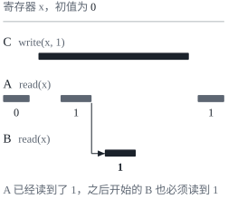
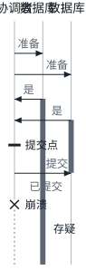

这是 DDIA 读书笔记的第九篇。[第八篇](/posts/ddia-08/)把分布式系统里靠不住的东西摊开来讲了一遍：网络、时钟、进程，还有节点对自己的判断。第九章转向解决办法：在这样的环境里，怎样让系统的行为可以预期，怎样让几个节点就某件事达成一致。这也是全书第二部分“分布式数据”的最后一章。这一篇按我理解的几条主线整理，不按书的小节顺序。文中的英文引文出自原书，其余是我自己的整理。

这一章开头引了 Jay Kreps 2013 年的文章 *A Few Notes on Kafka and Jepsen*：

> Is it better to be alive and wrong or right and dead?

活着但出错，还是正确却死掉？网络出问题时，系统是继续响应、冒着给出错误结果的风险，还是宁可停下来也要保证正确，这个问题贯穿了整章。

思路和[第七篇](/posts/ddia-07/)的事务一样：找一些有用的抽象，实现一次，让应用依赖它们的保证，而不用自己面对底层的种种故障。这一章最重要的抽象是**共识**（consensus）：让几个节点就某件事达成一致，并且不反悔。它听起来简单，却是分布式系统里最微妙的问题之一。

## 一致性的强弱

[第五篇](/posts/ddia-05/)讲复制延迟时说过，大多数有复制的数据库只提供**最终一致性**（eventual consistency）：停止写入，等足够久，所有副本最终会一致，叫“收敛”也许更准确。它太弱了：它不说要等多久，收敛之前读到什么都有可能，连刚写进去的值都可能读不到。数据库看起来像一个可以读写的变量，行为却和程序里的变量完全不同，这类 bug 平时不出现，只在网络故障或高并发时冒出来。

更强的一致性模型更好用，代价是性能或容错能力。这一章涉及的几种，大致可以排成这样：

| 模型 | 保证什么 | 代价 |
| --- | --- | --- |
| 最终一致性 | 停止写入后，副本最终收敛到同样的值 | 几乎不需要协调 |
| 因果一致性 | 有因果关系的操作，在所有地方都以同样的顺序出现；并发的操作不作要求 | 不受网络延迟拖慢，网络分区时仍然可用 |
| 线性一致性 | 系统表现得好像只有一份数据，读一定能看到最新的写入 | 慢，而且网络分区时有一部分副本不可用 |

这些说的是副本之间的一致，和第七篇的事务隔离级别是两回事：隔离级别关心并发的事务怎样互不干扰，一致性模型关心延迟和故障下副本之间怎样协调，两者只是有些相似。

## 线性一致性：假装只有一份数据

**线性一致性**（linearizability）也叫原子一致性、强一致性、立即一致性或外部一致性。它的想法是：即使数据实际上有很多副本，系统也表现得好像只有一份，对它的每个操作都是原子的。这样一来，一个客户端的写入一旦完成，之后所有的读都必须看到这个值：

> In other words, linearizability is a recency guarantee.

书里的例子：Alice 和 Bob 在同一个房间看世界杯决赛的结果。Alice 刷新页面看到了最终比分，喊了出来；Bob 听到以后才刷新，可他的请求落到了一个落后的副本上，页面显示比赛还在进行。Bob 的查询明明发生在 Alice 的之后，读到的却比她的旧，这就违反了线性一致性。

更精确地说，可以把被读写的对象叫作**寄存器**（register），比如一个键。每个读写请求从发出到收到响应是一段时间，数据库在这段时间里的某个时刻处理它。和写入在时间上重叠的读，可能读到旧值，也可能读到新值；可一旦有一个读返回了新值，之后开始的读都不能再返回旧值，就好像值在某个瞬间原子地从旧的翻成了新的。

线性一致性很容易和第七篇的**可串行化**混淆，其实它们是两种保证：

- 可串行化是事务的隔离性质，一个事务可以读写多个对象，保证结果和某种串行顺序相同，这个顺序可以和实际发生的先后不同；
- 线性一致性是单个对象读写的新近性保证，不把操作组成事务，所以防不了写偏斜。

两者都满足叫**严格可串行化**（strict serializability）。两阶段锁和串行执行实现的可串行化通常也是线性一致的；可串行化快照隔离则不是，因为从快照读，本来就看不到快照之后的写入。

### 什么时候需要它

线性一致性不只是让比分刷新得及时，有几类事情离了它就做不对：

- **锁和领导者选举**：所有节点必须对谁持有锁、谁是领导者看法一致，否则就会脑裂。ZooKeeper 和 etcd 用共识算法提供线性一致的操作，专门干这个[^zk-reads]；
- **唯一性约束**：用户名唯一、余额不能为负、座位不能卖两次，都需要一个所有节点都认同的“最新值”；
- **跨信道的时序依赖**：比如网站把用户上传的图片先存进文件存储，再通过消息队列通知后台生成缩略图。如果文件存储不是线性一致的，消息可能比存储内部的复制跑得快，后台取到的是旧图片，或者根本取不到。问题出在两条信道之间的竞态，Alice 喊比分也是另一条信道。

### 哪些复制方式做得到

| 复制方式 | 能否线性一致 | 原因 |
| --- | --- | --- |
| 单领导者 | 有可能 | 从领导者或同步更新的追随者读可以做到；可节点可能误以为自己还是领导者，异步复制的故障转移还会丢掉已提交的写入 |
| 共识算法 | 能 | 协议里有防止脑裂和读到陈旧副本的措施，ZooKeeper、etcd 就是这样 |
| 多领导者 | 不能 | 多个节点并发接受写入、异步复制，会产生冲突 |
| 无领导者 | 多半不能 | 基于时钟的最后写入胜出、宽松的法定人数都会破坏它；即使严格的法定人数（w + r > n），网络延迟不均时，也可能一个读者看到新值，之后的读者却看到旧值 |

要让无领导者的法定人数做到线性一致，读的时候得同步地做读修复，写之前得先读一遍法定人数的最新状态，代价很高，而且只能做到线性一致的读写，做不到比较并设置。所以最稳妥的假设是：Dynamo 风格的系统不提供线性一致性。

### 代价：CAP 与延迟

假设应用部署在两个数据中心，中间的网络断了。如果要求线性一致，连不上领导者（或者说多数副本）的那一边只能等待或者报错，也就是不可用；如果不要求，两边可以各自继续处理请求，比如用多领导者复制，可行为就不是线性一致的了。

这就是 **CAP 定理**的实质。它常被说成“一致性、可用性、分区容错，三者只能选其二”，这种说法有误导性：网络分区是一种故障，不是可以选择要不要的东西。正确的读法是：网络正常时，两者可以兼得；一旦发生分区，就只能在线性一致和完全可用之间选一个。而且 CAP 的适用范围很窄，只讨论线性一致性和网络分区这一种故障，不涉及网络延迟、节点宕机等其他问题，它对“可用性”的定义也和平常的意思对不上。书里的态度是，这个说法今天主要是历史意义，最好别再用它（CAP is best avoided）。

其实线性一致性贵，主要不是贵在分区的时候，而是一直都慢。连多核 CPU 的内存都不是线性一致的：每个核有自己的缓存，写入异步地刷回主存，另一个核不一定马上看得到，除非用内存屏障。这样设计是为了性能，和容错无关。很多分布式数据库不提供线性一致性，原因也一样。Attiya 和 Welch 证明了，线性一致的读写，响应时间至少和网络延迟的不确定性成正比，不存在更快的算法。

## 顺序：因果与全序

线性一致性背后是一个顺序：所有操作排在一条时间线上。顺序在这本书里一再出现：单领导者复制靠领导者决定写入的顺序，可串行化让事务表现得像按某种顺序执行，时间戳想给事件排序。它重要，主要是因为它维护了**因果关系**（causality）：先有问题才有回答，先创建一行才能更新它，Bob 听到 Alice 喊了比分才去刷新。

### 因果是偏序，线性一致是全序

因果关系只给有关联的事件排序：A 发生在 B 之前（B 可能知道 A、依赖 A），或者反过来，或者两者**并发**，谁也不知道谁，这时它们没有先后可言。所以因果关系是一个**偏序**（partial order），像 Git 的提交历史，会分叉，也会合并。线性一致性则是一个**全序**（total order），任意两个操作都分得出先后，时间线只有一条。

线性一致性蕴含因果关系，线性一致的系统自动保持因果。可反过来，保持因果不一定需要线性一致：

> In fact, causal consistency is the strongest possible consistency model that does not slow down due to network delays, and remains available in the face of network failures.

很多看起来需要线性一致性的场景，其实只需要**因果一致性**（causal consistency），而它可以实现得高效得多。书写作时，这方面的研究还很新，进入生产系统的不多[^causal]。

### 用序列号排序

要维护因果一致，就得知道哪个操作先于哪个。精确地跟踪所有的因果依赖开销太大（一次写入可能依赖之前读过的任何东西），更实用的办法是给每个操作一个**序列号**，让序列号的顺序和因果关系一致：A 在因果上先于 B，A 的序列号就更小；并发的操作随便排。

单领导者复制天然有这样的序列号，就是复制日志里的位置。没有唯一的领导者时，常见的几种生成办法都不行：每个节点各用奇数或偶数，节点忙闲不同，两边的计数器就对不上；用物理时钟的时间戳，有时钟偏差（第八篇的图 1）；每个节点预先领一段号码，后发生的操作可能拿到更小的号码段。

**Lamport 时间戳**（Lamport timestamp）解决了这个问题。它是一个二元组（计数器，节点 ID），节点 ID 只在计数器相同时用来决出先后。关键在于：每个节点和客户端都记住自己见过的最大计数器值，并在每个请求里带上它；节点收到比自己大的值，就把自己的计数器直接拨到那里。

 之后。")

这样，每一次因果依赖都会让时间戳变大，时间戳的全序就和因果关系一致了。和[第五篇](/posts/ddia-05/)讲的版本向量比，Lamport 时间戳更紧凑，但它总是给出一个全序，看不出两个操作是并发的还是有因果关系。

### 光有全序还不够

有了和因果一致的全序，能不能实现“用户名唯一”？事后可以：把所有注册请求收集起来，时间戳小的赢。可一个节点收到注册请求时，需要**当场**决定成功还是失败，而它不知道别的节点此刻是否正在用更小的时间戳注册同一个名字。要确定，只能挨个问遍所有节点，有一个节点联系不上，系统就卡住了。

问题在于，时间戳的全序要等收集齐所有操作才算数，你不知道它什么时候**定下来**。要知道顺序何时最终确定，就需要全序广播。

## 全序广播、线性一致与共识

**全序广播**（total order broadcast，也叫原子广播）是一个在节点之间传递消息的协议，要求两条性质始终成立：

- **可靠交付**：消息不丢，交付给了一个节点，就交付给所有节点；
- **全序交付**：所有节点以相同的顺序收到消息。

换个角度看，全序广播就是一个所有节点都能读的只追加日志：交付一条消息，就是往日志里追加一条记录，而且一条消息一旦交付，就不能再往它前面插入别的消息。这是它比时间戳排序强的地方。有了它，就能做状态机复制（每个副本按同样的顺序执行同样的写入）、可串行化的事务（每条消息是一个确定性的存储过程），还能生成防护令牌（日志里的位置天然单调递增，ZooKeeper 的 `zxid` 就是这样来的）。

全序广播和线性一致的存储可以互相实现：

- **用全序广播实现线性一致的比较并设置**：想注册一个用户名，就往日志里追加一条“我要这个名字”的消息，然后读日志，等自己的消息被交付回来；如果关于这个名字的第一条认领消息是自己的，就成功，否则就失败。所有节点看到的顺序都一样，所以对谁赢了的判断也一样。这样做出来的写是线性一致的，读要线性一致还得多做一步，比如读之前先通过日志同步一下；
- **用线性一致的寄存器实现全序广播**：用一个支持原子“自增并读取”的整数，给每条消息分配一个序列号，接收方按序列号依次交付。和 Lamport 时间戳不同，这样的序列号没有空缺，收到 6 之前一定要先等到 5。

而要可靠地实现一个线性一致的“自增并读取”，考虑到节点会失效、网络会中断，最后不可避免地会走到共识算法。可以证明，线性一致的比较并设置寄存器、全序广播和共识是等价的：能解决其中一个，就能把它变成另外几个的解法。顺着这条线还能找到更多等价的问题：

| 问题 | 要决定的是 |
| --- | --- |
| 线性一致的比较并设置 | 当前值是否等于预期值，要不要写入 |
| 全序广播 | 消息以什么顺序交付 |
| 原子提交 | 一个分布式事务提交还是中止 |
| 锁和租约 | 几个客户端同时抢，谁拿到了 |
| 成员和协调服务 | 哪些节点还活着，哪些因为超时算死了 |
| 唯一性约束 | 几个事务同时插入同一个键，谁成功 |

## 原子提交与两阶段提交

先看其中最常见的一个：**原子提交**（atomic commit）。一个事务涉及好几个节点时（比如跨分区的事务，或者二级索引在另一个节点上），不能让每个节点各自提交：有的节点可能违反约束要中止，有的提交请求可能在网络上丢了，有的节点可能在写提交记录之前崩溃。一部分节点提交、一部分中止，原子性就没了。而提交一旦发生就不能撤销，因为别的事务可能已经读到了提交的数据。

### 两阶段提交的流程

**两阶段提交**（two-phase commit，2PC）引入一个**协调者**（coordinator），把提交分成两步：

1. 应用在各个**参与者**（participant）上做完读写以后，协调者向所有参与者发送**准备**（prepare）请求。参与者收到后，要确保自己无论如何都能提交（数据写到磁盘，约束和冲突都检查过），然后回答“是”；
2. 协调者收齐回答，全都是“是”就决定提交，否则中止。它先把决定写进自己的日志，再把提交或中止发给所有参与者，发不成功就一直重试。

它之所以能保证原子性，在于两个不归点：参与者回答“是”，就放弃了单方面中止的权利，承诺以后一定能提交；协调者把决定写进日志的那一刻是**提交点**（commit point），决定从此不可更改。书里把它比作婚礼：说“我愿意”之前可以反悔，说完就不行了；即使说完当场晕倒，没听见牧师宣布结为夫妻，婚也已经结成了。

### 卡在存疑

问题出在协调者崩溃的时候。参与者回答了“是”以后，就只能等协调者告诉它结果：自己中止，可能和已经提交的参与者不一致；自己提交，又可能和已经中止的不一致。这种状态叫**存疑**（in doubt）。

唯一的出路是等协调者恢复、读自己的日志，所以 2PC 是一个**阻塞**的协议。三阶段提交试图做到不阻塞，可它假设网络延迟有界、节点的响应时间有界，在现实的网络里保证不了原子性；非阻塞的原子提交需要一个完美的故障检测器，而超时不是。

### 实践中的分布式事务

分布式事务名声不好：MySQL 的分布式事务据报道比单节点事务慢十倍以上，很多云服务干脆不提供。要分清两种：

- **数据库内部的分布式事务**：参与者都是同一种数据库的节点（比如 VoltDB、MySQL Cluster 的 NDB），可以针对自己做优化，通常工作得不错；
- **异构的分布式事务**：参与者是不同的系统，比如一个数据库加一个消息队列。标准是 XA，它能实现“恰好一次”的消息处理：消息的确认和处理它的数据库写入在一个事务里一起提交，失败了就一起中止，消息可以安全地重新投递。

异构事务的麻烦很实际：

- 存疑的事务一直持有锁，挡住其他事务。协调者重启要 20 分钟，锁就被持有 20 分钟；协调者的日志丢了，锁就永远不放，只能管理员手动处理，或者用会破坏原子性的“启发式决策”强行了结；
- 协调者常常是嵌在应用服务器里的一个库，它的日志成了和数据库一样重要的持久状态，应用服务器不再是无状态的，协调者本身也成了单点；
- XA 只能是各个系统的最小公分母，比如检测不了跨系统的死锁，也用不了可串行化快照隔离；
- 2PC 要所有参与者都回应才能提交，任何一部分坏了，事务就失败，局部的故障被放大了。

书里说，第 11、12 章会讲一些不靠异构分布式事务、又能让几个系统保持一致的办法。

## 共识算法

2PC 其实也是一种共识，只是不太好的一种：协调者一挂，整个系统就卡住。容错的共识算法要满足四条性质：

- **一致同意**（uniform agreement）：没有两个节点决定了不同的值；
- **完整性**（integrity）：没有节点决定两次；
- **有效性**（validity）：决定的值一定是某个节点提议过的；
- **终止**（termination）：没有崩溃的节点最终都会做出决定。

前三条是安全性，最后一条是活性，它正是容错的形式化：不能因为某个节点挂了就永远等下去。可以证明，任何共识算法都需要多数节点正常工作才能保证终止；可安全性要在任何情况下都成立，哪怕多数节点都挂了，系统也只是停下来，不会做出错误的决定。

著名的 **FLP 结论**证明，在不能使用时钟和超时的异步模型里，只要有一个节点可能崩溃，就没有总能达成共识的确定性算法。实际的算法靠超时（或者随机数）绕开了这个限制。

### 先有领导者，还是先有共识

最有名的几个共识算法，视图戳复制（Viewstamped Replication）、Paxos、Raft 和 Zab，实际上都不是决定一个值，而是决定一串值，也就是实现全序广播：每一轮共识决定下一条交付的消息。它们内部也都有一个领导者，看起来很像单领导者复制。可单领导者复制要选出领导者，又需要共识：

> It seems that in order to elect a leader, we first need a leader. In order to solve consensus, we must first solve consensus.

解开这个循环的办法是**纪元编号**（epoch number，Paxos 叫选票编号，Raft 叫任期号）。协议不保证全局只有一个领导者，只保证每个纪元里只有一个；怀疑领导者死了，就发起一次新的选举，纪元编号加一，编号大的领导者说了算。领导者要做任何决定，都得把提议发给一个法定人数的节点，只有没见过更高纪元的节点才会投赞成票。选领导者和批准提议这两次投票，用的法定人数必然有重叠，所以只要提议获得通过，就说明还没有更高纪元的领导者出现，这个领导者可以放心地做决定。

这和 2PC 很像，区别在关键处：领导者是选出来的，坏了可以换；只需要多数节点同意，而不是所有参与者；还有一套新领导者上任后让各个节点恢复一致的过程。

### 共识的代价

共识把确定的安全性带进了一个处处不确定的环境，又不失容错。可它并没有被到处使用，因为它有代价：

- 对提议投票是一种同步复制，比异步复制慢；
- 需要严格的多数才能工作，容忍一个节点失效至少要三个节点，容忍两个要五个；网络分区时只有多数的那一边能继续；
- 大多数算法假设参与投票的节点是固定的，动态增减成员要复杂得多；
- 靠超时检测领导者失效，网络延迟波动大时会频繁误判、重新选举，把时间都花在选领导者上；
- 有些算法对网络问题特别敏感，比如 Raft 在某一条链路时好时坏时，可能陷入领导权反复易手、系统没有进展的局面[^cloudflare]。

## 协调服务：把共识外包出去

应用开发者很少直接实现共识，更多是通过 ZooKeeper 或 etcd 这样的**协调服务**（coordination service）间接地用上它。HBase、Hadoop YARN、Kafka 这些系统都在后台依赖 ZooKeeper[^kafka]。

它们看起来像键值存储，但只适合存少量能全部放进内存、变化不频繁的数据，比如“10.1.1.23 上的节点是分区 7 的领导者”。这些数据用容错的全序广播复制到所有节点上。ZooKeeper 仿照 Google 的 Chubby 锁服务，提供了一组构建分布式系统时特别有用的功能：

- **线性一致的原子操作**：用比较并设置实现锁，通常做成带过期时间的租约；
- **操作的全序**：每个操作有单调递增的 `zxid`，可以直接当防护令牌用（第八篇的图 3）；
- **故障检测**：客户端和服务器之间维持会话、定期发心跳，会话超时，它持有的锁（**临时节点**，ephemeral node）就自动释放；
- **变更通知**：客户端可以监视某个值，有节点加入或失效时立刻得知，不用轮询。

其中只有原子操作真正需要共识，但这几样组合在一起，才让它在协调工作上这么好用：选主，把分区分配给节点，节点加入或失效时重新分配。ZooKeeper 只在固定的三五个节点上投票，却能服务成千上万的客户端。

**服务发现**（找到某个服务的 IP 地址）需不需要共识，就不那么肯定了：DNS 并不线性一致，读到稍旧的结果通常也没关系。**成员服务**（判断集群里哪些节点还活着）则把故障检测和共识结合起来，至少让所有节点对“谁在集群里”看法一致，即使偶尔会把一个活着的节点误判为死亡。

书里的建议很明确：

> If you find yourself wanting to do one of those things that is reducible to consensus, and you want it to be fault-tolerant, then it is advisable to use something like ZooKeeper.

最后，不是每个系统都需要共识。无领导者和多领导者复制通常不用全局共识，它们的冲突正是没有共识的结果。也许这样也可以：学会和没有线性一致性、版本历史会分叉合并的数据相处。

## 小结

我从这一章带走的几点：

- 线性一致性让系统像只有一份数据，好理解，但慢，网络分区时还会不可用；
- 很多场景真正需要的只是因果一致性，它不受网络延迟拖慢，也不怕分区；Lamport 时间戳能给出和因果一致的全序，可它不知道顺序什么时候定下来，做不了唯一性约束；
- 全序广播、线性一致的比较并设置、原子提交、锁、唯一性约束，归根结底都是共识问题；
- 两阶段提交能做原子提交，但协调者一挂就卡住；Raft、Paxos 这样的算法靠纪元编号和重叠的法定人数，只要多数节点存活就能做出决定；
- 自己实现共识很难，需要时用 ZooKeeper、etcd 这样经过检验的服务。

单领导者数据库看起来不需要共识，其实只是把共识推到了选领导者的时候。领导者挂了，要么等它恢复，要么让人手动切换，要么用共识算法自动选出新的领导者，只有最后一种是真正容错的。

第二部分到这里结束：复制、分区、事务、分布式系统的故障，最后是一致性与共识。第三部分转向更具体的系统，讨论怎样把各种组件组合成完整的应用。

## 术语表

| 英文 | 中文 | 含义 |
| --- | --- | --- |
| consensus | 共识 | 让几个节点就某件事达成一致，并且不反悔 |
| eventual consistency | 最终一致性 | 停止写入后副本最终收敛 |
| linearizability | 线性一致性 | 系统表现得好像只有一份数据，读能看到最新写入 |
| recency guarantee | 新近性保证 | 读到的一定是最新写入的值 |
| register | 寄存器 | 被读写的单个对象 |
| strict serializability | 严格可串行化 | 同时满足可串行化和线性一致性 |
| CAP theorem | CAP 定理 | 分区时只能在线性一致和完全可用之间选一个 |
| causality / causal consistency | 因果关系 / 因果一致性 | 有因果关系的操作在各处顺序相同 |
| total order / partial order | 全序 / 偏序 | 任意两个元素都可比较 / 有些元素不可比较 |
| sequence number | 序列号 | 给操作排出全序的数字 |
| Lamport timestamp | Lamport 时间戳 | （计数器，节点 ID），带上见过的最大计数器以保持因果一致 |
| total order broadcast | 全序广播 | 消息可靠地、以相同顺序交付给所有节点 |
| state machine replication | 状态机复制 | 所有副本按相同顺序执行相同的写入 |
| atomic commit | 原子提交 | 所有节点就分布式事务提交还是中止达成一致 |
| two-phase commit (2PC) | 两阶段提交 | 先准备、再提交的原子提交协议 |
| coordinator / participant | 协调者 / 参与者 | 2PC 里做决定的组件 / 事务涉及的节点 |
| commit point | 提交点 | 协调者把决定写进日志的那一刻 |
| in doubt | 存疑 | 投了“是”、还不知道结果的参与者 |
| XA | XA | 异构系统之间两阶段提交的标准 |
| uniform agreement / integrity / validity / termination | 一致同意 / 完整性 / 有效性 / 终止 | 共识算法的四条性质 |
| FLP result | FLP 结论 | 异步模型里没有总能达成共识的确定性算法 |
| epoch number | 纪元编号 | 每个纪元里领导者唯一，编号大的说了算 |
| coordination service | 协调服务 | 比如 ZooKeeper、etcd，提供共识、故障检测和成员管理 |
| ephemeral node | 临时节点 | 会话超时时自动删除的 ZooKeeper 节点 |

[^zk-reads]: 严格地说，ZooKeeper 和 etcd 的写是线性一致的，读却可能是陈旧的，因为默认可以由任何一个副本来回答；ZooKeeper 要在读之前调用 `sync()`，才能保证读到最新值。书里说的 etcd 是 v2 的 API；2016 年发布的 v3 API 里，读默认就是线性一致的，想要更快但可能陈旧的读，得在请求里指定 serializable。

[^causal]: 书写于 2017 年。同年年底发布的 MongoDB 3.6 在客户端会话里提供了因果一致性：驱动程序记下每次响应里带回的集群时间，在后续的请求里带上，让之后的读看得到自己之前的写，也不会读到更旧的数据。不过 Jepsen 2018 年的测试发现，只有配合多数派的读写关注（read/write concern），它才真正成立。

[^cloudflare]: 书写于 2017 年。后来真的出过这样的事：2020 年 11 月 2 日，Cloudflare 的一台交换机部分失效，一个三节点的 etcd 集群里，节点 1 连不上领导者节点 3，却还连得上节点 2。节点 1 一次又一次地发起选举、给自己投票，节点 2 每次都把票投给它还连得上的节点 3，始终选不出一个节点 1 连得上的领导者；而 Raft 的选举会挡住所有写入，集群就这样只读了几分钟，直到交换机自己恢复。由此引发的连锁反应，让 Cloudflare 的 API 和控制台受影响了六个多小时。

[^kafka]: 书写于 2017 年。Kafka 后来用自己基于 Raft 的 KRaft 协议取代了 ZooKeeper，2025 年发布的 Kafka 4.0 已经完全不再支持 ZooKeeper（见[第六篇](/posts/ddia-06/)）。
