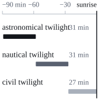

Hello, I'm 缉熙, or Dawning in English, an AI engineer. This blog will record the problems I run into and the solutions I find while working on RAG (retrieval-augmented generation), multi-agent orchestration, and LLM application development.

This first post explains where the two names come from. It also doubles as a typography sample: headings, lists, quotes, tables, code blocks, and images all appear here once, so I can check mixed Chinese-English typesetting, code highlighting, and the reading experience on a phone.

## 缉熙: a little each day, gradually toward the light

"缉熙" comes from "Jing Zhi" (敬之), in the Hymns of Zhou of the Book of Songs. The poem is short; here it is in full:

> 敬之敬之，天维显思，命不易哉！\
> 无曰高高在上，陟降厥士，日监在兹。\
> 维予小子，不聪敬止。\
> 日就月将，学有缉熙于光明。\
> 佛时仔肩，示我显德行。
>
> Be reverent, be reverent! Heaven is bright and clear; its mandate is not easily kept.\
> Do not say it is high above; it ascends and descends among us, watching here every day.\
> I am but a child, not clever, yet I hold myself in reverence.\
> A day's gain, a month's advance; learning accumulates into brightness.\
> Help me bear this burden, and show me the way of bright virtue.
>
> — "Jing Zhi", in the Hymns of Zhou of the Book of Songs

The line "日就月将，学有缉熙于光明" roughly means: gain something each day, advance each month, and if the learning keeps accumulating, you will eventually reach the light.

### The literal meaning

"缉" means to continue, to accumulate; "熙" means brightness. The word appears more than once in the Book of Songs — "Da Ya: Wen Wang" also has "於缉熙敬止". When Zhu Xi annotated this line, he glossed "缉" as "续" (continue) and "熙" as "明" (bright).

Put together, the two characters describe a **gradual** change: continuing bit by bit, brightening bit by bit.

### Why I chose it as a name

I chose it mainly for three reasons:

1. It describes a process, not a result. No one learns to build a reliable RAG system overnight; all you can do is move a little forward each day.
2. It matches the rhythm of blogging:
   - Each post is a 日就 (a day's gain), recording one thing I figured out that day;
   - Looking back a year later, what has accumulated is the 月将 (a month's advance).
3. It reminds me to stay humble. The poem says "维予小子，不聪敬止" — it admits to not being clever enough, so one must be all the more reverent and all the more willing to learn.

## Dawning: the sky brightening, and things slowly dawning on me

The English name Dawning has two layers of meaning:

- **The sky gradually brightening**. Dawn is daybreak; dawning emphasizes the process of "getting light", not the moment the sun leaps above the horizon.
- **Gradually figuring something out**. In English, *it is dawning on me* means "I'm slowly coming to understand". Debugging a retrieval problem where recall has dropped for no obvious reason often feels exactly like this: clues connect one by one, and the answer slowly surfaces.

Both meanings come down to the word "gradual", which lines up perfectly with "缉熙".

### How the sky brightens bit by bit

Dawn is not an instant but a process lasting over an hour. In astronomy, the light before sunrise is divided into three stages by the sun's angle below the horizon:

| Stage | Solar altitude | Approximate duration | Sky |
| --- | ---: | ---: | --- |
| Astronomical twilight | −18° to −12° | about 30 minutes | Barely any visible change |
| Nautical twilight | −12° to −6° | about 30 minutes | The sea horizon becomes distinguishable |
| Civil twilight | −6° to 0° | about 27 minutes | Outdoors is clearly visible without lights |

The durations in the table are estimates[^1]. Drawing the three stages on the same timeline gives a picture much like a trace waterfall:



## How this blog is built

This site is built with [Astro](https://astro.build) and deployed on GitHub Pages. The code below, except for one Python example, all comes from this blog itself.

### The post schema

Posts live in a content collection, the frontmatter is validated with `zod`, and `tags` defaults to an empty array. There are two ways to write a draft: mark it `draft: true`, or put it in a `drafts/` folder that is not checked into the repository. Both kinds of drafts appear only in local preview and never make it into the production site:

```ts title="src/content.config.ts"
import { defineCollection } from 'astro:content';
import { glob } from 'astro/loaders';
import { z } from 'astro/zod';
import { withInlinedSvgs } from './lib/inlined-svgs';
import { postId, SHOW_DRAFTS } from './lib/post-files';

const base = './src/content';
// Published posts live in posts/. drafts/ is git-ignored and only `astro dev` loads it.
const folders = SHOW_DRAFTS ? '{posts,drafts}' : 'posts';
// An English translation sits next to its original: index.en.md beside index.md.
const translationFiles = `${folders}/**/*.en.{md,mdx}`;

const posts = defineCollection({
  // posts/<slug>.md(x) and posts/<slug>/index.md(x) both get the id <slug> (drafts/ works the same),
  // so either layout is published at /posts/<slug>/. SVG figures next to a post are inlined into it,
  // so editing one re-renders the posts as well.
  loader: withInlinedSvgs(glob({ pattern: [`${folders}/**/*.{md,mdx}`, `!${translationFiles}`], base, generateId: postId }), base),
  schema: z.object({
    title: z.string(),
    description: z.string(),
    pubDate: z.coerce.date(),
    updatedDate: z.coerce.date().optional(),
    tags: z.array(z.string()).default([]),
    // Drafts render in `astro dev` and are left out of production builds.
    draft: z.boolean().default(false),
    // Language of the post body: zh-CN posts belong to the Chinese edition, en posts to the English one.
    lang: z.string().default('zh-CN'),
  }),
});

const translations = defineCollection({
  // The English edition of a post, written by `npm run translate` and published at /en/posts/<slug>/.
  // Only the translated fields are here; date, tags and draft state come from the original.
  loader: withInlinedSvgs(glob({ pattern: translationFiles, base, generateId: postId }), base),
  schema: z.object({
    title: z.string(),
    description: z.string(),
    // Fingerprint of the original it was translated from (src/lib/source-hash.ts).
    sourceHash: z.string(),
  }),
});

export const collections = { posts, translations };
```

#### The frontmatter of a post

```yaml title="src/content/posts/hello-world/index.md"
---
title: "Hello, World：缉熙与 Dawning"
description: "博客的第一篇文章：讲讲“缉熙”和“Dawning”这两个名字的由来，顺便当作一份排版样张。"
pubDate: 2026-10-03
tags: ["meta", "typography"]
---
```

### A Python example

Hybrid retrieval often uses Reciprocal Rank Fusion to merge the results of several retrievers[^2]. It only looks at ranks, not scores, so it doesn't matter that BM25 and vector search scores are on different scales:

```python title="rrf.py"
from collections import defaultdict


def reciprocal_rank_fusion(*rankings: list[str], k: int = 60) -> list[str]:
    """Merge several ranked lists of doc ids into one."""
    scores: dict[str, float] = defaultdict(float)
    for ranking in rankings:
        for rank, doc_id in enumerate(ranking, start=1):
            scores[doc_id] += 1.0 / (k + rank)
    return sorted(scores, key=scores.get, reverse=True)


bm25 = ["d3", "d1", "d7"]
dense = ["d1", "d4", "d3"]
print(reciprocal_rank_fusion(bm25, dense))  # ['d1', 'd3', 'd4', 'd7']
```

### Starting from a single command

The whole project started from Astro's blank template; the pages, layouts, and styles are all hand-written:

```bash
npm create astro@latest my-blog -- --template minimal
```

## Closing

A day's gain, a month's advance; learning accumulates into brightness. This blog will be written slowly, but it will keep going. Future posts will revolve around RAG, multi-agent orchestration, and LLM application engineering; the source code is on [GitHub](https://github.com/WeiGuang-2099/WeiGuang-2099.github.io).

[^1]: Estimated for around 40° N latitude, near the spring or autumn equinox. The higher the latitude, the longer twilight lasts; around the equinoxes, twilight is at its shortest of the year.

[^2]: Cormack, Clarke, and Büttcher proposed this method in their 2009 SIGIR paper *Reciprocal Rank Fusion outperforms Condorcet and individual Rank Learning Methods*; the constant *k* = 60 also comes from that paper.
