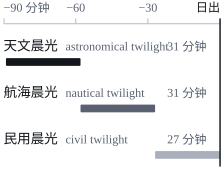

你好，我是缉熙，英文名 Dawning，一名 AI 工程师。这个博客会记录我在 RAG（Retrieval-Augmented Generation）、多智能体编排（multi-agent orchestration）和 LLM 应用开发中遇到的问题与解法。

第一篇文章先讲讲这两个名字的由来。它同时也是一份排版样张：标题、列表、引用、表格、代码块和图片都会在这里出现一次，方便我检查中英文混排、代码高亮和手机上的阅读体验。

## 缉熙：日积月累，渐至光明

“缉熙”出自《诗经·周颂·敬之》。全诗不长，抄录如下：

> 敬之敬之，天维显思，命不易哉！\
> 无曰高高在上，陟降厥士，日监在兹。\
> 维予小子，不聪敬止。\
> 日就月将，学有缉熙于光明。\
> 佛时仔肩，示我显德行。
>
> ——《诗经·周颂·敬之》

其中“日就月将，学有缉熙于光明”一句，大意是：每天有所收获，每月有所长进，学习不停地积累下去，终会通达光明。

### 字面上的意思

“缉”有接续、积累的意思，“熙”是光明。这个词在《诗经》里不止出现一次，《大雅·文王》也有“於缉熙敬止”。朱熹为这句作注时，把“缉”释为“续”，把“熙”释为“明”。

两个字连在一起，说的是一种**渐进**的变化：一点一点地接续，一点一点地变亮。

### 为什么用它做名字

我选它，主要有三个原因：

1. 它描述的是过程，而不是结果。没有人能一夜之间学会构建可靠的 RAG 系统，能做的只是每天往前挪一点。
2. 它和写博客的节奏一致：
   - 每篇文章是一次“日就”，记下当天弄懂的一件事；
   - 一年后回头看，攒下来的就是“月将”。
3. 它提醒我保持谦逊。诗里说“维予小子，不聪敬止”，自认不够聪明，所以更要敬慎，更要学。

## Dawning：天色渐亮，也是渐渐想明白

英文名 Dawning 有两层意思：

- **天色渐亮**。dawn 是黎明，dawning 强调的是“正在亮起来”的那段过程，而不是太阳跃出地平线的那一刻。
- **渐渐想明白**。英语里说 *it is dawning on me*，意思是“我渐渐明白过来了”。排查一个召回率莫名下降的检索问题时，常常就是这种感觉：线索一条条接上，答案慢慢浮出来。

两层意思都落在一个“渐”字上，和“缉熙”正好对得上。

### 天是怎么一点点亮起来的

黎明不是一瞬间，而是一段持续一个多小时的过程。天文学上，按太阳在地平线以下的角度，把日出前的天光分成三个阶段：

| 阶段 | 太阳高度角 | 大致时长 | 天色 |
| --- | ---: | ---: | --- |
| 天文晨光（astronomical twilight） | −18° 至 −12° | 约 30 分钟 | 肉眼几乎看不出变化 |
| 航海晨光（nautical twilight） | −12° 至 −6° | 约 30 分钟 | 能分辨出海天交界线 |
| 民用晨光（civil twilight） | −6° 至 0° | 约 27 分钟 | 不开灯也能看清户外 |

表中的时长是估算值[^1]。把这三段画在同一条时间轴上，就是一张很像 trace 瀑布图的图：



## 这个博客是怎么搭起来的

这个站点用 [Astro](https://astro.build) 构建，部署在 GitHub Pages 上。下面的代码，除了一个 Python 例子，都来自这个博客本身。

### 文章的 schema

文章放在 content collection 里，frontmatter 用 `zod` 校验，`tags` 默认是空数组。草稿有两种写法：标上 `draft: true`，或者放进不进仓库的 `drafts/` 文件夹。两种草稿都只在本地预览时出现，不会进入正式站点：

```ts title="src/content.config.ts"
import { defineCollection } from 'astro:content';
import { glob } from 'astro/loaders';
import { z } from 'astro/zod';
import { withInlinedSvgs } from './lib/inlined-svgs';
import { postId, SHOW_DRAFTS } from './lib/post-files';

const base = './src/content';
// Published posts live in posts/. drafts/ is git-ignored and only `astro dev` loads it.
const pattern = SHOW_DRAFTS ? '{posts,drafts}/**/*.{md,mdx}' : 'posts/**/*.{md,mdx}';

const posts = defineCollection({
  // posts/<slug>.md(x) and posts/<slug>/index.md(x) both get the id <slug> (drafts/ works the same),
  // so either layout is published at /posts/<slug>/. SVG figures next to a post are inlined into it,
  // so editing one re-renders the posts as well.
  loader: withInlinedSvgs(glob({ pattern, base, generateId: postId }), base),
  schema: z.object({
    title: z.string(),
    description: z.string(),
    pubDate: z.coerce.date(),
    updatedDate: z.coerce.date().optional(),
    tags: z.array(z.string()).default([]),
    // Drafts render in `astro dev` and are left out of production builds.
    draft: z.boolean().default(false),
    // Language of the post body; the site chrome stays English.
    lang: z.string().default('zh-CN'),
  }),
});

export const collections = { posts };
```

#### 一篇文章的 frontmatter

```yaml title="src/content/posts/hello-world/index.md"
---
title: "Hello, World：缉熙与 Dawning"
description: "博客的第一篇文章：讲讲“缉熙”和“Dawning”这两个名字的由来，顺便当作一份排版样张。"
pubDate: 2026-10-03
tags: ["meta", "typography"]
---
```

### 一个 Python 例子

混合检索里常用 Reciprocal Rank Fusion 合并多路召回的结果[^2]。它只看排名、不看分数，所以 BM25 和向量检索的分数不在同一个量纲上也没关系：

```python title="rrf.py"
from collections import defaultdict


def reciprocal_rank_fusion(*rankings: list[str], k: int = 60) -> list[str]:
    """Merge several ranked lists of doc ids into one."""
    scores: dict[str, float] = defaultdict(float)
    for ranking in rankings:
        for rank, doc_id in enumerate(ranking, start=1):
            scores[doc_id] += 1.0 / (k + rank)
    return sorted(scores, key=scores.get, reverse=True)


bm25 = ["d3", "d1", "d7"]
dense = ["d1", "d4", "d3"]
print(reciprocal_rank_fusion(bm25, dense))  # ['d1', 'd3', 'd4', 'd7']
```

### 从一行命令开始

整个项目从 Astro 的空白模板起步，页面、布局和样式都是手写的：

```bash
npm create astro@latest my-blog -- --template minimal
```

## 结语

日就月将，学有缉熙于光明。这个博客会写得很慢，但会一直写下去。之后的文章会围绕 RAG、多智能体编排和 LLM 应用工程展开，源码在 [GitHub](https://github.com/WeiGuang-2099/WeiGuang-2099.github.io) 上。

[^1]: 以北纬 40° 附近、春分或秋分前后估算。纬度越高，晨光持续得越久；春分和秋分前后，则是一年中晨光最短的时候。

[^2]: Cormack、Clarke 和 Büttcher 在 2009 年的 SIGIR 论文 *Reciprocal Rank Fusion outperforms Condorcet and individual Rank Learning Methods* 中提出了这个方法，常数 *k* = 60 也来自这篇论文。
